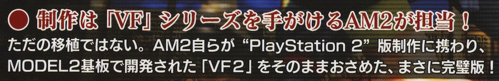

**Preface: This article gets fairly technical at some points and hyperlinks to bewtter explain certain portions will be provided.**

Last year, I began an investigation into Sega’s official Model2 emulators which lead me into a deep and rich rabbit-hole of research. I began drafting this article but the May 2021 announcement of Lost Judgement’s Model2 arcade mini-games made me hold off until I had done my due diligence of researching that as well. Lost Jugement has now come and gone, and I’m finally ready to share my findings with the world. Buckle up as this is one of the wild and craziest journeys I’ve ever taken in terms of unused content…

I’d like to start off with a brief history of the Model2 itself. Sega’s Model2 line of arcade cabinets would succeed the successful Model1 line. The Model1 produced such hits as Virtua Racing and Virtua Fighter, but the early 1990’s were a quickly evolving industry for video games, requiring Sega to move at Sonic speeds to keep up with the competition. The Model2 introduced what was possibly the most astounding feature to Sega’s arcade lineup: real-time [texture mapping](https://en.wikipedia.org/wiki/Texture_mapping). This was made possible due to Sega’s partnership with General Electric, who were bought by Martin Marietta Corp, who in turn eventually merged with Lockheed Martin in 1995. General Electric had pitched texture mapping to Sega in as early as 1990, which was during development of the Model1. General Electric proposed that the technology they could provide would improve the quality of Sega’s arcade games and Sega agreed.

The arcade goers would also agree once the Model2, and it’s succeeding iterations Model2A-CRX, Model2B-CRX, and Model2C-CRX, made their way across the globe. The Virtua Fighter 2 title was such a hit, it even received an updated rerelease as Virtua Fighter 2.1, and this is where our story really begins. Sega advertised themselves as being able to bring the arcade experience home, and while ports of Model2 games did land on the Sega Saturn, the $399 console was nowhere near as powerful as the $15,000 arcade cabinet. Sacrifices had to be made to ensure the game ran reasonably on the inferior hardware. The games themselves were good ports, however, they couldn’t compare to the genuine arcade experience.

---

# The AM2 Era

In in 2003, Sega of Japan launched their line of Sega Ages 2500 series of games for the Playstation 2. These Japan only titles were focused on bringing the hit arcade titles of Sega’s past onto the console as faithfully as possible. Games such as Fantasy Zone, Space Harrier, Golden Axe, and Outrun were faithfully emulated on the console, and in 2004, the Model2 saw it’s first emulated title as “Sega Ages 2500 Series Vol. 16: Virtua Fighter 2”. The game’s packaging reads:

