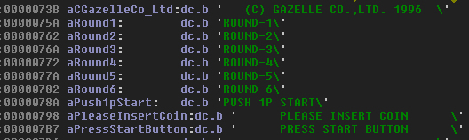

If there's one constant we can rely on, it's STGs having leftover menus.

<!--more-->

I loaded up Air Gallet (pronounced 'Air Garret' according to the title screen announcer, who also emphatically states that this game 'blows your socks off'), a vertical shooter by Bandai running on the Cave hardware and gave it a quick look. Right away, it was clear there was some juicy bits to dig out:


Unlisted options in the test mode menu? Oh boy! Looks like invincibility, pause, game reset and a stage select. I started poking around, but found that (unfortunately) the menu code doesn't use any reference tables. All the pointers for strings and functions are hard-coded for the standard nine options, which means there was no clear way to find these extra functions. So what to do in a situation like this? Well, there are some strings above that seem to be a part of the stage select menu:



How can we use this to find our function?

I'll digress for a bit and go into some of my methodology.

In almost all the games I've hacked on, there is a standard routine to load and display basic, 'system' text like in menus (and things like INSERT COIN and HIGH SCORE at the top and such in the case of arcade games). If we can identify this routine, we can find all the references to it across the code, and that could lead us to a function that is calling text that is part of an unused menu. From there we can work backwards to find the entry point for that function, and hopefully even further up to find how it is properly called. We can find this text display routine by setting a watchpoint in the MAME debugger for an address that has some text that we expect to load. For example, we see the location of the strings for the Test Mode menu, so we can set a watchpoint to alert us when that address is read from and what part of the code is reading it. Hopefully that part of the code is the text display function. This is a method I've used many times now to uncover otherwise inaccessible code.

In Air Gallet, I used this method and found the text display function rather easily, and labeled it:


Okay, we're getting somewhere. Now we can use the cross-reference tool in IDA Pro to see where all this function is called from and then do some trial and error by manually calling the these referencing functions and see if we can't make our stage select strings appear. After some unsuccessful attempts, I try the subroutine at 0x55F0 and...


There it is, although the palette is clearly incorrect. I can cycle through the menu, which is promising, but when I select an option the game crashes and resets. Clearly the stack isn't set up properly, so we need to find out where this subroutine is called from elsewhere in the code. Using the cross-reference tool again, we find that there's a branch to 0x55F0 at 0x3E50:


(Thankfully this game does seems to mostly work with hard-coded pointers instead of indirect addressing; it makes references like this much easier to find!)

It looks like it's testing bit 0 of the word (2 bytes) at 0x100094 and will branch to the subroutine return if it's not set. But if it is set it will branch to our stage select. So if we set 0x100095 (since it's only testing the lowest bit of the word) to 1...

# STAGE SELECT


Got 'em. The menu appears after pressing start on the title screen. It's straightforward: P1 Up/Down to cycle and any P1 button to go.

So what about the other unavailable options that were listed in the string table? Things like invincibility and game pause probably won't have text associated with them, so how can we find them? Well, we could really dig into the disassembly, step through it and try to follow the game loop, identifying all the routines... That's a lot of work and would require some serious time investment. The other method is Luck and Guesswork!

Since the flag for the stage select is at 0x100094, I had a (completely unfounded) hunch that the flags for the other options were nearby that address. And I turned out to be right! The flag for game reset is at 0x10008E, pause is at 0x100090, and invincibility is at 0x100092. They work the same as the stage select, with the lowest bit being checked. Hooray for dumb luck!

The menu strings were kind enough to tell us that pause game is enabled by P2 Start, but neglected to mention that you have to hit P1 Start to unpause. More trial and error. Also, P2 Button 1 + Button 2 + Button 3 at the same time to activate the game reset, though it should be noted that the game seems to crash and not recover when resetting this way. Oh well.

Here are the MAME cheats to enable these settings:

```
  <cheat desc="Enable level select">
    <comment>Level select will appear after inserting a coin and pressing start</comment>
    <script state="run">
      <action>maincpu.pw@100094=1</action>
    </script>
    <script state="off">
      <action>maincpu.pw@100094=0</action>
    </script>
  </cheat>
  
  <cheat desc="Enable invincibility">
    <script state="run">
      <action>maincpu.pw@100092=1</action>
    </script>
    <script state="off">
      <action>maincpu.pw@100092=0</action>
    </script>
  </cheat>
  
  <cheat desc="Enable pause">
    <comment>Pause game with P2 Start, unpause with P1 Start</comment>
    <script state="run">
      <action>maincpu.pw@100090=1</action>
    </script>
    <script state="off">
      <action>maincpu.pw@100090=0</action>
    </script>
  </cheat>
  <cheat desc="Enable reset">
    <comment>Reset game by pressing P2 A+B+C (This appears to be BROKEN! Game resets, but then locks up)</comment>
    <script state="run">
      <action>maincpu.pw@10008E=1</action>
    </script>
    <script state="off">
      <action>maincpu.pw@10008E=0</action>
    </script>
  </cheat>
```

# COUNTRY SETTING


I also came across a hidden region select for the game. While there's no way to access it normally, its entry is still partially enabled from the test menu: it requires a certain button combination, which is implemented, but also checks a value in RAM that as far as I can tell is never set anywhere in the code.

From the DIPSW menu, highlight Factory Settings and press P1 Right + P1 Button 2. The word at 0x109722 also needs to be 0x0010, and that's where we have to use a MAME cheat to force that value:

```
  <cheat desc="Enable country select menu">
    <comment>While in the DIP-SW menu in Test Mode, highlight Factory Settings, hold P1 Right and press P1 Button 2</comment>
    <script state="run">
      <action>maincpu.pw@109722=0010</action>
    </script>
  </cheat>
```

Note that you need to choose the exit option on both test mode menus for the country setting to be saved. Apparently it saves it to the NVRAM, as the country is saved between restarts.

More stuff to come! Be sure to [follow my twitter feed](https://twitter.com/suddendesu), as I tend to post previews of my findings there before they appear on the site.
