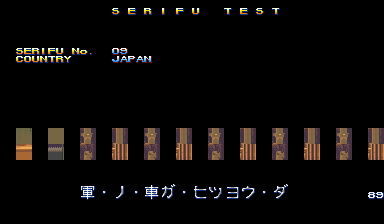
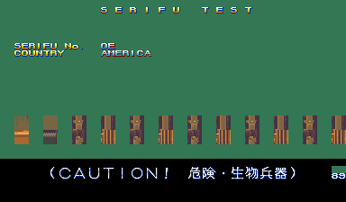
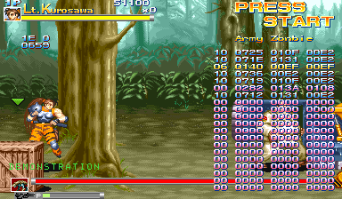
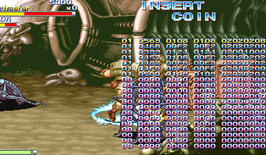
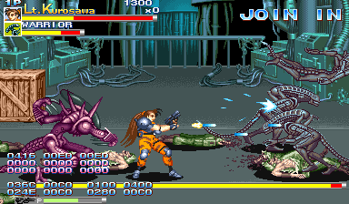
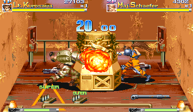
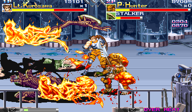
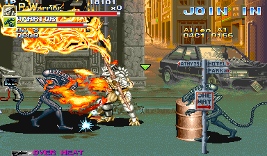
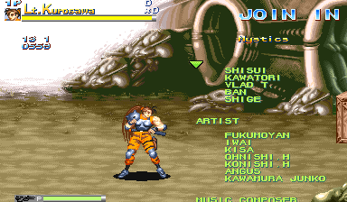

We're back on our CPS2 jam, and we're looking at Alien vs Predator this time. Buried in its code are a bunch of debugging tools and an alternate staff roll. Compared to the mess that was [Progear no Arashi](/entry/progear-no-arashi-debug-tools-and-code-weirdness), things were pretty straightforward this time, but there's still a fair bit of technical complexity we need to cover, so let's get into it.

<!--more-->

# Player 4

It must first be noted that the debug tools make use of all four player slots and of four button controllers in those slots. In the final game Player 4 is not present and only 3 button controllers are used, thus that is the configuration MAME uses. I will be opening a PR to MAME to add the extra controls when the machine is in the development configuration, but until it is merged (if it is merged...), you will need to build a custom version of MAME in order to fully use all of the debug tools.

It is a pretty simple modification. In `cps2.cpp`, find these lines near the bottom:

```
GAME( 1994, avsp,       0,        cps2,     cps2_3p3b, cps2_state, init_cps2,     ROT0,   "Capcom", "Alien vs. Predator (Europe 940520)",                                            MACHINE_SUPPORTS_SAVE )
GAME( 1994, avspu,      avsp,     cps2,     cps2_3p3b, cps2_state, init_cps2,     ROT0,   "Capcom", "Alien vs. Predator (USA 940520)",                                               MACHINE_SUPPORTS_SAVE )
GAME( 1994, avspj,      avsp,     cps2,     cps2_3p3b, cps2_state, init_cps2,     ROT0,   "Capcom", "Alien vs. Predator (Japan 940520)",                                             MACHINE_SUPPORTS_SAVE )
GAME( 1994, avspa,      avsp,     cps2,     cps2_3p3b, cps2_state, init_cps2,     ROT0,   "Capcom", "Alien vs. Predator (Asia 940520)",                                              MACHINE_SUPPORTS_SAVE )
GAME( 1994, avsph,      avsp,     cps2,     cps2_3p3b, cps2_state, init_cps2,     ROT0,   "Capcom", "Alien vs. Predator (Hispanic 940520)",                                          MACHINE_SUPPORTS_SAVE )

```

Changes all instances of `cps2_3p3b` to `cps2_4p4b` then save and [recompile MAME](https://docs.mamedev.org/initialsetup/compilingmame.html).

# Test Menu


As with several other CPS2 games, there is a hidden test menu in the game. It is accessed when the byte @ 0xFF21AA equals 2 while the standard test menu is active.

Unfortunately, there doesn't seem to be any remaining code that sets that value, so we can't really speculate as to how it was originally enabled. But we can easily force it with a cheat like this one:

```
  <cheat desc="Use Debug Test Menu">
    <comment>Replaces the standard test menu with an alternate menu with debugging tools</comment>
    <script state="run">
      <action>maincpu.pb@ff21aa=2</action>
    </script>
  </cheat>
```

In all tools, P2 Start changes background color.

## Character Test


Here we have a tool for viewing the variety of characters in the game, both players and enemies. It has a variety of functions spread across three modes. It's a complex tool that makes use of all four player controllers.

### General Controls

These inputs work across all three modes:

 - P1 Start changes the mode.
 - P1 Coin cycles the background between flat color, grid and the stage, with and without the text overlay for each of these. (This is interesting because I've never seen a debug tool make use of the coin trigger before. But at the hardware level it is just anotehr switch, and whatever interface the developers were using, it was probably just another button.)
 - P3 B3 changes the color palette (the STAGE value). This also determines which stage background is displayed in the background for the previous option, though the palette is often incorrect.
 - P4 Start highlights the "CHR 1" text, and then P4 B2/B3 cycle palette.
 - P3 B2 changes the layer on which the sprites are drawn. This is indicated in the upper right as o123 and 1o23. Basically, it determines if the text over is drawn in front of or behind the sprites.

### Mode 1 - CHAR TEST

The basic character viewer. Most of the commands here work in the other modes as well:

 - P1 Up/Down changes the Patttern. Hold P2 B4 to change this value quickly.
 - Hold P1 B2 and use P1 Up/Down to change the TBL No. (the grouping of patterns)
 - Hold P1 B1 to play the animation, if the current pattern has one. P1 B3 advances to the next single frame of animation. Holding P2 B4 and using P1 B3 plays the animation quickly. The difference between P1+B1 and P2+B4/P1-B3 is that the former will play the animation with its timings while the latter will play each frame with no delays.
 - P1 B2 resets the animation to its initial frame.
 - P4 B1 changes the weapon held by the character
 - P3 Up/Down changes the vertical flip; P3 Left/Right changes the horizontal flip. Note that when in CHAR TEST2 mode, this controls the second character only. However, P1 Left/Right will also change the horizontal flip for the first character in any mode.
 - P2 Start changes the background color like in other modes, but holding P2 Start will change the shade of that particular color.

### Mode 2 - CURSOR MV

This mode moves the cursor around the screen, represented by a white plus sign. It also displays an orange plus sign, presumably indicating the bottom point of the character. The white cursor can be moved by the P2 stick. Holding P2 B1 and moving the stick causes the cursor to "expand" and form a bounding box. The position and size of the box are indicated in the CURSOR section of text in the upper right. P3 B1 will reset the cursor to its initial position.

This may have been used to measure hit boxes on sprites.

### Mode 3 - CHAR TEST2

This mode spawns a second sprite that can be configured independently of the first. The controls mostly mirror those in the normal CHAR TEST mode but mapped to the P2 controls.

P3 stick changes the mirror/flip for the second sprite; P2 Left/Right also changes the mirroring.

The second sprite can be positioned on the screen, something that is not possible with the first sprite. Hold P3 B2 and use P2 stick to move the second sprite around.

P3 Start changes the priority between the two sprites (that is, determines which displays in front of the other).

## Scroll 1/2/3 Block Test


These three tests are very similar, so I have grouped them together here. They display various large, static tilemaps: stage backgrounds and cutscene images and such.

The controls are helpfully displayed on the screen, so there's not much to discuss here on that topic.

Scroll 1 only has the "Recycle It" and Q-Sound screens while scroll 2 and 3 have the interesting graphics. Scroll 2 also has a Hit Mode, which displays the collision markers for that particular block.

## Scroll 2/3 Move Test


Once again, these two tools are nearly identical so I have grouped them together.

The Scroll Move tests are similar to the Scroll Block test in that they display the stage backgrounds, but here we see them assembled and as they appear in the game. Scroll 2 is the intermediate background layer, while Scroll 3 is the far background.

Here too the controls are printed on the screen. They are mostly identical for both, though Scoll 2 once again has the hit mode toggle that displays the collision.

## Scroll 2&3 Move Test


If we think of the two previous sections as graphics viewers that start with foundational pieces (Block Test) then advance to seeing those pieces assembled (Move Test), we can think of this tool (Scroll 2&3 Move Test) as the progression of that pattern.

This tool combines the scroll 2 and scroll 3 background layers with their parallax scrolling, presented just as they would be in the final game. The tool consists of a movable cursor (controlled with P1 Stick) and a number indicating the ID of the displayed scene. P1 Button 2 advances the scene ID, while P1 Button 3 toggles free movement and collision.


## VRAM Serifu





This is a story text viewer. (Serifu is Japanese for line, as in a line from a script.) P1 Up/Down changes the line,and holding P1 Button 1 and using Up/Down changes the line quickly. P1 Start changes the country, but this doesn't seem to have any affect. This may be because I am using the Japanese version for testing, however.

## Queen Char


Remember [KiSS dolls](https://en.wikipedia.org/wiki/Kisekae_Set_System) from the old internet? That's kind of what we have here: a tool to arrange the individual parts of the queen alien.

P1 Start cycle through body sections while P1 Button 1 cycles through the individual body poarts. P1 Stick moves that part around, and P1 B2/B3 change the sprite for that body part. Finally, P2 B1 togggles the text overlay on and off.

## PL/EM Catch Mode


These tools are for testing the arrangements when doing a catch or throw. PL CATCH is the player as the thrower and an enemy as throwee, and EM CATCH is vice versa. In both cases, the controls are the same:

- P1 Up/Down chages the pattern number
- Hold P1 B2 and press P1 Up/Down to change the table number
- P2 Up/Down changes the opponent ID
- P1 B1 plays the animation in a loop
- P1 B2 resets the animation to the start
- P1 B3 advances the animation by one frame
- P1 Start toggles the text overlay
- Holding P2 Start cycles bg color in a gradient

# Debug DIPs

At first glance, Alien vs Predator does not seem to use [the CPS2 debug DIP switches](/entry/cps2-debug-switches-and-the-games-that-love-them/) that we have talked about in the past. These were three rows of eight physical switches, only present on development hardware, with each row mapped to three bytes in RAM (0x8040B0 to 0x8040B2). Many final production games still contain code that references these switches, though in most cases that code is blocked off, uncalled, or otherwise disabled.

In Alien vs Predator, there are no such references to these switches at all. However, it's pretty likely that the game did make use of them at one time. How do we know? It's simple enough: there are a number of debugging tools remaining in the game that are activated identically to other games that do make use the switches.

The tools are toggled by bit-level flags stored across three bytes in RAM, from 0xFF806C to 0xFF806E. These bytes were likely the cached copy of the hardware switch state.

That is how most games (including CPS2 games) handle reading values from external inputs like controllers and switches: read the input once early in an update period (usually the screen blanking interval) and store it in RAM for all the subsequent program logic to use. This keeps things consistent, because such external devices (controllers, switches, data communication) are volatile in nature. That is, their state can change independent of the CPU. Multiple reads directly from the hardware can return inconsistent results and, in some cases, even affect its internal state.

So storing an exact copy of the switches in memory is completely normal. It seems we are missing the code that does that copying and and are left with only the references to where those copies would be in RAM.

The logical conclusion is that the copying code was removed before the game was published, a guarantee that the dev tools would not be accessible on any hardware in the final version. That conclusion is probably the correct one, but the story with the debug DIP switches doesn't end there. The programmers did something interesting, something I haven't seen done in a CPS2 game before...

## Soft Switches

Alien vs Predator has code to "emulate" the debug switches in software:


Here we see three rows of eight bits, showing the state of the three debug bytes in RAM and representing the three rows of switches present on a CPS2 development board. Essentially, it is a "virtual" bank of switches, controlling the debug flags by software rather than hardware, where 0 is off and 1 is on.

(*Technically* it's still controlled by hardware since it uses the player controllers to do the toggling, but let's not split hairs...)

Such a system would have been useful for play testers who may have only had production hardware instead of a proper development board or perhaps to other devs if the number of proper development units was limited. They would be able to access all the debugging tools without needing the physical switches.

In this mode, each row is managed by its respective player controller (Row 1 by Player 1, Row 2 by P2, and so on) with each unqiue input on that controller mapping to one bit in the row: the first four bits map to the joystick and the last four to the four buttons.

The switch config mode is toggled with P4 B2+B3. The game does not pause when it is on screen, so your inputs will also affect the gameplay in the background.

But things aren't quite that simple. There's a "software switch enable" flag that needs to be set first.

## Soft Switches - Technical

Something that may have crossed your mind about this soft DIPs system is contention between the two "sources": if both the hardware switches and these virtual switches are present, which takes precedence?

The next logical thought is, well, that's probably why they removed the aforementioned copying code. Sure, that's a possibility. Perhaps these soft switches replaced the use of the hardware switches entirely. Or perhaps there were different build targets: one for dev hardware that copied from physical switches and disabled the soft switch code, and vice versa for non-dev hardware.

Another possibility is that the two systems "coexisted," that there was another flag that determined which source to use, and that the hardware copy code was removed because it was the production build as we initially surmised.

I lean more towards that last scenario, and that's because there is indeed a "soft switch enable" flag in the code. It is the byte located at 0xFF81D8 and it must be non-zero to enable the use of the soft switches UI.

How to set that flag is unknown since all references to it are reads and nothing writes to it except for RAM initialization on startup. All that it really does in our final version is act as the flag to enable the soft switches code, and to disable the entity spawner (for reasons that we will describe in that section below). Presumably, it would have also been used in the missing routine that copied the hardware debug switches.

So, in summary, our version of Alien vs Predator does not use the debug DIP hardware, but it does have a number of debug tools which are enabled using bitwise flags in a layout that is identical how other games make use of the switches. Those flags are toggled by an in-game tool that "emulates" the DIPs, mapping each switch to an input on all three player controllers. There are a number of possibilities for why the actual, physical DIP switches are not used in the final version, but since there is a flag to enable/disable the use of the software switches, it's likely that the hardware switch copy was simply removed before the final build.

Without further ado, here is the MAME cheat to enable the software switches. Don't forget you'll need to press Player 4 B2+B3 simultaneously to display/hide the switch interface. You will also need to set the "global debug tools enable" flag with switch 1-1 to enable any of the tools (see the next section).

```
  <cheat desc="Enable Debug Soft DIPs">
    <comment>Enables the soft DIPs system; display can be toggled with Player 4 B2+B3</comment>
    <script state="run">
      <action>maincpu.pb@ff81d8=1</action>
    </script>
    <script state="off">
      <action>maincpu.pb@ff81d8=0</action>
    </script>
  </cheat>
```

## Debug Tools Enable Flag

Because things just aren't complicated enough, there is yet another flag check that stands in the way of accessing the debug tools, and that is the global "debug tools enable" flag. This is the byte at 0xFF81C7, and all the debug tools check that this value is non-zero before they run.

This flag is set in one of two ways: either by setting DIP switch 1-1 or by having the soft switches mode enabled by setting the flag at 0xFF81D8, as discussed above. The code at 0x1434 will check that either (or both) of these two are set to enable the global "debug tools enable" flag.

(If anything, this gives further credence to the theory above that there were two switch "modes" that coexisted, a hard switch and soft switch mode.)

An interesting side effect of this flag being set is that it also enables player suicide by pressing that player's Start button during gameplay. This is unrelated to any of the debug DIP switches and is always enabled. Hilariously, suiciding the character also works during the tutorials and gameplay demos during the attract mode.

## Debug Tools Overview

And now let's *finally* have a look at what sort of debugging tools are available to us after all that switch setting/flag enabling nonsense.

## Switch 1-1 - Tools enable; Entity Spawner; Info display


As we said in the previous section, the primary use of switch 1-1 is to act as the global "debug tools enable" flag, unless you have the soft switches enabled which also set that flag.

Aside from that, this switch displays a numeric value on the left hand side of the screen. The lower value is the time remaining for the current scene. It's unknown what the two numbers above are used for.

But the most useful tool enabled by this switch is an entity spawner. With this, you can spawn enemies, items and other gameplay tasks.

The spawner appears on screen as a green triangle acting as the cursor, with the name of the current object/task in the upper right. It is controlled with the Player 4 inputs: the stick moves the cursor, holding P4 B2 and pressing Up/Down changes the item to spawn, P4 B1 spawns the selected object, and holding P4 B3 activates "fast mode", which moves the cursor and the item selection quickly.

Since the spawner makes use of the P4 controls quite a bit, it is incompatible with the soft switches interface we discussed above. As you'll recall, that display is toggled with P4 B2+B3, which interferes with the spawner controls. As such, **the entity spawner will not display/run while the "soft switch enable" flag is set.**

This makes things a little convoluted. To use the spawner, you would need to:

1. Enable the soft switches cheat
2. Display the switches interface with P4 B2+B3
3. Set switch 1-1
4. Close the switches interface with P4 B2+B3 again
5. Disable the soft switches cheat

While I think it is very, very important to document how such tools were *meant* to be accessed, I also understand that it is an annoyance to go through all these steps. So here is a MAME cheat that will enable these directly without having to mess about with the switches interface and turning things on and off. (Make sure you have the "Enable Debug Soft DIPs" cheat disabled!)

```
  <cheat desc="Enable Debug and Spawner">
    <comment>Sets the flag to enable all other debug tools; also enables an entity spawner controlled with Player 4 inputs</comment>
    <script state="on">
      <action>maincpu.pb@ff806c=(maincpu.pb@ff806c | 1)</action>
    </script>
    <script state="off">
      <action>maincpu.pb@ff806c=0</action>
    </script>
  </cheat>
```

## Switch 2-6 - Display Stage Collision


Remember the "display stage collision" option in the Scroll viewers in the test menu we discussed earlier? Well now you can see them live, in game!

Note that toggling this switch will not affect the background immediately. You will need to walk through the stage to see the changes as it updates the background.

And as above, here is a cheat to enable it directly without the need of the switches interface. Don't forget that the global "debug enable" flag needs to be set, so make sure that the soft switches are enabled or that DIP switch 1-1 is set.

```
  <cheat desc="Show Stage Collision">
    <comment>Requires "Enable Debug and Spawner" or "Enable Debug Soft DIPs" to be set</comment>
    <script state="on">
      <action>temp0=maincpu.mb@ff806d</action>
      <action>maincpu.pb@ff806d=(maincpu.pb@ff806d | 0x40)</action>
    </script>
    <script state="off">
      <action>maincpu.pb@ff806d=(maincpu.pb@ff806d BAND 0xbf)</action>
    </script>
  </cheat>
```

## Switch 2-7 - Display Hitboxes


Just like the title says. Displays the hitboxes of all entities on the screen, including objects and pickups.

Here is a cheat to enable hitboxes without the need of the switches interface. Again, the global "debug enable" flag needs to be set, so make sure that the soft switches are enabled or that DIP switch 1-1 is set.

```
  <cheat desc="Show Hitboxes">
    <comment>Requires "Enable Debug and Spawner" or "Enable Debug Soft DIPs" to be set</comment>
    <script state="on">
      <action>temp0=maincpu.mb@ff806d</action>
      <action>maincpu.pb@ff806d=(maincpu.pb@ff806d | 0x80)</action>
    </script>
    <script state="off">
      <action>maincpu.pb@ff806d=(maincpu.pb@ff806d BAND 0x7f)</action>
    </script>
  </cheat>
```

## Switches 1-2, 1-3, 3-3 - Info Displays







Switch 1-2 enables an entity info monitor on the right hand side of the screen, showing the object ID and position of each entity (object, enemy, etc) on the screen. The state of that entity (spawning, active, dead) is also reflected in the color of the text.

Switch 3-3 adds an extra column to the entity display above with additional information.

Switch 1-3 enables a player info monitor, displaying the position of each player as well as some other information that I have not yet researched.

The code for all three of these, however, is unused. The entity info display (located at 0xB1998), the player info display (at 0xB1866) and the extended entity info (at 0xB1A84) are unreferenced anywhere, meaning we need to hack them in someplace to actually use them. This proved to be a little more complex than usual.

At first, the game was crashing constantly when I had them hacked in. At first I thought it may have been due to buggy or old revision code, but some closer analysis revealed the issue.

In summary, it looks like these routines are meant to be called in the context of a task. A task is any discrete piece of code that maintains its own state, often (but not always) something visual on the screen like an enemy or a powerup. Most games have a generic task system that allows allocation/execution/destruction from a set area in memory for all types of tasks. Alen vs Predator however has no less than *nine* task "systems", split roughly by task type, rather than a monolithic system as many games do. This can make for efficient memory usage by having task blocks that are sized for each task type, but we've done enough technical talk and won't branch further into that discussion.

Our unused debug tools are not listed in any of these nine task systems and don't appear to be used in the same way anyway (namely, using the first byte as the "step" as opposed to the execution state as other tasks do). My theory is that there was a tenth "task system" that called these tools, setting up the pointer in the A6 register properly before calling them as the task's execution code.

So how do restore them? Well, we just need to set aside a little space in memory, assign that space to A6 before calling, and things should work. We also need to make sure D0 is initialized to 0 beforehand since (skipping some detail here...) the register is used by the code and we don't want an invalid value set when going into them.

And here we go. This cheat will reconnect the info viewers. Keep in mind that this just restores the code to be accessible and that you'll still need to set the appropriate DIP switches to actually display them. And, of course, you'll need that global "debug enable" flag to be set, either via enabled soft switches or by DIP switch 1-1.

```
  <cheat desc="Restore disconnected DIP switch code">
    <comment>Restores entity info on switch 1-2 with extra info on 3-3; player info on 1-3</comment>
    <script state="on">
      <action>temp0=maincpu.oq@216000</action>
      <action>maincpu.oq@216000=4eb90001be3c7000</action>
      <action>temp1=maincpu.oq@216008</action>
      <action>maincpu.oq@216008=4df9002161004eb9</action>
      <action>temp2=maincpu.oq@216010</action>
      <action>maincpu.oq@216010=000b18664df90021</action>
      <action>temp3=maincpu.oq@216018</action>
      <action>maincpu.oq@216018=62004eb9000b1998</action>
      <action>temp4=maincpu.oq@216020</action>
      <action>maincpu.oq@216020=4df9002163004eb9</action>
      <action>temp5=maincpu.oq@216028</action>
      <action>maincpu.oq@216028=000b1a844e750000</action>
      <action>temp9=maincpu.od@8488</action>
      <action>maincpu.od@8488=00216000</action>
    </script>
    <script state="off">
      <action>maincpu.od@8488=temp9</action>
      <action>maincpu.oq@216000=temp0</action>
      <action>maincpu.oq@216008=temp1</action>
      <action>maincpu.oq@216010=temp2</action>
      <action>maincpu.oq@216018=temp3</action>
      <action>maincpu.oq@216020=temp4</action>
      <action>maincpu.oq@216028=temp5</action>
    </script>
  </cheat>
```

## The Rest of the Switches

There are a few more functions enabled by the switches, with more minor effects:

### Switch 3-2

When set, computer controlled players do nothing during attract mode gameplay demo sequences.

### Switch 3-4



Disables timer countdown in the "break control box" mini game.

### Switch 3-5



Displays two numbers on the right side which relate to the time taken to draw object graphics to the screen. The bottom number is the time taken this frame while the top number latches to the maximum value encountered during runtime. The code to calculate this timing occurs within the routine at 0xA99C2, with time subtracted from an initial value stored in D7 by each successive subroutine within this chunk of code. The difference of that original, base value and the value with all the time subtractions gives the timing for the frame.

### Switch 3-6



Shows the X/Y position of the entity spawner cursor, appearing below the entity name.

# Alternate Staff Roll



It seems there is an unused, alternate, possibly older version of the credits within the game. The text for these unused credits begins at 0x98850. The text is actually referenced by the routine beginning at 0x9871A, and this code is actually referenced in one of the entity/task pointer tables. It seems that particular task ID is never set by any code, making it ultimately unused by the game.

But! We can access that task via the Entity Spawner we discussed above. It turns out this credits task is labeled as "Mystics". 

The credits are mostly identical, save for some ordering differences. Interestingly, there are names *added* to this unused list. Normally for something unused like this, we would expect it to be an older version and thus likely to have less data. Instead, there are some extra names that do not appear in the final version.

For references, here is the final credits list:

```
STAFF                
PLANNER              
                     
    KAME             
    GARUDA TETSU     
                     
    UDA.T            
                     
                     
PROGRAMMER           
                     
    CHAM CHOCHOY     
    ARIKICHI         
    PON              
    HARD.YAS         
    SHINCHAN         
                     
                     
CHARACTER DESIGNER   
                     
    HAYASHI          
    YUS              
    SHISUI           
    VLAD T.          
    BAN              
    KAWATORI         
    SHIGE            
                     
    JUN 26           
                     
                     
ARTIST               
                     
    IWAI             
    OHNISHI.H        
    KONISHI.H        
    MORISAKI CHIE    
                     
    FUKUMOYAN        
    KISA             
    ANGUS            
                     
                     
MUSIC COMPOSER       
                     
    HIDEKI OK        
                     
                     
SOUND DESIGNER       
                     
    KAJINO TOSHIO    
                     
                     
CAPCOM USA SUPPORT   
                     
    DAVID WINSTEAD   
    ALEX JIMENEZ     
                     
                     
SPECIAL THANKS       
                     
    POO              
    AKIMAN           
    TOM              
                     
    CAPCOM ALL STAFF 
                     
                     

```

And here is the unused credits list:

```
PLANNER              
                     
    UDA.T            
    KAME             
    GARUDA TETSU     
                     
                     
PROGRAMMER           
                     
    CHAM CHOCHOY     
    ARIKICHI         
    PON              
    HARD.YAS         
    SHINCHAN         
                     
                     
CHARACTER DESIGNER   
                     
    HAYASHI          
    YUS              
    JUN 26           
    SHISUI           
    KAWATORI         
    VLAD T.          
    BAN              
    SHIGE            
                     
                     
ARTIST               
                     
    FUKUMOYAN        
    IWAI             
    KISA             
    OHNISHI.H        
    KONISHI.H        
    ANGUS            
    KAWAMURA JUNKO   
                     
                     
MUSIC COMPOSER       
                     
    HIDEKI OK        
                     
                     
SOUND DESIGNER       
                     
    KAJINO TOSHIO    
                     
                     
CAPCOM USA SUPPORT   
                     
    DAVID WINSTEAD   
    ALEX JIMENEZ     
    JAMES GODDARD    
                     
                     
SPECIAL THANKS       
                     
    POO              
    AKIMAN           
    FUKUMOYAN        
    SHIRAIWA TAKUYA  
                     
    CAPCOM ALL STAFF 
                     
                     

```

Very similar, but in the Artist section, we have Kawamura Junko present in the unused version, with Morisaki Chie appear instead in the final. Next, in the Capcom USA Support section, we have [James Goddard](https://www.gamedeveloper.com/business/james-goddard-saw-the-birth-of-the-i-street-fighter-ii-i-phenomenon) listed in the unused version but not appearing in the final. The Special Thanks section also has a couple differences, with Shiraiwa Takuya not appearing in the final and Fukumoyan removed as well (likely because they already appears in the Artist section).

The case with James Goddard is interesting. According to his (now defunct) website, [he claims to have worked on Alien vs Predator](https://web.archive.org/web/20221211185930/http://www.djamesgoddard.com/bio.html) as these unused credits suggest. So why was he removed?

My guess is that he left the company before the project was complete. We can see from his [Moby Games profile](https://www.mobygames.com/person/187005/james-goddard/credits/) that the last Capcom games he worked on were in 1993, with nothing listed in 1994 (when Alien vs Predator was released, according to its title screen), and then work on games in 1995 with a different company.

I imagine that is the same reason the other names were removed. Developers have a history of doing that, so it's not entirely surprising. At least their names are known to us now.

---

And that wraps up our examination of Alien vs Predator. See you next time!
