We're back on our CPS2 jam, this time looking at Alien vs Predator. Buried in its code are a bunch of debugging tools. Things were actually blessedly straightforward this time, compared to the mess that was Progear no Arashi, so let's get into it.

<!--more-->

# Player 4

Before we get into things, it should be noted that the game makes use of 4 button control panels and of the Player 4 slot. Player 4 is not present in the final hardware and only 3 buttons are used, and thus that is the configuration MAME uses. I will be opening a PR to MAME to add the extra controls when the machine is in the development configuration, but until that PR is merged (if it is merged...), you will need to build a custom version of MAME in order to fully use all of the debug tools.

It is a pretty simple modification. In `cps2.cpp`, find these lines near the bottom:

```
GAME( 1994, avsp,       0,        cps2,     cps2_3p3b, cps2_state, init_cps2,     ROT0,   "Capcom", "Alien vs. Predator (Europe 940520)",                                            MACHINE_SUPPORTS_SAVE )
GAME( 1994, avspu,      avsp,     cps2,     cps2_3p3b, cps2_state, init_cps2,     ROT0,   "Capcom", "Alien vs. Predator (USA 940520)",                                               MACHINE_SUPPORTS_SAVE )
GAME( 1994, avspj,      avsp,     cps2,     cps2_3p3b, cps2_state, init_cps2,     ROT0,   "Capcom", "Alien vs. Predator (Japan 940520)",                                             MACHINE_SUPPORTS_SAVE )
GAME( 1994, avspa,      avsp,     cps2,     cps2_3p3b, cps2_state, init_cps2,     ROT0,   "Capcom", "Alien vs. Predator (Asia 940520)",                                              MACHINE_SUPPORTS_SAVE )
GAME( 1994, avsph,      avsp,     cps2,     cps2_3p3b, cps2_state, init_cps2,     ROT0,   "Capcom", "Alien vs. Predator (Hispanic 940520)",                                          MACHINE_SUPPORTS_SAVE )

```

Where the text says `cps2_3p3b`, change this to `cps2_4p4b` then save and [recompile MAME](https://docs.mamedev.org/initialsetup/compilingmame.html).

# Test Menu

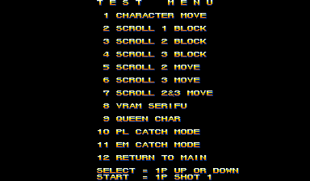

As with several other CPS2 games, there is a hidden test menu in the game. It is accessed relatively easily by setting the byte @ 0xFF21AA to 2 while the standard test menu is active. Unfortunately, there doesn't seem to be any remaining code that sets that the value to 2, so we can't really speculate as to how it was originally enabled.

But we can certainly force it with cheats, so let's have a look inside.

In all menus, P2 Start changes background color. a single press makes a "big" change, while holding it changes the hue in a gradient

## Character Test

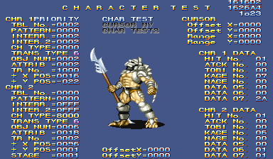

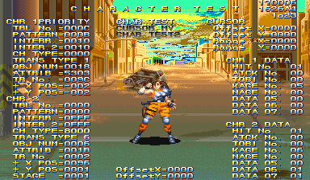

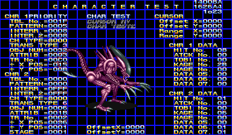

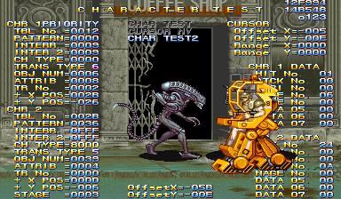

Here we have a tool for viewing the variety of characters in the game, both players and enemies. It has a variety of functions spread across three modes. It's a complex tool that makes use of all four inputs.

### General Controls

These inputs work across all three modes:

 - P1 Start changes the mode.
 - P1 Coin cycles the background between flat color, grid and the stage, with and without the text overlay for each of these. (This is interesting because I've never seen a debug tool make use of the coin trigger before. But at the hardware level it is just anotehr switch, and whatever interface the developers were using, it was probably just another button.)
 - P3 B3 changes the color palette (the STAGE value). This also determines which stage background is displayed in the background for the previous option, though the palette is often incorrect.
 - P4 Start highlights the "CHR 1" text, and then P4 B2/B3 cycle palette.
 - P3 B2 changes the layer on which the sprites are drawn. This is indicated in the upper right as o123 and 1o23. Basically, it determines if the text over is drawn in front of or behind the sprites.

### Mode 1 - CHAR TEST

The basic character viewer. Most of the commands here work in the other modes as well:

 - P1 Up/Down changes the Patttern. Hold P2 B4 to change this value quickly.
 - Hold P1 B2 and use P1 Up/Down to change the TBL No. (the grouping of patterns)
 - Hold P1 B1 to play the animation, if the current pattern has one. P1 B3 advances to the next single frame of animation. Holding P2 B4 and using P1 B3 plays the animation quickly. The difference between P1+B1 and P2+B4/P1-B3 is that the former will play the animation with its timings while the latter will play each frame with no delays.
 - P1 B2 resets the animation to its initial frame.
 - P4 B1 changes the weapon held by the character
 - P3 Up/Down changes the vertical flip; P3 Left/Right changes the horizontal flip. Note that when in CHAR TEST2 mode, this controls the second character only. However, P1 Left/Right will also change the horizontal flip for the first character in any mode.

also p3 b2 + p2 stick moves the char test2 sprite

### Mode 2 - CURSOR MV

This mode moves the cursor around the screen, represented by a white plus sign. It also displays an orange plus sign, presumably indicating the bottom point of the character. The white cursor can be moved by the P2 stick. Holding P2 B1 and moving the stick causes the cursor to "expand" and form a bounding box. The position and size of the box are indicated in the CURSOR section of text in the upper right. P3 B1 will reset the cursor to its initial position.

This may have been used to measure hit boxes on sprites.

### Mode 3 - CHAR TEST2

This mode spawns a second sprite that can be configured independently of the first. The controls mostly mirror those in the normal CHAR TEST mode but mapped to the P2 controls.

P3 stick changes the mirror/flip for the second sprite; P2 Left/Right also changes the mirroring.

The second sprite can be positioned on the screen, something that is not possible with the first sprite. Hold P3 B2 and use P2 stick to move the second sprite around.

P3 Start changes the priority between the two sprites (that is, determines which displays in front of the other).


## Scroll 1/2/3 Block Test

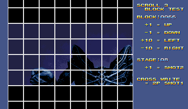

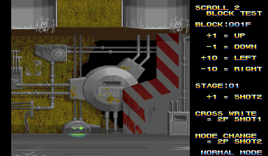

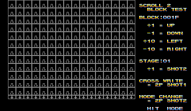

These three tests are very similar, so I have grouped them together here. They display various large, static tilemaps: stage backgrounds and cutscene images and such.

The controls are helpfully displayed on the screen, so there's not much to discuss here on that topic.

Scroll 1 only has the "Recycle It" and Q-Sound screens while scroll 2 and 3 have the interesting graphics. Scroll 2 also has a Hit Mode, which displays the collision markers for that particular block.

## Scroll 2/3 Move Test

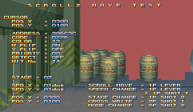

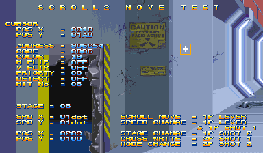

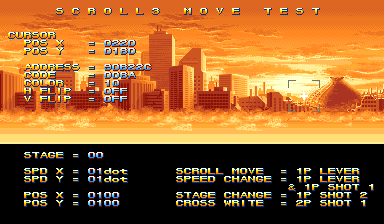

Once again, these two tools are nearly identical so I have grouped them together.

The Scroll Move tests are similar to the Scroll Block test in that they display the stage backgrounds, but here we see them assembled and as they appear in the game. Scroll 2 is the intermediate background layer, while Scroll 3 is the far background.

Here too the controls are printed on the screen. They are mostly identical for both, though Scoll 2 once again has the hit mode toggle that displays the collision.

## Scroll 2&3 Move Test

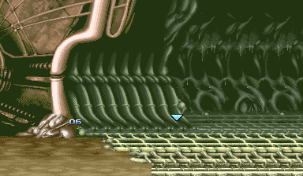

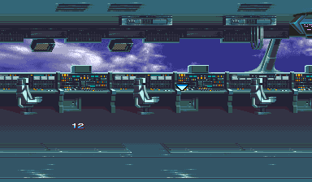

If we think of the two previous sections as graphics viewers that start with foundational pieces (Block Test) then advance to seeing those pieces assembled (Move Test), we can think of this tool (Scroll 2&3 Move Test) as the progression of that pattern.

This tool combines the scroll 2 and scroll 3 background layers with their parallax scrolling, presented just as they would be in the final game. The tool consists of a movable cursor (controlled with P1 Stick) and a number indicating the ID of the displayed scene. P1 Button 2 advances the scene ID, while P1 Button 3 toggles free movement and collision.


## VRAM Serifu


## Queen Char

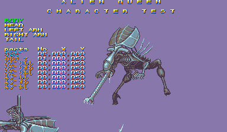

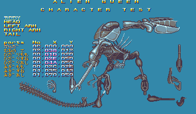

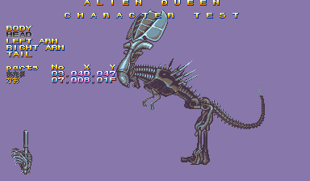

Remember [KiSS dolls](https://en.wikipedia.org/wiki/Kisekae_Set_System) from the old internet? That's kind of what we have here: a tool to arrange the individual parts of the queen alien.

p1 start cycle through body sections
p1 b1 cycle through body parts
p1 b2/b3 increase/decrease the Number
p1 stick move the body part position

p2 b1 toggle text overlay


## PL/EM Catch Mode


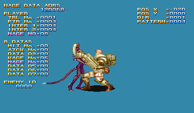

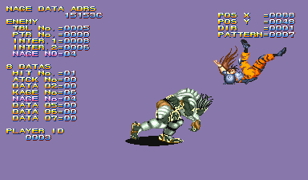

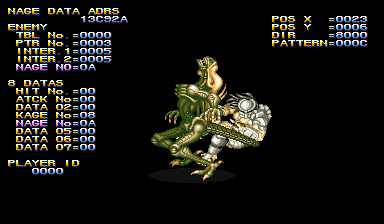

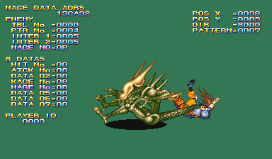

p1 up/down chage pattern number
p1 b1 play animation in loop
p1 b2 reset animation
hold p1 b2 + p1 up/down change table number
p1 b3 advance animation on frame
p1 start toggle text overlay

p2 up/down change opponent id


# Debug DIPs

At first glance, Alien vs Predator does not seem to use [the CPS2 debug DIP switches](/entry/cps2-debug-switches-and-the-games-that-love-them/) that we have talked about in the past. These were three rows of eight physical switches, only present on development hardware, with each row mapped to bytes in RAM from 0x8040B0 to 0x8040B2. Many final production games still contain code that references these switches, though in most cases that code is blocked off or disabled.

In Alien vs Predator, there are no such references in the code to these switches at all. However, it's pretty likely that the game did make use of them at one time. How do we know?

It's simple enough: There are a number of debugging tools remaining in the game that are activated in an identical way to other games that do use the switches. The tools are toggled by bit-level flags stored across three bytes in RAM, from 0xFF806C to 0xFF806E. These bytes are likely where the copy of the hardware switch state was stored.

That is how most games (including CPS2 games) handle reading values from external inputs like controllers and switches: read the value once early in an update period (usually the screen blanking interval) and store it in RAM for all the subsequent program logic to use. This keeps things consistent because such external devices (controllers, switches, data communication) are volatile in nature. That is, their state can change independent of the CPU. Multiple reads directly from the hardware can return inconsistent results and possibly even affect the internal state of the external device.

So storing an exact copy of the value of the switches in memory is completely normal. It seems we're left with references to the copies and are missing the piece of code that does that copying itself.

The logical conclusion is that copying code was removed before the game was published, a guarantee that the dev tools would not be accessible on any hardware in the final version.

But the programmers did something interesting, something I haven't seen done in a CPS2 game before...

## Soft Switches

Within Alien vs Predator, there is code that enables the user to toggle the bit level state of the debug bytes from within the game:

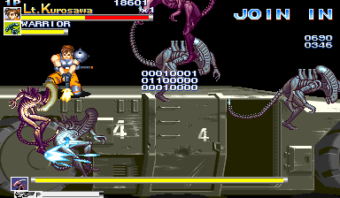

Here we see three rows of eight bits, showing the state of the three debug bytes in RAM and representing the three rows of switches present on a CPS2 development board. Essentially, it is a "virtual" bank of switches, controlling the debug flags by software rather than hardware.

Each row is managed by a player controller (Player 1, 2 and 3) with each unqiue input on that controller mapping to one bit in the row: the first four bits map to the joystick and the last four to the four buttons. (We'll discuss this more in depth in the technical section.)

Such a system would have been useful for playtesters who may have only had production hardware instead of a proper development board or perhaps even to other devs if the number of proper development units was limited. They would be able to access all the debugging tools without needing the physical switches.

## Soft Switches - Technical

We're missing code that copies from the debug DIPs hardware switch bank, which begs the question: was it actually removed, or was it *replaced* with the soft DIPs system?

The code located at 0x1434 seems to answer that for us:

[0x1434 disasm]

The end result of this small routine is that the global debug tool enable flag will be toggled based if *either* DIP 1 Switch 1 is set OR the soft DIP subsystem is enabled. The "global debug tool enable flag" is checked by all of the debugging tools at their start. It must be non-zero or the tool exits immediately. Essentially then, Debug DIP 1-1 needs to be set, OR the soft DIPs enable flag must be set to allow any of the debugging tools to run.

Thinking inductively, we can say that hardware copy code was *removed* rather than *replaced* by the soft DIPs and the two methods of setting debug flags "coexisted." We can say this because if we were to assert that the debug flags could only be set by teh soft dips system (that is, that the soft dips had replaced the hardware copying and there was now no other way to set those flags), then the code at 0x1434 doesn't make sense. 


This display is toggled with P4 B2+B3. The game does not pause when it is on screen, so your inputs will also affect the gameplay in the background. (Note that you will need to enable the soft DIPs subsystem first with a MAME cheat; we'll dicuss that in the technical section.)

---

NEW THEORY:

Let's review the code at 1434:

it first checks bit 0 of dip 1 (the "copied to ram" dips) and if it *is set* it will set bit 1 of the temp variable in that routine. It then checks the use soft dips variable and ORs the temp variable against it. The temp variable then gets written into the global "debug enable" that is used by all the debugging tools.

SO... if the copy is unset and use soft dips is unset, then global debug is unset... if EITHER of those two is set, then global debug is set...

SO... we can extrapolate from this that "use soft dips" flag and the DIP copies are independent... since either of the two is checked to enable debug tools globally, it does NOT seem that the soft dips are a replacement for the hardware copy... if there was a dependency, then the DIP copy bits could never be set without using the soft dips, and the code at 1434 wouldn't make sense: checking the DIP copy at all implies it could be set elsewhere... that is, within a copy routine somewhere else, that is no longer present in our version...


BUZZER ERRRR WRONG....

What about if the soft dips were turned on, DIP 1-1 was set, and then the dips disabled? 0x1434 would still make sense...

---

One theory is that there were different build targets for dev and non-dev hardware that either enabled the copy code and disabled the software DIPs or vice versa, and that we have the former of those. Or, perhaps the switch copy code "coexisted" with the software DIPs and there was a separate flag that acted as a toggle to choose whether to read from hardware or not, and then that code was removed... Who knows.

I do however strongly feel that the debugging DIP switches were in use by the team in some fashion and that the "emulated" soft switches were an add-on to their existing structure.

So, in summary, our version of Alien vs Predator does not use the debug DIP hardware, but it does have a number of debug tools which are enabled using bitwise flags in a layout that is identical to a RAM copy of those DIP switches. Those flags are enabled/disabled by an in-game tool that "emulates" the DIPs, mapping each switch to an input on all three player controllers. There are a number of possibilities for why the actual, physical DIP switches are not used in the final version, but we can only conjecture the reason.

## Soft DIPs technical

There's not much more to discuss with the soft switches, but less address a couple more technical aspects.

First, how is the soft switch display shown in the screenshot above accessed? We mentioned P4 B2+B3 will toggle it, but there's another variable in play: the byte at 0xFF81D8 seems to be the flag to enable the soft DIP system. This byte is checked at the very start of the soft dip display code and will immediately return if it is zero.

Unfortunately, there is no code that writes to this location, so whatever method was used to set it has been removed. So the first step to restoring the soft DIPs is a cheat to set things up:

```
  <cheat desc="Enable Debug Soft DIPs">
    <comment>Enables the soft DIPs system; display can be toggled with Player 4 B2+B3</comment>
    <script state="on">
      <action>temp0=maincpu.mb@ff81d8</action>
      <action>maincpu.pb@ff81d8=1</action>
    </script>
    <script state="off">
      <action>maincpu.pb@ff81d8=0</action>
    </script>
  </cheat>
```


ff81c7 - uk__debug__global_debug_tools_enable - Seems to be the "global" debug tools enable (tools check that this is non-zero to even begin processing)
^---- used the most, used by the tools themselves

ff81d8 - debug__uk__use_soft_dips - 
                     it seems that this is the flag to use the soft DIP 
                     system; when set, the spawner will not work (as it 
                     uses the P4 inputs)

^--- only used in a couple places


TODO - need to really confirm what is different about the above two
ff81dc - debug__enable_soft_dip_config - enables the soft dip display and editor

SOFT DIP CONTROLS:

right - bit 0
left - bit 1
down - bit 2
up - bit 3
B1 - bit 4
B2 - bit 5
B3 - bit 6
B4 - bit 7


In fact, there is another set of three bytes involved here, from 0xFF81D9 to 0xFF81DB, and these also appear to be copies of what was read from the physical switches.

To make things easier, we'll refer to the copies in the 0xFF806C range as Copy A, and those in the 0xFF81D9 range as Copy B. Copy A is what is actually used by 


CURRENT THEORIES:

- Copy B is an copy of the data read directly from switch memory mapping
- Copy B is the settings saved to memory and then loaded on startup


the "soft dip" system is not perfect - it conflicts with the object spawner which makes use of the P4 controls that the soft dip editor does


And this is where things get interesting: Alien vs Predator seems to make use of "virtual" or "soft" DIP switches.

First let's look at his interesting bit of code located at 0x12D6:

[disasm of 0x126 to 0x12ec]

It is only called once, during startup. It copies three bytes, from 0xFF81D9 into 0xFF806C, followed by the next two bytes. Notably, it has an RTS right at the start, returning immediately and never reaching the actual copy.


DO NOT USE THIS:

Devices that are connected to a CPU (things like joysticks and buttons and lightguns and keyboards) have a *volatile state,* meaning their operation and output can change independnt of the state of the CPU. In the case of things like keyboards or lightguns, an *interrupt* is generated, which is a signal to the CPU that an external device needs attention or has some data to give. However, some devices do not generate an interrupt and their state must be checked by the CPU whenever it needs an update.

This is usually the case for game hardware controllers. The state of the joystick and buttons is only checked by the CPU at certain intervals, usually during the vertical blanking interval, that period of time when the CRT's beam was resetting up to the top left corner. That means that even if you hit a button while that CRT screen update is only half down, it won't register with the game until the blanking interval. Those speeds are incredibly fast (60 times per second, usually) so it's not noticeable to anyone who isn't a top tier elite noscope 360 pro gamer.

Now lets say it's that blanking period, and your code is updating the state of the game based on what is being pressed on the controller. Now lets say you happen to press a button or change direction quickly enough during that period. If the code is reading directly from the hardware, then the state of the controller is inconsistent. It may have read that you were pressing Button A earlier and is now on a code path for that button press, but now you're holding B instead. If the code needds to check the controller again, expecting A to be pressed but finds it isn't, it may enter some invalid code.

(also: quick reads from the hardware may put it into a bad state, etc)

Instead, the state of the controller is read once earlier on and saved off to RAM, and that is considered the definitive state of the controller for the rest of that update period.

This applies to DIP switches as well: the state is read early on and copied to RAM and any code that needs to check those switches references the RAM copy rather than the hardware mapping itself.

This is how the CPS2 games work with their debug DIP switches as well: copying the state of all three to RAM for the rest of the game to read from.


With all that out of the way, let's have a look at what tools are actually available.

## Spawner

P4 Stick - move cursor
P4 B1 - spawns object/task
P4 B2 - hold + P4 up/down to change object/task
P4 B3 - "fast" mode - hold this to move the cursor quickly or to sroll the object selection quickly


## Stage Collision

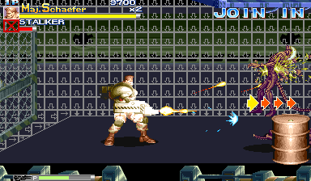

## Hitboxes

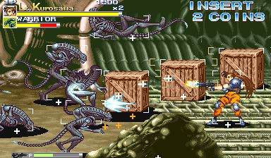


# Scratchpad

# Alien vs Predator

https://twitter.com/suddendesu/status/1503361292077506560

# Debug DIPs

Interestingly, this games does not seem to use [the CPS2 debug DIP switches](/entry/cps2-debug-switches-and-the-games-that-love-them/). There are no references in the code (as far as I can tell) to the hardware mapping for the switches. However, there are a number of debugging functions that are activated at the bit level, so it's likely that the code to read from the switches was removed while the debugging functions that may have used them remain.

TODO: not sure the bits atatement above is true...

# Debug Tools

0xff81d8 when non-zero, pressing p1/2 start suicides that player
TODO: does it do anything else?

looks like both 0xff81d8 and 0xff81dc must be non-zero to access other functions in subroutine @ 0x144a


mmmmmokay....

0xff81d8 looks to be the general "debug enable" for code @ 0x144a

The code at 0x1434 is interesting. It will set bit 0 of 0xff81d8 when bit 0 of 0xff806c is set. 0xff806c/6d/6e aer bytes that represent a binary state of inputs pressed for p1/p2/p3. That is, when an input is pressed, it sets or clears that bit. The code to do this bit state work is within 0x144a, specifically beginning at 0x1468. What is interesting is that 0x144a is conditional on 0xff81d8 being non-zero. That is, teh code to set the bit to enter the function is within that function, meaning it can't be normally called anyway... reasons for this?

Code at 0x12d6 is blocked by an rts. Copies ff81d9/da/db to 0xff806c/6d/6e
This was *probably* the copy of the debug dip mirrors (ff81d*) to the soft dips (ff806*)

---

Okaaay...

The "soft dips" were enabled/disabled by P4 B2+B3 (same time)

(when ff81d8 is set to 1!)

Bit zero of DIP 0 (soft or hard) enables the object spawner
However, it will not work if Soft DIPs are enabled, since they share use of P4 inputs


DIP 1
bit 0 - enables other debug tools; enables spawner (controller by P4); enables player suicide (with Start)
bit 1 - checked within code beginning b1998, which seems to be uncalled...? - when hacked in, shows a dump of hex on the right side of the screen
bit 2 - checked within code beginning b1866, which seems to be uncalled...? - when hacked in, like above, shows some hex on the left side

3 - 7 look to be unchecked

DIP 2
0-4 unchecked
5 - tested within code @ 03a5cc, which is called through a maze of functions above that we haven't unraveled yet
6 - display stage collision/boundaries
7 - display hitboxes

DIP 3
0 - unchecked
1 - when set, computer controlled players do nothing during attract mode gameplay demo sequences
2 - checked within code beginning b1a84, which seems to be uncalled...?
3 - disables timer countdown in the "break control box" special stage
4 - displays two numbers on the right side, may possible be CPU load; number goes higher and turns red when spawning many entities
5 - shows the x/y position of the cursor for the spawner
6-7 unchecked

TODO: need to find a better way to get the uncalled debug functions hacked in...


# Alt credits

credits @ 0x15ac8 appear to be used

but there is anotehr set @ 0x98850 that is slightly different. Unused?

The data at 0x98850 is referenced by code beginning 0x9871a, which is in turn listed in a ptbl at 0x1bc28

The normal staff roll is called from 0x157d2, as a direct jump. So the calling methods are different.


---


