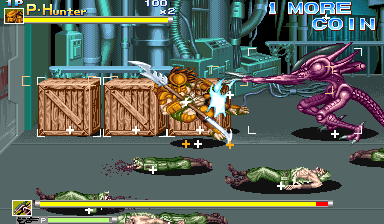

We're back on our CPS2 jam, this time looking at Alien vs Predator. Buried in its code are a bunch of debugging tools. Things were actually blessedly straightforward this time, compared to the mess that was Progear no Arashi, so let's get into it.

<!--more-->

# Player 4

It must first be noted that the game makes use of 4 button control panels and of the Player 4 slot. On the final hardware, Player 4 is not present and only 3 buttons are used, and thus that is the configuration MAME uses. I will be opening a PR to MAME to add the extra controls when the machine is in the development configuration, but until it is merged (if it is merged...), you will need to build a custom version of MAME in order to fully use all of the debug tools.

It is a pretty simple modification. In `cps2.cpp`, find these lines near the bottom:

```
GAME( 1994, avsp,       0,        cps2,     cps2_3p3b, cps2_state, init_cps2,     ROT0,   "Capcom", "Alien vs. Predator (Europe 940520)",                                            MACHINE_SUPPORTS_SAVE )
GAME( 1994, avspu,      avsp,     cps2,     cps2_3p3b, cps2_state, init_cps2,     ROT0,   "Capcom", "Alien vs. Predator (USA 940520)",                                               MACHINE_SUPPORTS_SAVE )
GAME( 1994, avspj,      avsp,     cps2,     cps2_3p3b, cps2_state, init_cps2,     ROT0,   "Capcom", "Alien vs. Predator (Japan 940520)",                                             MACHINE_SUPPORTS_SAVE )
GAME( 1994, avspa,      avsp,     cps2,     cps2_3p3b, cps2_state, init_cps2,     ROT0,   "Capcom", "Alien vs. Predator (Asia 940520)",                                              MACHINE_SUPPORTS_SAVE )
GAME( 1994, avsph,      avsp,     cps2,     cps2_3p3b, cps2_state, init_cps2,     ROT0,   "Capcom", "Alien vs. Predator (Hispanic 940520)",                                          MACHINE_SUPPORTS_SAVE )

```

Where the text says `cps2_3p3b`, change this to `cps2_4p4b` then save and [recompile MAME](https://docs.mamedev.org/initialsetup/compilingmame.html).

# Test Menu


As with several other CPS2 games, there is a hidden test menu in the game. It is accessed when the byte @ 0xFF21AA equals 2 while the standard test menu is active.

Unfortunately, there doesn't seem to be any remaining code that sets that value, so we can't really speculate as to how it was originally enabled. But we can easily force it with cheats, so let's have a look inside.

In all tools, P2 Start changes background color.

## Character Test


Here we have a tool for viewing the variety of characters in the game, both players and enemies. It has a variety of functions spread across three modes. It's a complex tool that makes use of all four inputs.

### General Controls

These inputs work across all three modes:

 - P1 Start changes the mode.
 - P1 Coin cycles the background between flat color, grid and the stage, with and without the text overlay for each of these. (This is interesting because I've never seen a debug tool make use of the coin trigger before. But at the hardware level it is just anotehr switch, and whatever interface the developers were using, it was probably just another button.)
 - P3 B3 changes the color palette (the STAGE value). This also determines which stage background is displayed in the background for the previous option, though the palette is often incorrect.
 - P4 Start highlights the "CHR 1" text, and then P4 B2/B3 cycle palette.
 - P3 B2 changes the layer on which the sprites are drawn. This is indicated in the upper right as o123 and 1o23. Basically, it determines if the text over is drawn in front of or behind the sprites.

### Mode 1 - CHAR TEST

The basic character viewer. Most of the commands here work in the other modes as well:

 - P1 Up/Down changes the Patttern. Hold P2 B4 to change this value quickly.
 - Hold P1 B2 and use P1 Up/Down to change the TBL No. (the grouping of patterns)
 - Hold P1 B1 to play the animation, if the current pattern has one. P1 B3 advances to the next single frame of animation. Holding P2 B4 and using P1 B3 plays the animation quickly. The difference between P1+B1 and P2+B4/P1-B3 is that the former will play the animation with its timings while the latter will play each frame with no delays.
 - P1 B2 resets the animation to its initial frame.
 - P4 B1 changes the weapon held by the character
 - P3 Up/Down changes the vertical flip; P3 Left/Right changes the horizontal flip. Note that when in CHAR TEST2 mode, this controls the second character only. However, P1 Left/Right will also change the horizontal flip for the first character in any mode.
 - P2 Start changes the background color like in other modes, but holding P2 Start will change the shade of that particular color.

also p3 b2 + p2 stick moves the char test2 sprite

### Mode 2 - CURSOR MV

This mode moves the cursor around the screen, represented by a white plus sign. It also displays an orange plus sign, presumably indicating the bottom point of the character. The white cursor can be moved by the P2 stick. Holding P2 B1 and moving the stick causes the cursor to "expand" and form a bounding box. The position and size of the box are indicated in the CURSOR section of text in the upper right. P3 B1 will reset the cursor to its initial position.

This may have been used to measure hit boxes on sprites.

### Mode 3 - CHAR TEST2

This mode spawns a second sprite that can be configured independently of the first. The controls mostly mirror those in the normal CHAR TEST mode but mapped to the P2 controls.

P3 stick changes the mirror/flip for the second sprite; P2 Left/Right also changes the mirroring.

The second sprite can be positioned on the screen, something that is not possible with the first sprite. Hold P3 B2 and use P2 stick to move the second sprite around.

P3 Start changes the priority between the two sprites (that is, determines which displays in front of the other).


## Scroll 1/2/3 Block Test


These three tests are very similar, so I have grouped them together here. They display various large, static tilemaps: stage backgrounds and cutscene images and such.

The controls are helpfully displayed on the screen, so there's not much to discuss here on that topic.

Scroll 1 only has the "Recycle It" and Q-Sound screens while scroll 2 and 3 have the interesting graphics. Scroll 2 also has a Hit Mode, which displays the collision markers for that particular block.

## Scroll 2/3 Move Test


Once again, these two tools are nearly identical so I have grouped them together.

The Scroll Move tests are similar to the Scroll Block test in that they display the stage backgrounds, but here we see them assembled and as they appear in the game. Scroll 2 is the intermediate background layer, while Scroll 3 is the far background.

Here too the controls are printed on the screen. They are mostly identical for both, though Scoll 2 once again has the hit mode toggle that displays the collision.

## Scroll 2&3 Move Test


If we think of the two previous sections as graphics viewers that start with foundational pieces (Block Test) then advance to seeing those pieces assembled (Move Test), we can think of this tool (Scroll 2&3 Move Test) as the progression of that pattern.

This tool combines the scroll 2 and scroll 3 background layers with their parallax scrolling, presented just as they would be in the final game. The tool consists of a movable cursor (controlled with P1 Stick) and a number indicating the ID of the displayed scene. P1 Button 2 advances the scene ID, while P1 Button 3 toggles free movement and collision.


## VRAM Serifu


## Queen Char


Remember [KiSS dolls](https://en.wikipedia.org/wiki/Kisekae_Set_System) from the old internet? That's kind of what we have here: a tool to arrange the individual parts of the queen alien.

p1 start cycle through body sections
p1 b1 cycle through body parts
p1 b2/b3 increase/decrease the Number
p1 stick move the body part position

p2 b1 toggle text overlay


## PL/EM Catch Mode


p1 up/down chage pattern number
p1 b1 play animation in loop
p1 b2 reset animation
hold p1 b2 + p1 up/down change table number
p1 b3 advance animation on frame
p1 start toggle text overlay
holding P2 start cycles bg color 

p2 up/down change opponent id


# Debug DIPs

At first glance, Alien vs Predator does not seem to use [the CPS2 debug DIP switches](/entry/cps2-debug-switches-and-the-games-that-love-them/) that we have talked about in the past. These were three rows of eight physical switches, only present on development hardware, with each row mapped to three bytes in RAM (0x8040B0 to 0x8040B2). Many final production games still contain code that references these switches, though in most cases that code is blocked off, uncalled, or otherwise disabled.

In Alien vs Predator, there are no such references to these switches at all. However, it's pretty likely that the game did make use of them at one time. How do we know? It's simple enough: there are a number of debugging tools remaining in the game that are activated identically to other games that do make use the switches.

The tools are toggled by bit-level flags stored across three bytes in RAM, from 0xFF806C to 0xFF806E. These bytes were likely the cached copy of the hardware switch state.

That is how most games (including CPS2 games) handle reading values from external inputs like controllers and switches: read the input once early in an update period (usually the screen blanking interval) and store it in RAM for all the subsequent program logic to use. This keeps things consistent, because such external devices (controllers, switches, data communication) are volatile in nature. That is, their state can change independent of the CPU. Multiple reads directly from the hardware can return inconsistent results and, in some cases, even affect its internal state.

So storing an exact copy of the switches in memory is completely normal. It seems we are missing the code that does that copying and and are left with only the references to where those copies would be in RAM.

The logical conclusion is that the copying code was removed before the game was published, a guarantee that the dev tools would not be accessible on any hardware in the final version. That conclusion is probably the correct one, but the story with the debug DIP switches doesn't end there. The programmers did something interesting, something I haven't seen done in a CPS2 game before...

## Soft Switches

Alien vs Predator has code to "emulate" the debug switches in software:


Here we see three rows of eight bits, showing the state of the three debug bytes in RAM and representing the three rows of switches present on a CPS2 development board. Essentially, it is a "virtual" bank of switches, controlling the debug flags by software rather than hardware, where 0 is off and 1 is on.

(*Technically* it's still controlled by hardware since it uses the player controllers to do the toggling, but let's not split hairs...)

Such a system would have been useful for play testers who may have only had production hardware instead of a proper development board or perhaps to other devs if the number of proper development units was limited. They would be able to access all the debugging tools without needing the physical switches.

In this mode, each row is managed by its respective player controller (Row 1 by Player 1, Row 2 by P2, and so on) with each unqiue input on that controller mapping to one bit in the row: the first four bits map to the joystick and the last four to the four buttons.

The switch config mode is toggled with P4 B2+B3. The game does not pause when it is on screen, so your inputs will also affect the gameplay in the background.

But things aren't quite that simple. There's a "software switch enable" flag that needs to be set first.

## Soft Switches - Technical

Something that may have crossed your mind about this soft DIPs system is contention between the two "sources": if both the hardware switches and these virtual switches are present, which takes precedence?

The next logical thought is, well, that's probably why they removed the aforementioned copying code. Sure, that's a possibility. Perhaps these soft switches replaced the use of the hardware switches entirely. Or perhaps there were different build targets: one for dev hardware that copied from physical switches and disabled the soft switch code, and vice versa for non-dev hardware.

Another possibility is that the two systems "coexisted," that there was another flag that determined which source to use, and that the hardware copy code was removed because it was the production build as we initially surmised.

I lean more towards that last scenario, and that's because there is indeed a "soft switch enable" flag in the code. It is the byte located at 0xFF81D8 and it must be non-zero to enable the use of the soft switches UI.

How to set that flag is unknown since all references to it are reads and nothing writes to it except for RAM initialization on startup. All that it really does in our final version is act as the flag to enable the soft switches code, and to disable the object spawner (for reasons that we will describe in that section below). Presumably, it would have also been used in the missing routine that copied the hardware debug switches.

So, in summary, our version of Alien vs Predator does not use the debug DIP hardware, but it does have a number of debug tools which are enabled using bitwise flags in a layout that is identical how other games make use of the switches. Those flags are toggled by an in-game tool that "emulates" the DIPs, mapping each switch to an input on all three player controllers. There are a number of possibilities for why the actual, physical DIP switches are not used in the final version, but since there is a flag to enable/disable the use of the software switches, it's likely that the hardware switch copy was simply removed before the final build.

Without further ado, here is the MAME cheat to enable the software switches. Don't forget you'll need to press Player 4 B2+B3 simultaneously to display/hide the switch interface. You will also need to set the "global debug tools enable" flag with switch 1-1 to enable any of the tools (see the next section).

```
  <cheat desc="Enable Debug Soft DIPs">
    <comment>Enables the soft DIPs system; display can be toggled with Player 4 B2+B3</comment>
    <script state="on">
      <action>temp0=maincpu.mb@ff81d8</action>
      <action>maincpu.pb@ff81d8=1</action>
    </script>
    <script state="off">
      <action>maincpu.pb@ff81d8=0</action>
    </script>
  </cheat>
```


# Debug Tools

And now let's finally have a look at what sort of debugging tools are now available to us... after we discuss one last thing.

Because things aren't complicated enough, there is yet another flag check that stands in the way of accessing the debug tools, and that is the global "debug tools enable" flag. This is the byte at 0xFF81C7, and all the debug tools check that this value is non-zero before they run. 

Thankfully, this flag is set by simply enabled debug DIP switch 1-1. Easy!

So if you're doing things the "proper" way, you would need to:

1. Enable the soft switches cheat
2. Display the switches interface with P4 B2+B3
3. Set switch 1-1
4. Set other switches for the debug tools you'd like to use
5. Close the switches interface with P4 B2+B3 again
6. If you want to use the item spawner, you'll then need to disable the soft switches cheat (see the next section)

While I think it is very, very important to document how such tools were *meant* to be accessed, I also understand that it is a bit of an annoyance to go through all these steps. So for the three main tools (spawner, stage collision, hitboxes), I will include a MAME cheat that will enable these directly without having to mess about with the switches interface and turning things on and off.

Okay, *now* let's have a look at the tools themselves.

## Switch 1-1 - Tools enable; Entity Spawner; Player suicide; Info display

As we said in the previous section, the primary use of switch 1-1 is to act as the global "debug tools enable" flag. In other words, **make sure switch 1-1 is enabled before using the other debug tools.**

Aside from that, this switch displays a numeric value on the left hand side of the screen. The lower value is the time remaining for the current scene. It's unknown what the two numbers above are used for.

Moreover, this switch also enables instant player suicide by pressing that player's Start button during gameplay.

That's not exactly useful, but the last function it enables is quite handy: an object spawner.


The spawner appears on screen as a green triangle acting as the cursor with the name of the current object/task in the upper right. It is controlled with the Player 4 inputs: the stick moves the cursor, holding P4 B2 and pressing Up/Down changes the item to spawn, P4 B1 spawns the selected object, and holding P4 B3 activates "fast mode", which moves the cursor and the item selection quickly.

Since the spawner makes use of the P4 controls quite a bit, it is incompatible with the DIP switches interface we discussed above. As you'll recall, that display is toggled with P4 B2+B3, which interferes with the spawner. As such, **the object spawner will not display/run while the "soft switch enable" flag is set.**

This makes things a little convoluted as you need to enable the soft switches, then display them, then set switch 1-1, then disable the switches (the steps 1 to 6 above)... So instead of all that, you could just use this cheat to activate all the switch 1-1 tools directly. Just make sure you have the "Enable Debug Soft DIPs" cheat disabled too if you want to use the spawner.

```
  <cheat desc="Enable Debug and Spawner">
    <comment>Sets the flag to enable all other debug tools; also enables player suicide with Start button, a data display, and an object spawner controlled with Player 4 inputs</comment>
    <script state="on">
      <action>maincpu.pb@ff806c=(maincpu.pb@ff806c | 1)</action>
    </script>
    <script state="off">
      <action>maincpu.pb@ff806c=0</action>
    </script>
  </cheat>
```

## Switch 2-6 - Display Stage Collision


Remember the "display stage collision" option in the Scroll viewers in the test menu we discussed earlier? Well now you can see them live, in game!

Note that toggling this switch will not affect the background immediately. You will need to walk through the stage to see the changes as it updates the background.

And as above, here is a cheat to enable it directly without the need of the switches interface. Don't forget that **switch 1-1 needs to be set for this tool to activate**, so make sure the "Enable Debug and Spawner" cheat is set as well.

```
  <cheat desc="Show Stage Collision">
    <comment>Requires "Enable Debug and Spawner" to be set</comment>
    <script state="on">
      <action>temp0=maincpu.mb@ff806d</action>
      <action>maincpu.pb@ff806d=(maincpu.pb@ff806d | 0x40)</action>
    </script>
    <script state="off">
      <action>maincpu.pb@ff806d=(maincpu.pb@ff806d BAND 0xbf)</action>
    </script>
  </cheat>
```

## Switch 2-7 - Display Hitboxes




Just like the title says. Displays the hitboxes of all entities on the screen, including objects and pickups.

Here is a cheat to enable hitboxes without the need of the switches interface. Again, **switch 1-1 needs to be set for this tool to activate**, so make sure the "Enable Debug and Spawner" cheat is set as well.

```
  <cheat desc="Enable Hitboxes">
    <comment>Requires "Enable Debug and Spawner" to be set</comment>
    <script state="on">
      <action>temp0=maincpu.mb@ff806d</action>
      <action>maincpu.pb@ff806d=(maincpu.pb@ff806d | 0x80)</action>
    </script>
    <script state="off">
      <action>maincpu.pb@ff806d=(maincpu.pb@ff806d BAND 0x7f)</action>
    </script>
  </cheat>
```

## The Rest of the Switches

1-2 - checked within code beginning b1998, which seems to be uncalled...? - when hacked in, shows a dump of hex on the right side of the screen

Appears to be an object monitor. The text on the right is the objecty ID, teh X/Y position, and some other info. The color is the current status of that object slot.

The game crashed occasionally when this was enabled, the given the nature of the crashes (it varied, but in several cases it was address errors, indicating invalid values going into the function) it may just not be being called from the correct place

1-3 - checked within code beginning b1866, which seems to be uncalled...? - when hacked in, like above, shows some hex on the left side

Appears to be a player monitor. Displays the X/Y position of the player, while the bottom two rows seem to be positioning of the stage itself.

1-4 to 1-8 appear to be unused

2-1 to 2-5 appear to be unused
2-6 - tested within code @ 03a5cc, which is called through a maze of functions above that we haven't unraveled yet

3-1, 3-7, 3-8 - unused
3-2 - when set, computer controlled players do nothing during attract mode gameplay demo sequences
3-3 - checked within code beginning b1a84, which seems to be uncalled...?
seems to show a grid overlay
3-4 - disables timer countdown in the "break control box" special stage
3-5 - displays two numbers on the right side, may possible be CPU load; number goes higher and turns red when spawning many entities
3-6 - shows the x/y position of the cursor for the spawner


TODO: need to find a better way to get the uncalled debug functions hacked in...


# Alt credits

The "Mystics" object in the spawner shows these credits!

credits @ 0x15ac8 appear to be used

but there is anotehr set @ 0x98850 that is slightly different. Unused?

The data at 0x98850 is referenced by code beginning 0x9871a, which is in turn listed in a ptbl at 0x1bc28

The normal staff roll is called from 0x157d2, as a direct jump. So the calling methods are different.


ff81c7 - uk__debug__global_debug_tools_enable - Seems to be the "global" debug tools enable (tools check that this is non-zero to even begin processing)
^---- used the most, used by the tools themselves

ff81d8 - debug__uk__use_soft_dips - 
                     it seems that this is the flag to use the soft DIP 
                     system; when set, the spawner will not work (as it 
                     uses the P4 inputs)

^--- only used in a couple places


TODO - need to really confirm what is different about the above two
ff81dc - debug__enable_soft_dip_config - enables the soft dip display and editor

SOFT DIP CONTROLS:

right - bit 0
left - bit 1
down - bit 2
up - bit 3
B1 - bit 4
B2 - bit 5
B3 - bit 6
B4 - bit 7


In fact, there is another set of three bytes involved here, from 0xFF81D9 to 0xFF81DB, and these also appear to be copies of what was read from the physical switches.

To make things easier, we'll refer to the copies in the 0xFF806C range as Copy A, and those in the 0xFF81D9 range as Copy B. Copy A is what is actually used by 


With all that out of the way, let's have a look at what tools are actually available.


# Scratchpad

# Alien vs Predator

https://twitter.com/suddendesu/status/1503361292077506560

# Debug DIPs

Interestingly, this games does not seem to use [the CPS2 debug DIP switches](/entry/cps2-debug-switches-and-the-games-that-love-them/). There are no references in the code (as far as I can tell) to the hardware mapping for the switches. However, there are a number of debugging functions that are activated at the bit level, so it's likely that the code to read from the switches was removed while the debugging functions that may have used them remain.

TODO: not sure the bits atatement above is true...

# Debug Tools

0xff81d8 when non-zero, pressing p1/2 start suicides that player
TODO: does it do anything else?

looks like both 0xff81d8 and 0xff81dc must be non-zero to access other functions in subroutine @ 0x144a


mmmmmokay....

0xff81d8 looks to be the general "debug enable" for code @ 0x144a

The code at 0x1434 is interesting. It will set bit 0 of 0xff81d8 when bit 0 of 0xff806c is set. 0xff806c/6d/6e aer bytes that represent a binary state of inputs pressed for p1/p2/p3. That is, when an input is pressed, it sets or clears that bit. The code to do this bit state work is within 0x144a, specifically beginning at 0x1468. What is interesting is that 0x144a is conditional on 0xff81d8 being non-zero. That is, teh code to set the bit to enter the function is within that function, meaning it can't be normally called anyway... reasons for this?

Code at 0x12d6 is blocked by an rts. Copies ff81d9/da/db to 0xff806c/6d/6e
This was *probably* the copy of the debug dip mirrors (ff81d*) to the soft dips (ff806*)

---

Okaaay...

The "soft dips" were enabled/disabled by P4 B2+B3 (same time)

(when ff81d8 is set to 1!)

Bit zero of DIP 0 (soft or hard) enables the object spawner
However, it will not work if Soft DIPs are enabled, since they share use of P4 inputs


---


