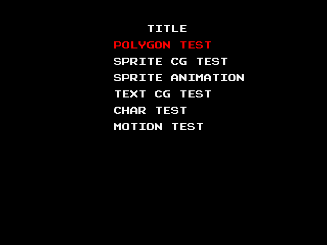
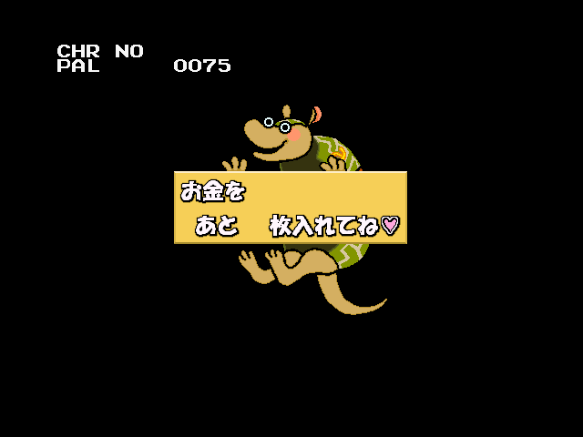
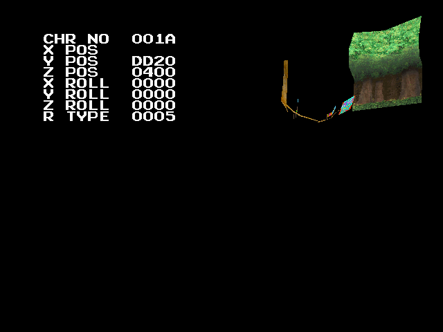
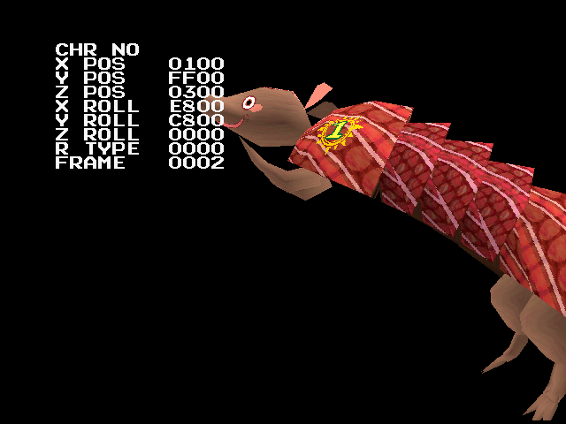

With perhaps the most honest title in all of video gaming, *Armadillo Racing* is exactly that. But behind its Global Village Coffeehouse-on-LSD tribal aesthetic lurks... a couple of garden-variety dev tools. Ho-hum.

<!--more-->

I've had the pleasure of playing Armadillo Racing in [its original cabinet](https://x.com/GiGO_akiba_ac/status/1541597248563191809) on the retro games floor of GiGO Akihabara 3-gou (perhaps the best thing GiGO has ever done). It's.. fine. Cute. I went [back to playing Rave Racer](https://x.com/suddendesu/status/2058031166813520245?s=20) pretty quick though.

So what is it hiding away? Well... not much.

# Dev Test Menu



Turns out the menu I though I found was already described in the MAME source and [already covered on TCRF](https://tcrf.net/Armadillo_Racing). So we won't elaborate, but briefly...

The Namco S22 hardware had a connector edge for dev control panel, it seems, and MAME emulates this with a Machine Configuration adding those inputs back in for some games. In Armadillo Racing, pressing Dev Right whie on the service menu brings up a secondary menu with some graphics tests. From there, the Dev stick and two buttons work pretty intuitively.







The tools themselves are graphics viewers: four of them related to 2D artwork, and two related to 3D polygonal art. Probably the most interesting is Motion Test, which runs through all the animations of the titular [cingulata](https://en.wikipedia.org/wiki/Cingulata).

MAME's dev control panel coverage was slightly lacking, however. The dev directional stick acts as the coarse value adjustment within the menus: it changes values with a step of 8. The code checks for two unmapped lines that changes the values by 1. Since this is pretty clear-cut and since there is already a developer input harness present in the driver, I have [opened a PR]((https://github.com/mamedev/mame/pull/16015)) to have these inputs added.

Once it's merged in, you'll be able fully explore these menus in greater detail in a future MAME version. Oh boy!

# Pause / Frame Advance

The only other halfway interesting thing I could find was gameplay pause and frame advance functionality. Like the dev menu above, this is still hooked into the engine and does not require any patches. It does, however, rely on yet another unmapped input line. This input is not part of the dev inputs, but rather sits with the standard `:INPUTS` port at bit 9 (0x0200), and acts as the toggle for the pause mode.

When paused, the standard P1 Start button will advance the game by one frame and stop again.

I have included this input in the PR above, so hopefully it will be present in a future MAME version.

# Develeop Credit as Cold Boot Flag

At 0xA7BC is this string:

```
PROGRAMED by N.Aoshima & R.Kaku
```

It is not attached to any routines that display text, though it is used by the code as a cold/warm boot flag. On cold boot, it is copied to the head of work RAM; if the game resets and the text is there, it skips the slow RAM initialization and the "For us in Japan only" warning.

You actually see these relatively often in retro games: short, hidden developer names that never appear on screen but are actually used by code as sentinels, syncs, or validity checks. This was a time when staff rolls in games were not guarantees, and even if a game has one, you may not be allowed to use your real name. So hiding your name in the data *and* having the code use it in such an integral code path acts as proof you worked on it and didn't just hex edit your name into some blank space in the ROM.

So who were N.Aoshima and R.Kaku? It looks like Aoshima appears similarly in Cyber Commando and Tokyo Wars (and possibly other Namco games from the era). Moby Games lists a [Nobuyuki Aoshima](https://www.mobygames.com/person/1313019/nobuyuki-aoshima/) who apparently worked for Namco in the early 2000's... and there are [several Japanese patents owned by Namco](https://jglobal.jst.go.jp/en/detail?JGLOBAL_ID=200903097053042472) related to 3D games with his his name on them. Notably, these patents are from the mid 1990s at right around the same time the games with the Aoshima credit were release. So I think it's a pretty safe bet that N.Aoshima is 青島信行 AOSHIMA Nobuyuki.

R.Kaku was much easier to track down: 加来量一 KAKU Ryōichi. There's an interview with him [here](https://www.mygaime.com/post/interview-with-ryoichi-kaku-shohei-nakanowatari-from-bandai-namco-research-inc).

Well, that was one of the shortest articles I've written in some time... The next one will be more interesting, I promise.
