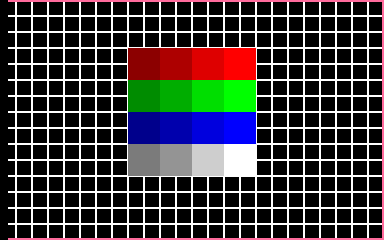
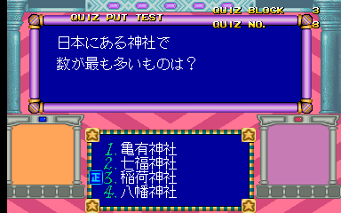
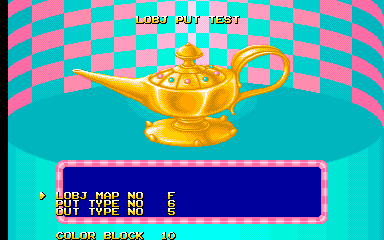

Getting back to our roots of hacking on obscure Japanese quiz/mahjong games that no one else cares about, we're taking apart Athena no Hatena today!

<!--more-->

There are three main topics we'll discuss: a hidden test menu, a debug flag and unused controller inputs. The latter two topics are heavily interrelated with the first, so let's begin there.

# Test Program


Hidden within the game's program is a test menu, and this is one of the rare occasions where it is accessible via an input code instead of being entirely disabled.

With the game set to Service Mode (by pressing F2 in MAME or setting the DIP switch), hold P1 Button 3, P2 Button 3, P1 Start and P2 Start at the same time and reset the game (F3 in MAME). You'll be brought to the menu shown above after the initial system test.

*But wait, there's more!*

It turns out there is an extended set of options for this menu which are not normally available.


This extended menu is, unfortunately, not accessible with any input codes. Instead it needs Debug Mode to be enabled, which we'll talk about in the next section.

In both of these menus, you can move the cursor up and down with P1 Button 1 and 2, respectively, but you'll find that you can't actually select any items. This is because there are three extra button inputs that are supported by the hardware but are not used in this game. Thus, they are not mapped by MAME. And we'll talk about all that in the final section of the article.

For now, just understand that Buttons 1 to 4, as they are known in the game and in the MAME mappings, are actually equivalent to Up, Down, Left, and Right, respectively, for other games on this same hardware, and that the un-mapped inputs would be Buttons 1 to 3. To help keep things clear, we'll refer to these three un-mapped buttons as Shot 1, Shot 2 and Shot 3, as that is how the game refers to them.

So, on the main menu, P1 Up and Down (i.e. P1 Button 1 and 2) move the cursor, while P1 Shot 1 selects the item.

Let's go through the list. For all of these options, P1 Start + P2 Start returns to the main menu.

## GAME START

Does what it says on the label. If you choose this on the standard Test Program menu, you'll start the game as usual. If you launch it from the extended menu, it will actually put the game in a debug mode with some extra effects. We'll examine those in the later debug flag section.

## CHR TEST OBJ


A garden-variety tile viewer that we see in almost every arcade game. P1 Up/Down to scroll the tiles; P1 Left/Right to scroll by blocks 0x80. P1 Shot 1 changes the palette and P1 Start changes the Color Block.

At the end of the tile data, there is this date sketched by one of the artists. The kanji is "Monday."


## CROSS HATCH



Nothing special here. It's the same cross hatch test from the standard test menu.

## PORT CHECK


An input test. This is different from the one use in the standard test menu in that it displays inputs as the Joystick + Buttons layout instead of the four button quiz layout used in the actual game. This is how we know that those four quiz buttons map to Up/Down/Left/Right.

## SOUND TEST


Yup, it's a sound test. Left/Right changes the ID and Shot 1 plays the music/sound effect. P1 controls the music, P2 controls SFX.

## GQUIZ PUT TEST


My guess is the G in GQUIZ stands for "graphics." This tool displays the image/animation based quiz questions in the game. P1 Up/Down change the Quiz Block, and P2 Up/Down changes the Quiz No. Pressing P1 Shot 1 will display the answer; pressing any P1 input after that will move to the next question. P1 Shot 2 does the same thing, but it moves to the previous question instead. P1 Shot 3 also shows the answer, but then reshuffles the answer list order and shows the same question again.

## QUIZ PUT TEST




Displays the text only quiz questions in the game. The controls are similar to the GQUIZ tool.

## ENEMY PUT TEST


Displays the appearance and death animations of the enemies in the game. P1 Up/Down controls the cursor and P1 Shot 1/Shot 2 increases/decreases the value. P1 Shot 3 will start the sequence.

## MESSAGE PUT TEST


Displays the text messages in the game. Controls are similar to the Quiz tools: P1 Up/Down changes the Msg Block, and P2 Up/Down changes the Msg No. P1 Shot 1 displays the message and moves to the next one; P1 Shot 2 displays and moves to previous; P1 Shot 3 repeats the same message.

Note that this tool locks up when hitting a message ID that doesn't exist. The code is still running, though, and you can still exit to the main menu by holding P1 Start + P2 Start. However, it maintains the message block/number in memory, so going back to the message test again will cause another lock up as it tries to access that same non-existant message. You'll need to reset the game.

## LOBJ PUT TEST




This displays the various full screen tilemaps used in the game as backgrounds and such. It's possible LOBJ here means Layout Objects. Aside from displaying the artwork, it also plays the various animations used in opening and closing of these scenes. By animation, I am referring to the scene transitions, the screen "wipes" from one side to the other. The opening animation is set in "Put Type" and the closing animation is set in "Out Type." P1 Up/Down moves the cursor, P1 Shot 1/Shot 2 increase and decrease the values, and P1 Shot 3 will apply the new changes. When pressing P1 Shot 3, the opening animation will play, then will pause and ask you to push Shot 3 again, after which the closing animation will play.

Note that Color Block 0, which is displayed by default, is a blank palette; you will need to increase it's value to something higher with P1 Start in order to actually see anything.

## OBJ POS EDITOR


Shows the fully assembled graphics objects used in the game. You can spawn multiple objects, each of which maintains its own position and palette. 

P1 Directions move the object around the screen. P2 Left/Right move the cursor. The letters on the left indicate the properties for each object instance: C is color palette, P is the object ID, O is the object block, B is the instance id. The color block is changed with P1/P2 Start.

# Debug Flag and Unused DIP switch

As we've mentioned a couple of times already, there's a debug mode flag that enables several effects. It is the word value at 0x90679C, which is always set to 1 during the game's start up. When set to 0, debug mode is enabled. (So in a way, it's more like a 'normal mode' flag, since a value of 0 is debug enable, while non-zero is debug disable. It's backwards from how we normally think of 'set' and 'unset.')

It's necessary to also mention switch 8 on DIP 2, which is labeled as 'Unused' in the MAME menu. It doesn't have any effect by itself, but it acts as a secondary debug mode of sorts by enabling some extra functionality when the debug flag is set. If you plan to play with the debug tools, you may as well just leave this DIP switch turned on.

Let's walk through the debug mode effects.

## Hidden Test Program

We have already talked in depth about the contents of this menu, so this will be brief. Basically, there are two versions of the hidden Test Program menu, both of which replace the standard test mode functions. One of them is accessible by an input code (without debug mode) and the other is accessible when the debug flag is set (without any input codes). The latter of these has an extended set of options.

When launching the game from the 'Game Start' option on the extended version, the game will run in a debug mode. **Note that you must start the game from this menu for the gameplay debug effects!** In fact, all (but one...) of the debug functions listed below are ONLY available when starting the game from the menu. If you just start the game normally, you will only have normal gameplay, even with the debug flag set in memory.

## Game Pause & Frame Advance

P2 Shot 3 and Shot 2 (which are among the unused controller inputs) will pause the game and advance by one frame, respectively. P2 Shot 3 will unpause the game.

Be careful with this inside the Test Program menus, as you may accidentally pause the game. There's no pause indicator, so if it seems to be locked up, try P2 Shot 3 and see if things start working again.

## Quiz Identifiers


On any quiz screens, two numbers will be printed below the answers. These value represent the quiz block and quiz number, which are also shown in the two Quiz Put options discussed previously.

This requires the DIP switch to be set. It is the only debug function that will work when not launched from the 'Game Start' option in the test menu.

## Job Meter

There is a job meter on the left side of the screen:


I have never actually seen this bar light up during normal usage; this isn't exactly a hardware intensive game. The only way I've actually observed it with code running is by holding P1 Start + P2 Start at the Test Program main menu, which I suppose puts it in a loop.

This requires the DIP switch to be set.

And finally, here is the MAME cheat to set debug mode:

```
  <cheat desc="Enable Debug Mode">
    <comment>Enables a hidden test menu that replaces the usual test mode; reset the game after enabling; change input type in Machine Configuration</comment>
    <script state="on">
      <action>temp0=maincpu.md@464</action>
      <action>maincpu.md@464=4e714e71</action>
      <action>temp1=maincpu.mw@468</action>
      <action>maincpu.mw@468=4e71</action>
    </script>
    <script state="off">
      <action>maincpu.md@464=temp0</action>
      <action>maincpu.mw@468=temp1</action>
    </script>
  </cheat>
```

# Enabling Unused Inputs

Most games that run on the Seta hardware use a standard joystick and button layout, with Athena no Hatena being the big exception: It has four buttons and no joystick. That's fine for regular quiz gameplay, but the debug tools in the Test Program make use of the full set of controller inputs. Since MAME only maps the four gameplay buttons, we don't have a way to use the other buttons in the test menu and they become pretty useless.

In the past we've gotten around this [with some fancy cheat hacking](/entry/namco-classics-collection-dev-messages-and-debug-tools-galore), but that won't work in this case since we have such a low number of inputs to work with. The only way to really deal with this is to change the mappings within MAME. My original solution to this involved recompiling with the alternate mapping, but thanks to a suggestion from the MAME dev team, there's a better way: adding an alternate machine configuration that can change the control scheme from within the settings.

Ultimately this does require a code change, so I've opened a pull request to MAME. ~~Hopefully it will be accepted and we'll have an easy way to work with this in an upcoming version. If it's not accepted for whatever reason, I'll post the code so you can compile your own binary.~~

I'm happy to write that the change was merged and as of MAME 0.213, there is an alternate control scheme available to work with the debug menu! To use it, go to Machine Configuration in MAME's config menu, and change the Input Type.

So that covers Athena no Hatena. Just a reminder that if you don't already [follow us on Twitter](https://twitter.com/suddendesu), it's a great way to keep up with things in the long period of time between complete articles. And I'm always open to suggestions for the next game to work on!

Until next time...
