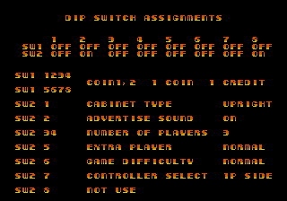

Aurail is a half top-down, half quasi-3D mech based shooting game developed by Westone and published by Sega. It's fun but a bit difficult to play (or more likely I just suck at it), and there's a debug/cheat lurking just beneath the surface of the code...

<!--more-->

# Special Function Mode

DIP bank 2, switch 8 is listed as "Special Function Mode" in MAME, which in turn gets this terminology from the official manual:


However, the diagnostic screen in the actual game declares that it is unused:



Indeed, if this switch is set, there is no obvious effect on the game... unless you hold P1 Start on machine startup!

Doing so with the switch enabled will set bit 0 of the byte at 0xFFE707, which then enables a number of Special Functions, just as the manual describes.

## Gameplay Cheats

After inserting a coin and pressing start with this "debug mode" byte set, you'll be brought to a black screen with plain text:


Pressing Button 1 will alternate between the two modes. Muteki is Japanese for invincible and, as you'd guess, it makes your mech invulnerable. Shine Shine is not the English word "shine." It is instead pronounced "shee-neh," and you could translate it as "Die Die Mode." Unfortunately, it's just the opposite of invincible mode... which is to say normal, vulnerable gameplay.

The number at the bottom is the starting stage. Left/Right will change it's value, and Button 3 will start the game when you're ready.

While in the game, Start + Button 1 will "advance" to the next stage by returning to the stage/mode select screen above with the stage value increased by one.

## Enemy Wave Select

There is also a secondary stage select of sorts within the first-person, quasi-3D stages. When entering one of these stages via normal gameplay or from the main level select, you can press Button 2 to bring up a text prompt reading "SIM-BATTLE BY WESTONE" and a number, which represents the "wave" of enemies.


Left/Right changes the value; Button 1 starts the wave. When it is complete, you are returned to the select prompt.

Most of the game only checks that the debug byte is non-zero to enable the cheat functions, but the 3D stages additionally check if the value is negative (i.e., if the top bit is set). If so, the enemies in the stage will be motionless.

The debug byte is never actually set to negative anywhere in the code, so it's likely a leftover from earlier testing. We can manually set the value to negative with a MAME cheat, however:

```
  <cheat desc="Stop enemy movement in 3D stages">
    <script state="run">
      <action>maincpu.pb@ffe707=(maincpu.pb@ffe707 | 80)</action>
    </script>
    <script state="off">
      <action>maincpu.pb@ffe707=(maincpu.pb@ffe707 ^ 80)</action>
    </script>
  </cheat>
```

## Sprite Over


Finally, the least interest effect of the Special Function DIP switch and the debug byte: enabling the "SPRITE OVER" debugging message. Presumably, this appears when too many sprites have spawned and would be unlikely to actually appear during normal gameplay. However, if you'd like to see it in game, set the word value at 0xFFFDB4 to non-zero.

# Aurail Ending

We'll end the article with game's Engrish-tastic ending, just because more people need to see it. Hover over the images to zoom in, since the text isn't too readable.


