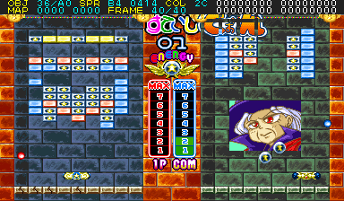
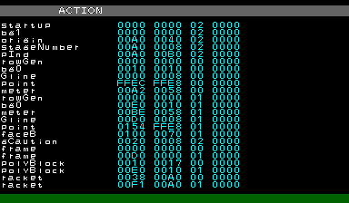
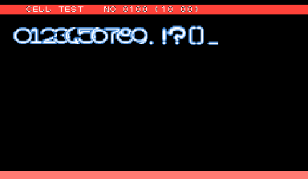

What happens when you cross Breakout with puzzle game versus mode mechanics? You get an adorable hot mess called Blocken! 

<!--more-->

# Debug Flags

The byte value at 0x304312 in RAM holds a number of debug flags for the game.

## Bit 1 - Gameplay debug info



When this bit is set, debugging information appears at the top of the screen during gameplay.

## Bit 2 - Skip introduction

This flag skips the opening animation that plays during the attract mode

## Bit 3 - Skip mode select

This will skip the mode select that appears in game type B

## Bit 4 - Skip difficulty select

This will skip the difficulty select menu.

## Bit 5 - Skip story mode intros

This will skip all of the story mode stage introductions

## Bit 6 - Action list



With this flag enabled, pressing P2 Button 1 + 2 will show an Action list, detailing each of the discrete code objects that are running. This is only available during gameplay.

While on this screen, P2 Up/Down will scroll through the list, and P1 Button 1 will return to the gameplay.

Actually, this action list is also referenced elsewhere in the code, in a piece of code that I believe is related to creating tasks, meaning it can be displayed in parts of the program that aren't gameplay (attract mode, etc). I haven't been able to figure out how to properly access it this way, if it even can be done with the final code, but here's a quick test cheat if you want to see it:

```
  <cheat desc="Action List test">
    <script state="run">
      <action>maincpu.pd@30380e=003086e6</action>
    </script>
  </cheat>
```

## Bit 7 - Slow motion gameplay

When enabled, gameplay will run in slow motion.

And now, here are the cheats to access these <em>exciting</em> features! Included is a cheat to show the status of each bit in the debug byte.

```
  <cheat desc="Display gameplay debug text (bit 1)">
    <script state="on">
      <action>maincpu.pb@304312=(maincpu.pb@304312 ^ 02)</action>
    </script>
  </cheat>

  <cheat desc="Skip introduction animation (bit 2)">
    <script state="on">
      <action>maincpu.pb@304312=(maincpu.pb@304312 ^ 04)</action>
    </script>
  </cheat>

  <cheat desc="Skip mode select screen (bit 3)">
    <script state="on">
      <action>maincpu.pb@304312=(maincpu.pb@304312 ^ 08)</action>
    </script>
  </cheat>

  <cheat desc="Skip difficulty select screen (bit 4)">
    <script state="on">
      <action>maincpu.pb@304312=(maincpu.pb@304312 ^ 10)</action>
    </script>
  </cheat>

  <cheat desc="Skip story mode stage intro (bit 5)">
    <script state="on">
      <action>maincpu.pb@304312=(maincpu.pb@304312 ^ 20)</action>
    </script>
  </cheat>

  <cheat desc="Show action list (bit 6)">
    <comment>Press P2 Button 1 + 2 to show list during gameplay</comment>
    <script state="on">
      <action>maincpu.pb@304312=(maincpu.pb@304312 ^ 40)</action>
    </script>
  </cheat>

  <cheat desc="Slow motion gameplay (bit 7)">
    <script state="on">
      <action>maincpu.pb@304312=(maincpu.pb@304312 ^ 80)</action>
    </script>
  </cheat>

  <cheat desc="Display debug settings">
    <script state="run">
      <output format="Display gameplay debug text: %01d">
        <argument>(maincpu.pb@304312 BAND 02) RSHIFT 1</argument>
      </output>
      <output format="Skip introduction animation: %01d">
        <argument>(maincpu.pb@304312 BAND 04) RSHIFT 2</argument>
      </output>
      <output format="Skip mode select screen: %01d">
        <argument>(maincpu.pb@304312 BAND 08) RSHIFT 3</argument>
      </output>
      <output format="Skip difficulty select screen: %01d">
        <argument>(maincpu.pb@304312 BAND 10) RSHIFT 4</argument>
      </output>
      <output format="Skip story mode stage intro: %01d">
        <argument>(maincpu.pb@304312 BAND 20) RSHIFT 5</argument>
      </output>
      <output format="Show action list: %01d">
        <argument>(maincpu.pb@304312 BAND 40) RSHIFT 6</argument>
      </output>
      <output format="Slow motion gameplay: %01d">
        <argument>(maincpu.pb@304312 BAND 80) RSHIFT 71</argument>
      </output>
    </script>
  </cheat>
```

# Cell Check



Holding P2 Button 1 on startup will bring up a very basic graphics viewer.

That's all we've got for Blocken! Enjoy slow motion mode, I guess.
