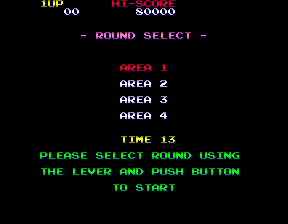
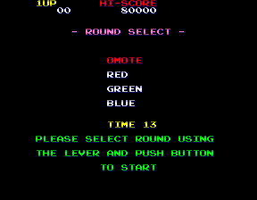

Another game with too much stuff to cram into one post! Burning Force is a shooter similar to Space Harrier, only a bit prettier (and newer, to be fair). In part 1 I'll show a few of the most interesting finds, and then in part 2 we'll look at some leftover debugging tools, bugs and other miscellany.

<!--more-->

# English Translation

The biggest find is that there appears to be an English translation of the few Japanese lines in the game. This is interesting because (according to the Internet) it did not have an international arcade release. There are translations of the mid-level "boss analysis" screen and the ending:


The strings are included in the main pointer table (at 0x2C5A8), but those entries (0x76 through 0x7F) are never actually referenced anywhere in the code, so they are completely unused.

The Japanese text that would normally appear in the screens above comes from a different text display routine that doesn't use the main string table, so I couldn't just change it to point to the English entries.

But there was another problem too. Even if the strings were referenced, they still wouldn't display properly because part of their metadata is broken. Many games contain a few bytes before the actual text with info like the x/y position to start the text, color or style code, timing, etc. Burning Force does the same:


There are 6 bytes before each string (which are formatted into structures above). The first word is the style/color/palette, the second word is the x/y position and the final word is the length of the string. With that in mind, you'll see each string is marked as 4 bytes long. Clearly that's not correct; it would only show the first four characters of the text and nothing more. The two strings for the boss analysis screen are even shorter, having a length of two.

So to get the screenshots above, I had to hijack a call to the standard text display, repoint it the English entry, and fix the length of the string in the register. As such, the screens above are (minimally) edited, with the Japanese text removed and the forced English text overlayed on it. Despite that, the text position in the images is exactly how the game renders it, so I think these are pretty accurate to how it would have looked at one time.

The game had a US release on the Genesis, which has slightly different but equally delightful translations:


The strings for the ending can be found at 0x2CFEC and for the analysis screen at 0x2CFA6.

# Bonus Goals

In the game is a hidden 'bonus goal,' for lack of a better term, consisting of three levels. It involves racing the clock to get to a certain point in a stage within a certain time. There are various effects on the game when the goal is met.

The bonus can be activated in three stages in the game: stage 9 (Day 3, Area 2), stage 13 (Day 4, Area 2) and stage 17 (Day 5, Area 2). The simplified way to activate the goal is to 'go as fast as you can' in these stages. More specifically, you need to go a distance of 0x2000 before the bonus goal timer reaches 0x5A0. When the goal is triggered, the game pauses and flashes red and white for a couple seconds:


Of course the game doesn't display your distance traveled, or the timer (the time in the lower right is for your score bonus at the end of the level, and has no relation to the bonus goal). Aside from having a memory viewer open and observing the timers there, there's no real way to tell if you're going to make the goal or not. However, it does seem relatively easy to trigger, and I imagine many people have done so without realizing how.

(There is actually a leftover debug function that prints your distance traveled on the screen, but it's only available by hacking anyway. We'll discuss that more in part two. If you do want to watch the values in memory, the distance traveled is the word at 0x409020 and the bonus goal trigger timer is the word at 0x409038. Remember that distance traveled need to be >= 0x2000 before the trigger timer reaches 0x5A0, and only on the three stages listed above. Alternatively, there's code to manually set the bonus goal level, discussed in the next section.)

Note that you must activate each bonus in order. If you miss the first one in Day 3 Area 2, the one in Day 4 Area 2 will not activate. It's all or nothing!

The primary gameplay effect of triggering a goal is to double the point values: 2x at level 1, 4x at level 2 and 8x at level 3. When enemies normally worth 100 points are suddenly worth 800 at level 3, it's very easy to top the high score list.

There are a couple cosmetic changes that occur when a bonus goal is triggered. One, the enemies' color palette will changed based on the current bonus goal level: red for the first goal, green for the second, and blue for the third. You'll see it happen in the gif above, where the enemies turn red during the flashing.

Second, extra graphics and messages start to appear in the stage:


After you trigger the bonus goal, you'll see messages scroll by. For the first level, in Day 3 Area 2, we have '1989' and 'Beer', as well as these odd hanging gray ball... things. (We'll come back to that in a minute.) There are also occasionally a set of kanji that appear reading 平成元年 *Heisei Gannen*, meaning 'First year of the [Heisei era](https://en.wikipedia.org/wiki/Heisei_period),' which corresponds to 1989. Which makes sense as that is when the game was released. In the Final Day stage, provided you've hit all three bonus goals, the messages start from the very beginning. We have the Heisei Gannen kanji from before, plus Earth and small yellow apple outlines.

So those are interesting little easter eggs, but they open a whole new set of mysteries. Like.. what about the other stages with bonus goals? You'll note above that I only talked about Day 3 Area 2 and the Final Day, but there are also two other stages with bonus goals that can be activated.

When activated on Day 4 Area 2, we immediately get a Heisei Gannen... and then nothing else for the rest of the stage. For Day 5 Area 2, we get no messages at all. I find that very strange when you consider how overloaded with messages the Day 3 Area 2 and the Final Day stages are. And now to make things more interesting, let's take a look at the tile viewer in MAME:


Okay, there's Heisei Gannen, Earth, Beer, 1989, the apple outline... and two more that don't appear to be used! 'Top [Camber](https://en.wikipedia.org/wiki/Camber)' and 'Golden Apple.' I wonder if these were supposed to appear in the two stages that are lacking messages.

Now lets go back to those hanging gray ball things from Day 3 Area 2. So we've seen that all the messages have this sort of glowing, 'neon sign' look to them, which makes the gray ball thing really stand out. It looks like a normal part of the level, and in fact, is stored near the graphics for level obstacles:


They definitely don't appear normally, without activating the bonus goal. It's all very strange, and I don't know whether to count all the inconsistencies as bugs or unfinished design...

Now that we've gotten through all that, there is one final effect on the game that the bonus goals give: different endings!


That's right, Hiromi actually has four possible hats. The brown military one is the standard ending, with no bonus goals, while the next three are displayed depending on the bonus goal level: the tiara at level 1, the crown at level 2, and the Pac-man hat at level 3 (the kanji on the Pac-man hat says 'nippon ichi,' 'The best in Japan').

# Extended round select

There is already a basic level select available in the game, which is enabled in the system config. It allows the player to select the starting day:


However, there is unused code for two more menus with more options:





The area select is obvious: it allows you to select the starting Area inside the Day. The final menu seems odd without context, but since we know about the bonus goals and how they change the enemy palettes (see the section above), this is the bonus goal level/score modifier select menu. 'Omote' (Japanese for face [of an object], or front) is the default colors (default scoring), while red, green and blue correspond to bonus goal levels 1, 2 and 3.

Here's a MAME cheat to enable the extra round select menus:

*(For reasons we'll talk about in part 2, all the MAME cheats are for the 'Revision C' dump of the game)*

```
  <cheat desc="Extended round select">
    <comment>Enables area and enemy color select menus</comment>
    <script state="on">
      <action>temp0=maincpu.md@5450</action>
      <action>maincpu.md@5450=00100d00</action>
    </script>
    <script state="run">
      <action>maincpu.pd@100d00=5474</action>
      <action>maincpu.pd@100d04=54f4</action>
      <action>maincpu.pd@100d08=55fe</action>
      <action>maincpu.pd@100d0c=5634</action>
      <action>maincpu.pd@100d10=568c</action>
      <action>maincpu.pd@100d14=56ea</action>
      <action>maincpu.pd@100d18=57c4</action>
      <action>maincpu.pd@100d1c=57fa</action>
      <action>maincpu.pd@100d20=584a</action>
      <action>maincpu.pd@100d24=58a8</action>
      <action>maincpu.pd@100d28=597c</action>
      <action>maincpu.pd@100d2c=59ae</action>
      <action>maincpu.pd@100d30=59fe</action>
    </script>
    <script state="off">
      <action>maincpu.md@5450=temp0</action>
    </script>
  </cheat>
```

# Extended level select - Technical

Here's how I managed to get it all put together:

The code for the round select starts at 0x544E, which is called repeatedly from the game loop. It starts with a simple switch on the value at 0x409026 and jumps to the pointers that are listed at 0x5460:

<pre class="pdasm pdasm-arch-m68k">
options_select:
00544E: lea     $5460.l{mode_ptrs}, A0
005454: move.w  $409026.l{ptr_counter}, D0
00545A: movea.l (A0,D0.w), A0
00545E: jmp     (A0)
mode_ptrs:
005460: dc.l $5474{roundsel_init}
005464: dc.l $54F4{roundsel_loop}
005468: dc.l $55FE{roundsel_select}
00546C: dc.l $5634{roundsel_clear_text}
005470: dc.l $59FE{option_select_exit}
</pre>

The round select menu is made up of four parts: init, input loop, option selected, and clear text. At the end of each segment, the pointer counter is increased, and the switch block moves to the next section, until it reaches the exit and the level starts. Do you notice the big jump in pointer addresses from the clear text routine to the exit routine? That's 970 bytes! What's up with that?

It turns out there are two more chunks of code that are nearly identical to the round select init/loop/select/clear routines, which are the area and bonus select menus described above. They start immediately after the round select clear text routine and end before the exit, and that accounts for the big jump in the final pointer. So the whole block of code is mapped like this:

```
0x5474  roundsel_init         ; normal round select
0x54F4  roundsel_loop
0x55FE  roundsel_select
0x5634  roundsel_clear_text
0x568C  areasel_init          ; unused area select
0x56EA  areasel_loop
0x57C4  areasel_select
0x57FA  areasel_clear_text
0x584A  bonussel_init         ; unused enemy color select
0x58A8  bonussel_loop
0x597C  bonussel_select
0x59AE  bonussel_clear_text
0x59FE  options_exit          ; exit menu, start level
```

As the unused routines are nearly identical to their normal round select counterparts, they increment the pointer counter at the end of each segment. Clearly this code is meant to work together, 'cascading' down from the normal round select into the area select, then into the color select, and finally to the start of the level. The obvious solution here is to add references to the unused functions to the pointer table.

However, we have a problem: there is no free space between the end of the pointer table and the start of the next bit of code (the round select init). If we can't modify the ROM... let's abuse the RAM!

The CPU doesn't care where it's reading instructions and data from, so long as the address is reachable. We can construct a new pointer table in RAM and have the code point there for the addresses. I played the game for a bit with the memory viewer open and found an area in RAM that didn't seem to be in use, starting at 0x100D00. In the run section of the MAME cheat above, it maintains a pointer table references the normal round select as well as the unused menus after it. We then change the address of the LEA command at 0x544E to our location in RAM, and then everything just works! It's beautiful how cleanly this worked out.

**[Part 2 is is posted here!](/entry/burning-force-part-2-version-differences-broken-test-mode-patch-leftover-debugging-tools)**
