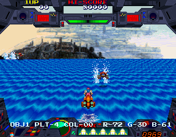

Here we are at part two of our dissection of Burning Force. We'll look at some of the less flashy, more technical tidbits I've come across while taking the game apart.

<!--more-->

# Version difference

There are two dumps of this game, marked in MAME as 'older version' and 'newer version (Revision C)'. There is a very tiny code change in the later revision that fixes a minor text bug, where the text MUTEKI is displayed at the top of the screen:

This is triggered in the routine at 0x4A32, the first part of the attract loop, which initializes the title screen. Here's the code from the old version:

<pre class="pdasm pdasm-arch-m68k">
004A66: moveq   #$2a, D6                       ; D6 stores the offset for the string table - 2A is '1UP'
004A68: jsr     $c100{disp_string}
004A6E: moveq   #$2b, D6                       ; 0x2B - HISCORE
004A70: jsr     $c100{disp_string}
004A76: moveq   #$0, D6                        ; 0 - the initial 00 scores under 1UP and HISCORE
004A78: jsr     $c100{disp_string}
004A7E: tst.w   $40902a{multiplayer_flag}      ; are we in multiplayer mode?
004A84: beq     $4a96                          ; if not branch below and skip the 2P stuff
004A86: moveq   #$2c, D6                       ; 0x2C - 2UP
004A88: jsr     $c100{disp_string}
004A8E: moveq   #$2d, D6                       ; 0x2D - MUTEKI -- this line and the next are NOT in revision C!
004A90: jsr     $c100{disp_string}
// ... go on to display copyright text, namco logo, etc... 
</pre>

There's nothing too complicated here. It's drawing the 1UP and HISCORE text, then checks if it's in multiplayer mode, and if so prints 2UP as well. Curiously though, right after printing 2UP it will also print MUTEKI. It won't display on normal startup; it will only happen after a multiplayer game has ended and the system has returned to the attract loop. At that point, the game is still marked as multiplayer and enters the 2P section in the code above.

The 'muteki' string is not referenced anywhere else in the old version. Muteki is the Japanese word for invincible. My guess is that there used to be an invincibility feature, possibly for debugging, which was removed, but this string was accidentally left in. This is what I think happened, in psuedocode:

<pre>
print("1UP");
print("HISCORE");
if(multiplayer)
  print("2UP");
// if(invincibility)   ; this line is commented out
  print("MUTEKI");     ; this line isn't commented, on accident, and will get printed if in multiplayer mode
</pre>

Revision C removes the print command for the string, effectively eliminating the bug, though its ASCII data remains in the string table. Aside from pointer shifts from the removed lines, this is literally the only difference between the two dumps. For that reason, there's really no reason to play the old version over the new one and all my MAME cheats are intended for Revision C.

# Developer credit (sort of)

There is hidden, sorta-kinda developer credit in the program data. At 0x36F9E we have the text ' <a href="http://www.mobygames.com/developer/sheet/view/developerId,299404/" target="_blank">KATSUO NAKAMURA</a>.' This is producer and one of the programmers of the game, listed in the credits as Devil Nakamura (<a href="https://tcrf.net/Galaga_'90" target="_blank">and apparently it's not the only time he's left his name in the code for a game</a>).

The System 2 hardware is interesting (and powerful) in that it has <a href="http://www.system16.com/hardware.php?id=525" target="_blank">two M68k CPUs running in parallel</a>. During the game's startup, the master CPU copies that string to memory location 0x40AC80 by the routine at 0x3A6C. Meanwhile, the slave CPU runs in a loop in the routine at 0x1446, checking the memory for that text before proceeding. I'm not certain exactly what these two routines are doing (read: it's not important enough to try to figure out) but they're probably a sort of CPU synchronization, with the main processor telling the sub processor that it's at a certain point in startup. It's cute that the developer chose his name as the flag to sync the two processors.

# Broken Test Mode

In the test mode, you press the Service button to cycle through the different screens. It goes from the game options, to the input test, to the sound test... and then if you press it again, the game crashes and resets. There are more screens available after the sound test, including a color bar display and ADS data, but because of this issue they're inaccessible. The problem child here is the crosshatch display screen, a very common tool in almost all older arcade games that is used to adjust <a href="http://wiki.arcadecontrols.com/wiki/Monitor_convergence_tutorial" target="_blank">CRT beam convergence</a>:

It took a fair bit of work, but I finally managed to trace the issue to a small routine at 0x2CC4. It simply zeros out the memory from 0x460200 to 0x4608FF, so we'll call it the 'memory clear' function. It's pretty innocuous. In fact, it's called from a few places elsewhere in the code as well without any problems. So why all the fuss in this case?

The short answer is the A1 register (used to track which memory location to write the zero to next) isn't being saved to the stack at the start of the routine. This is a problem because A1 is also used higher up in the stack to point to the current step in the screen config. (The test mode screen configs contain things like the text strings to display and pointer table offsets for initialization routines; they start at 0x14A6.) So when the code jumps back a couple steps and expects to read the next byte of the config pointed to by A1, it gets some wacky address that causes the system to implode and jump to an exception vector/restart, after processing a bad opcode.

Thankfully, the memory clear routine begins by pushing a couple of data registers (D0 and D1) to the stack then restores them at the end, effectively protecting those values from being molested. All we have to do is have it save/restore the A1 register as well and we have our fix, easily implemented in the form of a MAME cheat:

<pre>
  &lt;cheat desc="Test mode patch"&gt;
    &lt;comment&gt;This fixes the game crash in the test mode when trying to go past the Sound Test&lt;/comment&gt;
    &lt;script state="on"&gt;
      &lt;action&gt;temp0=maincpu.mb@2cc7&lt;/action&gt;
      &lt;action&gt;maincpu.mb@2cc7=40&lt;/action&gt;
      &lt;action&gt;temp1=maincpu.mb@2cdc&lt;/action&gt;
      &lt;action&gt;maincpu.mb@2cdc=2&lt;/action&gt;
    &lt;/script&gt;
    &lt;script state="off"&gt;
      &lt;action&gt;maincpu.mb@2cc7=temp0&lt;/action&gt;
      &lt;action&gt;maincpu.mb@2cdc=temp1&lt;/action&gt;
    &lt;/script&gt;
  &lt;/cheat&gt;
</pre>

What confounds me about this is... how did such a glaring bug make it to the final product? For a while I assumed it as an emulator issue, as Namco S2 emulation isn't perfect, but after tracking down and understanding the problem I don't believe it is. It has nothing to do with any unique hardware; it's just a normal CPU register getting scrambled. I also highly doubt it's some strange, unemulated quirk with the processor, as the M68k is extremely widespread and well-documented.

Moreover, this bug is present in a couple other System 2 games: Marvel Land (which works occasionally) and Finest Hour (which locks up rather than restarting). While there is some variation in the test mode formats across the System 2 games, several (such as Super World Stadium) are identical: the same type of test mode screens, in exactly the same order, and the crosshatch screen displays in them with no problems. Given the prevalence of working games and the nature of the problem in the code, I'm inclined to believe these are not emulation issues but program bugs. Hopefully someone with the actual hardware can tell us for sure.

# Leftover debug tools

There are a handful of debugging functions leftover in the game, with varying degrees of accessibility. We'll go through a quick overview of each function, so you can get right to the MAME cheats to enable them, then take a deeper dive into the technical aspects if you want to know more.

## Freeze Game

No point in having screenshots here; this bit of code just freezes the game where it is. Although the program is still running, it's just skipping all the game state updates and screen rendering, but we'll talk about that in more detail below.

<pre>
  &lt;cheat desc="Freeze game"&gt;
    &lt;script state="run"&gt;
      &lt;action&gt;maincpu.pw@40AC3C=1&lt;/action&gt;
    &lt;/script&gt;
    &lt;script state="off"&gt;
      &lt;action&gt;maincpu.pw@40AC3C=0&lt;/action&gt;
    &lt;/script&gt;
  &lt;/cheat&gt;
</pre>

## Color editor

The color editor allows you to make temporary changes to the active color palettes. It was probably used to quickly prototype color choices.

The interface is a little slow and clunky, but it does work. (Try changing CHR0 PLT-0 COL-01 to see an obvious change while in a level.) You can choose the graphics plane (OBJ0/1 and CHR0/1), the palette, the palette entry, and the RGB values for that entry. P1 Left and Right cycle through the menu options while P1 Up and Down change the value (one by one, no quick scrolling here). For reasons discussed in the technical section, there are two versions of this code: one runs alongside with the gameplay, and the other pauses gameplay while allowing you to edit the colors (note that the pause version causes the text in the menu to NOT blink).

As the comment in the cheat below explains, you'll also need to set dip switch 0 (listed as 'Video Display' in MAME) to Low ('Frozen') to activate the editor.

<pre>
  &lt;cheat desc="Color Editor"&gt;
    &lt;comment&gt;This requires dip switch 0 (Video Display) set Low (Frozen) for this to work&lt;/comment&gt;
    &lt;script state="on"&gt;
      &lt;action&gt;temp0=maincpu.mw@3d0c&lt;/action&gt;
      &lt;action&gt;maincpu.mw@3d0c=3544&lt;/action&gt;      
    &lt;/script&gt;
    &lt;script state="off"&gt;
      &lt;action&gt;maincpu.mw@3d0c=temp0&lt;/action&gt;
    &lt;/script&gt;
  &lt;/cheat&gt;
  &lt;cheat desc="Color Editor (pause version)"&gt;
    &lt;comment&gt;This requires dip switch 0 (Video Display) set Low (Frozen) for this to work&lt;/comment&gt;
    &lt;script state="on"&gt;
      &lt;action&gt;temp0=maincpu.mw@3d0c&lt;/action&gt;
      &lt;action&gt;maincpu.mw@3d0c=3544&lt;/action&gt;      
    &lt;/script&gt;
    &lt;script state="run"&gt;
      &lt;action&gt;maincpu.pw@40AC3C=1&lt;/action&gt;
    &lt;/script&gt;
    &lt;script state="off"&gt;
      &lt;action&gt;maincpu.mw@3d0c=temp0&lt;/action&gt;
      &lt;action&gt;maincpu.pw@40AC3C=0&lt;/action&gt;
    &lt;/script&gt;
  &lt;/cheat&gt;
</pre>

## Performance Meter

The game has what appears to be a (disabled) [https://wiki.neogeodev.org/index.php?title=Job_meter](performance meter) in the main program loop. It indicates the processing load by repeatedly drawing text down the left and right sides of the screen for the master and slave CPUs, respectively, and then clearing that text. Text that remains on screen indicates heavier processing load. As such, most of the time these are blank, but they are occasionally drawn during sections with lots of on-screen activity.

You'll also need to set dip switch 1 (labeled as '$2000-1' in MAME) to activate the display.

<pre>
  &lt;cheat desc="Performance Monitor"&gt;
    &lt;comment&gt;This requires dip switch 1 ($2000-1) set Low to activate&lt;/comment&gt;
    &lt;script state="on"&gt;
      &lt;action&gt;temp0=maincpu.mw@3850&lt;/action&gt;
      &lt;action&gt;maincpu.mw@3850=4e71&lt;/action&gt;
      &lt;action&gt;temp3=slave.mw@1382&lt;/action&gt;
      &lt;action&gt;slave.mw@1382=4e71&lt;/action&gt;
    &lt;/script&gt;
    &lt;script state="off"&gt;
      &lt;action&gt;maincpu.mw@3850=temp0&lt;/action&gt;  
      &lt;action&gt;slave.mw@1382=temp3&lt;/action&gt;
    &lt;/script&gt;
  &lt;/cheat&gt;
</pre>

## Distance Traveled Display

This function displays the value of 0x409020, which is the distance traveled, to the right of the HI-SCORE text. This is one of the values that determines if you've hit one of the bonus goals ([as discussed in part 1](/entry/burning-force-part-1-unused-translation-and-extra-round-select-options)), and this display is useful in determining if you're going to reach the bonus goal.

As above, you'll need to make sure dip switch 1 ($2000-1) is set Low to enable the display.

<pre>
  &lt;cheat desc="Distance traveled display"&gt;
    &lt;comment&gt;This requires dip switch 1 ($2000-1) set Low to activate&lt;/comment&gt;
    &lt;script state="on"&gt;
      &lt;action&gt;temp1=maincpu.mw@3cc4&lt;/action&gt;
      &lt;action&gt;maincpu.mw@3cc4=3900&lt;/action&gt;
    &lt;/script&gt;
    &lt;script state="off"&gt;
      &lt;action&gt;maincpu.mw@3cc4=temp1&lt;/action&gt;
    &lt;/script&gt;
  &lt;/cheat&gt;
</pre>

## Instant Level Select

Like the title implies, this function changes the value at 0x40AC24, the current level. This will immediately change the level you're on, even in the middle of gameplay. However, it does not reload the backgrounds or palettes. Instead, the map changes to the enemies and objects of the 'new' level, so (as you can see in the screenshots) you can expect plenty of color glitches.

The level value is changed by pressing P1 Up/Down. However, this presents a problem during gameplay, as it will suddenly change the level when trying to speed up or down, or just accidentally hitting Up/Down while playing. One method around this is to set the level then turn off the code. Alternatively, I combined the freeze game code from above with this one to create a version that, when enabled, pauses the game and allows you to set the level. You can then turn the cheat off and continue playing.

Unlike the others above, this cheat doesn't require any dip switches to be set!

<pre>
  &lt;cheat desc="Instant level select"&gt;
    &lt;script state="on"&gt;
      &lt;action&gt;temp1=maincpu.mw@3cc4&lt;/action&gt;
      &lt;action&gt;maincpu.mw@3cc4=3894&lt;/action&gt;
    &lt;/script&gt;
    &lt;script state="off"&gt;
      &lt;action&gt;maincpu.mw@3cc4=temp1&lt;/action&gt;
    &lt;/script&gt;
  &lt;/cheat&gt;
  &lt;cheat desc="Instant level select (with pause)"&gt;
    &lt;script state="on"&gt;
      &lt;action&gt;temp1=maincpu.mw@3cc4&lt;/action&gt;
      &lt;action&gt;maincpu.mw@3cc4=3894&lt;/action&gt;
    &lt;/script&gt;
    &lt;script state="off"&gt;
      &lt;action&gt;maincpu.mw@3cc4=temp1&lt;/action&gt;
      &lt;action&gt;maincpu.pw@40AC3C=0&lt;/action&gt;
    &lt;/script&gt;
    &lt;script state="run"&gt;
      &lt;action&gt;maincpu.pw@40AC3C=1&lt;/action&gt;
    &lt;/script&gt;
  &lt;/cheat&gt;
</pre>

# Leftover debug functions - Technical

Of the five debug functions listed above, three of them are actually referenced inside the main game loop. Let's start taking things apart there:

<pre class="pdasm pdasm-arch-m68k">
MAIN_LOOP:
003C98: andi    #$f8ff, SR                       ; reset the status register
loop_start:
003C9C: move.w  #$1, $100000{interrupt_flag}     ; set the interrupt flag
003CA4: clr.w   $100002{work_step}             ; reset the work step
003CAA: jsr     $3850{perf_meter}              ; redraw performance meter
interrupt_wait:
003CB0: tst.w   $100000{interrupt_flag}        ; has VBLANK occurred?
003CB6: bne     $3cb0{interrupt_wait}            ; if not, loop back up and check again
003CBA: addq.w  #1, $100002{work_step}         ; set work step to 1
003CC0: jsr     $3850{perf_meter}             ; redraw performance meter with the new step..
003CC6: move.w  #$31ad, $d00002.l                ; unknown, protection system acknowledge?
003CCE: jsr     $4078{update_from_settings}    ; changes program based on system settings, such as dip switch
003CD4: tst.w   $40ac3c{game_freeze}           ; is the game freeze flag set?
003CDA: bne     $3d08{skip_gameplay_updates}     ; if so, jump down
003CDE: lea     $3d1a{game_mode_ptrs}, A0
003CE4: move.w  $409022{game_mode}, D0
003CEA: movea.l (A0,D0.w), A0                    ; switch based on the current game mode
003CEE: jsr     (A0)
003CF0: jsr     $3f90{update_timers}           ; update various gameplay timers and counters
003CF6: jsr     $4768{mainloop_unknown2}       ; update graphics and gameplay state and such
003CFC: jsr     $4436{mainloop_unknown3}
003D02: jsr     $41e0{mainloop_unknown4}
skip_gameplay_updates:
003D08: jsr     $3500{color_edit}              ; show the color editor
003D0E: clr.w   $460088.l                        ; not sure what this does, doesn't seem be actually used anywhere
003D14: jmp     $3c9c{loop_start}              ; and do it all over again...
</pre>

The game loop is relatively straightforward. There are a few subroutines that it jumps to in the second half which I haven't bothered to fully investigate, but they aren't important to our analysis. (Given their context, which we'll see later, we can surmise that they're the graphics rendering/gameplay state update routines; I just haven't bothered to figure out which is which.)

So we see at the top that the performance meter is called twice, once before system interrupts, and once after. The work step is set to 0 for the first call; after the interrupt occurs, the step is incremented by one, and the performance meter is called again. We'll come back to the main game loop, but for now let's jump to the performance meter code and see what's going on down there.

<pre class="pdasm pdasm-arch-m68k">
work_step_values:
003844: dc.w $20
003844: dc.w 0
003844: dc.w 1
003844: dc.w 2
003844: dc.w 3
003844: dc.w 4
perf_meter:
003850: rts                            ; disables this code!
003852: movem.l D0-D1/A0, -(A7)        ; save the stack..
003856: move.w  $409010{dip_switch_mirror}, D0
00385C: andi.w  #$2, D0                ; is bit 1 of the dip switch set?
003860: beq     $388e{perfmeter_exit}  ; if not, exit
003864: move.w  $100002{work_step}.l, D1  ; get the current step
00386A: asl.w   #1, D1
00386C: lea     $3844{work_step_values}, A0
003872: move.w  (A0,D1.w), D1
003876: ori.w   #$0, D1
00387A: lea     $408012.l, A0          ; point to text plane
003880: moveq   #$1b, D0               ; set to loop 27 times
003882: move.w  D1, (A0)               ; write the step to the text plane
003884: adda.l  #$48, A0               ; skip to the next text line
00388A: dbra    D0, $3882              ; and loop
perfmeter_exit:
00388E: movem.l (A7)+, D0-D1/A0        ; restore the stack
003892: rts
</pre>

As we've seen in [other games](/entry/leftovers-in-dark-seal-2-wizard-fire), this function is blocked off by an RTS at the very start, effectively disabling the whole function. So, really, the only step to get this working in the game is to nop out that instruction, as the MAME cheat above does. After that, it checks that dip switch 1 is set, and if not exits. Next it checks the performance meter step and uses that as the index for the step values table, above the code. It writes that value to the text plane, looping to write it vertically in one column down all 27 lines visible on the screen:

Looking back to the main game loop, this code is called twice each iteration, once with step 0 and then step 1. In the values table, that gives is 0x20 for the first call and 0 for the second. What does that mean? The short answer is, the first call clears the column, while the second call writes '0,' giving us this:

Here's the longer answer: the 0x20 is the standard ASCII value for a space, which in this case is used to clear that particular tile on the text plane. Zero, however, is not the ASCII value for the character 0. Instead, the game (and lots of others from games of this era) is using a little trick where characters for hexadecimal numbers are stored in tile slots that represent that slot's value, which will always appear as the first 16 tiles:

This method allows numeric values to easily be displayed on the screen, without having to translate into ASCII first, by just writing the raw value to the text plane. It makes the data a little bit redundant, as you can see the numbers and A-F are repeated in their proper ASCII slots below, but it's a trade-off for faster code. Where were we? Ah right, the step value.

So the step table has the space (0x20) to clear the column, and then values 0, 1, 2, 3 and 4. The memory location pointing to the index of this table is not used anywhere else in the code except in the game loop, where it is constantly being reset to 0 and 1 in each iteration. This means the values in the step table for indices 2 through 6 are never used.

The sub CPU has a very similar game loop, and nearly identical performance meter code (located at 0x1382; the only difference is the offset to the text plane so it displays text on the right side of the screen). The step table, though, is quite different. It starts with 0x20, but then has 1, 2, 3, 4, 5, 6, 7. Just like the master CPU, it only uses indices 0 and 1, so it will display the number 1 on the right side. The remaining values are never used. Very odd!

The fact that these unused values exist makes me think that the step may have been incremented in other functions as well, perhaps to indicate which section of code is currently taxing the CPU heavily. I mean, if it were intended to only ever use two values (0x20 and 0), there's no reason to have a value table; it's just added complexity. That's why I refer to these as step values, as I think they indicated which step in the game loop it's on.

Of course, this is all conjecture, and I could be way wrong!

Back to the main game loop now. Let's look at the second half of it:

<pre class="pdasm pdasm-arch-m68k">
003CD4: tst.w   $40ac3c{game_freeze}           ; is the game freeze flag set?
003CDA: bne     $3d08{skip_gameplay_updates}     ; if so, jump down
003CDE: lea     $3d1a{game_mode_ptrs}, A0
003CE4: move.w  $409022{game_mode}, D0
003CEA: movea.l (A0,D0.w), A0                    ; switch based on the current game mode
003CEE: jsr     (A0)
003CF0: jsr     $3f90{update_timers}           ; update various gameplay timers and counters
003CF6: jsr     $4768{mainloop_unknown2}       ; graphics and gameplay state updates and such
003CFC: jsr     $4436{mainloop_unknown3}
003D02: jsr     $41e0{mainloop_unknown4}
skip_gameplay_updates:
003D08: jsr     $3500{color_edit}              ; show the color editor
003D0E: clr.w   $460088.l                        ; not sure what this does, doesn't seem be actually used anywhere
003D14: jmp     $3c9c{loop_start}              ; and do it all over again...
</pre>

We have the game freeze code here, where it checks if 0x40AC3C is set. If so, it jumps down to 0x3D08, skipping over all the game state and graphics rendering updates. Simple enough. That memory location for the game freeze flag isn't referenced anywhere else in the code. Though it's still functional, whatever enabled it has been completely removed.

It may have been dip switch 0 that originally enabled it. While the default description for switch 0 in the MAME Namco System 2 driver is 'Freeze Game,' it doesn't normally have any effect in Burning Force (and in most other NS2 games, making the description kinda incorrect as a default). However, a handful of games actually do use switch 0 to freeze the game processing. Perhaps Burning Force once did the same and then disabled it for the final product.

The color edit functionality might lend some proof to this. We've already discussed that freeze game works by skipping over all the game updates in the main loop, but look closely at where it jumps to after skipping those updates: the color edit routine. This means that even with freeze game enabled, it's still going to the color editor. Let's take a look at the entry of that routine:

<pre class="pdasm pdasm-arch-m68k">
color_editor:
003500: rts                                             ; disables this code
[menu strings and pointers here, from 0x3502 to 0x3543]
003544: move.w  dip_switch_mirror[$409010], D0        ; check the dipswitch
00354A: asr.w   #1, D0
00354C: bcs     $3576                                   ; jump to 0x3576 if switch 0 is set
003550: move.w  coloredit_menu_status[$409032], D0
003556: bpl     $3574                                   ; is bit 15 set? (was the menu previously displayed?)
00355A: lea     $40871c.l, A0                           ; point to the text plane
003560: move.w  #$20, D0                                ; clear the text
003564: moveq   #$20, D1
003566: move.w  D0, (A0)+
003568: dbra    D1, $3566
00356C: andi.w  #$ff, $409032.l                         ; clear the menu displayed flag
003574: rts
</pre>

Like the performance meter, the color editor is blocked off at the start with an RTS. However, we can't just remove it, as the menu strings appear right after it; the CPU would crash trying to process that data as opcodes. Instead we have the game loop jump to 0x3544 to enable the color editor.

The first thing it does is check if dip switch 0 is set. If it is, it jumps down to 0x3576 to continue with the rest of the editor code. If not, it then checks most significant bit of the menu status value (word at 0x409032; the lower 8 bits hold the currently selected option in the menu) to determine if the menu text was displayed. If it wasn't, it simply returns; if it was, it clears the text then returns. Given how this code works (by clearing the text plane when it's off), it's pretty clear that the editor was meant to be enabled and disabled at will.

It would make sense to have the game paused when the color editor is up, since controlling the menu and the player at the same time during the game would be troublesome, to say the least. Also, as the game continues to process, color palettes are changed between screens, overwriting any changes you make. It's conceivable that the color editor being enabled by dip switch 0 is a product of that switch's (probable) role as the standard freeze game flag. In other words, the color editor was coded to be enabled by switch 0 because switch 0 also paused the game... probably.

But we're faced with one final quandary. Though signs point to the editor depending on the game being paused to work as intended, there is a problem with the color edit menu in that scenario: the currently highlighted option doesn't blink. This makes it difficult for the user to determine where they are in the menu. The root cause for this problem is that the main timer (0x409036). Normally this value is unconditionally incremented by one in each game loop iteration, but with freeze game enabled, that functionality is skipped. And without that timer being updated, the menu code never blanks and redraws the text.

I don't think this suddenly means that the editor was not meant to be in pause mode. I think this is a bug. The main timer may have previously been updated while the game was frozen, and then changed in a later build. Or possibly the blinking never worked as intended to begin with. In any case, the devs probably thought and it wasn't important enough to follow up with a fix, since it wasn't meant for the consumer anyway.

# Distance Traveled & Instant Level Select

The two remaining debug functions are both pretty straightforward, so there's not much to talk about for their own code. The distance traveled display is enabled by dip switch 1, but doesn't have the text clear functionality that the color editor has when the switch is turned off. The instant level select code is the only one that doesn't have a corresponding dip switch.

It's worth noting that neither of these subroutines are referenced in the game loop, or anywhere else for that matter. Without any references to them, we can't know the proper context to call them from. It's fair to assume, given how they and other debug functions we've seen work, that they should be called from the main game loop. That's how the MAME cheats above implement them.

When the game is not in frozen mode, the instant level select function has the same issue as the color editor, that is, controlling the player in the game is entangled with changing the value in the menu. And so there are two versions of the cheat, one which just naively calls the instant level select code from the game loop, and another which pauses the game first.

---

That's it! We're done here! No more Burning Force, finally! It's a great game, but I've been disassembling it and writing about it since early November of last year. I am ready to move on!
