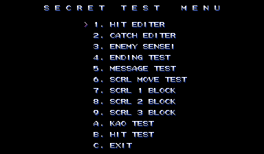
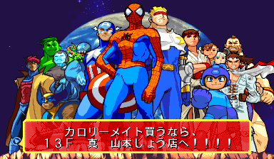
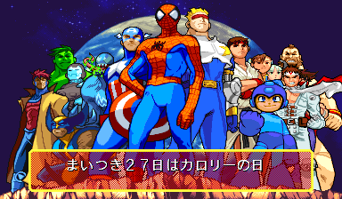

The CPS 2 has a storied history in the emulation scene and hardly needs an introduction. You may think there is nothing left to discover with this hardware, but there are remaining secrets indeed. 24 of them, in fact, in the form of little blue switches...

<!--more-->

# Dev Hardware and Debug DIPs

I began looking into several CPS2 games at once a while back after taking several of them apart in the past and noticing that they had similar elements,  suggesting that they were built from a "template" or SDK of some sort. I was looking for patterns, code that they all might have in common and, specifically, some kind of shared debug mode that would apply to all of them.

And, well... I found exactly what I was looking for.

Getting right to the point, I found what appeared to be three banks of debug DIP switches that many games were referencing in their final code. These potential switches were mapped to the three bytes at 0x8040B0 to 0x8040B2, an area that the MAME CPS2 driver has marked as unknown and for which it included some code to force this area to all bits set in order to get one of the games to run. To be clear for those not familiar with the hardware, consumer CPS2 boards do not include any physical DIP switches and all game configuration is done in software, so the likely scenario was that these switches would have only been present on development hardware. This would be a pretty big discovery and would require as much supporting evidence as possible to make such a claim confidently.

Now, originally at this point the article veered off into a few paragraphs of evidence to supported the existence of such switches: its location within the memory map being near other I/O devices, that it was tested at the bit level, that at least a couple games have strings referencing DIP switches A, B and C... I felt I needed to make a strong case for their existence since, to my knowledge, no CPS2 dev hardware had ever leaked to the public and there was no physical evidence for dev switches. But then, during a discussion about this article on twitter, [someone linked to this image](https://twitter.com/xMetalliCx/status/1571091138249109505):

It looks to be a legitimate CPS2 development board. It was [sourced from this site](https://capcomkits.com/gallery/devboard/) which, unfortunately, has no notes about its provenance. The label on the bottom in the middle reads "CPS2開発用ROM基板〈改〉- ROM Board for CPS2 Development (Revised)." The game data ROMs on the left read "SFZ J キャラチェック - Street Fighter Zero (Japan) Character Check."

Which is all very interesting (has this been dumped??), but what is particulalrly relevent here are the rows of blue switches in the upper right. Indeed, those are the debugging DIP switches I suspected to exist, with the board labeling each bank DIPSWA, DIPSWB and DIPSWC. That settles things I think!

Of course, they aren't *actually* DIP switches, which, [by their very definition](https://en.wikipedia.org/wiki/Dual_in-line_package), are grouped together into a single device. Instead, these are individual latching switches, much larger than the tiny nubs on a true DIP switch package. It makes sense, though: larger switches like these make it much simpler to quickly enable or disable a function as the game is running. Ultimately they function exactly as DIP switches would, so while it's technically a misnomer, we'll stick to that terminology since that's what Capcom chose to call them.

The use of these switches in the final games varies: some games won't read the values unless a hardcoded, compile-time constant is set; some read the values and then do nothing with them; some work with them as-is with no modifications needed. Some games reference the switches, but the code that does so has been orphaned. In most cases, an accompanying cheat is necessary to make the switches work as expected.

What games use these switches? The majority of CPS 2 games at least reference the memory where they are mapped, even if they don't actually use them. Such games that do make use of them are all of the Marvel games, Cyber Bots, Progear no Arashi, Ultimate Ecology, Street Fighter Alpha 3, Alien vs Predator, and more.

So what's the next step? Ideally, we would want to document this in code by adding it to MAME, but things get a little sticky there. We cannot simply add DIP switch entries to the CPS2 driver (which, admittedly, was my initial intent) because the switches are not present on the final, production run CPS2 hardware, which is what is being emulated. To comply with the MAME philosophy, we should create a new driver to emulate the dev board in particular. And we can't do that because we don't have the  physical hardware to work from. A relatively low resolution image of a PCB is not enough to write a driver: there may be other, less obvious differences which would need to be implemented or mask ROMs that would need to be dumped. We would need the actual board to do that.

In other words, there is not and will not be an easy way to play with the debug DIP switches in MAME, not unless someone who owns the dev board comes forward to help implement a driver for it.

But there is another option for those who are determined. While we can't add the DIP switches to the CPS2 driver and submit them to the mainline project, there's nothing stopping us from compiling our own MAME build with whatever customizations we want.

[So, I present to you a CPS2 "dev" driver.](https://sudden-desu.net/misc/cps2_driver_with_dips.cpp)

First of all, to be very clear: **this is not an accurate representation of the dev hardware**. This is intended only as a tool for easily activating the debug DIP switches for games that still use them. It's meant as a research tool only and not intended for mainline MAME.

To use this, you will need to [pull the MAME source](https://github.com/mamedev/mame), place this file in the src/mame/capcom directory, overwriting the existing cps2.cpp, and then [build the project](https://docs.mamedev.org/initialsetup/compilingmame.html) for the CPS2 driver specifically. If you're savvy with git, you may want to make a new branch first to preserve the original driver source.

After running it, you will need to enable the switches by going to Machine Configuration and setting the option there. The first time you run a game, you may need to toggle one of the switches and reset the game to put it into an initial state (but this depends on the game).

From here, the article was originally much, much longer, examining the DIP switch usage in four or five games. This was proving to make the article massive and was causing significant delays as some games (*cough* Progear no Arashi) were turning up lots of orphaned debug code that needed research to create acceptable MAME cheats. Instead, I have opted to post the article with the analysis of only a single game (or rather, a group of games with a lot of shared code) and will follow up with other CPS2 articles in the future.

So, let's jump in and have a look at the array of Marvel games on the system. As I said above, all of these games were built off of the previous one and thus share a great deal of debugging code. X-Men vs Street Fighter was the one I began disassembling first, so we'll start there.

# X-Men vs Street Fighter

## Debug Flag (Required)

In addition to their specific flags, all the debugging functions in the game are enabled by a "master" debug flag which must be set first. This was likely a compile-time constant indicating a debug build. It is stored at 0xC0 in ROM and should be non-zero for debug mode, so we'll make the modification there with this cheat:

<pre>
  &lt;cheat desc="Enable Debug Functions"&gt;
    &lt;comment&gt;This must be enabled to use debug functions and switches&lt;/comment&gt;
    &lt;script state="on"&gt;
      &lt;action&gt;temp0=maincpu.mw@c0&lt;/action&gt;
      &lt;action&gt;maincpu.mw@c0=ffff&lt;/action&gt;
    &lt;/script&gt;
    &lt;script state="off"&gt;
      &lt;action&gt;maincpu.mw@c0=temp0&lt;/action&gt;
    &lt;/script&gt;
  &lt;/cheat&gt;
</pre>

Be sure to reset the game after the cheat has been set, and remember that **this must be enabled to use the tools in the next sections**!

## Region Select

With the main debug flag set, you can choose the region by holding a P1 button on startup. The best way to do this in MAME is to hold the button, then press F3 to do a reset.

<table>
	<thead>
		<tr>
			<th>Button</th>
			<th>Region</th>
		</tr>
	</thead>
	<tbody>
		<tr>
			<td>P1 Button 1</td>
			<td>Japan</td>
		</tr>
		<tr>
			<td>P1 Button 2</td>
			<td>USA</td>
		</tr>
		<tr>
			<td>P1 Button 3</td>
			<td>Europe</td>
		</tr>
		<tr>
			<td>P1 Button 4</td>
			<td>Asia</td>
		</tr>
		<tr>
			<td>P1 Button 5</td>
			<td>Hispanic</td>
		</tr>
		<tr>
			<td>P1 Button 6</td>
			<td>Brazil</td>
		</tr>
	</tbody>
</table>

## Debug DIPs

This game makes use of the debug DIP switches during gameplay. You will first need to have the master Debug Flag mentioned above enabled.

<table>
	<thead>
		<tr>
			<th>Switch</th>
			<th>Effect</th>
		</tr>
	</thead>
	<tbody>
		<tr>
			<td>SW 1:1</td>
			<td>Display grid overlay and some values</td>
		</tr>
		<tr>
			<td>SW 1:2</td>
			<td>Flip the screen vertically</td>
		</tr>
		<tr>
			<td>SW 2:6</td>
			<td>Slow speed</td>
		</tr>
		<tr>
			<td>SW 2:1</td>
			<td>Invincibility</td>
		</tr>
		<tr>
			<td>SW 2:2</td>
			<td>Show hit boxes</td>
		</tr>
		<tr>
			<td>SW 2:3</td>
			<td>Disable countdown timer</td>
		</tr>
		<tr>
			<td>SW 2:7</td>
			<td>Slower speed</td>
		</tr>
		<tr>
			<td>SW 2:8</td>
			<td>Slowest speed</td>
		</tr>
		<tr>
			<td>SW 3:1</td>
			<td>Fast speed</td>
		</tr>
		<tr>
			<td>SW 3:2</td>
			<td>Partial invincibility 
			(most attacks do no damage, but some do; unclear exactly how this works)</td>
		</tr>
		<tr>
			<td>SW 3:4</td>
			<td>Stop</td>
		</tr>
		<tr>
			<td>SW 3:5</td>
			<td>Monitor 1 
			(only during gameplay, needs to be set before gameplay begins)</td>
		</tr>
		<tr>
			<td>SW 3:7</td>
			<td>Monitor 2 
			(only during gameplay)</td>
		</tr>
	</tbody>
</table>

## Secret Test Menu

With the debug flag set, hold P1 Button 1 and enter test mode (F2 in MAME) to display the secret test menu.

### Hit Editor

Displays and edits the animations for characters. There are two modes: Char Select and Hit Edit, P1 Start will cycle these modes, along with a third exit option.

#### Char Select Mode

<table>
	<thead>
		<tr>
			<th>Input</th>
			<th>Effect</th>
		</tr>
	</thead>
	<tbody>
		<tr>
			<td>P1 Up/Down</td>
			<td>Change animation group</td>
		</tr>
		<tr>
			<td>P1 Left/Right</td>
			<td>Change animation within the current group</td>
		</tr>
		<tr>
			<td>Hold P1 B1</td>
			<td>Play animation</td>
		</tr>
		<tr>
			<td>P1 B2</td>
			<td>Advance animation by one frame</td>
		</tr>
		<tr>
			<td>P1 B3</td>
			<td>Reset animation</td>
		</tr>
		<tr>
			<td>Hold P1 B4 + P1 Stick</td>
			<td>Move character</td>
		</tr>
		<tr>
			<td>Hold P1 B5 + P1 Stick</td>
			<td>Change H/V flip</td>
		</tr>
		<tr>
			<td>Hold P1 B6 + P1 Up/Down</td>
			<td>Change character</td>
		</tr>
		<tr>
			<td>P2 Stick</td>
			<td>Change shadow position/size (see note below)</td>
		</tr>
	</tbody>
</table>

In Char Select Mode, P2 Start will cycle the secondary object "mode." This will either be a player or an effect, and each has a visible and invisible mode. The controls for the secondary object are the same as listed above, but use the P2 side controls. Note that the P2 Stick will also control the shadow side regardless of the secondary mode.

#### Hit Edit Mode

<table>
	<thead>
		<tr>
			<th>Input</th>
			<th>Effect</th>
		</tr>
	</thead>
	<tbody>
		<tr>
			<td>P1 Up/Down</td>
			<td>Select an entry in the "Hit" menu</td>
		</tr>
		<tr>
			<td>P1 B1</td>
			<td>Edit hit value, after which P1 Left/Right changes the value</td>
		</tr>
		<tr>
			<td>Hold P1 B4 + P1 Left/Right</td>
			<td>Change animation (can lead to bad data/game crash)</td>
		</tr>
		<tr>
			<td>P1 B5</td>
			<td>Advance animation by one frame</td>
		</tr>
		<tr>
			<td>P1 B6</td>
			<td>Reset animation</td>
		</tr>
	</tbody>
</table>

### Catch Edit

Catch Edit is similar to Char Select in the previous tool, but is specifically for working with throw animations between two player.

<table>
	<thead>
		<tr>
			<th>Input</th>
			<th>Effect</th>
		</tr>
	</thead>
	<tbody>
		<tr>
			<td>P1 Left/Right</td>
			<td>Change catch anim</td>
		</tr>
		<tr>
			<td>P2 Left/Right</td>
			<td>Change hold anim</td>
		</tr>
		<tr>
			<td>Hold P1 B1</td>
			<td>Play animation</td>
		</tr>
		<tr>
			<td>P1 B2</td>
			<td>Advance animation by one frame</td>
		</tr>
		<tr>
			<td>P1 B3</td>
			<td>Reset animation</td>
		</tr>
		<tr>
			<td>Hold P1 B4 + P1 Stick</td>
			<td>Move character</td>
		</tr>
		<tr>
			<td>Hold P1 B6 + P1 Up/Down</td>
			<td>Change character</td>
		</tr>
		<tr>
			<td>P2 B2</td>
			<td>Exchange priority levels between characters</td>
		</tr>
		<tr>
			<td>Hold P2 B5 + P2 Stick</td>
			<td>Change H/V flip for throw character</td>
		</tr>
	</tbody>
</table>

Also similar to the previous mode, the same inputs apply to the secondary character using the P2 side controls. Notably, the H/V flip is only available on the P2 side here.

### Enemy Sensei

It's unclear exactly what is going on here. When selecting the option from the menu, you are shown a character name which can be changes with P1 Left/Right. Press P1 B1 to select and it will quickly cycle through several tables of data, followed by a completed message at the end. You can then select a different character or press P1 + P2 Start to return to the main menu.

It could be checking the validitity of fight engine data, or perhaps copying that data to someplace in memory where it can be useful to devs. Among the strings for its subroutine are some possible errors that can occur as it runs:

<pre>
    DONT USE COMMAND    
      NOT COMMAND       
    NOT FOUND ENDIF     
    NOT FOUND IF OFF    
  BAD PARAMETER (PU KI) 
 BAD PARAMETER (SP TYPE)
 BAD PARAMETER (SP KIND)
  BAD PARAMETER (SP SW) 
    OVER LIBRARY NO     </pre>

A deeper look into the disassembly could probably tell us more, but to be frank, there are too many other things to tackle, so I leave this to someone else to research.

### Ending test

As its name implies, it displays the various endings for the characters. When selecting it, a number display on the left, which can be changed with P1 Left/Right and selected with P1 B1. This is the character ID. After selecting, a second number below it will be shown, with the same controls. This is the ending type.

Note that setting the first number (the character) to 0x13 displays an "in development" version ending, with art/palette variations of the two characters, chosen at random.

### Message Test

Displays the text strings used in the game. P1 Left/Right changes the message ID, and P1 B1 through B4 corresponds to the four options listed. Note that even changing the language, the strings only appear to be in Japanese.

### Scroll Tools

There are four scroll plane viewers listed in the menu, all of which generally act the same.

Well, presumably SCRL MOVE works like the others. When chosen, it displays a black screen and nothing changes with inputs. The game is not locked up, however, as P1+P2 Start will return to the menu.

For the other tools, there are two numbers on the right side, which appear to be the bank (upper) and image (lower). P1 Left/Right changes the image by 1 and Up/Down changes by 0x10, while P1 B3 changes the bank. P1+P2 Start returns to the menu.

Note that SCRL 1 is a bit broken: it doesn't display the numbers, though it does respond to changing the image. Changing the bank "works," but seems to put it in a bad address space and may cause the game to restart.

### Kao Test

Kao is Japanese for face, and that's certainly what this tests. P1 Left/Right to cycle through the portraits, P1+P2 Start to return to the menu.

# Other Marvel Games

Unsurpringly, all of the Marvel games are built off of each other, and so the debug functionality is mostly the same across all of them (except for the earliest, Children of the Atom, which we'll look at seperately next). Had I realized this at the start, I would have looked at each one in order of their release dates to see how things changed, but as it is, I did all the research on X-Men vs Street Fighter first.

We'll quickly run through the other games and note if there are any significant changes.

## Marvel Super Heroes

Master Debug Flag, Debug Flags and Region Select are the same as XvsSF.

The secret menu is the same, except for a couple missing entries. The location test ending is available in the Ending Test:

The Japanese version reads "Marvel Super Heroes is now under location test."

## Marvel Super Heroes vs Street Fighter

Master Debug Flag, Debug Flags and Region Select are the same as XvsSF.

The Secret Test Menu is almost exactly the same, but it adds a new entry called "Star Test."

Selecting Star Test results in a black screen with no reactions from user inputs. The game is not locked up, however, as you can return to the menu with P1 + P2 Start. It's unclear if this is an emulation issue or the code is broken/removed. I will need to come back to this sometime and look into it further.

The location test endings are available in the Ending Test:

The Japanese version reads "NOW IN DEVELOPMENT!!!"

## Marvel vs Capcom

Master Debug Flag, Debug Flags and Region Select are the same as XvsSF.

The Secret Test Menu is almost exactly the same, but it adds a new entry called "Hit Test."

Hit Test shows a grid of data, possibly related to hit boxes in some way, for each character.

P1 Up/Down scrolls the data; hold P1 B1 and use Left/Right to change the character.

And, as above, the Ending Test has the location test screens:

The Japanese version is uh.... interesting. It reads "If you're going to buy Caloriemate, go to Yamamoto Goods on the 13th floor (of Makoto)!!!! Every month on the 27th is Calorie Day."

[Caloriemate](https://www.otsuka.co.jp/cmt/index.php) is marketed towards students and salarymen and others who are too busy to stop and eat a proper meal. I can imagine game devs, crunching away, probably had their fair share of Caloriemate. And some stores have a monthly "(something) Day," where a certain product is discounted.

But the 13th floor of what building? "Yamamoto" is such a generic name that it's impossible to pin down where they are referrring to. And the kanji after 13F, 真 Makoto, is unclear. Is that the name of the building? I've asked native Japanese about the message, and they're a bit confused by it as well.

It's a weird message to put at the end of the location test, but I guess it's a pretty silly game to begin with...

## X-Men: Children of the Atom

This is the oldest of the Marvel games and the original engine from which later games were built. The same basic debug functions are present, but with some changes.

### Debug Build Flag

Like its later games, CotA has a hardcoded debug build flag which must be set before any of the other tools can be used. Unlike those games, though, it is in a different location in the ROM, so we'll need a different cheat:

<pre>
  &lt;cheat desc="Enable Debug Functions"&gt;
    &lt;comment&gt;This must be enabled to use other debug function cheats&lt;/comment&gt;
    &lt;script state="on"&gt;
      &lt;action&gt;temp0=maincpu.mw@d24&lt;/action&gt;
      &lt;action&gt;maincpu.mw@d24=ffff&lt;/action&gt;
    &lt;/script&gt;
    &lt;script state="off"&gt;
      &lt;action&gt;maincpu.mw@d24=temp0&lt;/action&gt;
    &lt;/script&gt;
  &lt;/cheat&gt;
</pre>

### Region Select

Same as above.

### Secret Menu

The secret menu has many of the same options, or at least versions of them, as later games. I won't go into detail on the controls of each one, as it looks like it <a href="https://tcrf.net/X-Men:_Children_of_the_Atom_(Arcade)#Debug_Menu" target="_blank">has been documented on TCRF already</a>, but we'll run through them quickly with screenshots.

#### Hit Editor

#### Parts Editor

#### Tsukami Editor

#### Gamemap Test

#### Ending Object Test

#### Message Test

#### Scr Pri Test

#### Scr Blk Test

### Debug DIPs

The debug DIPs are used during gameplay here as well, with the same settings as in X-men vs Street Fighter listed above.

---

And there we have it. Next time we'll take a look at more CPS 2 games that utilitize these DIP switches and the debug functions they have hidden away. See you then!
