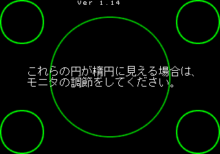
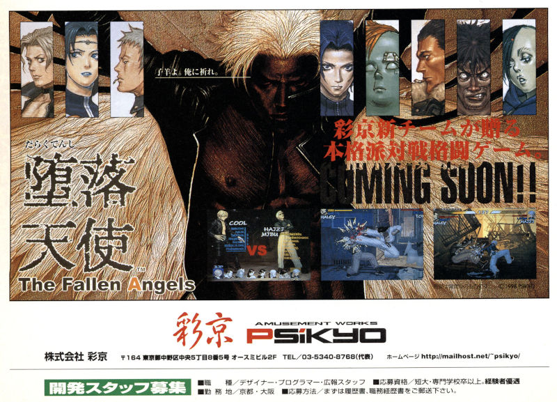

Let's take a look at a fighting game with a troubled development history, questionable aesthetic choices, cut characters and hidden debug tools. No, we're not talking about [Tōki Denshō](/entry/touki-denshou/) this time. It's Psikyo's 1998 fighting game, Daraku Tenshi: The Fallen Angels! In part 1, we'll look at the game's hidden development tools and other code mysteries, then in [Part 2](/entry/daraku-tenshi-part-2/) we'll discuss the game's decimated storyline.

<!--more-->

# Display Version & Enable Debug Mode



Hold P1 Button 3 and press P1 Button 2 during the screen alignment shown on startup to display the program version. It will also play a sound effect of Harry grunting.

More important than the version indication is that this also sets the byte at 0x602E330 to 1 which acts as a debug mode flag to enable pause and the dev tools that are available when paused.

So how do you pause the game? That's where things get sticky...

# Pause / Slow Motion

Let's begin by looking at the code that pauses the game:

<pre class="pdasm pdasm-arch-sh2">
0004A0CC: MOV.L   @$602DAFC{generalInputsPressCopy},R3 ; this variable only mirrors P1 and P2 start for a single press, which come in as 0x09 and 0x90 respectively
0004A0CE: MOV.B   @R3,R0
0004A0D0: AND     #$04,R0 ; AND the value with 0x04 - since the P1/P2 start values are 0x09/0x90, this will always set R0 to 0
0004A0D2: MOV.L   @$60343C7,R2 ; copy the ANDed value - this variable is not used anywhere, so it is likely a leftover
0004A0D4: MOV.B   R0,@R2
0004A0D6: EXTU.B  R0,R0
0004A0D8: CMP/EQ  #$04,R0 ; check if the value is 0x04...
0004A0DA: BF      $0004A0EC ; and jump down if it is not
0004A0DC: MOV.L   @$602E330{debugFlag},R3 ; check if the overall debug flag (the one set on the alignment screen) is enabled
0004A0DE: MOV.W   @R3,R0
0004A0E0: TST     R0,R0
0004A0E2: BT      $0004A0EC
0004A0E4: MOV.L   @$602EB7C{pauseFlag},R3 ; the correct button was pushed and we're in debug mode, so enable the pause flag
0004A0E6: MOV.W   @R3,R0
0004A0E8: XOR     #$01,R0
0004A0EA: MOV.W   R0,@R3
</pre>

As mentioned in the comments in the listing, the issue stems from the fact that the variable being checked (the byte at 0x602DAFC which mirrors P1/P2 Start button single presses) will never match the expected value. It never even gets to the check for the debug flag that was set on the alignment screen.

Let's take a detour and discuss button and joystick input. In most retro hardware, reading inputs is usually pretty simple and straightforward. The data generated by input hardware is mapped to a specific location in the addressable memory space. This usually only occupies one or two bytes per player since the classic joystick and buttons layout can be represented with simple binary states. You only need four bits to represent the four points on a joystick, and each button is only one bit (one or off).

Most games will copy those values to somewhere in its work RAM during each vertical blanking period. The program keeps a copy of the previous input state to compare with the current state, from which it creates another state representing single button presses. The game logic then uses those two input copies in RAM, representing the holds and single presses of each player. Certainly games vary in their input processing, but many of them follow this pattern and input is generally one of the less complicated aspects to understand when disassembling.

With that said, Daraku Tenshi has *the most confusingly convoluted input update code I have ever seen*. There are separate places in RAM just for the Start buttons, for the Player buttons, for the joysticks. Of those, several appear redundantly, with different subroutines using different "versions" of the inputs. Bit values from the hardware are not used directly but are instead mapped using a bit shift "key" to different values to be interpreted by the game engine. It's a mess. If you're familiar with the MAME debugger, open a memory view around 0x602DA90 and watch how many places light up and change as you press different buttons. If you're feeling really adventurous, you can attempt to unravel the update routine at 0x498E4.

The game was famously released "unfinished" and this may be a byproduct of that. Some places in the disassembly feel like they're still in a testing or prototypical state: everything is working, but the code is "hard patched" in places to ensure certain paths are always followed. There may be a method to the madness, but I don't see it from the admittedly small percentage of the entire disassembly that I've analyzed.

(I want to emphasize that we can only guess when we don't have the source code and are working backwards from compiled data. What may look like a mess in raw opcodes may actually be layers of indirection in the source that make for better code. I do not want to insinuate that the original code is bad or that the devs were unskilled.)

So. With that in mind, let's return to the code for enabling pause. It reads the byte from 0x602DAFC, which is one of the multiple input mirrors and which captures only P1 and P2 Start as values 0x09 and 0x90 respectively. The pause routine, however, is looking for value 0x4, which means it will always fail. My initial gut reaction was that this was [yet](/entry/athena-no-hatena-debug-menu-and-functions) [another](/entry/cps2-debug-switches-and-the-games-that-love-them) unemulated input, but since that has basically become a trope with my research at this point, I didn't want to automatically make that assumption. (Spoiler: *it was the correct assumption.*)

I decided to venture back into the disassembly. After several coffee-fueled hours of frustration later, I had a better idea of what was happening (to some extent).

The chunk of code at 0x4A594, which gets called as part of the larger update inputs subroutine, takes the value as read from the hardware, adds it to the value at byte 0x602DB51 (set to 1 normally) which has been shifted a few times and uses the new value as an offset into a table of bytes beginning at 0x61F9C. The value in that table is used as the new representation of the input, and this is what ultimately turns P1/P2 Start into values 0x09/0x90.

In other words, this acts as a "translation layer," turning the values coming from the input hardware into different values hardcoded in a table to be used by the game logic. I'm not entirely sure why it does this. Perhaps it was to abstract the input devices from the game in order to make it more flexible if it were to be ported to other hardware. That's just a guess.

Interestingly, that bitshift "key," which is normally set to 1, is set to 0 in only one place: the test mode screen. As it turns out, this remaps the keys in such a way that P1 Button 4 generates the value that pause mode is looking for. That means that pause mode and the debug tools are available as-is without any patches. Simply enable the debug flag on the alignment screen and then switch into test mode. P1 B4 will pause and while paused, P1 + P2 Start will bring up the debug menu.


Of course, it's pretty useless here as all of the tools are only visible/usable during normal gameplay, but it's an interesting footnote.

It's rather odd that the input mapping is different only in test mode. Maybe it has something to do with the Input Test? Even with the remapping, all the buttons line up as expected there.

Wait a minute...


In the input test we have Button 1 and 2 and... where's 3? And what's up with Button 5? The game only has four buttons...

The MAME source also points out that Daraku Tenshi does not have a Button 3:

```
    PORT_BIT( 0x00020000, IP_ACTIVE_LOW, IPT_UNKNOWN )  /* No button 3 here */
    PORT_BIT( 0x02000000, IP_ACTIVE_LOW, IPT_UNKNOWN )  /* No button 3 here */
```

That is intriguing. And it looks like other games on the same board also do not have a "proper" button 3, namely Strikers 1945 III and Space Bomber. To the player, of course, the buttons aren't labeled 1 or 2 or 3, etc, but Punch, High Kick, etc., so it doesn't matter much to the end user. But it does raise the question: what happens if we enable the "true" Button 3 as defined by MAME's bit mapping?

Surprise surprise, **Button 3 is the pause enable button on the P1 side and slow motion enable on the P2 side!**

Once again I'll be opening a PR to MAME to add a machine configuration that provides a fifth button to enable pause. I'll also be checking the other games with a missing button 3 to see if that enables anything interesting.

In the meantime, we can set the pause flag directly in RAM. Slow motion mode won't be usable with this method since we're "hacking" this by bypassing the inputs altogether, but it's enough to play with the debug tools for now:

```
  <cheat desc="Pause Game / Debug Tools Access">
    <comment>Game is paused while enabled. Press P2+P1 Start to toggle debug tool chooser</comment>
    <script state="on">
      <action>maincpu.pw@602eb7c=1</action>
    </script>
    <script state="off">
      <action>maincpu.pw@602eb7c=0</action>
    </script>
  </cheat>
```

# Debug Tools

So now that we've written a goddamn dissertation on Daraku Tenshi's complex input update code, let's *finally* have a look at the actual debug tools.


When the game is paused, the debug mode options can be displayed by pressing P1 Start + P2 Start.

This will display the debug flags as a row of bits at the top of the screen which correspond to the long at 0x602DB4C. The current bit is highlighted in red with the name of the tool that it activates to the right of the list. P1 Left/Right moves the cursor and Button 1 toggles the bit.

Some of the tools display text overlays. These can be moved by the P2 stick, but only when paused and with the debug tool selector closed. Depending on what is happening on screen and on certain stages, the text may be invisible on most of the screen. It's unclear if this is a game or emulation issue. (Haiji's stage on the rooftop tends to show the entire text most of the time.)

## Task-Put


A task list and details viewer. Despite the name put, doesn't seem to have a way to spawn processes. P1 Button 4 changes "modes," which are a task list, details of the selected task, and a dump of the entire task control block. It seems there is an invisible cursor of sorts, which can be moved with P1 controls. On the task list, this moves the cursor up and down through the list, acting as the task selection. In the memory dump, it moves through each of the bytes, with P1 B1 increasing the value by 0x10 and P1 B3 increasing by 1.

## PaletSet


Palette editor. There is a cursor here like the task list, but it's actually visible this time, as red text. P1 stick moves cursor, P1 Button 1 increases value, P2 Button 3 decreases value.

## Hit Look


A hitbox viewer. Also displays player input values at the top of the screen.

## ShadowOn

I haven't been able to figure out what changes when this is enabled. Presumably, it would enable shadow under the characters, but they are already on. Further disassembly into its function is necessary.

## Boss-Sel


This enables selecting the boss characters on the player select screen. After this flag is enabled, press and hold B2 for Trigger or B2 + B4 for Carlos. Continue holding until the stage loads. This works for either P1 or P2.

(You may not actually need to hold that long, but I do know just a single press won't activate them. Holding until the stage loads just guarantees they will be selected.)

## P-TimeSt

Disables the gameplay timer.

## AllNoDam

When set, no damage is taken by either character.

## Seq Edit


The flag for this tool needs to be enabled before the stage loads in order display and run.

When enabled, an options menu is displayed and Player 1 becomes CPU controlled (even in Versus mode). P1 Stick moves through the options with the cursor represented as bright text. The P1 buttons will increase or decrease values, or reset to zero or maximize the value, depending on the tool. P1 + P2 Start returns to the main menu from the sub options. In some of the tools, text below the options acts as a value monitor.

The tools are intriguing but don't really seem to have much actual use. Characters can supposedly be modified, but these settings are represented as raw values, which make it difficult to make any meaningful changes. Most of the values aren't editable anyway, at least not in any way I've been able to determine.

## Win Demo


As the name implies, this displays the various end of round victory lines for all of the characters. It only displays at the end of a round when such dialogue would normally appear. P1 Button 1 selects the characters; P1 Button 2 goes backward, returning to the gameplay and the next stage if a Lost character wasn't selected. P2 Button 1 and Button 3 will increase/decrese the scene value (i.e. the background image).

## Play Sel


This option allows you to choose your next opponent. It will only be displayed before the character select screen or at the end of a match.

## Pl NoDam

Similar to AllNoDam, except only the player is invincible; the CPU character will still take damage.

## Hit Proc


Similar to SeqEdit, this is another settings editor, though it's unclear what it modifies. It only works when the game is paused. P1 Left/Right changes the "mode," cycling between Player 1, Player 2 and Other. The numbers listed are RAM locations, with the locations for P1/P2 being the player states.

P1 Button 1 will display text on the right when pressed twice, and P1 Button 2 seems to cancel it. There doesn't seem to be anything to actually edit and it doesn't have an obvious effect on the game.

## Prm Edit


Another parameter editor, but this one actually effects the game! Hold P1 Start and use the P1 stick to move the cursor around the values. P1 B1/B3 increase and descrease the lower half of the byte; P1 B2/B4 modify the upper half.

## D-Income

No on screen component. Possibly "display income," as in an audit screen? Or "disable income," as in not to effect audit info while testing?

The check for it occurs in the subroutine at 0x462E2. If the flag is set, it skips a bunch of code and returns immediatly, hinting that it is disabling something after all. This needs some more disassembly analysis... someday.

## Hit1Pchk/Hit2Pchk

When set, the joystick for the indicated player will move the character position on the screen while in pause mode. It's unclear if there are other effects from this setting.

# Unused Title Screens

[As documented on TCRF](https://tcrf.net/The_Fallen_Angels), there are a handful of what appear to be alternate or prototype title screens within the data, viewable in the Bitamap Dump tool.


While it's true they are unused, they are in fact referenced by the program at 0x1DDC0 and 0x1ACD4, within the title screen display routines.

(There are two title screen display routines, one for inserting a coin and the other for after the attract mode story intro completes. Both are quite similar and the block we're looking at within them is identical in both places.)

Within those routines, the Region DIP switch is checked, and if it is set to World, it branches down to this code which displays the alternate artwork depending on the value in R0:

<pre class="pdasm pdasm-arch-sh2">
0001DDC0: E000 MOV     #$00,R0 ; manually set a value in r0
0001DDC2: 8800 CMP/EQ  #$00,R0 ; then switch on that value
0001DDC4: 8909 BT      $0001DDDA
0001DDC6: 8801 CMP/EQ  #$01,R0
0001DDC8: 890B BT      $0001DDE2
0001DDCA: 8802 CMP/EQ  #$02,R0
0001DDCC: 890D BT      $0001DDEA
0001DDCE: 8803 CMP/EQ  #$03,R0
0001DDD0: 890F BT      $0001DDF2
0001DDD2: 8804 CMP/EQ  #$04,R0
0001DDD4: 8911 BT      $0001DDFA
0001DDD6: A031 BRA     $0001DE3C
0001DDD8: 0009 NOP
</pre>

What stands out here is that R0 is manually set to 0 right before the code switch, meaning it will always choose the first option (which is the World region title screen, similar to the Japanese version but without the kanji for the alternate Daraku Tenshi title).


What does this mean? We've certainly seen games branch using hardcoded values before, but in all the cases I've seen, they use what appear to be global constants set at compile time as part of a build configuration. In Daraku Tenshi, it seems to use a local variable set right there where it's being used. Granted that could still be set conditionally via some preprocessor directives at build time, but this style feels like it was still prototype code and hadn't been optimized into something more professional.

In any case, we can see that the other options are accessible simply by changing the value of R0, right? If we write a cheat to do just that...


Hmm. Well that's not right. The palette isn't being set and is simply using whatever color data was already present.

The surrounding code is slightly different in the two title screen display routines. In the "after intro story" version, there does appear to be a palette load call made after the World region artwork switch shown above. However, its arguments appear to be the same as the one for the Japanese title screen rather than something unique for the World versions. The "insert coin" version does not have such a palette load call at all after the artwork display.

How can we interpret all of this? Considering that these images are only referenced if the region is set to World, it seems they may have been alternate title screens for more specific non-Japanese regions (e.g. Korea, South America, USA, etc).

Or, instead of related to more specific regions, perhaps they may have been alternate English titles for the export version that were under consideration. That could help to explain why the code to display it is so janky, from the inline switch value to the lack of palette loading.

With enough time, we could probably write a patch to get the palette loading fixed, but frankly I don't see any value in this. We already have the images available in the Bitmap Dump and we have evidence they were used in some capacity at some point in the code. That's enough, I think. Instead, here is a MAME cheat to change that inline switch value in both locations so you can see it working with its palette funkiness.

```
  <cheat desc="Alt Title Screens">
    <comment>Selects the alternate, unused title screen artwork; note that the palettes do not load properly</comment>
    <script state="on">
      <action>temp0=maincpu.rb@1ddc1</action>
      <action>temp1=maincpu.rb@1acd5</action>
    </script>
    <parameter min="0" max="4" step="1"/>
    <script state="change">
      <action>maincpu.rb@1ddc1=param</action>
      <action>maincpu.rb@1acd5=param</action>
    </script>
    <script state="off">
      <action>maincpu.rb@1ddc1=temp0</action>
      <action>maincpu.rb@1acd5=temp1</action>
    </script>
  </cheat>
```

# Yuiren and Yuiran's sprites

Here's something that I thought was clever. The [okama](https://jisho.org/search/okama) brother Yuiren and [otemba](https://jisho.org/search/otemba) sister Yuiran are mostly identical in character design. In fact, Yuiren's sprite is just Yuiran with the clothes and longer hair overlaid in realtime!



Interestingly, [the Game Catalog Wiki entry](https://w.atwiki.jp/gcmatome/pages/978.html) indicates that as Yuiren's story progressed, she would eventually cut her hair and remove her feminine clothing to fight as a man. The wiki doesn't list a source for this assertion, unfortunatly, but this method of overlaying the sprites would support that idea.

# Prototype Screenshots

There are a handful of screenshots of the game in a preproduction state, appearing in the February 1998 issue of Gamest (No. 212) as well as on the game's flyer and in magazine advertising. They all seem to be the same handful of images, so they were likely the official press release shots from Psikyo.

The screenshots are (unfortunately) not particularly interesting and are (for the most part) identical to the final version. Here are the differences I could spot.


The large red VS symbol is slightly different in the final version. Namely, it only appears after character selection is complete and the row of portraits has disappeared. Also, the font and coloring is slightly different. The second image is from the final game for comparison.


You may have also noticed above that Haiji's name was mis-spelled, and this also happened to Harry, as you can see here. This just boils down to the team not being familiar enough with English to choose the "proper" transliteration. (To their credit, Haizi is one of the ways you could romanize the kanji for his name, but this is an older way and "ji" is more commonly used.) You can see the same issue in the Win Demo/Player Select Debug tools above, where in addition to Haly (Harry) and Haizi (Haiji), we have Roshi (Roche) and the particularly egregious Kalros (Carlos).


This line of dialogue does not appear in the final game. It reads "Yotsui yūshō." While yūshō means victory, I'm unsure of what the first word means. Rearranged to tsuyoi, it could be "strong," e.g. "A strong victory." It's written in a "simple" way, in kana script instead of kanji and with no particles, and with Tarō being the slow/stupid stereotype, it could be an intentionally misspelled word.

As a bit of an aside, here is a scan of the ad for the game that appeared in Gamest 212.

[](img/daraku_ad_gamest212.jpg)

The screenshots are the same as the preview article, so nothing particularly interesting there. However, it is amusing that Psikyo's website was hosted on free/ISP hosting and didn't yet have its own domain name. It seems this was quite brief, though: the ad above was published in February 1998 and the earliest capture of that URL on the Web Archive, from December 1998, is already an HTTP 302 redirecting to psikyo.co.jp.

But happily, there are [some contemporary captures of psikyo.co.jp](https://web.archive.org/web/19990125102441/http://www.psikyo.co.jp/) and as expected, [Daraku Tenshi is listed on their products page](https://web.archive.org/web/19991013185531fw_/http://www.psikyo.co.jp/product/mania.html). And on that page are a few more screenshots from the same prototype version. Two of them are the same ones we've seen in the ad/Gamest preview, but there are two additional images.





Unfortunately these don't show us anything particularly interesting, but at least they're preserved. And it's always fun to look at 20+ year old websites.

# Extended Test Menu


[This has already been covered by TCRF](https://tcrf.net/The_Fallen_Angels), so I won't go into detail, but in short: hold P1 Button 1 when entering Test Mode to access some new options: Memory Dump, Bitmap Dump, Action Test and Char Dump.

The Bitmap Dump is particularly interesting as it contains a large amount of artwork that is not used in the final game. We'll take a look at some of those images in part 2 as we take a deep dive in to the game's preproduction. We will look at ITŌ Hajime's old Daraku Tenshi fan site, translating his comments on the game's production and the storyboards that he posted. There's a lot more to be discovered about this game outside of the data, so [be sure to check it out](/entry/daraku-tenshi-part-2/)!
