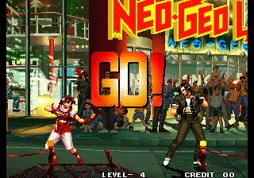
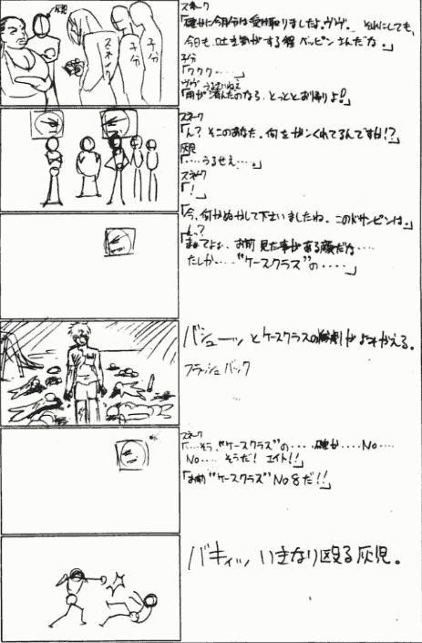
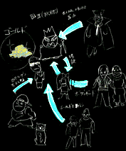

We've looked at [secrets of the game's data in part 1](entry/daraku-tenshi-fallen-angels-part-1). Now let's look at what didn't even make it past the planning stage, at what could have been...

<!--more-->

To be honest, when I first played Daraku Tenshi, I had little interest in the game. In fact, I actively disliked it. The palettes and characters were dreary and depressing. The quality of some of the artwork was... questionable. It simply wasn't an attractive game to me.

But as I've begun to research the storyline side of things, it has started to grow on me. Now that the characters have a bit of depth and motivation, the overall story has become interesting. There was much planning and effort that went into the game's story during preproduction... and practically none of it made it into the final game.

# Character Profiles

Since the game itself tells us almost nothing about the stories of the characters, let's begin by properly introducing the cast. Below I have translated the official profiles for all of the characters in the final game. This information was available in the game's soundtrack booklet and the old Psikyo website. It was also available on background artist ITŌ Hajime's website (which we'll discuss further in the next section) where the text had some minor variations and included descriptions for Trigger and Carlos as well.

The details here provide much needed context to the some of the images in the bitmap dump and also show how much things changed for the characters as they moved from the planning stage to their final form.

## Yuiren

>結連～魅惑の歌姫
>
>名前：結連
>
>&nbsp;
>
>身長：１７０cm
>
>体重： ６１kg
>
>年齢：２０歳
>
>誕生日：３月３日
>
>格闘スタイル ：主に打撃技
>
>趣味 ：料理
>
>好きな食べ物：そうめん
>
>大切なもの：髪
>
>嫌いなもの ：わたぼこり
>
>&nbsp;
>
>酒場「風の魚」の歌姫。美しい容姿と美声で店に来る客たちを魅了しているが、実は男である。性格は気さくで、繊細な外見からは想像もつかないが腕っ節も強く、店の看板娘（？）でありながら、用心棒の役割も果たしている。「ユイラン」とは双子の兄弟で、「ユイレン」はお兄さんである。
>
>&nbsp;
>
>CV：折笠　愛　（ガンダムＷ　カトル，天地無用！　魎呼）

>Yuiren, The Attractive Diva
>
>Name: Yuiren
>
>Height: 170cm
>
>Weight: 61kg
>
>Age: 20
>
>Birthdate: March 3rd
>
>Fighting Style: Primarily strikes
>
>Hobby: Cooking
>
>Favorite food: sōmen
>
>Important: Her hair
>
>Hates: dust balls
>
>&nbsp;
>
>A singer at "Kaze no Sakana (The Windfish)" bar. With a beautiful figure and voice that draws patrons in, he is actually male. You wouldn't know it from his friendly personality and delicate appearance, but he is quite strong, and also acts as the bodyguard even while enticing people into the bar. Yuiran is his twin sister.
>
>&nbsp;
>
>CV: ORIKASA Ai (Quatre from Gundam W, Ryōkō from Tenchi Muyō!)

## Yuiran

>華麗なるバーテンダー ・ 結蘭
>
>名前：結蘭
>
>身長：１６７cm
>
>体重：５７kg
>
>年齢：２０歳
>
>誕生日：３月３日
>
>格闘スタイル ：主に間接技
>
>趣味 ：散歩
>
>好きな食べ物：カレーライス
>
>大切なもの：自分の体
>
>嫌いなもの ：兄（結連）
>
>&nbsp;
>
>酒場「風の魚」のバーテン。ユイレンとは双子でこちらは妹である。オカマである兄をあまり快く思っておらず、その反発からか、男っぽい性格になってしまった。ユイレンと同じく、普段は風の魚のバーテン兼用心棒をつとめている。性格は豪快かつ大胆だが、たまに女らしい一面を見せる事もある。
>
>&nbsp;
>
>CV：大谷育江　（ポケットモンスター　ピカチュウ，姫ちゃんのリボン　エリカ）

>Yuiran, The Grand Bartender
>
>Name: Yuiran
>
>Height: 167cm
>
>Weight: 57kg
>
>Age: 20
>
>Birthdate: March 3rd
>
>Fighting Style: Primarily indirect skills
>
>Hobby: Going for walks
>
>Favorite Food: Curry rice
>
>Important: Her body
>
>Hates: Her older brother (Yuiren)
>
>&nbsp;
>
>A bartender at "The Windfish" bar. She is twins with Yuiren. She does not think highly of her okama brother, and to antagonize him she has taken on tomboy personality. Like Yuiren, she also acts as a bodyguard while bartending. Despite her vigorous and daring personality, she occasionally reveals a feminine side.
>
>&nbsp;
>
>CV: ŌTANI Ikue (Pikachu from Pocket Monsters, Erika from Himechan no Ribbon)

## Harry

>「恐れを知らぬ職業軍人」 ハリー・ネス
>
>名前：ＨＡＲＲＹ・ＮＥＳＳ
>
>身長：１９４cm
>
>体重：１０３kg
>
>年齢：３４歳
>
>誕生日：７月４日
>
>格闘スタイル ：マーシャルアーツ
>
>趣味 ：ジャパニメーション
>
>好きな食べ物：Ｃレーション
>
>大切なもの：愛国心
>
>嫌いなもの：ポルノ
>
>&nbsp;
>
>「アメリカ海兵隊第55師団第4小隊」の隊長。普段はEDENの暴動鎮圧が仕事であるが、一度重大事件があれば、大統領直属の特殊部隊となって事件を速やかに解決する。彼には、妻と娘がいるのだが、あまりの彼の仕事熱心から、夫婦間に亀裂が生じ、現在は別居中である。
>
>&nbsp;
>
>CV：郷里大輔　（魁!!男塾　江田島平八，DRAGONBALLZ　ミスターサタン

>Harry Ness, The Fearless Soldier
>
>Name: Harry Ness
>
>Height: 194cm
>
>Weight: 103kg
>
>Age: 34
>
>Birthday: July 4th
>
>Fighting Style: Martial arts
>
>Hobby: Japanese anime
>
>Favorite food: C-Rations
>
>Important: Patriotism
>
>Hates: Porno
>
>&nbsp;
>
>Commanding officer of the Navy 4th Platoon. Though his primary job is riot control in EDEN, if a major event arises, he joins the special forces under direct control of the president. He has a wife and daughter but his extreme worlkaholic tendencies have created a rift between them, and he now lives apart from them.
>
>&nbsp;
>
>CV: GŌRI Daisuke (Edajima Heihachi from Sakigake! Otokojuku, Mr. Satan from Dragonball Z)

## Taro

>心優しき人造人間 ・ タロウ
>
>名前：タロウ
>
>身長：１７８cm
>
>体重：１１２kg
>
>年齢：不明
>
>誕生日：不明
>
>格闘スタイル：パワー
>
>趣味：散歩
>
>好きな食べ物：握り飯
>
>大切なもの：一緒に暮らす動物達
>
>嫌いなもの：ゴキブリ
>
>&nbsp;
>
>何時、何処で生まれたか、本人には全く記憶がない。15年前にマシュウじいさんに拾われた彼は、「タロウ」と名付けられ育てられた。彼は、生まれながらに異形なその外見故に、人から忌み嫌われて来たが、真の彼の姿は全ての生き物を愛する心優しき男である。実は彼の出生の秘密にはカルロスがからんでいるらしいのだが、現在は全て謎である。
>
>&nbsp;
>
>CV：園部啓一　（平成イヌ物語バウ　バウ，とんでぶーりん　近藤正義）

> Tarō, The Tender-Hearted Android
>
>Name: Tarō
>
>Height: 178cm
>
>Weight: 112kg
>
>Age: Unknown
>
>Birthdate: Unknown
>
>Fighting Style: Power
>
>Hobby: Going on walks
>
>Favorite food: Rice balls
>
>Important: The animals that live with him
>
>Hates: Cockroaches
>
>&nbsp;
>
>When and where he was born, he himself does not know. After he was picked up 15 years ago by old man Matthew, he was raised with the name Tarō. He is hated by people due to his strange outward appearance, but he actually has a gentle nature and loves animals. It seems Carlos is somehow entangled with the secrets of Tarō's birth, but that remains a mystery for now.
>
>&nbsp;
>
>CV: SONOBE Keiichi (Bow from Heisei Inu Monogatari Bow, Kondo Masayoshi from Tondebūrin)

## Roche

>暗黒街の臥龍～ロッシ
>
>名前：ロッシ
>
>身長：１６４cm
>
>体重：４９kg
>
>年齢：１６歳
>
>誕生日：４月２７日
>
>格闘スタイル ：暗殺術
>
>趣味：なし
>
>好きな食べ物：なし
>
>大切なもの：なし
>
>嫌いなもの：王 大全（ワン・タイゼン）
>
>&nbsp;
>
>若干16才にして、「暗黒街の臥龍」と呼ばれる凄腕の殺し屋である。幼少の頃、暗黒街を取り仕切る王大全（ワン・タイゼン）に拾われ殺し屋になるための技術を徹底的に叩き込まれて育った。しかし、ロッシは14才の時にワン・タイゼンの元から逃げ出し、２年後の現在ではフリーの殺し屋となっている。その事もあり、ワン・タイゼンには常にしつこく命を付け狙われている。
>
>&nbsp;
>
>CV：堀川　仁

>Roche, The Crouching Dragon of the Underworld
>
>Name: Roche
>
>Height: 164cm
>
>Weight: 49kg
>
>Age: 16
>
>Birthdate: April 27th
>
>Fighting Style: Assasination arts
>
>Hobby: none
>
>Favorite Food: none
>
>Important: nothing
>
>Hates: ...
>
>&nbsp;
>
>At only 16 years old, he is already known as "the crouching dragon of the underworld." As a child he was found by Wan Taizen, the underworld boss, who developed his skills to become a killer. However, Roche escaped from Wan Taizen at the age of 14 and for the last two years has worked as a freelance hitman. Becaus eof this, his life is under constant threat from Wan Taizen.
>
>&nbsp;
>
>CV: HORIKAWA Jin

[Note: The term used for Roche here is 臥龍 garyū, which is most literally "crouching dragon." However, it can also mean a genius or master whose skill has not yet been recognized, a "diamond in the rough." Crouching dragon sounds way more awesome as a nickname, however, so we went with that. Also, "Wan Taizen" is the Japanified pronunciation of what is likely a Chinese name. As I know practically zero Chinese, I'm not sure what the proper romanization would be.]

## Torao

>空手バカ！！ 鬼瓦寅男
>
>名前：鬼瓦 寅男
>
>身長：１８５cm
>
>体重：１０６kg
>
>年齢：４７歳
>
>誕生日：５月２７日
>
>格闘スタイル ：空手
>
>趣味：山篭もり
>
>好きな食べ物：焼き魚
>
>大切なもの：必死の心
>
>嫌いなもの：最近の若僧
>
>&nbsp;
>
>空手に生き、空手に死す！まさに空手バカである。当然、空手が地上最強と信じ日夜自分を鍛える事を怠らない。しかし、現在では彼の生きがいはそれだけであり、故に浮浪者まがいの生活を続けている。元、軍の武術顧問であり、ハリーに武術を教えたのも彼である。
>
>&nbsp;
>
>CV：秋元洋介　（Ｇガンダム　マスターアジア，ジャイアントロボ　アルベルト）

>Onigawara Torao, The Karate Fool!!
>
>Name: Onigawara Torao
>
>Height: 185cm
>
>Weight: 106kg
>
>Age: 47
>
>Birthdate: May 27th
>
>Fighting Style: Karate
>
>Hobby: Being a mountain hermit
>
>Favorite Food: Grilled fish
>
>Important: Having a mind on your inevitable death
>
>Hates: Kids these days
>
>&nbsp;
>
>Live by karate, die by karate! Truly a fool for his martial art. Believing he is the strongest karate fighter on the earth, he naturally maintains his discipline day and night. But as that has become his sole reason for living, he has now become a vagrant. He was originally a combat instructor for the military and taught martial arts to Harry.
>
>&nbsp;
>
>CV: AKIMOTO Yōsuke (Master Asia from G Gundam, Albert from Giant Robo)

## Haiji

>8番目の狂犬・壬生 灰児
>
>名前：壬生 灰児
>
>身長：１７９cm
>
>体重：７４kg
>
>年齢：２０代
>
>誕生日：１２月１１日
>
>格闘スタイル：痛みを感じないが故の無謀なファイトスタイル
>
>趣味：なし
>
>好きな食べ物：なし
>
>大切なもの：なし
>
>嫌いなもの：なし
>
>かつて、カルロスが人間を兵器化する実験の一環として作った「ケースクラス」。彼は、そのケースクラス８番めの子供であった。しかし、その実験は子供たちがお互いを殺し合うという最悪の結果を迎え閉鎖されるに至った。ただ1人その惨劇から生き残った「灰児」は、カルロスの元から逃げ出し、夜の街に消えた。それから数年経った現在、灰児は売春宿の用心棒をして暮らしていた。ケースクラス時代の自分の番号であった「No.8」と呼ばれると見境なく切れる。
>
>CV：関　智一　（Ｇガンダム　ドモン，エヴァンゲリオン　鈴原トウジ）

>Number Eight, The Mad Dog - Mibu Haiji
>
>Name: Mibu Haiji
>
>Height: 179cm
>
>Weight: 74kg
>
>Age: in his 20's
>
>Birthdate: December 11th
>
>Fighting Style: Reckless, due to feeling no pain
>
>Hobby: none
>
>Favorite Food: none
>
>Important: nothing
>
>Hates: nothing
>
>&nbsp;
>
>Haiji was the 8th child of the so-called "Case Class" created by Carlos as part of his experimentation to create human weapons. That experiment had a gruesome outcome when the children killed each other. Haiji, the sole survivor of that tragedy, escaped from Carlos into the nightlife district. A few years later, he began working as a bodyguard at a brothel. He will indiscriminantly snap if he is called "No. 8," his designation during his time at Case Class.
>
>&nbsp;
>
>CV: SEKI Tomokazu (Domon from G Gundam, Suzuhara Touji from Evangelion)

## Cool

>第４区画の黒い翼・クール
>
>名前：ＣＯＯＬ
>
>身長：１７８cm
>
>体重：６０kg
>
>年齢：２４歳
>
>誕生日：１０月３１日
>
>格闘スタイル：チキン
>
>趣味：なし
>
>好きな食べ物：食べれればいい （食べることに興味がない）
>
>大切なもの：自由
>
>嫌いなもの：信頼
>
>&nbsp;
>
>泥棒を始め、あらゆる仕事をこなすクールは街の裏世界で「第四区画の黒い翼」と呼ばれる名の通った一匹狼である。夢や希望と言った甘い言葉を嫌い、常に平常心で冷たい印象を受けるが自由を侵されると異常な反応を示す。泥棒を始め、あらゆる仕事をこなすクールは、街の裏世界で「第四区画の黒い翼」と呼ばれる名の通った一匹狼である。 夢や希望といった甘い言葉を嫌い、常に平常心で>冷たい印象を受けるが、自由を侵されると異常な反応を示す。
>
>&nbsp;
>
>CV：緑川　光　（ガンダムＷ　ヒイロ，スラムダンク　流川楓）

>Cool, The Black Wings of Sector 4
>
>Name: Cool
>
>Height: 178cm
>
>Weight: 60kg
>
>Age: 24
>
>Birthdate: October 31st
>
>Fighting Style: Chicken
>
>Hobby: none
>
>Favorite Food: If only he had one (not interested in eating)
>
>Important: Freedom
>
>Hates: Trusting people
>
>&nbsp;
>
>A loner who is well-known in the underworld as "The Black Wings of the Fourth Sector," Cool will do any kind of work, including robbery. He dislikes honeyed words like "hopes" and "dreams" and maintains a calm and cold demeanor, but will react violently when his freedom is threatened.
>
>&nbsp;
>
>CV: MIDORIKAWA Hikaru (Hiiro from Gundam W, Rukawa Kaede from Slam Dunk)

## Trigger

>冷酷非情な殺し屋・トリガー
>
>名前：ＴＲＩＧＧＥＲ
>
>身長：１８５cm
>
>体重：８２kg
>
>年齢：２８歳
>
>誕生日：６月６日
>
>格闘スタイル：オリジナルウエポンアーツ
>
>趣味：フラフープ
>
>好きな食べ物：ピータン
>
>大切なもの：ゴルバチョフ人形
>
>嫌いなもの：アメリカンジョーク
>
>&nbsp;
>
>冷酷非情なヒットマンである。その仕事内容は確実で、狙った獲物は逃がさないカルロスに最近世間を騒がしている輩の暗殺を依頼され、プレイヤーを抹殺に現れる。銃をメインとした戦い方を得意とし、また、こよなく銃を愛する男である。

>Trigger, The Ruthless and Stone Cold Killer
>
>Name: Trigger
>
>Height: 185cm
>
>Weight: 82cm
>
>Age: 28
>
>Birthdate: June 6th
>
>Fighting Style: Original weapon arts
>
>Hobby: Hula-hoops
>
>Favorite Food: Chinese preserved eggs
>
>Important: His Gorbachev doll
>
>Hates: American humor
>
>&nbsp;
>
>A cruel and unfeeling hitman. His job is secure thanks to Carlos, who has no shortage of targets. Lately, there has been a rabble in the city causing trouble, and Carlos has commissioned Trigger to take them out. He is a man who is proud of his gunfighting ability and who treasures his weapons above all else.

## Carlos

>GOD OR DEVIL・Carlos
>
>名前：カルロス
>
>身長：１９０cm
>
>体重：９５kg
>
>年齢：２９歳
>
>誕生日：１２月１２日
>
>格闘スタイル：我流抜刀術
>
>趣味：泣ける映画を見る事
>
>好きな食べ物：肉料理
>
>大切なもの：プライド
>
>嫌いなもの：心の弱い奴
>
>&nbsp;
>
>普段は紳士的に振る舞っているが、一度切れると部下と言えど平気で殺す程の狂人的部分を持つ二重人格者である。若干２９歳にして街を支配するほどの影響力を持つに至った不動産王。多大な権力を得た彼だが現状には満足しておらず、世界の経済を支配し我が物にしようと企んでいる。その為には、人間兵器開発や軍事衛星のハッキングによる国家への脅迫等、手段を選ばない。

>Carlos, God or Devil
>
>Name: Carlos
>
>Height: 190cm
>
>Weight: 95kg
>
>Age: 29
>
>Birthdate: December 12th
>
>Fighting Style: Self-taught sword quick-draw
>
>Hobby: Watching movies that bring him to tears
>
>Favorite Food: Meat dishes
>
>Important: His pride
>
>Hates: Those with weak spirits
>
>&nbsp;
>
>A man with split personalities: in normal circumstances, he conducts himself in a gentlemanly fashion, but he can snap instantly, becoming a madman who can kill his subdordinates without hesitation. As a real estate tycoon, he has come to dominate the city with his influence at the age of 29. Yet even with this power he remains unsatisfied and is making plans to control the international economy as well. To do so he will go to any extreme, including developing human weapons and hacking military satellites to threaton entire nations.

# ITŌ Hajime's Website

Daraku Tenshi is rather lucky in that a sizable amount of the world building ended up being publicly available. One source for that is the Bitmap Dump tool that we [looked at briefly in part 1](/entry/daraku-tenshi-fallen-angels-part-1), which has a multitude of unused artwork including images from cutscenes and even preproduction sketches. Most of it is presented without any sort of context, however, leaving fans to speculate over who or what appears in some of those pictures.

The other source for cut content is ITŌ Hajime, a background artist who worked on the game. He ran a Daraku Tenshi website in the early 2000's: a classic pre-Web 2.0 fan site hosted on a free service and containing character information, combo and skill lists, an art gallery, a guestbook, and so on. It included a page with an overview of the myriad primary and supporting characters who were left out of the final game; storyboards for all of the characters before the scope of the plot was reduced; and images of preproduction sketches and unused content. Like so many others from that time period, the site is now gone, but we are lucky to have a few [bits and pieces of it on the Web Archive](http://web.archive.org/web/20010124080300/http://www.twin.ne.jp/~itohaji/).

Below I have translated some choice parts of the website that provide some insight into the development and character backstories and have rehosted some of the images that survived thanks to the Web Archive.

## Cut Characters

[Web Archive Backup](http://web.archive.org/web/20031107055618/http://www.twin.ne.jp:80/~itohaji/bosuchara/botu.htm)

The page introduces some of the characters that didn't make it into the final version. Itō also hints that there were a number of issues with development (some of which really pique one's interest), but doesn't go into detail about what exactly happened. The page links to a gallery of artwork for these characters, but two of three pages simply read "Under Construction," while the remaining one for Lapis has only one working image link.

>どれだけヒットした名作ゲームでも、どんな良作ゲームでも、無事発売に漕ぎ着けるには幾多の問題、難関を乗り換えて、 今あなたの目の前に存在するわけです。それは一言では言い表せない様々な理由（言訳）があるわけです
>
>&nbsp;
>
>それは例えば、「企画が通らない」、「調整が上手く行かない」、「内容が突如変更になる」、「プランナーが失踪する」、「突然病気で倒れる」、「精神障害をきたす」、「どうしてもゲームにならない」等々、様々な原因があるわけです。
>
>&nbsp;
>
>そして一番よくあるのが、「スケジュールに間に合わない」
>これには、先に述べたような理由の他にどうにもこうにもならない理由があったりする訳です。皆普通の人間ですから、寝ますし、食べますし、ウンコもオナニーもする訳です。そうです、ロボットではないわけです。でも、そんな事通用しないこの世の中。
>場合によってはスケジュールが延びるなんてラッキーな事もありますが、やはり、メーカーや、その企画に対する期待度などによって変わってくる訳です。
>
>&nbsp;
>
>そして、この堕落天使も様々な理由により、企画半ばで消えていったキャラクターが多数？存在するわけです。
>そんな時、プランナー、デザイナー、皆泣いてしまいます。
>でも、どうにもならない訳ですから、その思いを担当キャラなどに向けていくわけで、その結果、ものすごいモノが出来上がったりして、ウォーとなるわけです。
>
>&nbsp;
>
>今回ここで紹介しているキャラ達は、脇役からメインキャラまでヨーサンいてます。モー懐かしすぎて涙ボロボロです。
>初めてラピスを見た時は、そのリーチの長さに思わず「卑怯ナリー」と心の奥で叫んでしまいました。
>
>&nbsp;
>
>ジミーを見た時はあまりの衝撃に貧血起こしてしまいました。なぜなら、業界初・真裸キャラだからです。「んー、イケトォ、これは人気出るね」と誰かが言ってた程です。
>
>また、彼の場合は見た目のガキらしさに感動したのを覚えてます。
>
>シドとスネークもかなり良い感じ、もったいないお化けが出てきちゃう！！ あんな素敵なキャラだったのに．．．．．．「やっぱ、ムエタイは必要っす！！」と言っていたシド担当者。 スネークは．．．よぉ覚えとらん。 ごめんなさい。
>
>&nbsp;
>
>他にも「ジミーの姉・みあ」や「マシューじぃさん」 あと「ドン・コルネオ」など個性と魅力溢れる色んな脇役達もいました（詳しくはFOCUS参照）
>
>&nbsp;
>
>今回紹介するのは、使われるはずだった物やその他ごく一部ですが、見る人すべてで供養してやってください。 また感想などいただけると幸いです。
>
>&nbsp;
>
>LAPIS
>
>トレジャーハンターである彼女はハリソンばりに鞭を駆使して戦う。そのリーチは長く、ハリーおも上回るほどである。んーー。たぶんマニアの方々のハートをガッチリGETしたのではないかと思われる？ 何よりも、コスプレしやすそうだなぁと思います。ハイ。是非続編での復活を見てみたいです
>
>&nbsp;
>
>SNAKE & JIMMY
>
>タロウの宿敵であるスネークは見た印象からだとかなりいやらしいキャラになってのではないかと思われる。拳を握ってない所から手套を使いそうな雰囲気。ジミーはタロウ、灰児同様にカルロスの人体実験の犠牲者であり、真裸で戦う子供である。一体どんな戦闘をしていたんだろうか？？
>
>&nbsp;
>
>OTHERS
>
>ここにはサブキャラクターを中心とした個性的な人物の紹介です。このゲームにおいて無くてはならない人ばかりです。たぶん。ドンコルネオ、マシューじいさん、ジミーの姉・ミア、結連のライバル？である謎の大男。ケースクラスの仲間に、売春宿のボス・ヴヴ。あぁー見たかった

>No matter how many big-hit, masterpiece games you've made, no matter how well-crafted your game is, there will be a multitude of problems and barriers that must be overcome to get a final release. What you see before you is an example of that. There are a variety of reasons (excuses) that can't be summed up in a single phrase for how things turned out. For example, "The plan isn't approved," "That can't be changed easily," "The content has suddenly changed," "The planner has disappeared," "Sudden collapse from sickness," "Mental breakdown," "There's no way this will become a game," etc., are some of the various causes.
>
>&nbsp;
>
>But the most common of these is, "We won't meet the deadline."
>
>&nbsp;
>
>There are all sorts of reasons for this besides the ones I mentioned above. We are normal people who sleep and eat and take shits and jerk off, after all. No, we're not robots. But that doesn't matter in this world. In some cases the schedule may be extended, but of course that all depends on the company and the degree of expectation for the project.
>
>&nbsp;
>
>As a result, there were many (?) characters who disappeared halfway through the development of Daraku Tenshi for a variety of reasons. When that happened, the planner, the designer, and everyone else wept. But there was nothing that could be done, so we turned our thoughts to the remaining characters and it became a war to create something great in the end.
>
>&nbsp;
>
>Here I'll introduce many characters, from minor supporting roles to the main cast. I'm already crying great tears of nostalgia.
>
>&nbsp;
>
>When I first saw Lapis and the length of her reach, I internally screamed, "what a cheap character!"
>
>&nbsp;
>
>When I first saw Jimmy, I was so shocked that I went anemic. I mean, this was the industry's first fully nude character. People were saying, "Yeah, it's great, this'll be popular." And I remember having a strong impression from his bratty outward appearance.
>
>&nbsp;
>
>Sid and Snake were also great. It's such a waste!! They were such good characters... The person in charge of Sid had said, "Yeah, we definitely need some Muay Thai!!" As for Snake... I can't really recall, sorry.
>
>&nbsp;
>
>There were other supporting characters too, full of individuality and charm, like Jimmy's older sister Mia and old man Matthew and Don Corneo (see FOCUS for details).
>
>&nbsp;
>
>I'm just showing a small portion of what we originally planned to use, but for those of you seeing them, please have a moment of silence for our dearly departed. I'd love to hear your thoughts on them.
>
>&nbsp;
>
>LAPIS
>
>A lady treasure hunter who fights with a whip like Harrison. Her reach is long, even more so than Harry's. She would probably have captured the hearts of the enthusiasts out there, don't you think? More than anything, I think cosplaying her would have been simple. Yeah. I definitely want to see her return for a sequel.
>
>&nbsp;
>
>[I would say the Harrison reference is obvious, but sometimes I forget just how old I am, so: the whip usage refers to Harrison Ford in his role as Indiana Jones. Also, I too would have really liked to see Lapis in the game. It seems like she would have been a breath of light-hearted comic relief in the otherwise dreary atmosphere of the game.]
>
>&nbsp;
>
>SNAKE & JIMMY
>
>We get the impression that Snake, a long-time enemy of Tarō, was quite a disagreeable character. He seems like like the kind of character who would use his gloves without making a fist.
>
>&nbsp;
>
>[I admit the second sentence is a little unclear to me. Perhaps he "slapped" instead of balling his fists to punch...?]
>
>&nbsp;
>
>Jimmy, like Tarō and Haiji, is a victim of Carlos' human experimentation who fights in the nude. What the hell kind of battles would those be like??
>
>&nbsp;
>
>OTHERS
>
>Here we introduce some of the unique members of the cast, focusing on the sub-characters. There were many characters who were indispensable to the game. Probably. Don Corneo, old man Matthew, Jimmy's older sister Mia, and the mysterious man who is Yuiren's rival. Vuvu, the brothel mistress and members of Case Class. Ahh, I wanted to see it.

## Background Artwork

[Web Archive Backup](http://web.archive.org/web/20040306104046fw_/http://www.twin.ne.jp/~itohaji/haikei/haikei.htm)

Itō was one of two background artists for the game, so it makes sense that one of the pages features his artwork. There are high-quality (relative to whats in the game) animated GIFs of five of the ten stages, presumably the ones that he personally created. Moreover, he has added comments to most of these images in the form of an ALT tag on the links, which does not always show up on modern browsers. I've extracted and translated these comments under the images where they appeared.

>堕落天使の背景の中で一番好きかもしれません。実際の画面ではＡ面に草があるんですが、合成するのを忘れてました。あと水しぶきとか波紋など作ったりして、しんどかったけど、楽しかったです。その水関係の効果をプログラマーのダーヨシ君がカッコよくなるように組んでくれてうれしかったです
>
>&nbsp;
>
>This might be my favorite of the Daraku Tenshi backgrounds. On the actual screen, there is grass on plane A, but I forgot to composite them in here. The water splashes and ripples were a tedious but also fun to make. I was happy to see how cool our programmer Daayoshi-kun was able to make the water effects look.

>この背景は何度も書き直したのでとても思い出深いです。出来上がって、捨てると言う間違いを２，３回程繰り返してしまい、最初作ったものとはかなり？違うものになりました。それ以外でも色々大変だった気がします．．．実際はもっと速いです。
>
>&nbsp;
>
>This background is quite memorable because I re-drew it a number of times. I repeated the process of finishing it then throwing it away two or three times, and it ultimately turned out very (?) different from the first version. Aside from that, there were a variety of other problems too... It was actually faster.

>上手くいかなかったです。でも大事にしてます。この時色々勉強になりました。地味ですか？地味ですねぇ。えぇえぇ
>
>&nbsp;
>
>This one didn't turn out well. But it's still important to me. I learned several things from working on it. Is it plain? Yes, quite plain. Yeaaahhh....

(This image had no ALT tag comment.)

>個人的にはかなり好きな背景です。ゲーム中ではハエが蛍光灯の周りを飛んでます。アクショウンスピードももうちょっと？速いです．．．
>
>&nbsp;
>
>Personally, I really like this background. In the game, there are flies buzzing around the fluorescent lights. The action speed is a bit (?) faster...

## Storyboards & Early Concepts

[Web Archive Backup](http://web.archive.org/web/20010308155155fw_/http://www.twin.ne.jp/~itohaji/focus/focus.htm)

The game's attract mode opening hints at a deep, sprawling story, yet all we are given in the game are a couple terse boss fight dialogues that contribute little to the overall plot. But it seems that the devs did a significant amount of world building, with nearly all of it ending up on the cutting room floor.

On Itō's website, there was a section called FOCUS which contained storyboards for all of the main characters. Unfortunately, the archived website is missing many of the images, with many characters having just a few panels, usually just the beginning and ending.

What we do have is just a glimpse of the ambitious story that the team was aiming to tell. Every stage has an introduction and an outro with lots of dialogue. We can see that there were meant to be facial portraits above the characters, showing their emotions as they talked. There are multiple minor characters who play important roles in the plot which have been completely erased from the final story. I understand why Itō sounds bitter in his writings: it really was a waste to lose all of this. *This* is the game I want to see.

I have mirrored the storyboard images below, divided by character as they are on the original site. While I have not fully translated the images, partially due to time constraints and partially due to the low resolution handwriting that makes them impossible to read in places, I have included an overview of the story as I understand it and dialogue where it can be understood.

I have also included images from both the Bitmap Dump tool as well as Itō's site where they relate to the rest of the content. As such, the rest of this section is an amalgamation of all the sources available to reconstruct as much as possible the original story and media for each character, rather than a translation of any one page on the old fan site.

## The City

Before we move on to the individual characters, let's look at the city in which the game takes place. It had some changes along the way too.

The introduction in the final game describes a massive earthquake that has ripped the metropolis away from the mainland to form an island. It also mentions management by a central computer, which has stopped functioning due to the natural disaster, and peace through manipulation of the news.

Neither of these elements are directly addressed in the storyboards. This doesn't completely rule them out from being a part of the original concept, but considering that the story is detailed and well-planned in the storyboard version, you would expect such aspects of the world to play a role in the plot ([Chekhov's gun](https://en.wikipedia.org/wiki/Chekhov%27s_gun) and all that). It's my feeling that these concepts were later additions, possibly just for the attract mode story text to pad it out.

There is a computer/hacking/military satellite subplot that acts as the impetus for Harry's story, but there is no mention of this system having anything to do with Neo Esaka directly.

The city is definitely an island, however. One of the pieces of artwork available in the Bitmap Dump tool shows what looks to be an overworld map with some very early character designs (which we'll take a closer look at later on).

We can see that it is surrounded by water, and the arrow in the upper right points to what looks like a boat with smoke coming off its top. Notably, there is an anchor symbol near it and the kanji 港 (minato, port) to the lower left of it.

Another image from the Bitmap Test and also appearing on the website shows such a building with a large suspension bridge and the central part of the city in the background. That building has what looks like a boxing ring set on the water.

(The image is quite dark, so I've made a copy and pumped up the shadows.)

The bridge in the background is of interest because the opening text in Japanese clearly states the city has been cut off from the mainland:

>大規模な地殻変動により、その街は大陸から分断され完全に孤立した。
>
>&nbsp;
>
>Massive sesimic shifts have caused the city to break away from the mainland where it is completely isolated.

But here we have a bridge connecting the island to, presumably, the mainland. It seems that in earlier concepts, the game's setting was just a normal island, possibly inspired by something like Manhattan. I suppose one could interpret "isolated" to mean politically rather than physically unreachable, but in my opinion, that doesn't seem to be the case.

However, the biggest and most interesting change that was made was to the city's name. In the final version it is called Eden, but in the storyboards it is known as NEO江坂 (Neo Esaka).

Hardcore SNK fans may already be laughing at the joke, but for everyone else, here's why it's amusing. Esaka is a town just north of Osaka City. (It's close enough that you can say it's in Osaka, but technically, it's in Suita City.) From the second half of the 1990s into the 2000's, it was considered a holy land for game fans as it had not one, not two, but THREE Neo Geo Land amusement centers in close proximity. Moreover, it was the location of SNK's main office.

The early KOF games even featured the area near Esaka Station and the Neo Geo Land venues around it. Esaka was truly SNK country. The game centers are long gone now, of course. [This person does a great video walkthrough of the area](https://www.youtube.com/watch?v=5Gcsu44TNOs), visiting the locations of the former amusement centers, the headquarters, KOF locations, and even where a commercial was filmed.

Psikyo, however, is based in Kyoto, so why are we talking about SNK and Osaka? It turns out Psikyo had a short-lived development office in Osaka located near Shin-Osaka Station, just north of the Yodo river and directly connected to Esaka by the subway just a couple stops north. And that's where Daraku Tenshi was produced.

(I'm making a point of highlighting the Osaka development office as there is practically zero information online about this part of Psikyo history, and this is a good segue to mention it. I only learned of the existence of the Osaka branch and  its location by speaking to a couple of dev staff who were kind enough to tell me about it.)

Moreover, several members of the Daraku Tenshi staff had previously worked at SNK (and would later return there after their time at Psikyo). Most notably of these was the game's director, [KODAMA Mitsuo](https://snk.fandom.com/wiki/Mitsuo_Kodama). They would have certainly known about the Neo Geo Land locations and would have certainly visited, perhaps even together occasionally.

By way of some supporting evidence, we have an archive of an old blog run by Daraku Tenshi programmer INOUE Takahiro, contemporary with his time at Psikyo. In an entry from November 1997, [he mentions visiting one of the Esaka Neo Geo Lands](http://web.archive.org/web/20010522141618/http://www.twin.ne.jp:80/~tinoue/diary/1997/day97b.html) to play the location tests of Gekka no Kenshi and Samurai Spirits on the Hyper NeoGeo 64. I also spoke to one of the game's other programmers, SHIMIZU Shinichi (credited as SHINACHIKU :SSS) who had this to say about the Esaka connection:

>スタッフはほぼ元SNKです。
>
>その江坂で間違いないと思います。
>
>&nbsp;
>
>The staff was practically all SNK.
>
>I'm pretty sure it's a reference to THAT Esaka.

So to name the your city "Neo Esaka"  when you obviously visit the Neo Geo Lands in that area and most of your staff worked at SNK goes beyond reference to almost being parody. I love it. But perhaps it was ultimately deemed too silly for the tone they wanted. Or perhaps Psikyo management wasn't happy with the obvious reference to a competitor. Or, most likely in my opinion, it was a temporary name that they always intended to change, similar to "Don Corneo" being specifically marked as temporary in Roche's story below.

Now let's dive in to the storyboards for the individual characters.

## Yuiren

Yuiren's story opens outside the bar where she works. There is a commotion outside and we find Miya being accosted by Cool. Miya tells him to stop, and he replies that she won't be hurt if she behaves and comes along with him. Yuiren intervenes asks what he wants with her daughter.

Yuiren and Cool exchange a couple more lines that I can't make out then proceed to fight. When Cool is defeated, Yuiren asks Miya why he was after her. She doesn't respond and Yuiren brushes it off and suggests they get out of there.

(On the Cut Characters page, Itō mentions Jimmy has a sister named Mia, and here we have a character named Miya. The difference was likely a typo on the page (there are a couple other typos there after all) and Miya is probaby the correct spelling as it appears consistently in the storyboards.

Also, Yuiren refers to her as her daughter, but as we'll see in a couple pages, they are definitely not related. They do already know each other, however, as Miya works as a waitress at the bar (as we'll see in Onigawara's story), so perhaps it is a sort of friendly mother/daughter type of relationship. Japanese bars/snacks tend to have a "main" woman behind the bar (often the owner) who is referred to as "Mama" by the patrons. There may be a connection there with referring to Miya as daughter, but I may also be overthinking things...)

In the next scene, as they are a little ways away, Sid yells for them to stop then saunters up to them. He says sorry, but he'll be taking the girl. Yuiren says, "Again?!" and asks why he's after her. He explains that big boss Carlos is offering a reward for the capture of Miya. He says all the bounty hunters are frantically searching for her, but he's going to be the one to get that money.

Yuiren responds, "Carlos!? THAT Carlos?" Sid confirms and says he'll be taking her by force. She replies that if he expects her to simply say, "Oh, I understand" and hand Miya over, he has another thing coming.

After the fight, Yuiren and Miya sit next to each other. Miya says she didn't want Yuiren to get mixed up in this, and explains that her father worked for Carlos. She and her brother were brought there for human experimentation as Carlos was making human weapons.

(To be more specific, it says her father worked at "the place where Carlos is," which is somewhat vague. Did he work for Carlos directly or was an unrelated employee in the same building...? It's also unclear who brought the two of them there. It probably wasn't their father and was thus probably a kidnapping, but the passive verb makes it unknown exactly who it was.)

Her father helped her to escape, but she doesn't know what happened to him or her younger brother. Yuiren is sympathetic, commenting on her bravery in knowing all that and still searching for her family.

Suddenly, a dark figure jumps through a window above them. Yuiren comments that these guys just won't give them a break. The figure turns out to be Roche.

"You know what I'm here for," he says.

"Jeez, you jerks lack any delicacy. You won't be popular with ladies that way," Yuiren responds.

The storyboards then jump to the very end of Yuiren's story, set outside at sunset. It seems that Yuiren and an unnamed man have just fought. Yuiren asks why he went easy on her. He replies that he doesn't go easy and that she has gotten stronger. He goes on to say that before long, he will return and challenge her again. Silhouetted by a dramatic sunset, his final line is, "So there are still strong people in this world." Yuiren smiles, then begins to walk slowly as the credits appear. 

As the credits scroll by, she picks up speed until she's running, and the camera fades out.

The ending is a bit of a mystery. Who is that man? In the storyboard, his lines are labeled as literally, "Man." They seem to have some history as he mentions she has become stronger. Had they not decided on his name yet, or was this ambiguity intentional? In Itō's Cut Characters page, he mentions that Yuiren has a "mysterious man" as a rival. Is this who is he is referring to?

Among the op/ed images for Yuiren on the website, we have this image:

He doesn't appear anywhere else, as far as I can tell. Is this our mystery man?

Something else to touch on in Yuiren's ending storyboards. We [mentioned in part 1](/entry/daraku-tenshi-fallen-angels-part-1) that Yuiren's graphics are a realtime overlay of her clothes over Yuiran's sprites, and that [there is a rumor](https://w.atwiki.jp/gcmatome/pages/978.html) that Yuiran was not an original character, but rather Yuiren after she cut her hair at some point in the story.

Unfortunately, due to the closeup here in the final frame, we can't really confirm this. However, to me it looks like her hair is somewhat more "shagggy" than it normally appears. This is especially noticeable under her ear, with a couple short-ish strands hanging down. The angled lines on next to the lower left side of her face appear to indicate a shorter cut as well. Normally, aside from her front bangs, her hair is quite long and I wouldn't expect to see such short hair from the back side of her ears unless she had cut it. Perhaps this is just wishful thinking on my part, but the final storyboard image of her face looks more like Yuiran, which would support the hair cut rumor. It would also support the idea that characters had two outfits, but we'll talk more about that later.

## Harry

Harry's story plays out as a monologue from a first person perspective: "My name is Harry, commanding office of the Neo Esaka Sector 4 Security Force. In short, I'm a soldier."

He explains that he has been assigned a particularly troublesome task. Someone has hacked the main computer at the Pentagon, commandeered a military satellite, and is threatening the country with it.

"They say this crazy person is the a bigshot in town, controlling things from the shadows. And his name is Carlos."

After stealing the satellite, his genius hackers put up strong protections, preventing the military from regaining control. According to the CIA investigation, it seems the disk that will input the password to cancel all attacks has been stolen and its whereabouts remain unknown.

"And so, I have been entrusted with a top secret mission to assasinate Carlos. This is my duty, which I will carry out."

The storyboard shows Harry salute, an image which appears in the final game during the attract mode opening.

The scene changes to the first pre-fight introduction. Harry has asked Cool if he knows of anyone who can get close enough to Carlos to deliver his "present." As the "Black Wings of Sector 4," he is sure Cool knows of someone who can do this. Cool replies that he knows what he knows, but what he knows costs money. Harry then puts up his fists and asks if he'll take these as payment.

After Cool is defeated, he comments that it was the most fun he's had in a long time, and Harry prompts him to give up the information. Cool explains that about five years ago, Carlos was shot by a man. That man's name is--

Gunshots interrupt him before he can finish. It's Trigger firing at them.

We don't have the next page of the storyboard, so it's unclear if he was aiming at Cool or Harry, but it seems likely his target was Cool to prevent him from revealing any information.

We then have the final two storyboard pages, revealing Harry's ending. It begins with Harry and Miya, with Harry pointing past her to Jimmy, wrapped in a blanket and being supported by two people. She is tearfully reunited with him. 

Harry watches them while standing in front of a helicopter, smiling to himself. The final frame is the helicopter in the sky and the monologue of a phone call. "Hello Lucy. It's dad. How have you been? Where am I now? I'm up in the sky... Is your mom around...?"

## Taro (Chanko)

The first thing to note here is the Tarō's name, which is チャンコ Chanko in these storyboards. This is likely a reference to chanko nabe, [a hotpot eaten by sumo wrestlers](https://en.wikipedia.org/wiki/Chankonabe), given his large size.

The opening pans down on a burning background to a standoff between Snake and Chanko. Snake says that if only he had done as he was told and handed over his land to Carlos, things wouldn't have turned out like this. (Presumably meaning the fire.)

There is also a scene here of dogs, cats and a crow, perhaps animal friends of Chanko's. There is also someone lying face down, who the animals appear to be surrounding defensively. This person is likely Matthew, given the scene we see after the fight, coming up next.

Chanko replies that he won't forgive Snake and the fight begins. After being defeated, Snake insults him and says something that I can't read well but is likely along the lines of "This isn't over/I won't forget this," etc.

In the next scene we get our only image of old man Matthew that Itō mentioned on his cut characters page. Chanko holds him close as he coughs. He says that he was once "the Hungry Wolf of Neo Esaka" and that Chanko needn't make a fuss over him. Chanko says he will call a doctor right away and to relax. Matthew says he is so tired, then says his final words: "Ahh... Maybe I'll have a good dream today."

(We're actually unsure of Matthew's apparent nickname, the "Hungry Wolf" of Neo Esaka, as we can't quite make out the kanji. We're pretty sure that the second is 狼 (ōkami, wolf) and with that in mind it could be 餓狼 (garō, hungry wolf). Wait a minute... As in Garō Densetsu? Is this another SNK reference? It wouldn't surprise me at this point...)

The storyboards then jump to page 14, to the end of Chanko's story. We see him collapse across from the person he has defeated (Carlos?). He speaks someone's name: "Rei." (The name of the cat in front of him?) The scene then changes to an overhead view with the camera pulling up then fading out.

A couple sketches of this scene appear among the images in the Bitmap Dump tools:

The scene changes to an image of a gravestone with rain falling. A figure is seen from behind.

We hear a cat meowing, and the scene changes to the person's face. It's Snake, surprised by the sound. The cat meows again, and he cradles it in his arms. Snake then walks back toward the inner city as the camera pans up to the buildings, then hard cuts to "END."

## Roche

Roche's story opens with a view of the city at sunset and pans down to the crowd of people going about their business. The scene changes to Snake who angrily says, "Hey, how are you gonna bump into someone and not even say anything?" It cuts to Roche who is, of course, silent. Snake asks if he's aware that the person he bumped is part of Carlos's gang, to which Roche again replies with silence. Snake becomes frustrated and weirded out and says that he's going to make Roche feel some pain.

After this first fight, the defeated Snake recognizes his opponent as the so-called Crouching Dragon of the Underworld. Snake admits he's no match for Roche and instead says that he can help him find some work. The scene fades out then back in to Roche walking in the slum part of town. The camera scrolls along as he walks, and he reaches Chanko (Tarō). Chanko reacts angrily. "What the hell, another one of Carlos' goons? You guys are persistent. I said I'm not selling this land! Now get out of here or you'll end up like the others before you."

Roche responds with silence, and the fight begins. Afterwards, we cut to a scene in a different part of the city, a building within Central Chinatown. An as yet unnamed Boss is unhappy with an underling, angry that they haven't been able to "deal with it." The underling nervously apologizes. The Boss dismisses the apology and can't believe his people are being taken down by this kid.

The Boss grumbles that it has been two years since the kid betrayed him and ran away and that he will pay him back for what was done. He tells the underling, "Don't worry about the money! Just find and hire someone who can take care him!" The underling acknowledges and the scene fades out.

The story continues with a bright flash and a huge explosion. We see Roche injured, or at least shaken up, and down on one knee. Sid walks in to the scene and laughs. "This is how I do things," he says. He goes on to call Roche a fool and tells him there are two people in this city that you shouldn't oppose: "One is Don Corneo, your former boss, and the other is the real estate king, Carlos. But you should have already known that."

Roche finally responds with a word: "Carlos..." Sid comments that *now* he finally decides to speak, and the fight begins.

When the battle concludes, we see Roche fall over and the screen fades out.

The scene reopens on the same building in Chinatown that we saw before, this time labeled as "Don Corneo's hideout."

(It is very much worth mentioning that next to Don Corneo's name on this page is 仮 (*kari*; temporary) in parantheses. This indicates that the name here was only for the interim and would be changed later. Indeed, we see in Roche's official profile from the final game that his old boss is named Wan Taizen, which matches the Chinatown setting of his hideout. Of course, the name Don Corneo immediately brings to mind [the somewhat similar character from Final Fantasy VII](https://finalfantasy.fandom.com/wiki/Don_Corneo). Considering that the name they chose for the city (Neo Esaka) was itself a video game reference, it would seem likely that this is also such a reference, but one they clearly never meant to put into the final game. Recall that just a couple pages back in Roche's story, this character was unnamed, simply called "Boss." With the development period as short as it was, they may have just been writing storyboards as fast as they could, scribbling in names when they couldn't think of anything better right away.)

Don Corneo says, "That's ridiculous!" The camera pans in from the right, showing Corneo's men lying beaten on the floor. The camera then pans up to show Carlos sitting in a chair with Kurosaki (Onigawara) standing next to him, clearly the one who defeated the underlings.

"Mister Corneo," says Carlos. "It seems you don't yet understand your position. I'm saying this deal will be split 9 to 1. Now, if we could conclude this arrangement..."

Unfortunately, we don't have any more details about said business deal as we are missing the next page of the storyboard. It jumps to page 6, where apparently Lapis has apparently helped him in some way on the previous page. He ignores her, curtly turns away and walks off. She chases after him and chides him, saying he should at least say thank you and at any rate, his body is in no shape to go wandering around. "And if you're planning to go anyway, I'll stop you by force!" When Roche turns back towards her and says nothing in responsed, she is surprised that he will actually fight her.

After the match, she concedes that if he can move well enough to fight her, then his body must be fine, but can't he at least say something? Roche raises his hand, presumably as a way of saying thanks or at least communicating something, then runs out of the frame.

The storyboards then jump far off to the ending, where we find Roche opposite Kurosaki with two underlings. Kurosaki says the target is Cool, a thug from Sector 4 called The Black Wings, which he's sure Roche has heard of. Kurosaki says to hurry up and decide what he'll do: take the job and get going or take a beating from Kurosaki's men. Roche turns but looks back at Kurosaki for a few moments. Kurosaki is shocked by the reaction, and Roche runs off.

The scene changes here to show Kurosaki, clearly beat up, with his men behind him. Presumably he was just trounced by Roche. The final version of this image actually appears in the game's attract mode.

The underlings are confused. One asks if it's okay to let him run off, and the other wonders who that guy even was. Kurosaki is silent, then sneers and says, "He smiled... The bastard just smiled."

The underlings are even more bewildered, but Kurosaki brushes them off. They realize they didn't inform Roche of Cool's location to do the job. Kurosaki replies that, sure enough, they didn't, and that's fine. The underlings are incredulous as Kurosaki says that their work is done, and the camera pans up to the sky.

## Onigawara Torao (Kurosaki)

Like Taro above, Onigawara Torao has a different name in the storyboards: 黒崎 Kurosaki.

His story begins in The Windfish (where Yuiren works) where he is nursing a drink at the bar. The camera focuses on his drink and his hand, calloused to the point that it looks like it's made of rock.

(It's not just his name that is different: we see him in a long overcoat and what looks like "normal" clothes rather than the karate gi (and buzzing flies) from the final version. You may initially chalk this up to being a cutscene but as we'll see this flows directly into the first couple of rounds of gameplay. It would be incongruous (to put it mildly) if his outfit suddenly changed for the fight. We'll revisit this point later.)

A loud laugh is heard and we see Sid pulling on Miya, who is working at the bar as a waitress. He is tells her to spend the evening with him. She asks him to stop, that she is working right now. He says that joining him is a part of her job.

"Damned pests," says Kurosaki, directed at Sid.

(The word he uses is 毒虫 dokumushi, which is more literally poisonous insect, but I can't think of a good way to word that in English.)

Sid turns his attention to Kurosaki.

"W-what was that, you old fart!?"

"I merely called a pest a pest."

"Y-you bastard! I'll kill you!"

The fight commences, and after Kurosaki's victory Yuiren steps in and tells him that's enough. He replies that it's pests like this guy that are keeping the violence, drugs, and prostitution rampant in the city, and such people should be killed for the sake of society.

Yuiren says he's wrong about that. Kurosaki replies that she's ten years too young to be preaching so impudently. She comments that words aren't enough to make him listen, and the next fight commences.

With Yuiren defeated, her many fans in the bar react violently.

"What the hell have you done to Yuiren!?"

"Don't let this guy leave here alive!"

"Ohh, you're a dead man!"

The scene fades out as the men rush Kurosaki.

The story continues with three figures outside the Windfish bar. One of them says that this is the bar where the report was made, and the leader acknowledges and says they will enter the building.

Everything is silhouetted as they open the door and are shocked by what they see. "What happened here!?"

The camera does a long pan to the left to Kurosaki, standing alone. The leader of the group who just entered turns out to be Harry, who wonders aloud if so many people were taken out by just that one man.

Kurosaki looks toward Harry, who is surprised by the face and asks if it is Kurosaki-sensei. Kurosaki coldly recognizes Harry as well.

The storyboards then jump to page 8, with Carlos sitting at a desk and responding incredulously to the person across from him. That person is a subcharacter we haven't seen before: Dr. Stein.

Dr. Stein reports that all of Kurosaki's body, from his intestines and skeleton to his joints and even brain are so worn out it's a mystery how he's even still alive. "At this rate, Kurosaki will soon no longer be of any use to us."

Carlos is disappointed, saying that even after finally managing to obtain Kurosaki, he's now just a worn out piece of junk. Stein then says that they have found another person of interest: [https://en.wikipedia.org/wiki/Sid_Vicious](Sid Vicious), a Muay Thai fighter with an extreme hatred of Kurosaki. Sid seems to have the ability to sniff out Kurosaki and knew that he was now with Carlos. Just a few minutes prior, he burst into the building, yelling. For now they have put him in the waiting room. Dr. Stein then asks what they should do about him.

Carlos replies that if Kurosaki is going to end up being usless anyway, they should make as much use of him as possible while they can.

"Let Sid do as he wishes and have the two of them fight. Collect data from the match and use it as reference data for *his* combat program."

(The "his" that Carlos uses (例のヤツの戦闘プログラム) is intentionally vague and seems to reference an entity seperate from Kurosaki or Sid. Perhaps he is referring to Jimmy as his latest subject for creating a human weapon?)

"A pile of old steel scrap versus a little tick with tusks. I can't wait to see which will win," Carlos muses. Dr. Stein says he will begin preparations immediately, and the scene fades out.

Unfortunately, we don't know exactly how the fight went as we are missing page 9. The story picks back up on page 10, where we find Sid running away from Kurosaki while screaming. Kurosaki falls to one knee and mutters, "Even so, for a young kid like that to have damaged me this much... Muay Thai is truly terrifying..... But I can't die yet."

Carlos is watching silently. A subordinate appears behind him and informs him that Cool has broken into the building, seemlingly with the intention of breaking out "the girl." Carlos calls Cool an idiot, then addresses Kurosaki.

"Kurosaki. I know you're tired, but I have one more task for you, please."

"... Yeah... No problem... I can still fight."

(Similar to earlier in this story, it's unclear exactly who "the girl" is. We know that Carlos is after two young women: Miya and Lapis, and we aren't sure if either or both were captured due to missing storyboards. My feeling is that it is Lapis as he used the exact same phrase 例の小娘 (rei no komusume, that girl) to refer to her in her own story.)

The scene fades out, then back in to Kurosaki and Cool. Kurosaki derides him and Cool responds that he is in a hurry and he will kill those who get in the way. Kurosaki says he doesn't care what Cool is up to and that he is just here to stop him.

We are again missing a storyboard page, so we jump forward a bit to Kurosaki's ending. The camera pans up on Kurosaki and he says, "There's no way you can beat Muay Thai like that. Now stand up! If you don't like it, get out of here!"

We see that his opponent is nameless (referred to as "Boy"), a Nagai Gō/Matsumoto Leiji styled young man who chuckles and says he isn't nearly exhausted yet. He calls Kurosaki an old man and says to come at him again. Kurosaki smiles and says, "Good... That is exactly what I would expect a real man to say."

The camera pans up into the night sky as Kurosaki gives a long and hearty laugh, and the scene fades out.

Let's talk about Kurosaki's look in this final scene. Here he is resting his hands on a [kendō shinai](https://en.wikipedia.org/wiki/Shinai). This is interesting because in the final game, emphasis is put on the fact that he is a karate user, a style of fighting which specifically does not use any weapons. However, the storyboards that we have never specifically say that Kurosaki uses karate. A possible conclusion we can draw is that Kurosaki may not have used karate in earlier drafts, or at least not used it exclusively as his official character profile suggests.

We also see that he has returned to wearing the open-chested karate gi that we see in his final version. Or perhaps it is actually a kendō gi, since he is holding the shinai. Did this change happen on the previous missing storyboard, or is it just an image for the ending cutscene? He shows up in Roche's story wearing the gi, but then when he appear in Lapis' story, he's wearing the overcoat. In Roche's story as well, we get probably the best glimpse of Kurosaki's outfit, and it looks like a full-size, closed trench coat. Is it possible he was to have two outfits, perhaps with one overlaid on the other in realtime, similar to Yuiren's sprite? Or perhaps they decided on a change to his outfit as they fleshed out the story?

Also worth noting that in the line above, the reference to Muay Thai was edited in after the initial line was written. Muay Thai is kickboxing from Thailand and, to my knowledge, also does not use weapons, making the Japanese shinai even more out of place. Has Kurosaki "converted" to Muay Thai after being impressed by Sid?

Kurosaki / Onigawara is certainly one of the more mysterious characters. I have another theory that he is the evolution of another very early character concept, but we'll discuss that further down below...

## Lapis

Lapis' story begins as she looks out at the skyline of Neo Esaka. She comments to herself that this is the place where Carlos is, then the dialogue switches to a first person narrative.

"I'm Lapis, 18 years old, a high school student and a treasure hunter. One day, a man named Carlos stole the stone tablet that my father wrote about in his final will. Of course I'm not going to just take that lying down! And now I've found that he is in this city. Look out Carlos! I'm here to get it back!!"

There is a WHACK and the screen flashes to white.

We see Lapis on the ground with Snake standing over her. She exclaims that it hurt and asks what the hell he is doing. He responds that he will show her what happens to those who sneak around town trying to find Carlos.

The fight begins and with Snake's defeat, she tells him to tell her where Carlos is located. He sneers and says everyone who lives in this city already knows that. Lapis is surprised by this, and the camera does a hard cut to Carlos Tower and pans up.

The scene shifts to inside the tower where we see an otherwise unnamed archaeologist poring over a book. Carlos asks about the item, and the archaeologist responds that he has analyzed the stone tablet and its writing indicates that they need another key to revive the "Great Power."

Carlos reflects on this then comments that the Great Power is the power to rule the world and that he alone deserves it. He then says that they should speak to the little girl, and the scene fades out.

It reopens on that little girl facing off against Kurosaki. "Now I get it," she says. "Carlos is after me because he can't figure out the mystery of the stone tablet. Serves him right!"

Kurosaki responds, "That's all I can tell you... but I will also say that I can't believe Professor James' daughter has already grown up this much."

She is surprised to hear this name and asks if he knew her father. Long ago, he replies, and says he has nothing more to tell her and asks her to come along with him.

We lose the rest of Lapis's story as the remaining storyboard image jumps to her ending on page 19. There is no dialogue, but there are some camera notes. We see her lean in to speak with a character we haven't seen before, who is apparently named Marcus based on the notes. They are apparently talking about treasure, and she excitedly dashes off to find it, leaving behind Marcus and two other unidentified characters, and the scene fades out.

(Given that she is basically a parody of Indiana Jones, the character of Marcus may be a reference to [https://indianajones.fandom.com/wiki/Marcus_Brody](Marcus Brody) from those films. There is also the fact that her father is apparently Professor James, which may be take on Professor Jones, the formal title of Indiana's father who appeared in the third movie.)

## Mibu Haiji

Mibu is the only character for which was have a complete set of storyboards.

Haiji's story opens on a black screen, with the sound of a heartbeat. It fades into text reading "No. 8," and with each heartbeat thump the camera pulls back further to reveal the text is a tattoo on Haiji's chest. A voice is faintly calling his name, and as it becomes clear, his eyes open. The voice says, "It's time for work!"

The next scene shows Sid chastising a woman on her knees, telling her not to take advantage of his good behavior.

Haiji approaches and tells him to let her go. Sid turns his attention to Haiji and asks if he's looking for a fight and, indeed, the first fight begins.

(Considering Haiji works as a bouncer at a brothel, we can assume the woman is a worker and that Sid is a customer.)

Afterwards, Haiji walks towards the woman, who is now smoking a long cigarette holder (or perhaps just a normal cigarette). She says that he's really good, but as he passes her by without a word, she further comments that while he may be a good bouncer, he's got terrible people skills. Haiji stops then tells her the kid was crying. She replies that she has to go feed him and exits the scene. The frame goes black.

(The scene with this woman is a bit confusing. Is it actually the same woman he defended from Sid, or someone else? And what is this deal with a baby needing to be fed...?)

The screen goes to black, then we cut back to Haiji sitting with his legg propped up, sighing. 

The scene fades out then re-opens on Snake with a couple of his henchmen. Snake is taking money from Vuvu, the owner of the brothel, with Haiji behind her.

We can see from the storyboard sketch that Vuvu looks to be a stout woman with comically large breasts. Among the Bitmap Dump tool images is an image of Haiji with a woman behind him. This may also be Vuvu.

Snake acknowledges receiving this month's payment, then comments that Vuvu is, as ever, so beautiful that he wants to vomit. The henchmen chuckle at this and Vuvu tells him to get out of here if their business is done.

Snake notices Haiji giving him the stink eye and calls him out. Haiji mutters that he is annoying; Snake asks what he just said to him and insults him. Snake then stops. "Waaait a minute. I've seen your face before... Was it... in Case Class?"

The screen flashes as Haiji has a flashback to the tragedy of Case Class.

"Yeah, it was Case Class.. You were... number... Yeah, number eight! You're Cass Class No. 8!!"

We have what looks to be a sketch of the Case Class children among the unused artwork:

Without warning, Haiji punches Snake.

"Don't call me a number!" yells Haiji. Snake calls him a brat and says he'll kill him, and the fight begins.

A defeated Snake comments that Carlos really did create a "mad dog." Haiji is confused by the mention of Carlos and Snake responds.

"You didn't know? You were meant to be Carlos's loyal attack dog, if only the Case Class experiment had been successful."

The next short scene is crossed out in the storyboard: Vuvu rushes into frame, upset. "What have you done, Haiji? Carlos won't turn a blind eye to this!"

Indeed, the scene re-opens on the night sky and pans down to the brothel in flames. Kurosaki stands behind Haiji as he looks at the flames.

"This was the work of Snake or one of Carlos' other thugs. Those who dare to stand against Carlos cannot live in this city," says Kurosaki.

"Carlos... was he the one who created Case Class?" asks Haiji.

"You are a failed experiment and I have no obligation to give you an answer. But you already know, don't you... Number 8..."

Haiji is enraged, and the fight begins.

Afterwards, we see Vuvu on her knees in front of the fire. "It's your fault... It's your fault this has happened to my business! Noo.. It's all burning up... You are a curse! Go to hell! Die!" Haiji responds with, "Get out of my sight, you pig."

As he walks away from the fire, he muses that a night with a crimson moon reeks of death, and the scene fades out.

It cuts to Haiji's eyes flashing open, and we see a shadow behind him. "You've come at last!" Haiji says. "I'm going to have you tell me some things about Carlos."

His opponent is Roche, who says nothing in response. "So you're won't cooperate, huh?" Haiji says, and the fight begins.

Afterwards, Haiji interrogates him about the location of Carlos. After some silence, Haiji then mutters that Roche has killed himself.

(Yes, I'm somewhat confused here too. The line Haiji speaks is "So he killed himself..." while holding his body up threateningly. Did Roche take some kind of suicide pill or something...?)

The scene changes to Haiji walking through a crowd of people. He walks out of frame, and we see Trigger walk into frame from behind, obviously following him. The camera follows Trigger for a few moments. He passes an alley where he is surprised by Haiji waiting inside. "What do you want with me?"

The screen goes black and re-opens on Haiji and Trigger.

"Do you work for Carlos?" Haiji asks.

"Carlos...? Don't make me laugh. I may kill people for money, but I'm no employee."

After the fight, Haiji asks for Carlos' whereabouts. Trigger asks what he will do when he finds out. Haiji pauses for a moment then says, "I'll kill him!"

Trigger chuckles. "Fine. Go ahead and try if you think you can. He's at..."

A gunshot rings out and Trigger falls over. We see Harry with the smoking gun and he addresses Haiji.

"You're pretty good, kid. I though Trigger would be the one to deliver my "gift" to Carlos

I don't want to kill you. Just stay quiet and come with me."

"Yes I understand.... is what you want me to say, isn't it?"

"You don't seem to get it..."

After the fight, Harry has softened up. "You may be the one who can defeat him..."

"Where is he?"

Harry pauses, then explains. "There's a woman at the Finecrest Apartments. Wednesday, at 10 o'clock. He'll be there."

Haiji turns his back to leave and Harry calls to him, asking his name.

"I am... Haiji!"

"Haiji, take my gun with you. You must shoot him dead. Alright? You cannot fail!"

The scene fades to the Finecrest Apartments where a car is pulling up outside. We hear the car door open and Carlos appears in the frame.

Among the unused artwork is what is apparently an image of this scene:

The view changes to Carlos and his men in front of an elevator. As the doors slide open, Haiji is revealed with his gun pointed.

The camera focuses on his face as he fires two shots, taking out the bodyguards. With Haiji's gun to his head, Carlos says, "You must be Number 8, you bastard... Why are you here?" Haiji tells him they're going to the roof.

The scene fades in to the rooftop. "And what do you plan to do now that you've got me here?" says Carlos. "New bodyguards will be arriving in just a minute. You can't get away."

"I'm taking my chance," Haiji responds. "I managed to survive the hell you created but the only way you're surviving is if you defeat me."

Carlos smirks. "It looks like I'll have to clean up this failure by myself."

"I'll let you use your little sword," says Haiji. "Go back to your hell and wallow in regret, " Carlos responds, and the fight begins.

Afterwards, Haiji stands over Carlos "If you can't clean up after yourself, then you should behave yourself from the start," Haiji says, then looks to the sky. "Looks like a crimson moon again tonight..."

The scene changes to Haiji's face which pans right to reveal Carlos on the ground behind him, conscious and pointing a gun at Haiji. He senses this and he draws his own gun quickly. The scene cuts away to a shot of the moon, as a gunshot rings out.

## Cool

Unfortunately, none of the Cool storyboards were captured by the web archive. He appears in a couple places in the interwoven stories above, though. It seems like he may have been trying to rescue someone (possibly Miya or Lapis) from Carlos' tower and that Kurosaki was after him at Carlos' request. Unfortunately we still don't know what his connection is to that jail cell.

## Thoughts on the Storyboards

Of note among the storyboards is the fact that several characters do not have storyboards: Yuiran, Snake, Sid and Jimmy. In the case of Snake and Sid it's possible they were meant to be opponents only and not intended to have their own story. Or it's possible the storyboards weren't completed before the game's scope was reduced. Jimmy is an interesting case. While Sid and Snake are interwoven into various stories, Jimmy is only mentioned in Yuiren's story and appears briefly in Harry's ending. Of course, since we don't have complete storyboards, he may have appeared elsewhere.

The lack of a Yuiran storyboard and of any mention of her in any of the interwoven storylines is evidence that her character is a last minute addition. In fact, the rumor goes that her graphics were meant to be used in the second half of Yuiren's storyline, after he cuts her hair and gives up his feminine ways for unknown reasons. I couldn't find the source of this rumor, but perhaps it stemmed from the storyboard itself, from a time when all of the pages were available online.

There is some evidence that the characters were to have two outfits which would change as the story progressed. The overlayed Yuiren-on-Yuiran sprites is the strongest evidence we have for this, but the storyboards seems to support it as well. We discussed above how Kurosaki seems to have two outfits, but Haiji is another example: early on he fights in what looks like to be a jumpsuit with an open chest, while later, after the brothel fire, he wears a jacket and sunglasses. We may see something similar in Harry's story, as he seems to be bandaged up in his ending, but we don't know if that was how he was fighting or if it that was just his appearance for the cutscene.

My feeling is they would have done the overlaying technique they did with Yuiren/Yuiran on all the characters. It's a neat trick and would have done a lot for character development.

# Earliest Concept Art

Among the images in the Bitmap Dump are a handful with a distinctly different art style from the others, featuring characters otherwise unseen.

どろぼう

くじゃ？

○兄弟

てしがわら　ごんぞう（老刑事）

The same images are also hosted on Itō's site, where there filenames are "botu" (botsu, as in cut from the game). Yet we can see that one of them clearly resembles Tarō, with his animal friends adding more evidence that it's the same character. So while these designs were certainly "cut," they appear to actually be very early design concepts. This is our earliest look at the game!

A couple of these images have text, though like everything else, the resolution makes them difficult to read. The pink image with the two young men says どろぼう (dorobō, thief) at the top, with the second line unreadable. The final line says ○○兄弟 (marumaru kyōdai, ** Brothers). The circles used like this generally mean something missing, either due to being unknown or not yet decided. Considering this is early production artwork, it's may be an undecided name for them: The (blank) Brothers.

The blue image with the overcoat reads てしがわら　ごんぞう (Teshigawara Gonzō) across the first two lines. This looks to be his name, which has a very manly, classic, "Edo Period" kind of sound. The final line reads 老刑事 (rōkeiji, old detective).

In addition to the characters, we have these two images which appear to be related:

Interestingly, these files are named "taro" on Ito's website, indicating they were part of his story. While the prototype Taro is clearly visible in the lower right and lower left respectively, we can also see some of the other characters from above across both images.

Although the resolution is dreadful, let's see what kind of text we can extract. First, the map. In the lower left, we have a female character with long hair with some kind of decoration (bows? hair buns?), with the text ヒロイン (heroine) underneath her. In the center is a character with glasses, resembling the detective  character above, with the text テキ (teki, enemy) below it. To the right of him is a group of smaller buildings with the text 下町 (shitamachi, downtown) under it. As we saw earlier in the article, above that is the kanji 港 (minato, port) near the anchor symbol. And we aren't sure enough about the rest of the text to make a credible judgement.

In the image to right we have what looks to be a relationship chart with text that is even more difficult to read. In the upper left is text reading "gold," and to the right of that is likely 国王 (kokuō, king). Indeed, below that we see a crude looking character with a crown and a scepter. Pointing at him from the right is what looks like a character with a tie and an overcoat coat, likely same detective from the map and the sketch above. The final word on the text above his arrow *may* be ぶか (buka, underlingh/subordinate), but we would really expect that to be written in kanji instead of kana, so don't trust that too much. Below him are two peole standing together with the text ボディガード (bodyguard) to their left. On the bottom are a pair of characters with a resemblance to the two in the pink background sketch above. Above them, the first piece of text seems to read "gold," but the rest is unreadable. Although we can't read the text pointing to her, we can also see the young lady from the map in the middle, now clearly with a bow in her hair.

So.. what the heck is going on here? If Tarō didn't show up in these images, one could easily assume these have nothing to do with Daraku Tenshi and were included by accident. The only things that seem to have made it to the final game from this early stage of development are the fact that it's an island (or at least most surrounded by water) and that the "bad guy" is in a tower in the center of the city. The relationship image is particularly intriguing as we have apparently have a king and a big pile of gold possibly acting as everyone's motivation.

We can see that Tarō is the one character that made it through more or less unchanged in concept. But what about the other characters? The "brothers" have a certain resemblance to Roche, with one being bald and the other having a "disaffected" facial expression, but that's just an opinion. There's not really enough information to make a judgement about the others.

But I do have a suspicion that the "old detective" character is the prototype for Onigawara Torao (aka Kurosaki). The most obvious link is the overcoat, which is similar in style to the one worn by Kurosaki in the storyboards. The old detective image has text indicating a name: Teshigawara Gonzō. From a pronunciation standpiont, Teshigawara is not too far off from Onigawara, his final name (though without kanji, we can't really make a fair comparison), but that aside, both name are similar in tone, feeling very classic, manly, stereotypically jidaigeki "samurai strong man."

I also think the map and relationship chart and map supports this as well, if we can make a couple of not-so-absurd assumptions. Let's suppose first that the king is the "final boss" since he seems to most resemble Carlos as the "king" of the city (he is at least once referred to as a "real estate king"), and let's further assume that the detective is a "bad guy" based on the label in the map calling him an enemy. The relationship chart shows a link between the two with an arrow, possibly with the detective being subservient to the king. If that is indeed the case, we see a similar plot thread in the storyboards above where Onigawara/Kurosaki acts as Carlos's attack dog. Perhaps there was a similar plot with these two characters in this very old design.

These handful of images raise many questions but the low resolution hides some important context from us. I hope we can one day see them in a readable size.

# Other Links

As we wrap up this saga, let's look at one more interesting tidbit I found while doing research.

Before tiktok, twitter, facebook, myspace, before the whole concept of what we now call social media was born, people had personal websites. Most were hosted on free services like Geocities or Angelfire, or on space provided by a user's ISP. They reflected their creators personality and interests, connected communities through WebRings and mutual links, and if you were one of the "cool" nerds, you had a web page. Most of these have disappeared from the modern web.

Working in an essentially high tech career like game development, many of the staff of Daraku Tenshi had their own personal websites. One of those we examined closely in this article, but I want to take a quick glimpse at another one.

The [links page](http://web.archive.org/web/20000615190729/http://www.twin.ne.jp/~kodamam/link.htm) on director [KODAMA Mitsuo's old personal website](http://web.archive.org/web/20000617230449/http://www.twin.ne.jp:80/~kodamam/index.htm) connected us to the personal sites of several of the game's staff and some future K2 members. Most of them don't mention mention Daraku Tenshi in their profiles; most of them barely even acknowledge working at Psikyo, citing their time at "Company P."

There was often a blog section on these sites, before such a term existed, noting the minutiae of their lives. Here they rarely talk about their work except to say they've been at the office for long hours and they're exhausted. And who can blame them? Who wants to talk about work in their spare time? So while they are fantastic little capsules preserving that little corner in time, of internet culture and design at the turn of the millenium, they are not particularly useful for our research purposes.

One such personal site was maintained by one of Daraku Tenshi's programmers, INOUE Takahiro, who went by the nick name "Aniki Tarō." We mentioned him and his site briefly above, citing his visit to Neo Geo Land to play location tests of new SNK games. Well, he does mention Daraku Tenshi a couple times elsewhere in that blog.

The first is on March 6th, 1998.

>今日は某天使の打ち上げでした。
>
>会社にも寄ったので私物を全部持ってかえったのだけれども・・・。
>
>重い。本とか結構あったんですげー重かった。いま腕いたいっす(^^;
>
>Today we a certain Angel was launched.
>
>I stopped by the office and brought home all of my things.
>
>It was heavy. Lots of books, so it was heavy. And now my arms hurt.

It looks like he didn't stick around at Psikyo and cleared out after the game launched. He went to work for Square after that, [according to his own profile](http://web.archive.org/web/20010731132833/http://www.twin.ne.jp:80/~tinoue/profile/prof.htm). But why leave? Programmer SHIMIZU Shinichi may have an answer for that. When I asked him about what other game he worked on and how long the Osaka office had been open, he told me this:

>他のタイトルに取り組む準備はしていましたが、その最中に大阪開発の廃止が決まり、京都に来るか辞めるか30分で決めるように言われて辞めました…
>
>I was preparing to work on other titles, but right in the middle of that, they decided to close the Osaka office. I had 30 minutes to decide to either quit or go to [the main office in] Kyoto. So I quit...

Back on Inoue's blog, his only other mentioned of the game is on October 8th, 1998, where he writes about a shopping trip to Nippombashi:

>難波よりは空いてるだろうと日本橋のほう。混んでるかと思ったがCD、誰もいん（笑）
>
>それが10時。んで、saturnのPiaキャロット２を買おうと、とりあえず11時まで時間を潰す。
>
>アビオンの堕落天使なくなってるやーんとかで10:45頃に店を出てディスクピアに行く事にする。
>
>大森玲子のSCD買う（笑）そしてsofmapザウルスへ・・・って張り紙観たら今日は10時から開店って・・・
>
>I think Nippombashi is emptier than Namba. I thought it would be crowded, but there was no one there.
>
>That was at 10 am. So I decided to kill some time till 11 and buy Pia Carrot 2 for Saturn.
>
>It looks like Daraku Tenshi has disappeared from Avion, so I left at around 10:45 and headed to DiscPier.

Avion is an arcade in Namba [which still exists](https://twitter.com/suddendesu/status/1507656010152157189?s=20) (though it was recently [GiGO'ed](https://x.com/GENDA_Kataoka/status/1486865882840465408), unfortunately) and was, in fact, one that I visited relatively often in the past. So it was fun to have that tiny little connection to the game.

But that was it. Daraku Tenshi was in arcades for just a few months before it faded away for everyone except a circle of die hard fans. I can't help but wonder how it would have done if only it had some more time and support.
