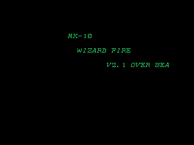

I'm still alive! It's the busy season at work, so between that and working on other projects, I haven't been doing much digital archaeology research. Tonight I spent some time doing just that.

So! Dark Seal 2 (known as Wizard Fire in the west) is a fantasy themed beat-em-up. And apparently it is a variety of debug functions remaining...

<!--more-->

# Game Version

Like with some other Data East acade games, there is a code to display the game version: **hold P1 Start + P2 Start while the game is starting up**.





# Coordinates Debugging

At 0x48D6 is a subroutine that displays the player and camera coordinates during gameplay:


Interestingly, this routine is called during every update in the game loop, but the first command at 0x48D6 is RTS, so it immediately jumps back to its calling routine. In short, it was disabled in the code. But, we can easily get around this by replacing that RTS with a NOP using MAME cheats:

```
  <cheat desc="Enable coordinates">
    <script state="on">
      <action>temp0=maincpu.mw@48d6</action>
      <action>maincpu.mw@48d6=4e71</action>
    </script>
    <script state="off">
      <action>maincpu.mw@48d6=temp0</action>
    </script>
  </cheat>
```

# Pause Game

This is clearly another debug leftover, and it only half works in the final version. Like the debug text above, this function was disabled in the code by an RTS at the beginning of the subroutine, which is at 0x1E0B0. It simply pauses the game and displays some debugging number:


Like the coordinates debug, it is called during the game loop but has an RTS to disable it. The routine itself reads the value from 0xFDCE08 and will enable the pause function if it is set to 1. It will initially enter the pause loop, and then check bit 6 on 0xFDD0A9 to un-pause/pause again. That RAM location mirrors the P2 Button 1/2/Start inputs, however, none of those button combinations ever set bit 6. So it looks like, originally, one of the P2 buttons was supposed to pause the game, but something changed somewhere in the code after the pause function was disabled. We can fix this mess!

```
  <cheat desc="Pause game">
    <comment>P2 Start to pause/un-pause</comment>
    <script state="on">
      <action>temp0=maincpu.mw@1e0b0</action>
      <action>temp1=maincpu.mb@1e0c1</action>
      <action>temp2=maincpu.mb@1e14b</action>
      <action>maincpu.mb@1e0c1=07</action>
      <action>maincpu.mb@1e14b=07</action>
      <action>maincpu.mw@1e0b0=4e71</action>
      <action>maincpu.pb@fdce08=01</action>
    </script>
    <script state="off">
      <action>maincpu.pb@fdce08=00</action>
      <action>maincpu.mw@1e0b0=temp0</action>
      <action>maincpu.mb@1e0c1=temp1</action>
      <action>maincpu.mb@1e14b=temp2</action>
    </script>
  </cheat>
```

First we replace the RTS with a NOP as above, then fix the checks at 0xFDD0A9 to read bit 7 instead of 6. P2 Start sets bit 7, and there you have it.

# Show Hitboxes

So by this point I was just looking searching for consecutive RTS commands to reveal any more disabled routines. Sure enough...


Pretty obvious what this is. This too is called during the game loop (thankfully), and interestingly, it checks for bit 6 to be set at 0xFE4494. This value cannot normally be written to; the MAME source indicates that it's part of the hardware protection device. So I find it pretty odd that it's looking for a value there. But whatever.

Bit 6 is not set there, and since we can't write to it, we'll have to change up the code like above. Bit 7 is set instead, so we'll just patch that in:

```
  <cheat desc="Show hitboxes">
    <script state="on">
      <action>temp0=maincpu.mw@1e5f4</action>
      <action>temp1=maincpu.mb@1e5f9</action>
      <action>maincpu.mw@1e5f4=4e71</action>
      <action>maincpu.mb@1e5f9=07</action>
    </script>
    <script state="off">
      <action>maincpu.mw@1e5f4=temp0</action>
      <action>maincpu.mw@1e5f9=temp1</action>
    </script>
  </cheat>
```

# Unknown Debug Routine

Really not sure about this one. It renders a circle of plus signs around the player, but it doesn't seem to do anything else.


I thought it might have to do with weapon reach at first, but I'm not sure. Anyway, as expected, the actual subroutine at 0x2829E is disabled with an initial RTS. Actually getting to that routine isn't nearly as straightforward as the two above. It's part of a reference table that is called from 0x1CD0A, which pulls from 0xFDD500 to select the table entry. The proper values to activate the routine (10 at 0xFDD501, then 00 at 0xFDD503) don't appear to be set anywhere so.. I dunno.

```
  <cheat desc="Unknown Debug Display">
    <script state="on">
      <action>temp0=maincpu.mw@2829e</action>
      <action>maincpu.mw@2829e=4e71</action>
      <action>maincpu.pb@fdd501=10</action>
      <action>maincpu.pb@fdd503=00</action>
    </script>
    <script state="off">
      <action>maincpu.mw@2829e=temp0</action>
    </script>
  </cheat>
```

# Leftover Strings

There are a couple unreferenced text strings in the game. First we have NAME / CLASS which appears at the top of the screen next to the player portrait:


This does seem pretty unnecessary, so I understand why they removed it. There's also SCREEN:


This may be part of a level select that was removed. In any case, with no references to it, I'm pretty sure whatever used it isn't around anymore, so who knows.

# Complete Level Now

And just for fun, I found that the game keeps track of the level status at 0xFDC100, so here's a quick MAME cheat to automatically complete the level during gameplay:

```
  <cheat desc="Complete this level now!">
    <script state="on">
      <action>maincpu.pb@FDC100=F0</action>
    </script>
  </cheat>
```
