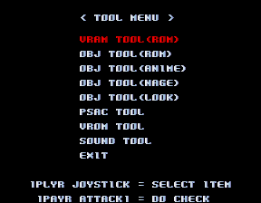
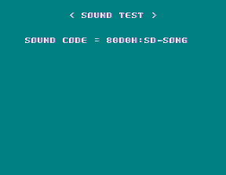

Kyukyoku Sentai Dadandarn, meaning Ultimate Battle Squad Dadandarn and called Monster Maulers in the West, is Konami's homage to/parody of the sentai genre of TV shows, movies and comics. It's a solid game and pretty fun; [Hardcore Gaming 101 has a good review](http://www.hardcoregaming101.net/monster-maulers/). And I got way more than I bargained for when I started taking the game apart: so much more that I'll be making splitting this into two posts. Here we go...

<!--more-->

# Skip Memory Check

First of all, here's a quick code to save you the time of having to fast forward through the stupid long memory check at the beginning of the game:

*Japanese version:*

```
  <cheat desc="Skip memory check">
    <script state="on">
      <action>temp0=maincpu.md@3008</action>
      <action>temp1=maincpu.mw@300c</action>
      <action>maincpu.md@3008=4ef90000</action>
      <action>maincpu.mw@300c=4230</action>
    </script>
    <script state="off">
      <action>maincpu.md@3008=temp0</action>
      <action>maincpu.mw@300c=temp1</action>
    </script>
  </cheat>
```

*European version:*

```
  <cheat desc="Skip memory check">
    <script state="on">
      <action>temp0=maincpu.md@2eec</action>
      <action>temp1=maincpu.mw@2ef0</action>
      <action>maincpu.md@2eec=4ef90000</action>
      <action>maincpu.mw@2ef0=4114</action>
    </script>
    <script state="off">
      <action>maincpu.md@2eec=temp0</action>
      <action>maincpu.mw@2ef0=temp1</action>
    </script>
  </cheat>
```

# Tool Menu




This disabled menu contains a few graphic viewers as well as a sound test, which will probably make some people happy as the game's music seems to be pretty popular. Originally this menu was available on the standard Test Mode menu, as the last option:


However, it's been completely disconnected; only the string remains in the menu list. The code for the menu as well as all of its functionality remains though, and we can access it easily with a MAME cheat. **This cheat will replace the standard Service Mode menu, so press Service (F2 by default in MAME) to see the menu after the cheat is enabled:**

Japanese version:

```
  <cheat desc="Tool Menu">
    <comment>This replaces the standard Service Mode menu</comment>
    <script state="on">
      <action>temp0=maincpu.md@fc0a</action>
      <action>maincpu.md@fc0a=000e0e44</action>
    </script>
    <script state="off">
      <action>maincpu.md@fc0a=temp0</action>
    </script>
  </cheat>
```

European version:

```
  <cheat desc="Tool Menu">
    <comment>This replaces the standard Service Mode menu</comment>
    <script state="on">
      <action>temp0=maincpu.md@faee</action>
      <action>maincpu.md@faee=000e0d28</action>
    </script>
    <script state="off">
      <action>maincpu.md@faee=temp0</action>
    </script>
  </cheat>
```

What we're doing here is replacing the first entry in the test menu pointer table (at 0xFC0A in the JP version, 0xFAEE in the EU version) with the location of the tools menu pointer table (0x0E0E44 JP, 0x0E0D34 EU). So instead of jumping to the initialization of the standard test menu, it jumps to the tools menu instead. No problem!

Now let's explore the Tool Menu. Note that several options are a little bit buggy, especially the graphic viewers, and the game might crash occasionally.

**Note: for all menus pressing P1 and P2 Button 1 at the same time will return to the main menu.**

## VRAM Tool


As you might expect, this option lets you explore the video RAM page by page. P1 Left/Right to scroll through the pages; P1 Button 1 to change the main palette; P1 Button 2 to change the VRAM field; and P1 Start to change the background color. As in all the menus, P1 Button 1 + P2 Button 1 to return to the previous menu.

## Obj Tool (ROM)

And here we have... nothing! A blank screen! It doesn't lock up, as you can see the CPU humming away. P1 Start will cycle the background color, and P1 Button 1 + P2 Button 1 to return to the menu.

## Obj Tool (Anime)


This is a neat little tool that lets you view the animations for all the sprites in the game. There are lots of controls, so I've laid them out in a table:

|Input|Action|
|--- |--- |
|P1 Left/Right|Scroll through ACT (action)|
|P1 Button 1 (Hold)|Play animation; animation will play once then has to be reset (Button 2) unless it is a looping anim|
|P1 Button 1 + Button 3|Play next frame of animation|
|P1 Button 2|Reset to first frame of anim; you can hold Button 1 and tap Button 2 to reset the animation|
|P1 Button 1 + Direction|Move X/Y position of object|
|P1 Button 3 + Up/Down|Scroll through MAN (object)|
|(P1 Button 1 + Button 2)(Hold) + Direction|Flip and mirror the sprite|
|P2 Button 1 (hold) + P2 Button 3|Enable P2 sprite; the above controls will work on the 2P side after enabling|
|P1 Start|Change background color|
|P2 Start|Change stage palette|


## Hitbox mode


Within this object viewer, you can view and edit hitboxes for sprites. Pressing P1 Button 1 + P1 Button 3 (holding the buttons) + P1 Direction will enable Hitbox mode. Hold Button 1 and 3 and press Up/Down or Left/Right to scroll through the hitbox sets.

Pressing P1 Button 1 + Button 2 + Button 3 will enable the hitbox editor (called 'Atari Make' at the top of the screen; 'atari' is Japanese for a hit). In this mode, hold Button 2 and move the Direction to resize the hitbox; Button 3 + Direction changes the X/Y position of the hit box. Button 1 will play the animation like usual, and will reset the hitbox. These controls work for the 2P character if they are enabled in hitbox mode.

You can exit hitbox mode by pressing P2 Button 1 + Button 2 + Button 3.

## Obj Tool (Nage)


Nage is Japanese for throw, and this test does exactly that, as you can view the various throws available to each of the enemies in the game. As you scroll through available sprites, the red NO next to nage will turn to green OK when you are on an enemy that can throw the character. Note that you may have to reposition to the character to get them in to the throw hitbox. Here's a table of the available commands:

|Input|Action|
|--- |--- |
|P1/P2 Up/Down|Change character on 1P or 2P side|
|P1 Left/Right|Change throw ('Nage' counter in the middle of the screen)|
|P1 Button 1 (Hold)|Play animation|
|P1 Button 2 (Hold) + Button 1|Reset animation|
|(P1/P2 Button 2 + Button 3)(Hold) + Direction|Reposition sprite|
|P1 Start|Turn on extra information ('Waku'); also changes background color|
|P2 Start|Switch stage palette|


## Obj (Look)


This mode will simply play all animations for the centaur and robot enemies in a loop. It plays the background music for their respective stages. P1 Start changes the background color, but other than that, uh... enjoy the show?

## PSAC Test


Oh boy another blank screen! Yup, either it's not emulated properly or, more likely, it's broken/had its functionality removed. Not sure what PSAC stands for anyway. P1 Start changes the background color, but that's it.

## VROM Test

Another blank screen, not even any text at the top this time. P1 Start to change background as usual.

## Sound Tool

The default test menu is lacking a sound test, but there's one available here.




Pretty straightforward: P1 Up/Down to scroll through sounds/songs, which will play automatically. P1 Start to change the background color.

In Part 2, I'll be covering the plethora of debug displays that remain in the code. Exciting!

[Part 2 is up here!](/entry/debug-tools-and-more-in-monster-maulers-2)
