[In Part 1](/entry/debug-tools-and-more-in-monster-maulers-1) we took a look at the removed Tool Menu, and now we'll look at the variety of debugging tools left in and a couple mysteries. And then I'll finally be done with this game... for now.

<!--more-->

# Debug mode - Line Display, Level Select, Pause/Slow and more

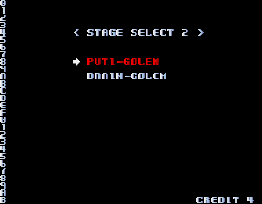

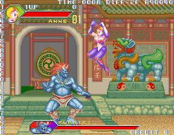

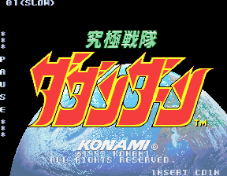

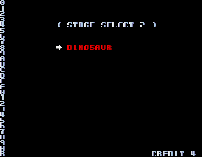


Setting the memory value at 0x60009A will enable the only fully working debug mode that remains in the game. It will constantly display a line count for text on the left side, and in gameplay levels, it will display the time and difficulty in the upper left, as well as a counter that goes up, whose purpose I can't figure out.

Also, after selecting a stage, you will be brought to the Stage Select 2 menu, to choose which enemy to face (although this is pretty pointless for most stages, which only have one enemy).

Finally, this mode enables a game pause and speed modifier. Hold P2 Start and press P1 Start to pause the game. While in this mode, you can hold P1 Start and press P1 Button 1 to slow the game, or P1 Button 2 to speed it up. Holding P2 Start and hitting P1 Start unpauses the game and continues play with the speed you set.

# Game Stats 1

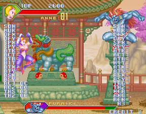


Here we have a list of variables, but most of them are blank. In fact, only the four in the lower left are updated. This particular debug info is only available in the China (Furaiki) stage (it will also show up in the China stage during the opening demo). This is enabled by setting 0x60009B in memory:

```
  <cheat desc="Game Stats 1A">
    <script state="run">
      <action>maincpu.pb@60009b=01</action>
    </script>
    <comment>Only works in the China stage</comment>
  </cheat>
```

We can guess that, originally, all of the values were updated in an older version.... and actually, I found the original routine that displays all the values:

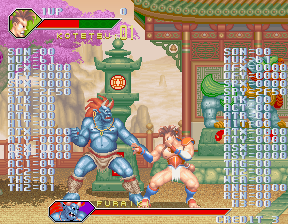


This routine is located at 0x16512, if you want to try calling it yourself while this mode is enabled. It looks as though this routine is meant to be called in the game loop, along with the function that updates the four values in the lower left but, for whatever reason, was removed. We could re-add this functionality by adding in a subroutine jump, but we could only do this by having it jump to some unused data area near the end of the ROM and rewriting a bit of it there, but this is too big to do for a MAME cheat (there are only 10 temp variables) and really not worth the effort of making a patch, IMO...

However, there is a function called in the gameplay loop of the Brazil/Kenya/Norway stages that I was able to hijack without many side effects. I've used this function to 're-enable' several of the debug displays, as you'll see later in this post. We can change that address that normally references this routine to call to our unused debug function:

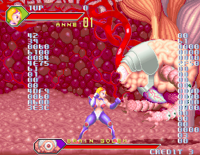


So about those side effects... Well, the function we hijacked is the one that makes the choices for the enemy attacks. As such, the enemy will just sit there waving his arms and moving around, never attacking (until you hit it enough that it does its 'limit break' counter attack; that appears to be handled in a different part of the code). It's not a perfect method, but it does update the debug values in the gameplay loop, so we can at least see it update as we play.

These values in particular seem to show part of the enemy's action process: it will change as you get closer to the enemy. It would probably change even more if we hadn't hijacked the function to make the enemy attack... Note that the lower four values are not updated, giving further evidence that this is meant to be used in tandem with the other function above.

Here's the MAME cheat:

```
  <cheat desc="Game Stats 1B">
    <script state="on">
      <action>temp0=maincpu.md@3aa2a</action>
      <action>maincpu.md@3aa2a=00016512</action>
    </script>
    <script state="run">
      <action>maincpu.pb@60009b=01</action>
    </script>
    <script state="off">
      <action>maincpu.md@3aa2a=temp0</action>
    </script>
    <comment>Only works in Brazil/Norway/Kenya; will disable enemy attacks</comment>
  </cheat>
```

# Game Stats 2

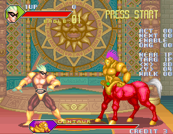


Like the one before it, this debug display only works in one level, Iraq (Centaur) in this case. This displays variables relating to the enemy of the stage. It will display which player the enemy is near, which it is targeting, if it's walking, which action it's executing, etc. It will also allow you choose the action to perform with P2 controls: P2 Left/Right scrolls the 'NEXT' display by the least digit, and P2 Up/Down by the higher digit. P2 Button 1 will then cause the enemy to perform that action. P2 Button 3 always causes him to do his kick. P2 Start will bring in a Player 2, as it normally does in the game, but note that the 2P controls will be shared between the enemy and the actual Player 2.

This debug text is enabled just by setting 0x600276; however, there's a small bit of code at 0x08568A that constantly sets that location to 0 in the game loop. It's interesting that this was hard-coded to be disabled, but we can fix that with a MAME cheat:

```
  <cheat desc="Game Stats 2">
    <script state="on">
      <action>temp0=maincpu.mq@8568a</action>
      <action>maincpu.mq@8568a=4e714e714e714e71</action>
    </script>
    <script state="run">
      <action>maincpu.pb@600275=01</action>
    </script>
    <script state="off">
      <action>maincpu.mq@8568a=temp0</action>
    </script>
    <comment>Only works in the Iraq stage</comment>
  </cheat>
```

# Game Stats 3

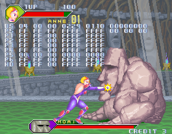


Yup, more gameplay stats. The routine to display this text is at 0x027A1C, although no references to it remain. I'm assuming it was meant to be called in the gameplay loop, so I used the hijacked subroutine I talked about above to make it 'work.' And there we have it. It updates some values related to the enemy, but what exactly, I can't tell.

There's something interesting I noticed about this though. Remember above I said that the routine I hijacked chose the enemy attacks? Well, when we reference this routine instead, the enemy does indeed attack! But it seems different, almost more 'basic.' For example, if you fight the Brain Golem, he'll mostly just shoot the laser ball at you till he hits the edge of the screen, then charges. Perhaps, after updating the text, it branches to some older enemy attack code? If someone really cares enough, we could trace the disassembly further and find out... but I'm not that person. Here's the MAME cheat to 'enable' it:

```
  <cheat desc="Game Stats 3">
    <script state="on">
      <action>temp0=maincpu.md@3aa2a</action>
      <action>maincpu.md@3aa2a=00027a1c</action>
    </script>
    <script state="off">
      <action>maincpu.md@3aa2a=temp0</action>
    </script>
    <comment>Only works in Brazil/Norway/Kenya; enables an alternate enemy attack pattern</comment>
  </cheat>
```

# Game Stats 4

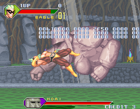


OH BOY ANOTHER DEBUG DISPLAY SO EXCITE! I have a feeling this one is broken, or from an older version. When put in the hijacked game loop, it rarely updates, and when it does it seems to go to all FF's. I get the feeling it's reading from some memory location that has nothing to do with anything anymore. There's really nothing exciting here, but here's the MAME cheat anyway:

```
  <cheat desc="Game Stats 4">
    <script state="on">
      <action>temp0=maincpu.md@3aa2a</action>
      <action>maincpu.md@3aa2a=00016852</action>
    </script>
    <script state="off">
      <action>maincpu.md@3aa2a=temp0</action>
    </script>
    <comment>Only works in Norway/Kenya; will disable enemy atttacks</comment>
  </cheat>
```

# Input Display

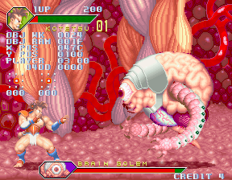

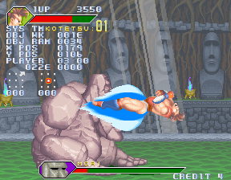


This one is a little bit interesting at least, and actually deals with the player instead of the enemy. It's a simple display that shows the current player input as well as the sprite's location and memory location. The routine to display it is located at 0x4E00. It's meant to be called in the gameplay loop, as the other displays above, so we can bring out our trusty hijacked routine from the Kenya/Norway/Brazil stages to enable it. Here's the MAME cheat:

```
  <cheat desc="Input Display">
    <script state="on">
      <action>temp0=maincpu.mw@3aa2c</action>
      <action>maincpu.mw@3aa2c=4e00</action>
    </script>
    <script state="off">
      <action>maincpu.mw@3aa2c=temp0</action>
    </script>
    <comment>Only works in Brazil/Norway/Kenya; will disable enemy attacks</comment>
  </cheat>
```

# Unused 'To Be Continued' display and other unused strings

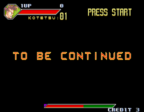


The routine at 0xB1D6 will display this TO BE CONTINUED text which, as far as I can tell, is not used in the final version. In fact, there's a whole mess of strings starting at 0x2140 (table at 0x208C), most of which are probably no longer used. Some of them appear in the debug displays we've already discussed, but others are clearly part of debug displays I haven't found yet. For example, at 0x2384:

```
2P STATUS
     //
   ACT
   THINK2
   THINK3
   THINK4
```

At 0x21CC:

```
  GAME INIT   
PLAYER SELECT 
  MAP SELECT  
MAP SELECT (R)
```

There's also a 1P WIN, 2P WIN and DROW (obviously supposed to be DRAW), hinting that there was once two player versus mode at least planned. I'm quite sure there's more to be dug out of this game, but I need a break from this game. If I hear that theme song one more time... ugh...

But before I give up for now, let's take a look at one last mystery that really confuses me...

# Japanese Names Mystery

Starting at 0xA630 (with a table at 0xA54C) is a list of 29 Japanese family names:

```
   HAYANO:
  KYOMASU:
    SENDA:
     NOSE:
   KANIWA:
   BOUIKE:
    MIZOO:
   KONDOU:
    SATOU:
MATSUMOTO:
   NOJIRI:
   FUJITA:
    SATOU:
   MIYATA:
    SAKOI:
SHIMAMURA:
 YOSHIOKA:
 NAKAGAWA:
 HAMAGAKI:
 MORIKAWA:
TAKAHASHI:
  SHIRASU:
   TANAKA:
  MATSUDA:
 HORIKAWA:
 HANASAKI:
   TERADA:
     WADA:
 NAKAMURA:
```

The strings are referenced, actually, in the routine at 0xA476. There it will check if the variable at 0x60000E is set; if so, it will switch this alternate set of names:

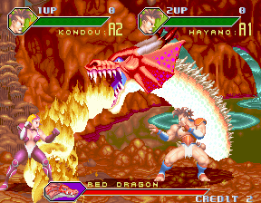


Which name is displayed is set at 0x601880 for P1 and 0x601881 for P2. The value at these locations can be set from 1 to 8, for the first 8 names in the list above. Anything above that just loops back around. So that means the other 21 names in the list aren't even accessible!

It also changes the lives counter to A2 and A1, and the players are no longer controllable or damaged. In fact, outside of a level, setting 0x60000E seems to interrupt the game loop, and will stop 'processing'. That location is checked several times in the code, but is never set anywhere. What this whole naming thing is supposed to be is a complete, weird mystery...

I'm not going to bother with a MAME cheat for this; it can be set very easily at the locations I've listed.

That's it for Kyukyoku Sentai Dadandarn. I actually have a short backlog of games to post about, but I really wanted to get this beast out of the way before moving on. And man am I happy it's over...
