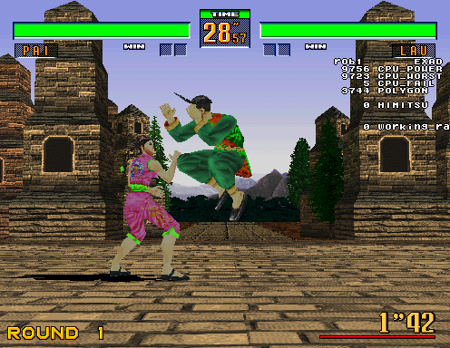
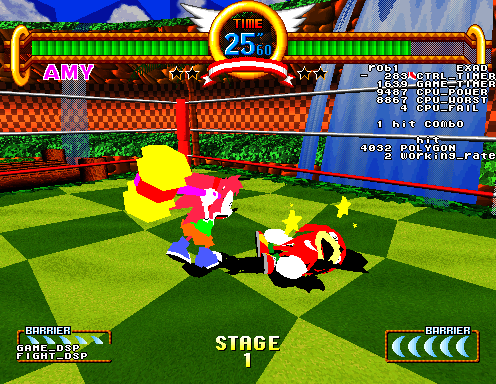

Looks like I can finally cross "discovered a previously unknown debug code in a Sonic game" off my bucket list.

<!--more-->

Just over a year ago, we posted [an article about an extensive set of debug menus](/entry/debug-tools-in-virtua-fighter-2-fighting-vipers-and-sonic-the-fighters) inside of Virtua Fighter 2, Fighting Vipers and Sonic the Fighters. At the time, it was a bit of a quickie article. I felt what was found was important and needed to be published, but I ultimately had more interest in other projects at the time and didn't give the code the closer look it needed.

Someone who *was* interested in that project was [biggestsonicfan](https://twitter.com/biggestsonicfan). Unbeknowest to me, he had already been working on hacking out the debug tools in Sonic the Fighters [for quite some time](https://forums.sonicretro.org/index.php?threads/sonic-fighters-hacking.30359/) before I happened to stumble on to them via Virtua Fighter 2. After the article was posted, he contacted me for some assistance and over the next year we poked at the code, discovering bits and pieces. As biggestsonicfan owns the actual hardware, he was able to confirm things that I could not. Our goal was to find the proper way to enable the debug menus as well as some other debugging tools that had been found along the way. Not wanting this to drag into the next year (which is going to be even more busy!), I gathered all our notes so far and made one final concentrated push to solve the mystery. And solve it we did.

Let's start with the technical aspects and work our way to the solution.

# Sega Model 2 & MAME

Not long after the original debug menu was discovered, we also found a routine that displays a debugging monitor on the right side of the screen:





We tracked it down to some code that reads from IO port ranges outside of what was mapped for P1/P2 controls for the conditions to display the text.

All signs pointed to it being a set of DIP switches. But this was confusing, as the MAME driver did not have DIP switch hardware defined for the mainboard of most games. In fact, only Zero Gunner has any defined. 

At first I thought it was something left over from running on dev hardware, something no longer present in the final version. Yet every Model 2 PCB picture I found showed a DIP switch array in one place or another depending on the hardware revision. Indeed, @biggestsonicfan confirmed that his Sonic the Fighters board does have switches present.

It seems the DIPs do not normally have any effect on the game: all configuration is done by software through the test menu. So in a way, the debug switches *actually are* remnants of dev hardware. Zero Gunner, the only game with mainboard DIPs defined in the driver, helps confirm this: switch 1 will add debug tools like art viewers and level select to the test menu when enabled.

That configuration doesn't match with the MAME mission, though, which is to accurately document hardware by code. Even if the DIPs don't have an obvious effect on the game, if they are present on the board, they should be described in the MAME driver. As such, I've opened a PR to mamedev to do just that. I imagine it will be merged without much issue, and I'll update this article when that happens.

** UPDATE:**  The PR was accepted and merged into MAME 0.217, so all Model 2 games now have the DIP switches available!

But all that aside, as biggestsonicfan confirmed with his actual hardware, the DIPs don't seem to do anything anyway. So what does adding them to the MAME driver matter?

# DIP switches

Despite having no obvious effect, the code to enable the debugging monitor was clearly checking if a switch was set. With more digging, we found the problem lies within the routine that copies the hardware IO values to RAM locations used by the rest of the game. In Sonic the Fighters, this is located at 0x17CC:

<pre class="pdasm pdasm-arch-i960">
mirrorDips:
000017CC: lda     r4,0x1c00000{IO_PORTS}
000017D4: mov     r5,0x1
000017D8: stos    r5,0x40(r4)
000017DC: ld      r6,0x500700
000017E4: st      r6,0x50070c
000017EC: lda     r11,0x1c00000
000017F4: ldob    r4,0xc(r11) ; 0xC of IO_PORTS is port G of the Sega 315-5649, which maps to the hardware DIPs
000017F8: not     r4,0x0,r4
000017FC: mov     r3,0x8 ; r3 will be used as a bitmask; set to 0x8 by default
00001800: ld      r15,0x508000{debugFlags}
00001808: bbc     14,r15,0x1810 ; skip down if bit 14 of the debug flags is not set
0000180C: lda     r3,0xff ; but if it IS set, change the mask to 0xFF
00001810: and     r4,r4,r3 ; apply the mask to the hardware DIP values...
00001814: ld      r3,0x500710{dipSwMirr}
0000181C: st      r3,0x500714{readAllDipsFlag}
00001824: st      r4,0x500710{dipSwMirr}
</pre>

Of particular interest to are the four instructions starting at 0x17FC. R3 is used as a bitmask on R4, which holds the data read from the DIP switches. By default, the mask is 8, which blocks all values except bit 3 (DIP switch 4). However, if bit 14 of the debug flags is set, the bitmask changes to 0xFF, allowing all values to pass through. In short, all DIP switches are filtered by the code (except for switch 4) unless one of the debug flags is set.

So we now know why the switches do not normally do anything. That's one half of the key. The other half is determining how bit 14 on the debug flags gets set. As it turns out, *it is set by an input code*, the program code for which is actually located in the very next subroutine after the IO copy function.

This is great news for those who own the hardware, as this means the full set of debug tools is available without any code hacks. biggestsonicfan tested it right away on his hardware and confirmed it worked without any issues!

# Input Codes & Usage

So without further ado, here are the input codes to enable debug mode. The code is the same for Fighting Vipers and Sonic the Fighters, but is different for VF2. To use them, ** hold the Service 1 switch (mapped to 9 in MAME) and enter these inputs on the Player 1 controls:** 

**Virtua Fighter 2** 

```
LEFT B1 B2 RIGHT RIGHT DOWN B1 UP B2 B2
```

**Fighting Vipers/Sonic the Fighters** 

```
RIGHT RIGHT B1 LEFT RIGHT B1 B2 RIGHT RIGHT UP B1
```

There is no notification that the code was successful. The best way to be sure it worked is to leave DIP switch 1 turned on, which will display debugging text in the upper right. The text will appear as soon as the code is correctly entered.

If you don't feel like hassling with a code, you can use a MAME cheat to enable DIPs immediately on any of the games:

```
  <cheat desc="Enable all DIP switches">
    <script state="on">
      <action>maincpu.pd@508000=(maincpu.pd@508000 | 0x4000)</action>
    </script>
  </cheat>
```

As previously mentioned, DIP switch 1 enables the debug monitor text. Setting switch 7 will disable the 2D graphics planes. And the switches in between seem to do something as well, but this hasn't been fully worked out yet.

Most importantly (in my opinion), you can also **press P2 Start + P2 Button 3 simultaneously to access the debug menu** . [Check out the previous article](/entry/debug-tools-in-virtua-fighter-2-fighting-vipers-and-sonic-the-fighters) for more details on what you can find inside it.

If you're planning on running this in MAME, please keep in mind that there are some plenty of issues with the Model 2 driver, and MAME will crash when using the debug menu. There is a set of cheats in the previous article that patch out the problematic opcode; these will still be necessary to use to prevent a MAME blowup.

# Unused content

biggestsonicfan quickly started using this newfound power on his hardware and used the tools running at full speed to quickly find some unused content in Sonic the Fighters:


Looks to be an old title screen (kanji reads 仮 *temporary*).


Ending screens from preview versions.

Now it's time for the Virtua Fighter 2 and Fighting Vipers experts to dig in with the code and see what they can find!
