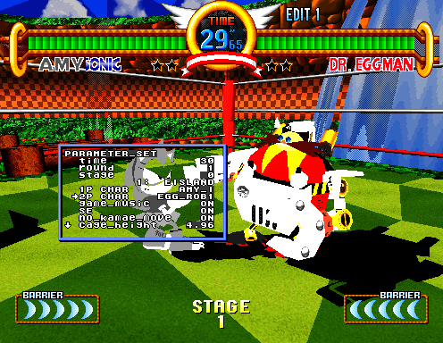

In the beginning, there was Virtua Fighter 2. And Suzuki Yu looked upon the game and saw that it was good. Thus were Fighting Vipers and Sonic the Fighters developed upon its game engine. And, lo, there dwelt within the code of each a bounty of debug tools!

<!--more-->





Virtua Fighter 2 was developed for the Sega Model 2 hardware, with Fighting Vipers and Sonic the Fighters subsequently using its gameplay engine. This engine has a set of thorough and beautifully implemented debugging tools which remain in the code of all three games.

# UPDATE

The tl;dr of this original post was that we found debug stuff, but didn't know the correct way to access it. We did later find the proper way to do so, and it's with an input code of all things! Please [see the newer article in conjunction with this one](/entry/debug-tools-in-virtua-fighter-2-fighting-vipers-and-sonic-the-fighters-part-2).

# Usage

When enabled, the gameplay will be paused, though environmental effects like hair moving and lightning will still animate. In this paused mode, pressing P1 Start will advance by one frame.

Holding P2 Start will show the debug menu. Pressing P1 Up/Down while P2 Start is held will scroll through the options, while pressing P1 Start will select the option. P1 Button 1 (Punch) will decrease values; P1 Button 2 (Kick) will increase values; holding P1 Button 3 (Guard) while holding either B1 or B2 will decrease/increase the value quickly. Holding P1 B3 also works for the joystick to move the cursor through menus quickly.

Note that the default option is Exit. The game will return to it's normal running mode when this is chosen, with any settings you made in debug still in effect. You will need to reactivate the cheat if you'd like to use the debugger again.

The debug options appear as windows on the screen. You can open multiple windows at the same time. P2 Button 1 (Punch) will cycle through the windows (the one highlighted in blue is active). Holding P2 B1 and pressing the P1 joystick will move the active window arouns the screen. P2 Button 2 (Kick) will refresh the current window in case its graphics get screwed up, which happens often if you move the window around. P2 Button 3 (Guard) will close the active window. 

Note that cycling through windows with P2 B1 will also cycle through control of the actual player. With no active windows (all windows have a white border), you have control of the player. Holding an action (such as punch or kick) and pressing P1 Start to advance to the next frame will queue that action up in game.

# Technical

The dword value at 0x508000 is the debug flags variable for the engine. Bit 2 enables the debug menu. Bit 4 pauses gameplay, with things like environment effects still running; when debug is enabled, this bit is constantly set. Bit 12 is a different kind of pause, which disabled all movement, including environmental effects. There some other bits in the lower half of this dword that seem to be used by the code as well, but I have not yet fully explored what effect these have. For now, I'm just publishing the debug menu.

If you've read this blog for a while, you're probably well aware that I use MAME for my work. You're probably also well aware that Sega Model 2 support in MAME is ... not great. So while I'm going to provide a MAME cheat here, the good news is that it's so simple that I'm sure someone will convert it to an equivalent cheat format for other emulators very soon.

UPDATE: Again, [please see the newer article with a better way to access the debug tools than this cheat](/entry/debug-tools-in-virtua-fighter-2-fighting-vipers-and-sonic-the-fighters-part-2).

```
  <cheat desc="Start debug mode">
    <comment>Hold P2 start to show menu, P1 start to select option</comment>
    <script state="on">
      <action>maincpu.pd@508000=(maincpu.pd@508000 | 4)</action>
    </script>
  </cheat >
```

This should work with any version or region of Virtua Fighter 2, Fighting Vipers or Sonic the Fighters.

Now, if you use MAME like I do, you'll quickly find that the whole emulator will crash when choosing pretty much any option in the menu. The reason for this seems to be the lack of full support for the SYNMOVQ opcode. We can get around this by patching out these opcodes with branches to the next instruction. (I couldn't find a NOP equivalent opcode in the manual, so a branch is the next best thing I could think of. I admit I'm not familiar with this CPU, or with Intel architecture for that matter.)

This is, unfortunately, where things get messy. Each game and each version will need their own individual hack to hop over these not-fully-supported commands. This isn't particularly difficult as much as it is time consuming. So I've written cheats for only one version of each game:

**Virtua Fighter 2 (Revision A)**

```
  <cheat desc="Debug mode hack">
    <comment>Works around broken MAME emulation</comment>
    <script state="on">
      <action>temp0=maincpu.md@4e894</action>
      <action>maincpu.md@4e894=08000004</action>
      <action>temp1=maincpu.md@4ea60</action>
      <action>maincpu.md@4ea60=08000004</action>
      <action>temp2=maincpu.md@4e640</action>
      <action>maincpu.md@4e640=08000004</action>
      <action>temp3=maincpu.md@4e778</action>
      <action>maincpu.md@4e778=08000004</action>
      <action>temp4=maincpu.md@4e6cc</action>
      <action>maincpu.md@4e6cc=08000004</action>
      <action>temp5=maincpu.md@4e81c</action>
      <action>maincpu.md@4e81c=08000004</action>
      <action>temp6=maincpu.md@4f354</action>
      <action>maincpu.md@4f354=08000004</action>
    </script>
    <script state="off">
      <action>maincpu.md@4e894=temp0</action>
      <action>maincpu.md@4ea60=temp1</action>
      <action>maincpu.md@4e640=temp2</action>
      <action>maincpu.md@4e778=temp3</action>
      <action>maincpu.md@4e6cc=temp4</action>
      <action>maincpu.md@4e81c=temp5</action>
      <action>maincpu.md@4f354=temp6</action>
    </script>
  </cheat>
```

**Fighting Vipers (Revision B)**

```
  <cheat desc="Debug mode hack">
    <comment>Works around broken MAME emulation</comment>
    <script state="on">
      <action>temp0=maincpu.md@4f81c</action>
      <action>maincpu.md@4f81c=08000004</action>
      <action>temp1=maincpu.md@4f9e8</action>
      <action>maincpu.md@4f9e8=08000004</action>
      <action>temp2=maincpu.md@4f5c8</action>
      <action>maincpu.md@4f5c8=08000004</action>
      <action>temp3=maincpu.md@4f654</action>
      <action>maincpu.md@4f654=08000004</action>
      <action>temp4=maincpu.md@4f7a4</action>
      <action>maincpu.md@4f7a4=08000004</action>
      <action>temp5=maincpu.md@4f700</action>
      <action>maincpu.md@4f700=08000004</action>
      <action>temp6=maincpu.md@502dc</action>
      <action>maincpu.md@502dc=08000004</action>
    </script>
    <script state="off">
      <action>maincpu.md@4f81c=temp0</action>
      <action>maincpu.md@4f9e8=temp1</action>
      <action>maincpu.md@4f5c8=temp2</action>
      <action>maincpu.md@4f654=temp3</action>
      <action>maincpu.md@4f7a4=temp4</action>
      <action>maincpu.md@4f700=temp5</action>
      <action>maincpu.md@502dc=temp6</action>
    </script>
  </cheat >
```

**Sonic the Fighters (Japan)**

```
  <cheat desc="Debug mode hack">
    <comment>Works around broken MAME emulation</comment>
    <script state="on">
      <action>temp0=maincpu.md@4e894</action>
      <action>maincpu.md@4e894=08000004</action>
      <action>temp1=maincpu.md@4ea60</action>
      <action>maincpu.md@4ea60=08000004</action>
      <action>temp2=maincpu.md@4e640</action>
      <action>maincpu.md@4e640=08000004</action>
      <action>temp3=maincpu.md@4e778</action>
      <action>maincpu.md@4e778=08000004</action>
      <action>temp4=maincpu.md@4e6cc</action>
      <action>maincpu.md@4e6cc=08000004</action>
      <action>temp5=maincpu.md@4e81c</action>
      <action>maincpu.md@4e81c=08000004</action>
      <action>temp6=maincpu.md@4f354</action>
      <action>maincpu.md@4f354=08000004</action>
    </script>
    <script state="off">
      <action>maincpu.md@4e894=temp0</action>
      <action>maincpu.md@4ea60=temp1</action>
      <action>maincpu.md@4e640=temp2</action>
      <action>maincpu.md@4e778=temp3</action>
      <action>maincpu.md@4e6cc=temp4</action>
      <action>maincpu.md@4e81c=temp5</action>
      <action>maincpu.md@4f354=temp6</action>
    </script>
  </cheat >
```

If there's a need for a specific version, let me known on Twitter and I can write it up. Hopefully these cheats won't be necessary after some time anyway, as MAME improves.

# Menu Options

Each game's list of options is slightly different, but here are a few that are particularly interesting that appear in each:

## PARAMETER_SET


As the name implies, there are some basic game parameters that can be set here. Perhaps the most interesting are setting the player characters in real time. Also interesting is changing the stage, which is loaded immediately. The round number of length of time for each match can also be set.

## CAMERA


This option is, once again, plainly named: it allows you to move the camera all over the place. It is somewhat unique in that instead of moving the cursor to the camera attributes in the menu, each option is mapped to one of the inputs. P1 Joystick, P2 Joystick, P1 Buttons 1 to 3 and P2 Button 2 all move the camera in various ways.

## POLYGON_TEST


This option cycles through the polygons in the game. Note that you will see the individual objects, such as arms and chests, instead of any fully assembled characters.

As a final note, I would be remiss if I didn't point out that this debug menu was already known about in Sonic the Fighters through the hacking work of biggestsonicfan and others in the Sonic hacking scene over at [Sonic Retro](http://sonicretro.org/) and other sites before it. He had been working on this game for years before I started disassembling VF2 and found the leftover code seperately.

And there we have it! I hope the people who are more specialized in each of these games can take this and run with it and find lots of unused or otherwise weird content.
