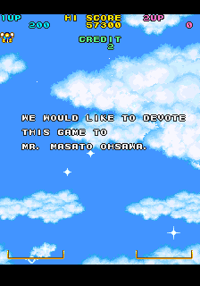
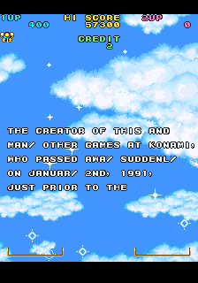
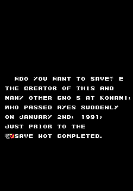

Just a small article this time. I came across an intriguing line of text as I was taking apart Detana! Twin Bee (arcade version) recently. Though part of the message shows up normally at the end of the game, it turns out there's more to the story...

<!--more-->

At the end of the credits, there is a short sentence dedicating the game to the director, Oosawa Masato, who apparently died before the game was released. This text is located at 0x273AA, among the rest of the game's text.

However, it looks like the original message was meant to be longer:





The first screenshot is the usual dedication that displays after the credits, and the second is the unused text, which appears to be incomplete. It's also not referenced in the string table, making it orphaned data.

The text data for it begins at 0x273EA (or 0x271B6 in the World version). The game uses a slightly modified ASCII encoding, where the @ symbol represents a space, a / represents a line break, and ? represents end of string. As such, the string is 'broken' as far as the game is concerned as there is no ? (0x3F) at the end to terminate the string. In other words, it would start reading into the next string, giving us a mess like this, from my first attempt:



Each line of text is prefixed by a word-length value that indicates the X-Y position of the text. After the final line of text ("JUST PRIOR TO THE"), there's an X-Y value, but no more text. Aside from the fact that the sentence reads like it was meant to go on, this confirms that there was more text after. Here's what the data looks like when structured:

```
ROM:0002739A str36:          textPos &lt;$B, $3A&gt;
ROM:0002739C                 dc.b 'SAVE@COMPLETE?'
ROM:000273AA str37:          textPos &lt;$D, $20&gt;
ROM:000273AC                 dc.b 'WE@WOULD@LIKE@TO@DEVOTE/'
ROM:000273C4                 textPos &lt;$D, $24&gt;
ROM:000273C6                 dc.b 'THIS@GAME@TO@/'
ROM:000273D4                 textPos &lt;$D, $28&gt;
ROM:000273D6                 dc.b 'MR^@MASATO@OHSAWA^@?'
ROM:000273EA                 textPos &lt;$E, $24&gt;       ; unused string
ROM:000273EC                 dc.b 'THE@CREATOR@OF@THIS@AND/'
ROM:00027404                 textPos &lt;$E, $28&gt;
ROM:00027406                 dc.b 'MANY@OTHER@GAMES@AT@KONAMI_/'
ROM:00027422                 textPos &lt;$E, $2C&gt;
ROM:00027424                 dc.b 'WHO@PASSED@AWAY@SUDDENLY@/'
ROM:0002743E                 textPos &lt;$E, $30&gt;
ROM:00027440                 dc.b 'ON@JANUARY@2ND_@1991_/'
ROM:00027456                 textPos &lt;$E, $34&gt;
ROM:00027458                 dc.b 'JUST@PRIOR@TO@THE/'
ROM:0002746A                 textPos &lt;$E, $38&gt;
ROM:0002746C str38:          textPos &lt;$C, $9C&gt;
ROM:0002746E                 dc.b 'SAVE@NOT@COMPLETED^/'
ROM:00027482                 textPos &lt;$C, $A0&gt;
ROM:00027484                 dc.b 'DO@YOU@WANT@TO@SAVE]@/'
ROM:0002749A                 textPos &lt;8, $28&gt;
ROM:0002749C                 dc.b 'NO@/'
ROM:000274A0                 textPos &lt;8, $2C&gt;
ROM:000274A2                 dc.b 'YES?'
```

But... 'JUST PRIOR TO' what? Considering the arcade game was released on February 20, 1991 (per the [Wiki page](https://ja.wikipedia.org/wiki/%E5%87%BA%E3%81%9F%E3%81%AA!!%E3%83%84%E3%82%A4%E3%83%B3%E3%83%93%E3%83%BC)), I'd guess it was 'just prior to the release of the game.'

I think this was originally meant to appear as one long blob of text instead of split across two screens, for a couple reasons. First, the unused text would be a sentence fragment if it didn't connect to the first. You could argue that older Japanese games have a history of less-than-stellar translations, but in this case, the English is quite good, especially for a rather complex sentence. Second, the unused text position is rather low on the screen. This makes sense if there was text above it. If that was the case, and considering there was more intended to be written after, it would have filled almost the entire screen with text. The devs probably thought this was a bit much, chopped the message down, and repositioned it.

I couldn't find much information on Ohsawa Masato; in fact I found practically nothing. The [Wikipedia article for the game](ttps://ja.wikipedia.org/wiki/%E5%87%BA%E3%81%9F%E3%81%AA!!%E3%83%84%E3%82%A4%E3%83%B3%E3%83%93%E3%83%BC) doesn't even have his name kanji. He [worked on Jackal](https://tcrf.net/Top_Gunner), but I couldn't find any more complete lists. Maybe his name will show up in more hidden credits or easter eggs; I'll be keeping an eye out for it in the future.
