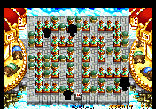

It's been a while, hasn't it? Some major events have happened in my life, namely planning a trip to Japan later this year and finally returning to college, which have stolen much of my attention. But I still enjoy disassembling and researching old software, and there's still a backlog of content to finish writing and post, so the site is definitely not dead!

And speaking of backlogs, a few months back my friend AJ on twitter asked that I take a look at Neo Bomberman for the NeoGeo after spotting some suspicious text strings. I started the initial disassembly right away, but didn't give it a serious examination until recently...

<!--more-->

# Debugging Monitor


The first thing we have is a memory viewer, labeled as 'DEBUGGING MONITOR Ver 1.00' and using a terrible palette choice. It is fully functional, though there's not a whole lot going on here: it simply displays the contents of RAM in 0x20 sized blocks starting at 0x100000. You can toggle the display with P2 Button 4, and cycle the address up with P2 Button 2 and down with P2 Button 3. Here's the MAME cheat to enable it:

```
  <cheat desc="Display Debug Monitor">
    <comment>P2 Button 4 to activate; cycle address with P2 Button 2 and 3</comment>
    <script state="on">
      <action>temp9=maincpu.md@9f6</action>
      <action>maincpu.md@9f6=000002e6</action>
      <action>temp0=maincpu.md@02e6</action>
      <action>temp1=maincpu.md@02ea</action>
      <action>temp2=maincpu.md@02ee</action>
      <action>temp3=maincpu.mw@02f2</action>
      <action>maincpu.md@02e6=4eb90003</action>
      <action>maincpu.md@02ea=a6ea4eb9</action>
      <action>maincpu.md@02ee=00000b5a</action>
      <action>maincpu.mw@02f2=4e75</action>
    </script>
    <script state="off">
      <action>maincpu.md@9f6=temp9</action>
      <action>maincpu.md@02e6=temp0</action>
      <action>maincpu.md@02ea=temp1</action>
      <action>maincpu.md@02ee=temp2</action>
      <action>maincpu.mw@02f2=temp3</action>
    </script>
  </cheat>
```

# Debugging Monitor - (Entitrely Too Much) Technical Detail

The code for the debugging monitor begins at 0x0B5A. There are no direct or indirect references to this address anywhere in the code, making it completely orphaned. So how do we figure out where it was originally called from? How can we go about re-implementing it?

While not always accurate, something we can take into account is the other code surrounding it. Is the code around it relevant or important somehow? In this case, yes.

Let's diverge for a minute and quickly examine program flow in Neo Bomberman. The game uses a very interesting sort of call 'stack' architecture, which each frame containing a pointer to a subroutine, a pointer to the next frame to load, an attribute byte and data for the subroutine. Each frame is 0x80 bytes in length, and starts at the beginning of the NeoGeo work RAM at 0x100000. There is a very basic loop at 0x0E4A which processes each frame: jump to the subroutine code, point to the next frame, and restart the loop. While there is some greater detail to this—the subroutine pointer is not static for a frame and can be changed, and the jump to the subroutine code can be skipped altogether, among other things—it gets too technical for what we're interested in and, frankly, I haven't fully examined all the tiny details of the system.

I use the term 'stack' loosely, as the frames are not stored in a traditional last-in, first-out style. Instead, the first three frames make up the main gameplay loop, while every thing after it is used for game state and changes as the program runs. Frames 1 and 3 are static, with 1 always pointing to 2, and 3 always pointing back to 1. The subroutines they reference do not change: Frame 1 jumps to 0x09EE (for normal gameplay) or 0x0AC8 (when the game is paused, used only in AES mode) while Frame 3 jumps to 0x0D22.

Frame 2 is unique. While it can point to Frame 3, and does very early in the run, most of the time it points to the frames past number 3. There can be any number of these game state frames, which jump around but always eventually end up pointing back to Frame 3. This is easier to understand with some crude visualization:

```
    +-------------------+
.-> | 0x100000: Frame 1 |
|   +-------------------+
|               |
|               V
|   +------------------+
|   | 0x100080: Frame 2 |---.
|   +-------------------+   |
|                           |
|   +-------------------+   |
+---| 0x100100: Frame 3 |   |
    +-------------------+   |
               / \          |
                |           |
                |           |
                .           .
                .           .
           [--- Other Frames ---]
```

This is the basis for the program flow through the game, with the subroutines in Frame 1 (0x09EE or 0x0AC8) and Frame 3 (0x0D22) always called in every iteration. What does all this have to do with the debug monitor? Honestly, not a whole lot, but I did spend a lot of time tracking down how the program flow works and wanted to write about it. Someone may find it useful. :)

But with the idea of 0x09EE/0x0AC8 and 0x0D22 being called on every loop, let's return to the Debug Monitor and look at its address in relation to these core subroutines:

<table>
	<tbody>
		<tr>
			<td>0x09EE - Render graphics (normal gameplay)</td>
		</tr>
		<tr>
			<td>0x0AC8 - Render graphics (paused game)</td>
		</tr>
		<tr>
			<td>0x0B5A - Debugging monitor</td>
		</tr>
		<tr>
			<td>0x0C42 - Debug monitor x/y text pos values</td>
		</tr>
		<tr>
			<td>0x0C82 - Pause screen strings</td>
		</tr>
		<tr>
			<td>0x0CFA - Debugging monitor strings</td>
		</tr>
		<tr>
			<td>0x0D22 - Loop cleanup</td>
		</tr>
	</tbody>
</table>

It's interesting that the code for the Debug Monitor is sandwiched between these constantly called subroutines. It's also interesting that the debug text strings come after the pause text strings. While I wouldn't count this as hard evidence, I call it coincidental enough to conclude that the Debug Monitor was meant to be called during the main game loop, specifically during the render subroutines. The code for the monitor lends itself to this: like similar RAM viewers I've seen in other games, it is meant to be called continually to work properly, checking button state and updating the screen once per call.

Our challenge now is to implement a jump to the debug monitor subroutine from within the loop. Looking at the code at 0x09EE, we see that it's pretty packed, with no room to add any code. We've [solved this issue in the past](/entry/burning-force-part-1-unused-translation-and-extra-round-select-options) by writing some code to RAM and forcing jump to it. However, there's not a lot of untouched RAM here, and the NeoGeo BIOS wipes it on every iteration of the demo/title screen. Forcing the value to remain unchanged causes the BIOS to freak out as well. So that rules out that option.

But instead of putting it in RAM, we can overwrite some other static program data that may not be as important. In this case, we overwrote part of the string in the system settings at 0x02E6 with our program code to jump to the debug monitor and back. Of course, this means the text in the system menu will be a little bit screwy:


But it's only one line (the CONTINUE ON/OFF text) and the menu is still perfectly functional.

# Sound Test


There is a sound test, which plays both the sound effects and music in the game. With either P1 or P2 input, Up/Down cycle through the numbers, while Button 1 plays the music for that code, Button 2 plays the sound effect for that code, and Button 3 stops all sound. Note that the sound effects don't start till 0x20 and the music doesn't start till 0x22. Also note that it's a bit buggy: when playing songs with increasing codes, it will stop the previously playing music. However, when cycling down, it doesn't always stop the previous song, and they will play at the same time, generating an awful cacophany. An example is playing 0x31 then playing 0x2F after it.

Here's the cheat for it. Enable it on the instruction or mode select screens, or during gameplay; the game doesn't read controller input during eye catch or on the title screen.

```
<cheat desc="Show Sound Test">
  <comment>Set this in game or at the pre-game screens; does not work on title screen/in eyecatch mode</comment>
  <script state="on">
    <action>maincpu.pd@100080=00012a9c</action>
    <action>maincpu.pd@100084=00100100</action>
  </script>
</cheat>
```

# Debug Menu


There is a fully functional debug menu in the game for single player mode. It includes a level select, powerup options, gameplay modifiers, and invincibility. With either P1 or P2, Up/Down cycles through the menu, while Left/Right changes the value. To launch the level with the settings you've chosen, press P1 Button 4.

This menu works for both single player and multiplayer mode. Note that in multiplayer mode, you don't keep your settings between stages.

This should be set after you are already in a level! Otherwise your player will not spawn. It will still load the map and the timer will still count down, but Bomberman will not appear. Also, the game does not end after the timer runs out; the level just sits there, humming away happily. Might be useful for those ripping artwork maybe? But if you want to actually play with the settings you chose, make sure you're inside a level first.

I've actually created two MAME cheats for this. One will need to be 'Set' from the MAME menu each time to activate:

```
<cheat desc="Show Debug Menu">
  <comment>P1 Button 4 to confirm selection; use this only inside a level or you will not spawn!</comment>
  <script state="on">
    <action>maincpu.pd@100080=00012b92</action>
  </script>
</cheat>
```

And the other is a bit fancier. I hijacked the pause function that is normally only used in the AES version of the game and hooked in a reference to the debug menu and changed the trigger to P1+P2 Start at the same time. This means 'Pause' won't work if you play it in the AES version, so you'll want to use the other version of the code if that's important. It still needs to be done from inside a level, as well:

```
<cheat desc="Debug Menu (P1+P2 Start)">
  <comment>Press P1 Start + P2 Start to bring up the debug menu; P1 Button 4 to confirm selection; use this only inside a level or you will not spawn!</comment>
  <script state="on">
    <action>temp0=maincpu.md@0a59</action>
    <action>maincpu.md@0a59=050c0000</action>
    <action>temp1=maincpu.md@0a5d</action>
    <action>maincpu.md@0a5d=05670000</action>
    <action>temp8=maincpu.md@0a61</action>
    <action>maincpu.md@0a61=2e600000</action>
    <action>temp9=maincpu.mb@0a65</action>
    <action>maincpu.mb@0a65=62</action>
    <action>temp2=maincpu.md@a8e</action>
    <action>maincpu.md@a8e=23fc0001</action>
    <action>temp3=maincpu.md@a92</action>
    <action>maincpu.md@a92=2b920010</action>
    <action>temp4=maincpu.md@a96</action>
    <action>maincpu.md@a96=00804e75</action>
  </script>
  <script state="off">
    <action>maincpu.mb@0a59=temp0</action>
    <action>maincpu.mw@0a5d=temp1</action>
    <action>maincpu.mw@0a61=temp8</action>
    <action>maincpu.mb@0a65=temp9</action>
    <action>maincpu.md@a8e=temp2</action>
    <action>maincpu.md@a92=temp3</action>
    <action>maincpu.md@a96=temp4</action>
  </script>
</cheat>
```

# Sound Test & Debug Menu - Technical Detail

Neither of the re-implementations of the code for these functions is perfect for reasons we'll delve into below. Let's start with the sound test code, starting at 0x12A9C:

<pre class="pdasm pdasm-m68k-arch">
...
012A94: cmp.w   D1, D2
012A96: bne     $12a8c
012A98: rts                    ; End of previous subroutine (purpose unknown)
012A9A: rts                    ; Was this used to block off the sound test code?
sound_test:
012A9C: move.b  #$0, ($7e,A4)
012AA2: move.w  #$0, D0
012AA6: move.w  #$c, D1
012AAA: move.w  #$1000, D2
...
</pre>

There are no references, direct (jump/branch) or indirect (pointer), to the start of the functional code, but it looks like there is a dangling RTS right before it. It's possible this RTS was placed there to 'block' off the code ([as we've seen before](/entry/debug-leftovers-in-dark-seal-2-wizard-fire)). However, the address for that blocking RTS, 0x12198, does not have any references elsewhere in the code either, making it little more than an interesting side note that doesn't really help us restore the code. Oh well.

The code for the debug menu begins at 0x12B92, immediately after the sound test code. There is a reference to it, a JMP at 0x787E, but things get a bit confusing around that area...

<pre class="pdasm pdasm-arch-m68k">
game_over:                    ; called when all lives are gone
007840: tst.b   $10fd8a.l     ; check for 'use continue' dip setting
007846: bne     $7914{disp_game_over}  ; if not set, display GAME OVER
00784A: move.b  ($7db6,A5), D0
00784E: add.b   ($7db7,A5), D0
007852: cmpi.b  #$6, D0
007856: beq     $7914{disp_game_over}
00785A: cmpi.b  #$3, D0
00785E: bne     $7872
007862: tst.b   ($7db6,A5)
007866: beq     $7914{disp_game_over}
00786A: tst.b   ($7db7,A5)
00786E: beq     $7914{disp_game_over}
007872: clr.b   ($4d,A4)
007876: move.l  #$7884{disp_continue_screen}, (A4)   ; set the subroutine pointer to 0x7884, skipping over the debug menu jmp
00787C: rts
jump_to_debug_menu:
00787E: jmp     $12b92{debug_menu_init}   ; no references to this...
disp_continue_screen:
007884: move.w  #$8000, ($2884,A5)
00788A: movea.l (-$3b4e,A5), A0
00788E: move.b  #$80, ($7d,A0)
007894: jsr     $934.l
00789A: bcs     $78ae
...
</pre>

0x7840 is the start of the code on game over, when all lives are gone. Towards the end of the subroutine, it sets the jump frame subroutine pointer to 0x7884, then returns. On the next loop iteration, it will jump to 0x7884 and skip the debug jump, making it completely orphaned. You may think the RTS in front of it was meant to block it off, which is a logical conclusion, but from a code standpoint, it would render the 0x7876 line pointless since the debug menu init sets A4 as well. And functionally, at this point, the game level state has not been cleared, and our Bomberman player has already despawned. If we remove the RTS, while the debug menu will display and work, when we apply the settings we find that the level is broken:



So... why is there a reference to the debug menu here, of all places? Unfortunately, I'm pretty stumped by that question. The only scenario I've been able to come up with is that maybe this menu was set to appear at game over, so the dev could continue testing. Perhaps instead of completely removing the code, they just took the jump out and moved it past the return so it wouldn't be called, and could be restored easily... though I don't know why they wouldn't just comment it out in that case. This is entirely speculation with no supporting evidence, so the answer to why it's located here is, "I have no idea."

With no context to give us a clue as to how these two disabled chunks of code should be called, we don't have a way of restoring them properly. Instead, we'll have to hack them in somehow.

Going back to what we know about the program loop and the jump stack, we can abuse that second jump frame to load our disabled code by changing the subroutine pointer (first four bytes of the frame). For the sound test, changing just the subroutine pointer isn't enough. If we do only that, it will work, but the game will continue to run in the background. Ideally, we'd like to have the sound test run by itself. To do so, we'll also change the next-frame pointer in the jump frame. By pointing it to frame 3 (which you'll recall is the final frame in the loop) at 0x0100100, we have a contained loop that doesn't do any further state processing.

As for the debug menu, we need the game to keep processing so we don't want to change the next-frame pointer. It will only work while you're already inside a level, however. This looks to be an intentional design choice: at the end of the debug menu code, it will jump to two different parts of the level init code depending on whether the game is in single player or multiplayer mode. The jump for single player, to 0x71A2, is after the player spawn. This means the debug menu code expects the player to already be spawned when it loads the level. This tells us that the menu was meant to be shown during gameplay, perhaps by a button combination.

# GUIDE


There's another unused piece of code in the game, which I assume was a debug function. It prints GUIDE in the middle of the screen, and a hexadecimal countdown right below it. The value it counts down is offset 0x60 of the jump frame it was called from. After counting down to zero, it sets the subroutine pointer to 0x7090, which is the opening animation scene in single player mode.

Like the other debug functions, there is no longer any reference to it, and no clues about how it was meant to be called, or where from. It is interesting that it jumps to the intro animation after it's done; maybe it was meant to be called from the 'How to Play' GUIDE screen? No idea.

Using the same method as the debug menu above, the MAME cheat below will bring up the GUIDE function by pressing P1+P2 Start at the same time:

```
<cheat desc="Unknown GUIDE Function">
  <comment>Activate by pressing P1 Start + P2 Start</comment>
  <script state="on">
    <action>temp0=maincpu.md@0a59</action>
    <action>maincpu.md@0a59=050c0000</action>
    <action>temp1=maincpu.md@0a5d</action>
    <action>maincpu.md@0a5d=05670000</action>
    <action>temp8=maincpu.md@0a61</action>
    <action>maincpu.md@0a61=2e600000</action>
    <action>temp9=maincpu.mb@0a65</action>
    <action>maincpu.mb@0a65=62</action>
    <action>temp2=maincpu.md@a8e</action>
    <action>maincpu.md@a8e=23fc0000</action>
    <action>temp3=maincpu.md@a92</action>
    <action>maincpu.md@a92=6fde0010</action>
    <action>temp4=maincpu.md@a96</action>
    <action>maincpu.md@a96=00804e75</action>
  </script>
  <script state="off">
    <action>maincpu.mb@0a59=temp0</action>
    <action>maincpu.mw@0a5d=temp1</action>
    <action>maincpu.mw@0a61=temp8</action>
    <action>maincpu.mb@0a65=temp9</action>
    <action>maincpu.md@a8e=temp2</action>
    <action>maincpu.md@a92=temp3</action>
    <action>maincpu.md@a96=temp4</action>
  </script>
</cheat>
```

# Debug DIPs

Those familiar with the inner workings of the NeoGeo may ask: what about the debug DIPs? Well, it looks like the game doesn't use them at all. In fact, the backup RAM, the first two bytes of which make up the debug DIPs and which is mapped to 0x10E0FE in this game, seems to contain nothing but pointers to RAM locations. It looks like the developers decided to do things their own way.
