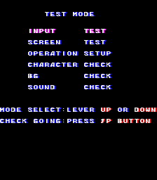
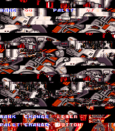

Disabled options in the test mode menu? We'll see about that...

<!--more-->

# Hidden Test Mode Options

The normal Test Mode menu for Bakuretsu Breaker, a vertical space shmup produced by Kaneko in 1992, looks like this:


But there are actually three more options available:



These removed options are still fully functional; they were just manually removed from the menu. Like we're going to let something like that stop us! (Pressing 1P start will return to the main menu in any of these modes.)

## CHARACTER CHECK


Standard sprite tile viewer. P1 Up and Down scroll through the graphics banks, and P1 Button 1 and 2 scroll through the palettes.

## BG CHECK




Standard background tile viewer. Same controls as above.

## SOUND CHECK


Standard sound test. P1 Up/Down to choose between Sound or SE; P1 Left/Right to scroll through the options. P1 Button 1 to play. P1 Button 2 to stop.

So yeah, nothing really special about these options, but at least they're accessible now.

The routine to display the menu text (at 0x1BA4E) actually doesn't use the string table at 0x1BB28 when initializing the menu. Instead, it has the pointers to the first three options hard coded. The string table is only used when pressing up and down to redraw the text in red for the current selection and reset blue for the previous selection. The code for pressing up and down (at 0x1BB78 and 0x1BBD0, respectively) has a maximum value (02) for scrolling through the menu. We can increase this value to 05 so it scrolls beyond just the three, and the redraw functionality we mentioned before will render the text.

Here's the MAME cheat to enable it. Works in both the US (Explosive Breaker) and JP versions. Because the program code only displays the first three options on menu init, you'll need to scroll through all the options each time you re-enter the menu to make the text appear:

```
  <cheat desc="Enable removed test mode options">
    <comment>The list will reset to three options every time the menu reloads; manually scroll beyond what is displayed and the other options will appear</comment>
    <script state="on">
      <action>temp0=maincpu.mb@1bbad</action>
      <action>temp1=maincpu.mb@1bbfb</action>
      <action>maincpu.mb@1bbad=5</action>
      <action>maincpu.mb@1bbfb=5</action>
    </script>
    <script state="off">
      <action>maincpu.mb@1bbad=temp0</action>
      <action>maincpu.mb@1bbfb=temp1</action>
    </script>
  </cheat>
```
