We've taken a look at [Donpachi](/entry/donpachi-debug-tools-and-more) and [Dodonpachi](/entry/dodonpachi-debug-tools-level-select-and-more) in the past, so of course DDP 2 was going to come up eventually!

<!--more-->

# Version

Just a note that all the research was done on version 1.00. All the cheats should work on any region with that version. I may take a look at 1.01 and 1.02 at a later date.

# Debug Menu

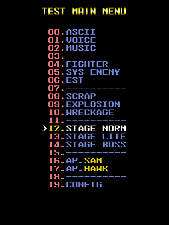

There is a full-featured debug menu located within the code, still referenced and relatively easily accessible (at least with a cheat). It's quite a luxurious set of tools, with many having multiple usage options within each test. Most tests also helpfully include a listing of the usage controls, which follow a key:

|Identifier|Input|
|--- |--- |
|[ ]|P1 Input|
|< >|P2 Input|
|A, B, C, D|Button 1, 2, 3, 4|
|J|Joystick|
|+|Joystick (any direction)|
|--|Joystick (Left/Right)|
|||Joystick (Up/Down)|
|#|Button (single press)|
|*|Button (hold)|

Let's take a quick look at the options available. For each of these, P1 Start returns to the main menu.

## ASCII

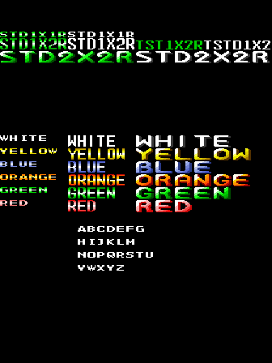

Displays a static screen with the various fonts and colors available.

## VOICE

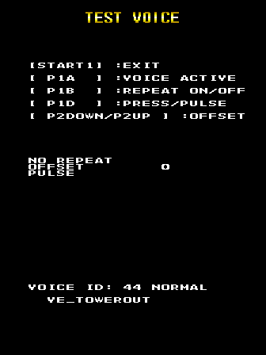

It's a PCM sound test, as you may have guess. The controls are listed, except for P1 Button 3, which changes the playback direction (normal or backwards).

## MUSIC

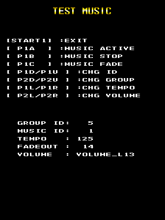

And a music sound test as well.

## FIGHTER

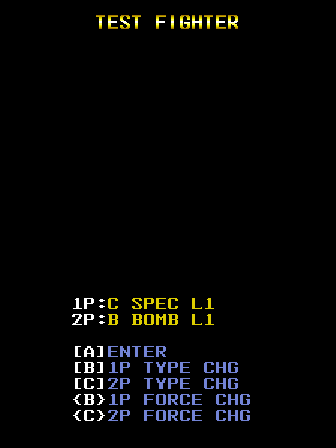

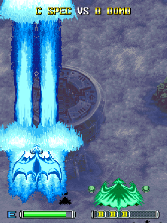

Tests the different weapons loadouts.

## SYS ENEMY

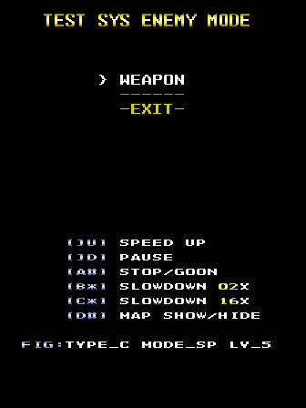

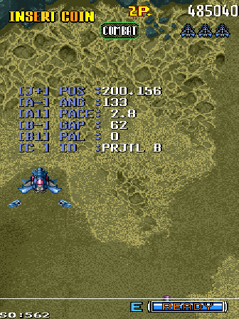

Repeatedly spawns a shooting enemy on the screen. While in the stage, holding P1 Button 4 will display a menu to choose the projectile settings.

## EST

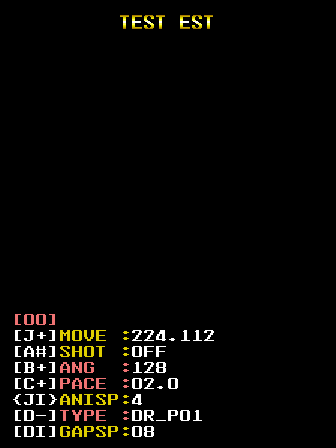

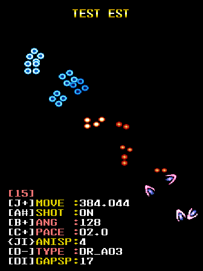

Tests the various types of bullets and shooting patterns.

## SCRAP

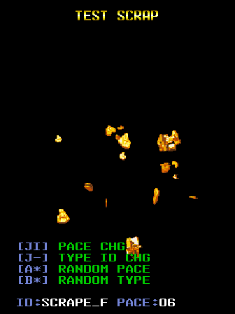

Tests the various types of shrapnel explosions.

## EXPLOSION

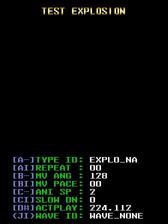

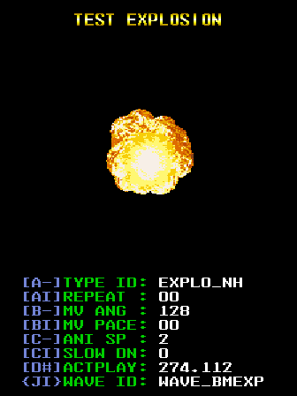

Tests the various types of fifireball explosions.

## WRECKAGE

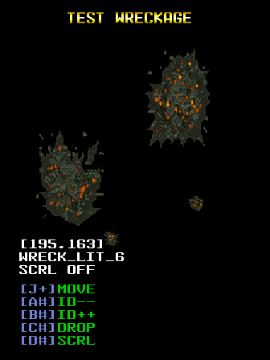

Tests the various types of exploded wreckage.

## STAGE NORM / LITE / BOSS

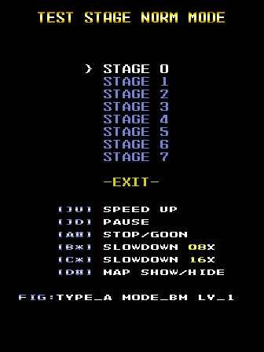

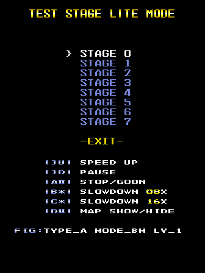

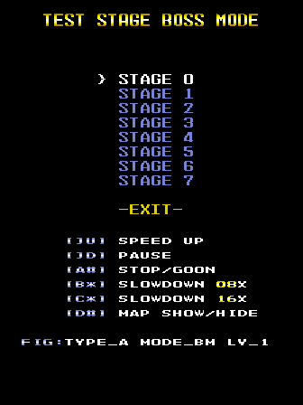

These modes spawn the second player with invincibility in one of the gameplay stages, while the P1 controls are reserved for debugging tools as it plays. NORM seems to be the normal stage layout; LITE seems to be the same layout but with the heavier enemies already destroyed; and BOSS starts you at the stage boss. Finishing a stage does not progress further, and you will need to return to the launch menu by pressing P1 Start.

Interestingly, it looks like the entry labeled Stage 2 is not actually used in the game, though it's background looks to be identical to the one labeled Stage 5. The enemy spawns in this unused stage are minimal and it seems to loop endlessly with no boss. I'll leave it to those who are more familiar with the game to see if there is anything further interesting about it.

## TEST AP.SAM / AP.HAWK

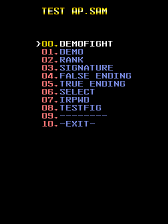

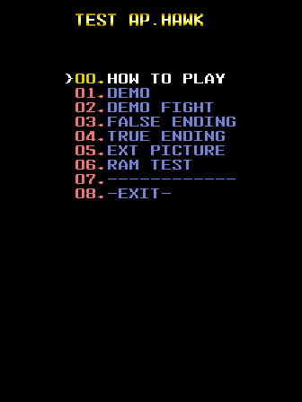

These menus provide shortcuts to some of the non-gameplay related parts of the game, such as the endings, attract mode and high score screen. Some of the entries are duplicated on both menus, and it's unclear (to me, at least) what the significance of SAM and HAWK are.

## CONFIG

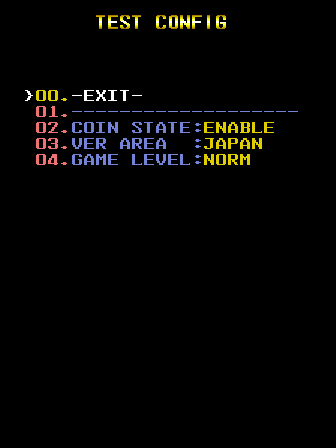

The Config entry sets some basic gameplay settings. Aside from its menu entry, it can also be accessed any time by pressing P1 Start while on the main menu. It seems to imply that the normal game should be accessible from the debug menu, launched with the settings chosen here, but no button inputs seem to do this.

## BLKSIGHT

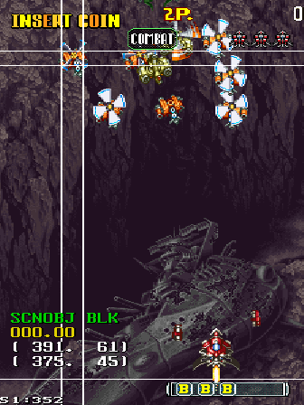

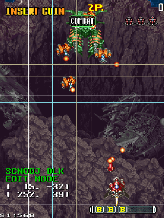

Within the test modes where the P2 is the controllabe ship and P1 controls are reserved for debugging tools (which are the TEST SYS ENEMY, STAGE LITE, STAGE NORM and STAGE BOSS modes), there is a secondary mode labeled BLKSIGHT, presumbaly short for "block sight." This is accessed by pausing the game with P1 Button 1, then pressing P1 Down. Within this sub-mode, P2 Button 1 acts as "forward" and P2 Button 2 as "back."

From the \<BLKSIGHT> prompt, P2 Up/Down scroll through the various block editors, such as SCNOBJ BLK and FIG CORE. P2 B1, as forward, selects the option.

You will now be in a selection mode, with P2 Up/Down scrolling through the on-screen objects that apply to the selected mode. P2 Left/Right works similarly, but seems to select at a more granular level, moving an invisible cursor around and only "activating" when on the position of an object.

With an object select P2 B1 goes forward into Edit Mode. Here, P2 Up/Down chooses between the lines of the bounding box on either the lower-left or upper-right side. Holding P2 B1 and using the P2 Joystick changes the position of those lines. P2 Button 3 will add a new point to the object, which can be select as above with P2 Up/Down, and P2 Button 4 removes the currently selected user-added line and its later additions.

It's unclear what exactly these bounding boxes are for. The first thing that comes to mind is hitboxes, but since the game doesn't save the edited positions when backing out, t's difficult to say how they affect the gameplay. There may be an unknown input combination that stores the settings; I haven't given the code a thorough examination. If anyone figures it out, let us know.

---

And without further ado, here is the cheat to enable the debug menu on startup, after the PGM BIOS intro:

```
  <cheat desc="Display debug menu on startup">
    <script state="on">
      <action>temp0=maincpu.mw@14b32e</action>
      <action>maincpu.mw@14b32e=0020</action>
    </script>
    <script state="off">
      <action>maincpu.mw@14b32e=temp0</action>
    </script>
  </cheat>
```

## Debug Mode - Technical

The "global mode" is stored in the word @ 0x80EF3C. It is set to 0x10 during attract mode, and 0 when a coin is inserted. A third mode, which does not have any non-cheat way of enabling, is 0x20, which enables the debug menu above. The cheat simply changes the initial mode from 0x10 to 0x20 on startup.

Rather than simply acting as a debug menu flag, it does seem that this was intended to be a full-fledged runtime debug mode, to some extent. On the fighter select screen, if the mode is 0x20, it will allow P2 to join even with 0 credits. It also looks like it skips the coin checks for P1 as well. However, if the mode is 0x20 during the attract mode (i.e. before you can even get to the fighter select screen), it seems that inserting coins does not put the game into "interactive" mode and allow for inputs like the Start button to actually begin the game. This means that you can't even be in mode 0x20 to begin the game and that at least 1 credit needs to be inserted before starting.

There are no other checks for mode 0x20 in the code beyond the ones on the fighter select screen.

With the Config options in the debug menu and the mode 0x20 check on the character select screen, it seems that you should be able to leave the debug menu screen and enter the normal gameplay with your settings and the 0x20 debug mode intact. However, there doesn't seem to be a way to do this. It's unclear if this was a miss on the part of the developer or if some piece was removed in the final version that prevents this.

# Audit Screen

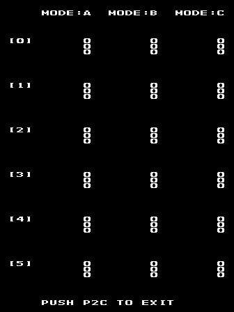

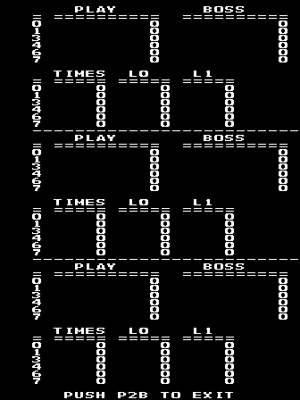

At 0x16EC9A is an audit screen, likely a leftover from a location test. There's nothing particularly interesting about it, so nothing really to say about it, either.

It is unreferenced by any code, so we don't know where it was originally called from. The cheat below will have it display on startup.

```
  <cheat desc="Display audit screen on startup">
    <script state="on">
      <action>temp0=maincpu.mw@14b32e</action>
      <action>maincpu.mw@14b32e=0020</action>
      <action>temp1=maincpu.md@14b37e</action>
      <action>maincpu.md@14b37e=16ec9a</action>
    </script>
    <script state="off">
      <action>maincpu.mw@14b32e=temp0</action>
      <action>maincpu.md@14b37e=temp1</action>
    </script>
  </cheat>
```

# Error Messages

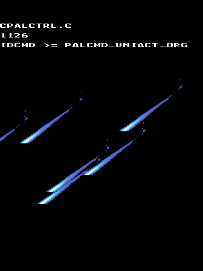

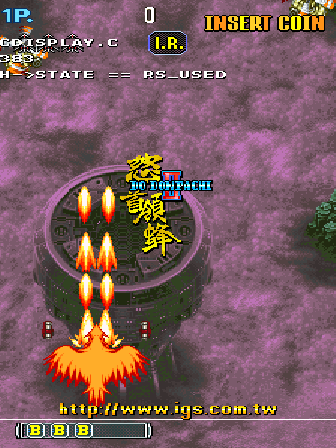

Through the code are bunches of short strings indicating error messages or snippets of C code and often a filename. These are intended to be displayed when game-halting errors occur. The C code is usually in the form of a Boolean conditional, indicating an assertion in the code that failed. The filenames likely indicate the original source code file. Both would be extremely helpful in debugging.

(The screenshots above were triggered manually; the chances of any of these messages appearing naturally is pretty low.)

None of these are particularly interesting on their own, but will be very valuable if anyone wants to do a full disassembly, as filenames and variable names can provide much-needed context to raw opcodes whose purpose can be unclear.

# Scene Test Tool

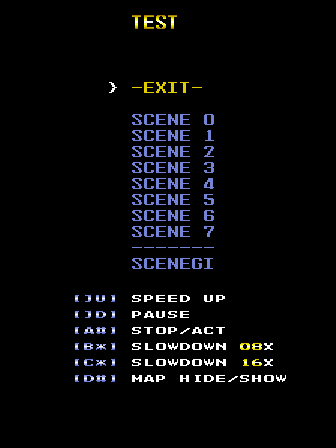

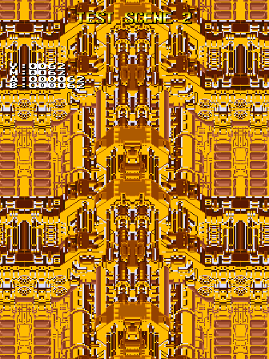

Located at 0x168702 is code for an old test tool, similar to some of the ones present in the main debug menu. This one, however, is unreferenced by any code. It may have simply been a map viewer, as it does not spawn any objects. However, it is broken, as all the entries (except SCENEGI) show the same bit of map with an obviously incorrect orange palette. After it scrolls for a while, it displays one of the error messages described above.

It's ultimately useless, but if you'd like to play with it out of curiosity, here's a cheat to do so:

```
  <cheat desc="Display old scene test tool on startup">
    <script state="on">
      <action>temp0=maincpu.mw@14b32e</action>
      <action>maincpu.mw@14b32e=0020</action>
      <action>temp1=maincpu.md@14b37e</action>
      <action>maincpu.md@14b37e=171bd0</action>
    </script>
    <script state="off">
      <action>maincpu.mw@14b32e=temp0</action>
      <action>maincpu.md@14b37e=temp1</action>
    </script>
  </cheat>
```

And that wraps up DoDonPachi 2 for now.
