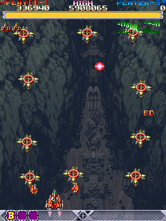
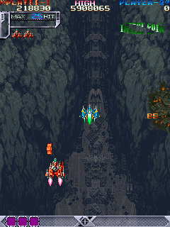

And now for the article many people have been waiting for: Dodonpachi! Unfortunately, I didn't make it in time for the 20th anniversary of the game on February 5th, but oh well; better late than never right? This game seems to have a larger following than it's predecessor, so I'm sure shmup fans will enjoy the re-enabled debugging tools available to play around with. There's not much else to say, so here we go!

<!--more-->

# Version string

Like Donpachi, immediately following the CPU vector table at 0x400, we have a version string:

```
DONPACHI Ver1.121995/05/2x XXXXX
```

We can parse this out to Version 1.12, May 2x, 1995. Interestingly, the second digit of the date is X'ed out (lower case x), and the remaining space is filled with upper case X's. In Donpachi, this extra space was will with, well, spaces. It doesn't really mean much, just an interesting anecdote.

Also of interest is the fact that the name is still DONPACHI, instead of DODONPACHI, but this too is probably inconsequential; the devs probably never bothered updating it.

# RAM/ROM skip

I've developed a MAME cheat to skip the ROM/RAM check at the beginning of the game. This prevents checksum errors (if you have cheats enabled on startup) and waiting for the long Warning screen to run.

**Japanese version:**


```
  <cheat desc="Skip ROM/RAM check and Warning screen">
    <script state="on">
      <action>temp0=maincpu.md@53d0</action>
      <action>temp1=maincpu.mw@53d4</action>
      <action>temp2=maincpu.md@54ec</action>
      <action>temp3=maincpu.mw@54f0</action>
      <action>maincpu.md@53d0=4ef90000</action>
      <action>maincpu.mw@53d4=5456</action>
      <action>maincpu.md@54ec=4ef90000</action>
      <action>maincpu.mw@54f0=0a80</action>
    </script>
    <script state="off">
      <action>maincpu.md@53d0=temp0</action>
      <action>maincpu.mw@53d4=temp1</action>
      <action>maincpu.md@54ec=temp2</action>
      <action>maincpu.mw@54f0=temp3</action>
    </script>
  </cheat>
```

# Debug Tools

**TL;DR - Run only one cheat at a time!**

It's clear that Dodonpachi was built off the Donpachi codebase. Though there are some differences, the basic program structure and flow is the same. As such, all of the debugging tools in Donpachi are present and (to varying degrees) working in Dodonpachi.

Without getting too technical, the biggest changes lie in how the debugging functions are referenced. As we touched on in the Donpachi article, the pause/stage scroll code is in one chunk of code while the RAM editor and palette edit/object spawn/stage select (which I'll just call the Swiss Army tool from now for simplicity) are lumped together in a seperate part of the code. In Donpachi, both of these pieces of code are directly referenced in the main program loop. The only thing that disables them is a check for a bit on the system input that is turned off elsewhere in the code.

In Dodonpachi, while the program loop is mostly the same, the debug tools are disabled more permanently. The initial code for the pause/stage scroll tool (which is actually part of the program loop code) is present but the system input check is gone. A good old-fashioned JMP to the code below replaces it, abandoning the debug functionality. The Swiss Army tool shares a similar fate: it still exists but all previous references to it in the game loop are completely gone, giving us more orphan (but working!) code.

Of course, we can fix all this relatively easily, but due to changes in the game loop, things aren't as simple as they were in Donpachi. Due to how I've written these cheats (i.e. lazily), they probably won't work if you try to run them at the same time. Namely, the Swiss Army tool cheat overwrites bits of the normally unused pause/stage scroll code to reimplement a proper call to the subroutine. Yes, I can probably rewrite them to work together, but it's not a priority right now. In any case, it shouldn't really be a problem as shared inputs on several of the tools makes running them simultaneously impractical.

If things get really messed up (like constant game crashes), hit Shift + F3 to do a hard reset of the MAME machine.

## Pause and level scroll

The game can be paused and, while paused, the level can be scrolled forwards and backwards. The controls are the same as Donpachi.

**Japanese / International version:**

```
  <cheat desc="Re-enable pause and stage scroll">
    <comment>P2 Start to pause; P1 Start to unpause; While paused hold P1 B3 and press P1 Up/Down to move through the stage</comment>
    <script state="on">
      <action>temp0=maincpu.md@b02</action>
      <action>maincpu.md@b02=4e714e71</action>
    </script>
    <script state="off">
      <action>maincpu.md@b02=temp0</action>
    </script>
  </cheat>
```

## RAM editor


The RAM editor is still present as well, though the cursor is a broken graphic. 

**Japanese version:**

```
  <cheat desc="Enable RAM editor">
    <script state="on">
      <action>temp0=maincpu.md@af2</action>
      <action>maincpu.md@af2=00000b68</action>
      <action>temp1=maincpu.mq@b68</action>
      <action>maincpu.mq@b68=4eb900049bec4eb9</action>
      <action>temp3=maincpu.md@b70</action>
      <action>maincpu.md@b70=00056dd6</action>
      <action>temp4=maincpu.mw@b74</action>
      <action>maincpu.mw@b74=4e75</action>
    </script>
    <script state="run">
      <action>maincpu.pw@1017a0=1</action>
      <action>maincpu.pw@1017a2=1</action>
    </script>
    <script state="off">
      <action>maincpu.md@af2=temp0</action>
      <action>maincpu.mq@b68=temp1</action>
      <action>maincpu.md@b70=temp3</action>
      <action>maincpu.mw@b74=temp4</action>
      <action>maincpu.pw@1017a0=0</action>
      <action>maincpu.pw@1017a2=0</action>
    </script>
  </cheat>
```

# Palette editor, object spawn and level select


The Swiss Army Knife tool is fully functional too. The font is now thankfully much more readable, though it's cursor is completely missing. See the Donpachi article for details on the inputs.

**Japanese version:**

```
  <cheat desc="Enable debug tools (Palette Editor/Object Spawner/Level Select)">
    <parameter>
      <item value="0x00">Disabled</item>
      <item value="0x04">Enabled</item>
    </parameter>
    <script state="on">
      <action>temp0=maincpu.md@af2</action>
      <action>maincpu.md@af2=00000b68</action>
      <action>temp1=maincpu.mq@b68</action>
      <action>maincpu.mq@b68=4eb900049bec4eb9</action>
      <action>temp3=maincpu.md@b70</action>
      <action>maincpu.md@b70=00056dd6</action>
      <action>temp4=maincpu.mw@b74</action>
      <action>maincpu.mw@b74=4e75</action>
      <action>temp6=maincpu.md@49c0c</action>
      <action>maincpu.md@49c0c=0010f001</action>
    </script>
    <script state="run">
      <action>maincpu.pb@10f001=param</action>
    </script>
    <script state="off">
      <action>maincpu.md@af2=temp0</action>
      <action>maincpu.mq@b68=temp1</action>
      <action>maincpu.md@b70=temp3</action>
      <action>maincpu.mw@b74=temp4</action>
      <action>maincpu.md@49c0c=temp6</action>
      <action>maincpu.pb@10f001=0</action>
    </script>
  </cheat>
```

# Unused Objects

If only more games had an object spawner like the ones in DP/DDP!

There are a few unused objects in the game, several of which appear to be debug items. There is also at least one completely functional but removed enemy, and possibly more. While I love Dodonpachi, I am by no means an expert, and it's hard for me to identify which objects may be unused. If any DDP maniacs can confirm as much about some of these objects, I would appreciate it!

## Object 0x4E - Bullet Test


Object 0x4E is clearly meant for debugging purposes. It appears as a small turret which will constantly shoot bullets at you and two rows of text in the lower center of the screen. You can use P2 Button 1 and Button 2 to scroll back and forth through the bullet types (which are shown as the low value of the upper text row), while Button 3 changes the rate of fire (show as the value in the lower text row). I've also noticed that the upper values of the text change throughout the level, though I haven't spent the time figuring out what they represent. The firing turret itself can be moved around with P2 joystick. Also, if you'd like an easy spot to play around with it, spawn it in a level then fast forward to a boss area; for whatever reason, the boss won't spawn while this object is out, which makes a nice clean area to play with it.

I'm pretty certain some of the bullets aren't used in the final game; for example, check out bullet 0x1E, which is literally the kanji 弾, "bullet".

## Object 0x5D - Unused enemy



This one is interesting! It is a mostly complete enemy, appearing as a ring of floating, spiky platforms that slowly toss a bullet around the screen. Shooting any of the platforms damages all of them, and when it is destroyed there is no explosion animation. It's big enough that it makes me think it was part of a mid-boss, or maybe something that appeared in a level to annoy you while faster faster enemies fill the screen. Who knows!

I wasn't 100% certain this was unused (though the lack of explosion animation was a big hint that it was unfinished), so shoutout to Armchair General for helping confirm that much.

## Objects 0xB5, 0xB6, 0xB8 - Unused enemies or test objects?




Objectx 0xB5, 0xB6 and 0xB8 appear to be test objects, or perhaps unfinished enemies. I'm hesitant to say with certainty that these objects are unused as, again, I'm no DDP expert and these might actually be in the game, but the odd behavior and seemingly unfinished state of the objects seems to suggest as much.

They all work similarly: when spawned, they do not move on their own but can be positioned with P2 Joystick. They can be hit by player bullets like any object and are destroyable. There are a couple differences though: 0xB5 and B6 do nothing but sit there, while 0xB8 has a couple of bullet patterns it shoots. 0xB5/0xB6 are also worth a whopping 1,000,000 points each when destroyed while 0xB8 is worth only 660 points.

Perhaps most interesting is the design of the first two, which look very similar to player ships. That could open up all sorts of conjecture if they are indeed unused.

# Unused Text

## Text from an unknown debug tool

You may remember my rants from the Donpachi article about the chaotic and probably broken REAL_L debug function. Theres no sign of it here in DDP, but it's strings still remain... as well as some other lines that point to a similar function.

Starting at 0x6B5EE we have the unused CONGULATULATIONS! and PRESENTED BY CAVE lines, just like Donpachi. However, in DDP, we have some more text that appears to be from a debug tool:

```
0x6B5EE CONGULATULATIONS!!
0x6B602 ALL STAGES CLEAR!!
0x6B616 REAL_L=
0x6B61F SIZE=   *
0x6B62A CHR=      /4
0x6B638 CHR=
0x6B63E PAL= 
0x6B645 REAL_L= 
0x6B64F [ten blank lines]
0x6B66D PRESENTED BY
0x6B67B CAVE
```

I can't find any code that references these string IDs, so as far as I can tell, whatever used them is long gone. With no code references, we can't draw any conclusions about what it was for, but we can always speculate: with text like PAL, CHR and SIZE, it sounds like this belonged to some sort of tile or graphics viewer.

The infamous REAL_L string is also present, and not just once but twice. Remember that I suggested that the REAL_L tool from Donpachi may have been some sort of tile/graphics viewer (in addition to the other functions it had crammed in).

Your next thought may be, is the REAL_L text even related to the other strings? Actually, it is. We can prove this with the string metadata, which defines the text style and position. At 0x6C6F6 begins the metadata for our group of unused strings. When rendered, they look like this:


They line up neatly on the left side of the screen with the same color palette, including the REAL_L line.

So, we can link the mysterious REAL_L text to these other lines that appear to be from a tile viewer and to the debug tool from Donpachi, which has some aspects of a tile viewer.

(There is one nagging mystery, though. If you look closely at the two REAL_L lines above, one has a space at the end. In Donpachi, REAL_L does have a space, so it would be easy to write that off as a leftover from the first game. However, when you look at the string metadata, you'll see that the one without the space has the same style/position as the one from Donpachi, while the one with a space has the new style/position. It's like they put in a different string and then mixed them up in the metadata table... maybe? It's strange, but ultimately inconsequential.)

## Extra Version?

Here's something tantalizing. At 0x6B7BF we have this string:

```
EXTRA VER.1.22
```

There are no references to this string index anywhere, unfortunately. At first I thought it may have replaced the 'Master Version' text on the warning screen, or perhaps on the title screen, but it has strange positioning that rules that out:


Wish I had more info on this, but there's nothing else to go on.

## Credits Text

Finally, it looks like we have a set of unused credits that appear at the very end of the strings:

```
           DESIGNER           
         NAOKI OGIWARA        
      AKIRA WAKABAYASHI      
        HIROYUKI TANAKA       
         JYUNYA INOUE         
        RIICHIROU NITTA       
          PROGRAMMER          
         TUNEKI IKEDA         
        SATOSHI KHOYAMA       
        MAKOTO WATANABE       
        TAKASHI ICHIMURA      
         SPECIAL THANKS       
        TOSHIAKI TOMIZAWA     
        ATUNORI ABURATANI     
         RYUICHI YABUKI       
           PRODUCER           
         KENICHI TAKANO       
```

As far as the list of names goes, there's no difference between these and the final (though the final does use Japanese style family name first, and some different romanization). Interestingly, only the first two lines are referenced in the string metadata:


Since metadata doesn't specify which text rendering function to use (8x8 or 8x16 size font), I've used both. The metadata positions the string in the same location, so the lines cannot appear at the same time. Either it was meant to display one at a time, or the metadata is broken/unfinished. Since only the first two lines actually have metadata, and the rest of the credits text is completely orphaned, I'd lean towards things be unfinished.

---

There we have it, my examination of Dodonpachi. I'm still planning to write a more technical analysis of both DP and DDP later this year. Keep an eye out for it!
