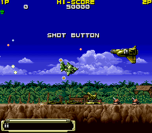

I'm pretty burnt out on tackling Super Gem Fighter / Pocket Fighter right now. I took a little break and did some more research on something quite interesting I had found a while back: English text in Koutetsu Yousai Strahl, a horizontal shooter and a favorite among shmup fans.

**EDIT 2018-11-28: As of MAME 0.203, there is a world region dump of Strahl. It contains the English text that was found in the Japanese version, making this article relatively useless. Oh well.**

<!--more-->

I've searched as much as I can and from what I can gather from the internet, Strahl only had a Japanese release and no multi-language option. But there's are several fully implemented screens of English text in the game that suggests they were planning for an overseas release.

First off, there is a translation of the introduction text, which is normally in Japanese. This is interesting as it provides the 'proper' transliteration of the German names Eisern Geist and Gegeben von Funkeln, which were previously not known (at least, [not known to the people who updated the Strahl Wikipedia page](http://en.wikipedia.org/wiki/Koutetsu_Yousai_Strahl)).

While the Japanese text scrolls up for the intro, the English text routine fades in the text and doesn't move. It is divided into two routines: the first consists of the fade in call and displaying the first page of strings; the second just displays strings with no fade-in. There is also a third routine that displays the same amount of lines, but with blank strings. One can assume that the original progression consisted of the first routine the fade in the text, the third routine to clear it momentarily, and then the second routine the display the second page of text.

Moreover, there are translations of the gameplay instructions text that are displayed during the attract mode, which exactly match the three Japanese screens. As above, there is also a routine to display blank lines, probably to clear the text between phrases. (Note that the original Japanese phrases slide in from the right to left.)

None of these routines are referenced anywhere in the code. I would assume that were they planning for an international release, they would have had function to choose between loading the Japanese text or English text, based on a DIP switch or hard coded software setting. However, since these routines are essentially orphaned and that they are less 'stylish' than the scrolling Japanese text, I get the feeling that any plans for English language support was dropped pretty early, and that these English language functions were just forgotten.

To make things even more interesting, there are two sets of Strahl dumps, labeled as Set 1 and Set 2. These English text strings/routines only appear in Set 1. They are completely removed in Set 2. The code around them is mostly identical in both versions; it's like someone commented them out or removed them when compiling this second version.

I may spend some time hacking in support for the English text, but for now, here are the locations of the routines so you can manually see them via the MAME debugger:

|Routine|Offset|
|--- |--- |
|English Introduction Page 1|0x015A30|
|English Introduction Page 2|0x015CC6|
|English Introduction Blank|0x015F56|
|English Gameplay 1|0x016072|
|English Gameplay 2|0x016118|
|English Gameplay 3|0x0161BE|
|English Gameplay Blank|0x016264|

