Man, what a gorgeous game. Some truly stunning pixel art here, and the music is a jam too. The team that made this sure was talented. I wonder what they went on to do after this[...](https://metalslug.fandom.com/wiki/Gunforce_II)

<!--more-->

# Four Player Mode

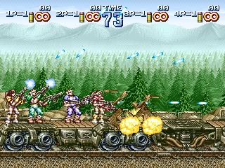

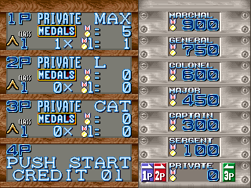

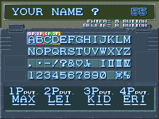

The big find here is that a 3/4 Player mode still exists in the game and appears to be fully functional. It's long been suspected that the game at least planned for more players due to the several references to a P3 and P4 slot in graphics. Well, it turns out it was much further along than just planning: it appears to be fully implemented and working perfectly.

(Side note: the default name for the Player 4 is Eri. [Hmmmmm....](https://metalslug.fandom.com/wiki/Eri_Kasamoto))

What is kind of crazy is that the entire 4 Player mode is disabled with just one command:

<pre class="pdasm pdasm-arch-nec-v">
05EE6: mov     al,0A501h{dsw2_snapshot}  ; read in the copy of DIP switch 2
05EE9: mov     dl,al  ; duplicate it into another register as a backup (for the Coin Slot type read)
05EEB: and     al,0h  ; CLOBBERED - mask the DIP 2 value with *zero*
05EED: shl     al,3h  ; move it into place...
05EF0: or      0A5A8h{cfg_flags},al ; and map it on to the config
05EF4: and     dl,4h  ; use the unmasked backup to read in Coin Slot type
05EF7: or      0A5A8h{cfg_flags},dl
</pre>

As with Yakyū Kakutō League Man and Dream Soccer '94 on the same hardware, DIP switch 2-2 sets the cabinet type to 4 Players. In the section of startup init code shown above, the DIP switch 2 settings are loaded, masked and shifted so they can be applied to the configuration in memory. This is done twice: once for the Cabinet Type and once for the Coin Slot Type, with DIP 2 copied in 2 registers since the masking is destructive.

The culprit is at 0x5EEB: the mask applied to the Cabinet Type read is **zero**. This effectively wipes out the actual DIP switch 2 settings: the byte reads as zero (all switches off) no matter what the actual switch state is. This unconditionally sets the Cabinet Type to 2 Players only. This is something done intentionally, a quick patch, and definitely not a bug.

So is the fix really is as easy as correcting that mask to properly capture the Cabinet Type bit?

Yeah, pretty much.

But now we have a bigger problem: MAME (correctly) assigned only 2 Player controls for the game, so we have no way to map inputs for the other players. One solution is to change the port layout for the game to `m92_4player` in the driver and build a custom MAME executable. Not a problem for those of us who keep the MAME source regularly pulled, but I imagine that doesn't describe most people.

Another option is use a Lua script to hook into the game directly. And hey, [look what we have here](geostorm_4player.lua)!

You can use it like so:

```
mame geostorm -autoboot_script geostorm_4player.lua -autoboot_delay 0
```

It should work for the World release (Gun Force 2) as well. Note that it doesn't add P3/P4 inputs to MAME: it just hooks into the game data and sends in keystrokes as it runs. You will need to do the input configuration in the script itself, at the top. Also note that it doesn't include any patching; you'll need to enable the cheat for that.

Once you've got your 4 Player input scheme figured out, here's the cheat to re-enable four player support:

```xml
  <cheat desc="Restore 3/4 player support">
    <comment>*Needs a MAME build with 4-player inputs.* Set DSW 2-2 to On (4 Player Cabinet Type) and reset before using. If the Coin Slot mode is Seperate, use P3/P4 Start as the credit key for those players.</comment>
    <script state="on">
      <action>temp0=maincpu.mb@005EEC</action>
    </script>
    <script state="run">
      <action>maincpu.mb@005EEC=02</action>
    </script>
    <script state="off">
      <action>maincpu.mb@005EEC=temp0</action>
    </script>
  </cheat>
```

As it says, make sure DIP switch 2-2 is set to on. MAME will have still have it marked as "Unknown," but that is the Cabinet Type setting that was intentionally patched over in the code and restored with the cheat: 2 Player (off) or 4 Player (on).

## Important Note - Player 3/4 Coin In and Start Button Conundrum

This section originally went down a deep rabbit hole on how the P3/P4 Coin and Start lines are utilized in the game. It was needlessly complex, but here's a brief summary and what it means for 3/4 Player mode.

There is some known weirdness with how Irem games treat the P3/P4 slots. From `iremipt.h` in the MAME source:

```xml
PORT_BIT( 0x0010, IP_ACTIVE_LOW, IPT_START3 ) /* If common slots, Coin3 if separate */
PORT_BIT( 0x0020, IP_ACTIVE_LOW, IPT_COIN3 )
PORT_BIT( 0x1000, IP_ACTIVE_LOW, IPT_START4 ) /* If common slots, Coin4 if separate */
PORT_BIT( 0x2000, IP_ACTIVE_LOW, IPT_COIN4 )
```

At a general level, if the Coin Slot Type is configured for Common, then coins inserted from any slot are added to a "pool" which can be used by any player to start the game. When set to Seperate, a coin must be inserted into a specific player's coin slot and can only be used by that player.

That's all well and good, but there are some quirks with how this is installed. In Seperate mode, the P3/P4 Start lines act as the Coin In triggers; in Common mode, P3/P4 Start do nothing at all. Essentially, P3/P4 have no working Start button in any case.

The game, however, is patched to recognize any button as Start. It actually employs DIP 1-6 the same way it is used in League Man, where that setting is labeled "Any button to start." But there is another manual patch here, similar to how 4 Player mode was disabled: instead of actually using the DIP 1-6 setting, the value is forced to always be on. (That happens at 0x5F1A if you're interested; it's a real slog.) Thus the game always recognizes any button as Start.

The TL;DR here is: if you use Seperate coin slot mode, use P3/P4 Start as your coin in buttons. If you use Common, you shouldn't need to do anything special, but keep in mind that P3/P4 Start will never work. Just use B1/B2.

## But Why?

Why was 4 PLayer mode cut? I have no idea. The M92 hardware already has 4 Player games, so presumably the input I/O and harness edge were capable. While I haven't played through the whole game as 4 players (difficult to do as one person...), I haven't encountered any game breaking bugs. It seems complete: default names and alternate palettes are present; the end of mission assesment works perfectly; even the difficulty rubber banding takes into account 3 and 4 players. You'd think in a game that is famous for being so rushed it had no ending, they'd want to value-add as many features where they could.

One thought I had was that we have a 2 Player Only version dump, with a full 4 Player version floating around out there. That was shot down when I saw the flyer for the game.

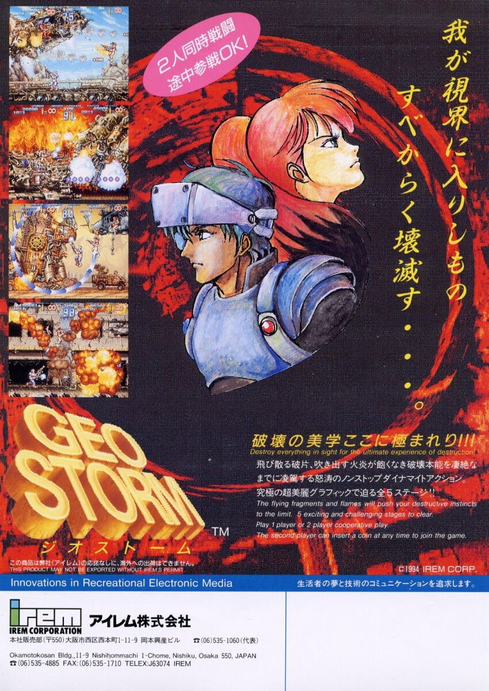

The flyer *specifically* indicates 1 or 2 Player modes, both in English and Japanese. That rules out a 4 Player PCB.

Perhaps it was due to its rushed nature. The game is infamous for its extreme slowdown in busy parts of stages. If we add in two more players, maybe the slowdown becomes entirely unbearable. (I haven't yet been able to play through it with a full 4 Players since I only have two hands, unfortunately, so I'm not sure if it really does get worse.) Since they weren't able to get it optimized in time, the best option may have been to just ship what was tolerable and snip the wire connecting the rest of it.

Whatever the reason, I'm happy to have it restored and playable again.

# Debug Tools

The game has a handful of pretty useful debug tools inside, accessible on a normal board without patching!

## Developer Mode

Everything is blocked by a global developer mode flag at e000:a65f. How that byte gets set and how it is used is kind of interesting.

<pre class="pdasm pdasm-arch-nec-v">
0E762: mov     aw,40h
0E765: mov     ds0,aw
0E767: mov     aw,[0F106h]
0E76A: out     0h,aw
0E76C: in      aw,4h   ; DIP switches on port 4, switch 1 in AL
0E76E: test    al,80h  ; check if Service Mode set
0E770: bne     0E786h  ; not in service mode -> to normal boot
0E772: test    byte ptr ps:0F0AEh{dbg__dev_mode_flag},0FFh  ; check for the "dev mode" build constant @ 0xF4AE is 0xFF
0E778: be      0E77Dh 
0E77A: br      0F462h{dbg__restart_dev_mode}  ; dev mode build flag set, restart in dev mode
0E77D: in      aw,0h  ; dev mode flag not set; check P1 input on port 0
0E77F: cmp     al,77h  ; check for P1 Up + P1 Button 1
0E781: bne     0E786h
0E783: br      0F462h{dbg__restart_dev_mode}  ; restart in dev mode if inputs matched
</pre>

First it checks that the system is in Service Mode via DIP switch 1-8. If that is true it then checks the byte at 0xF4AE. This is a build constant that unconditionally puts the machine in developer mode. Paired with the Service Mode requirement, this essentially turned the service switch into a developer mode toggle.

The byte at 0xF4AE is, predictably, set to 0 in the final version which prevents enterting developer mode automatically on boot. But, there's an override: holding P1 Up + P1 Button 1 on startup will also put the machine in developer mode. You can tell this works as it will skip the RAM/ROM check and go straight to the title screen. Dev tools aside, it's useful for skipping the annoyingly long boot up.

This should work on final boards without any hacking. If anyone has the board, give it a try and let us know.

I've also tried this Service Mode + P1 Button 1 + P1 Up combo on other Irem M92 games and it works in some cases! Something else to look into eventually...

## Debug Tools Enable

There's one more blocker before we get to actually use the debug tools: DIP switch 3-8 acts as a global debug tool toggle. It's not an access gate as much as it is a quick on/off for all the tools.

All of the debug tools in this section require switch 3-8 to be on in order to run.

## Game Pause

P2 Start pauses the game; P1 Start unpauses.

## Invincibility

DIP switch 3-6 enables invincibility for normal enemy gunfire. You can still die by falling off the map (e.g. the bossfight at the end of the the train stage).

## Gameplay Telemetry

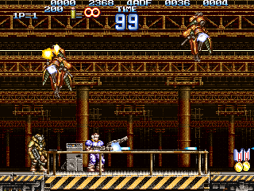

DIP switch 3-7 enables a data readout at the top of the screen. All values are BCD, except the third (frame count) which reads as hexadecimal.

The first value is the "odometer," how far into the stage the players are.

Next is spare CPU for the frame. It's a raw 16 bit value that is increased for every loop in the idle spin in the main loop after all tasks are complete for the frame. What's interesting is the value is not cleared on each frame because it also acts as the entropy source for the RNG, which is a pretty clever way to source randomness.

That means the value itself is meaningless. What does have meaning is the *delta* between values per frame. A large change means there was lots of free time after task processing; a small change means the CPU work was saturated with task work and didn't have much time in its idle loop. To the human eye, this looks like a higher number with an idle CPU, as the count step is higher, while a heavy CPU load looks like a lower number as it takes longer to rise.

After that we have the global frame count, increased once per input read in the main loop and used for animation timing.

The next column is the free object slot count. There are 56 runtime object slots; the more entities on screen, the lower this value will be.

The final column is the game rank. This determines the gameplay difficulty, recalculated each frame on the DIP setting, the number of players, and how well armed the players are.

The data at 0x7000:6F10 is a table that determines the base rank.

| DIP difficulty | Strength 1 | Strength 2 | Strength 3 | Strength 4 |
|---|---|---|---|---|
| 0 (normal) | 04 | 05 | 06 | 07 |
| 1 (easy) | 00 | 01 | 02 | 03 |
| 2 (harder) | 08 | 09 | 0A | 0B |
| 3 (hardest) | 0C | 0D | 0E | 0F |

Additional "points" are added to the rank depending on powerups like BOOST SP are in effect. The rank feeds into enemy timing: the higher the rank, the faster certain enemy actions occur and the faster their projectiles move.

## Stage Select

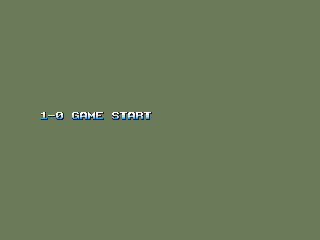

Possibly the most useful tool along with invincibility, or at least the most interesting. During gameplay, hold P1 Start + P1 Button 1 + P1 Button 2 and press Up. It immediately jumps to the stage select screen.

There are a couple test stages listed here, which we'll look at below.

## Mission Advance

Similar to the stage select: during play, hold P1 Start + P1 Button 1 + P1 Button 2 and press *Down*. It will show the Mission Assesment screen then move to the next area.

## Location Test Audit Screen

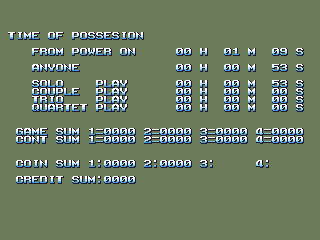

When the High Score screen is displayed in attract mode, hold P2 Button 2 and press P1 Button 1.

B1/B2 returns to attract mode.

I'm assuming this is specifically for a location test (as opposed to operator bookkeeping) since it's hidden behind a developer mode and an input code. Of note here is that 3 and 4 Player modes are included as Trio and Quartet Play.

# Test Maps

The Stage Select also links to a couple of test maps.

## TEST CHIKEI

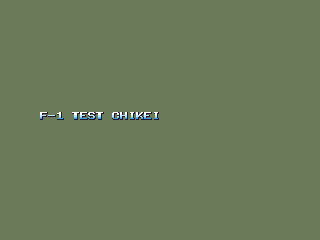

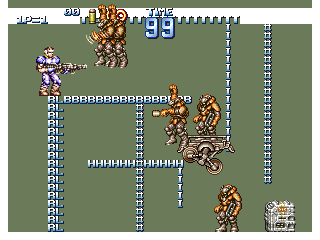

"Chikei 地形" is Japanese for terrain, and that's exactly what this tests. The letters making up the map have the attributes of different types of interactive structure: the character can hang from the T and B blocks, climb the RL wall, grab on to the I line as a rope and ascend the # lines like ladders.

There are also a few enemies and a powerup to play with. 

## COLOR CHOUSEI

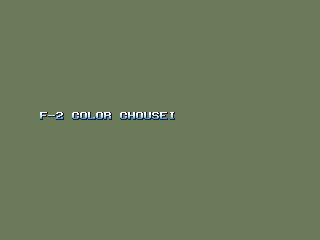

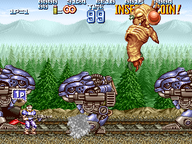

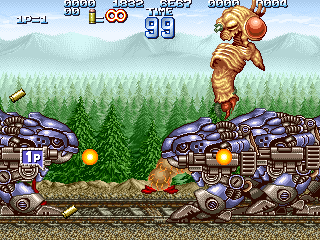

"Chōsei 調整" means adjustment, though I don't really see how this has anything to do with Color Adjustment. You're dropped into a map with a bunch of the large mech enemies and a monster in the sky. The monster quickly disappears, though it and the shots it spawns occasionall flash into view for a frame or two. You're also unable to fire your gun. 

The reason it's broken is because it spawns so many entitles that it runs out of object space. The last screenshot includes the data readout. Recall that the second to last column is the free object count: it's at zero. So you can't fire your gun since bullets are objects too.

You can work around this if you load the map and immediately start shooting, taking out some of the mechs before they fill up the object table. It's a good idea to enable the invincibility DIP as well.

## AMEN LUSTER

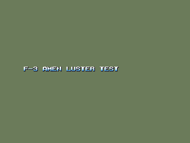

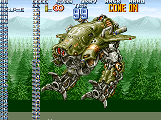

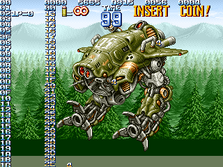

The title undoubtedly sounds strange to Western english speakers, but it can be explained: amen is actually (probably) A面, as in Plane A, one of graphics planes. And luster is a mis-romanization of "raster." So the real meaning is Plane A Raster.

You may have heard of "raster effects" in retro games. In these cases you can think of a raster as a single line of pixels on the screen. Raster effects involve manipulating the graphics at the line (raster) level than at the tile or sprite level. Commoon examples include wavy backgrounds or mid-screen palette changes.

This was some kind of simple test of the raster interrupt (also called the "horizontal blank interrupt" on some systems). The stage starts with the player immediately falling to their death, but that is inconseqential. There are two columns of numbers: the right column is static while the left one scrolls upward. If you look closed, you'll see the numbers 00 to 05 appear at the top of the moving column, but they don't move themselves. The parts that do move begin at 06 and continue on. It looks like us testing the raster interrupt by respositioning Plane A at for the first five rows, then at the 6th row, setting it's Y position to a a growing/looping value.

There are also three single characters diagonally in the center of the screen, cycling through the ASCII set. Since they are jittering around, it look like it is some kind of test related to setting position at h-blank for just one character. Possibly.

# Unused Graphics

Outside of the visilble area, the map for the elevator sequence in Mission 5 has some tiles that are not properly mapped:

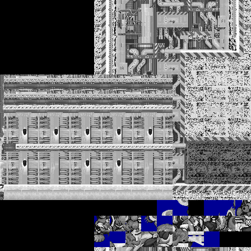

If we rearrange those and apply a couple probable palettes:

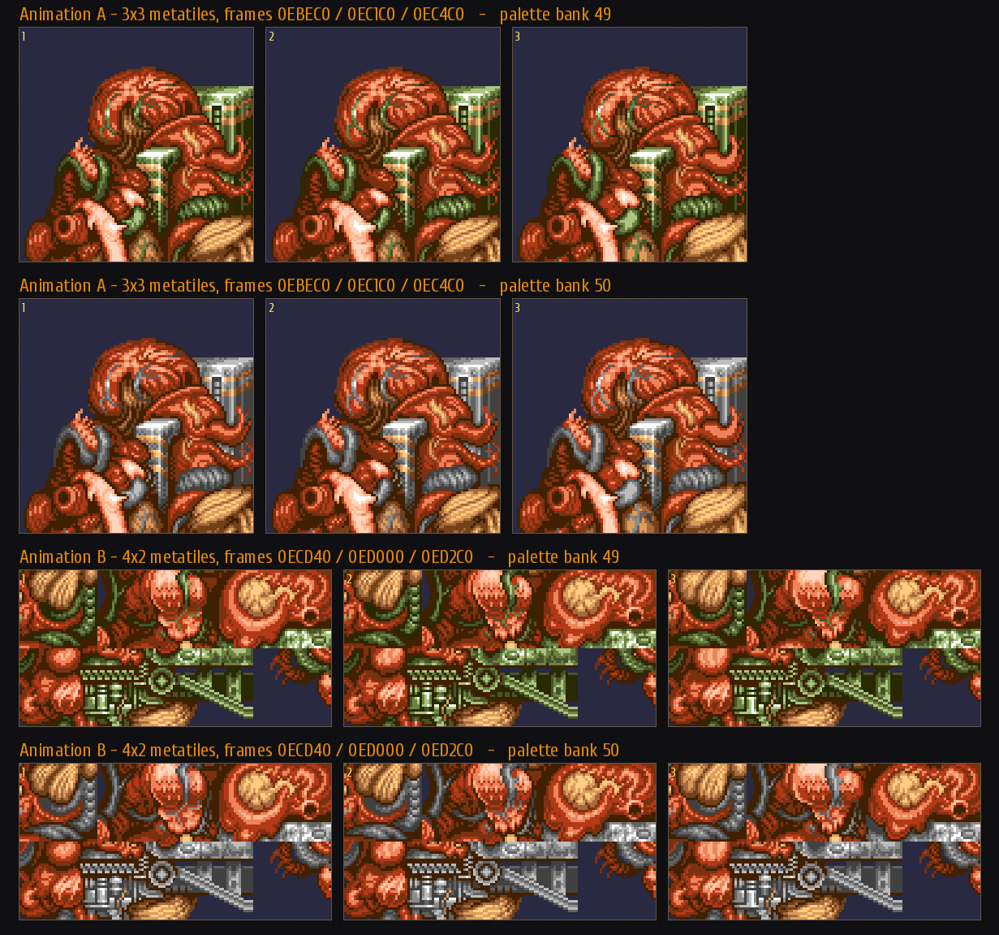

We get an Akira-esque bio-mass. They look like this when animated:

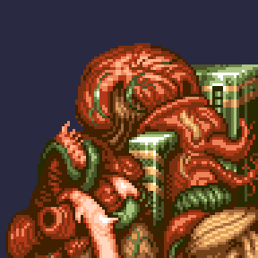

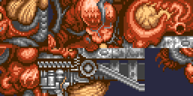

Not exactly as smooth and developed as the rest of the animations in the game, very much a work in progress.

---

I think that covers Geo Storm for now. Enjoy the 4 player mode! (If the frame rate holds up...)
