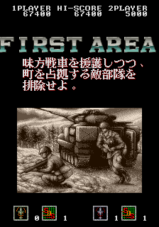
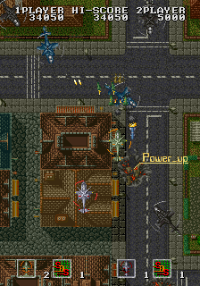
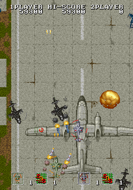

News was posted today of the finding and dumping of an unreleased vertical shooter by Sega and Santos for the System 18 arcade hardware, called *Hammer Away*.

<!--more-->

>The board was found in a collection of other dead PCBs that had simply being left to rot in a warehouse / were intended for use as parts. After negotiating with the owner of the boards a number of them were purchased by ‘1up’. One of the boards in that purchase was a Sega System 18 board. The motherboard was dead and in a very poor rusted condition – completely non-functional, but by transferring the unknown ROM board to a working System 18 motherboard (owned by _rm_) a great surprise was unveiled. [...] The ROM board was from the Sega / Santos prototype ‘Hammer Away’. A vertical shooter or ‘shmup’ that was set to be released around 1991 but ended up being cancelled for unknown reasons.

The data was quickly dumped and has since been added to MAME by the development team. [The full story is up on David Haywood's dev blog](http://mamedev.emulab.it/haze/2014/11/03/hikaru-arisa-michiyo-miho/). Amazing how things like this still pop up!