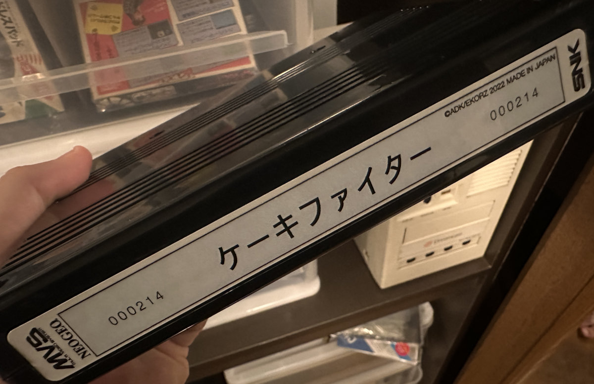

SUDDEN DESU officially turns ten years old in October. My, how time flies...

<!--more-->

In this post I'm going to ramble a bit about the site's history and then outline where we plan to go from here.

# The Past

The story actually starts sometime towards the end of 2010. At that point, I had created and soon abandoned a number of personal websites over the years. Most were narrow in their scope, focusing on only one subject, and most had more effort put into their CSS design than into actual content. I was itching have another go, this time making a blog style site, but wanted to avoid the traps I had fallen into with previous attempts.

I discovered tumblr around this time and appreciated the simplicity of its short format content: a long-winded article wasn't always necessary, and I could just post some interesting images and add some commentary. Since it was the relatively early days of social media, there were no heavy algorithms or machine learning, so finding users with shared interests to re-share their relevent posts was a natural and fun process.

I named my tumblr SUDDEN DESU and began posting about my interests: Japanese culture, language and pop media; 1980's style and aesthetics; and of course, retro games and the secrets hidden away in their data.

The name was chosen more or less on a whim. It was derived from the phrase "sudden death," a term used in many games to indicate a tie-breaker round. "Desu" is Japanese for "is" (kind of, sort of), but can also act as the pronunciation for the English word "death." At the time, I felt it to be quirky, unique and memorable while also being (kind of, sort of) related to the topics I posted about.

(I don't really care much for the name these days, but it's a little late to re-brand. I can't think of a good alternative anyway.)

It was also around this time that I found the [MAME debugger](https://docs.mamedev.org/debugger/index.html) and [IDA Pro](https://en.wikipedia.org/wiki/Interactive_Disassembler). With those two tools paired together, I was finding all sorts of leftover debugging functions and easter eggs.

As I started to post about these discoveries, I realized this was a whole new frontier. Sure, console games had been hacked and researched for years, especially popular series like Sonic and Mario and Zelda and so on, but arcade games seemed to be mostly overlooked. I had found a niche, one that I was enjoying exploring.

In late 2014, I bought some web hosting and a domain, narrowed the focus of the blog to retrogaming and data archaeology, and moved off of tumblr. This was the true beginning of the SUDDEN DESU project.

# The Present

And here we are in the second half of 2024, right about ten years after the switch from tumblr. In that time, we've made some awesome finds, like the [debug code for Sonic the Fighters/VF2/Fighting Vipers](/entry/debug-tools-in-virtua-fighter-2-fighting-vipers-and-sonic-the-fighters-part-2), and [the hidden boobs in Tecmo's Tee'd Off](/entry/tee-d-off-a-saucy-secret-and-hidden-dev-credits), and [a previously unknown ending in Raimais](/entry/raimais-pause-and-level-select).

We've done some incredible deep dives too, like [the analysis of Tōki Denshō](/entry/touki-denshou) and how it was overshadowed by Dead or Alive; [the trackball-based SegaSonic the Hedgehog](/entry/segasonic-the-hedgehog-stage-select-and-debug-tools) with its mysterious unused English language data and prototype versions; and the [translation of the remains of the Daraku Tenshi storyboards](/entry/daraku-tenshi-part-2), shedding light on what the game could have been.

And I would be remiss if I didn't mention my absolute favorite find: [the dueling cakes game hidden away inside Twinkle Star Sprites](/entry/twinkle-star-sprites-neo-geo-neo-geo-cd-sega-saturn-versions-debug-options-and-dueling-cakes). Over on the Arcade Projects forum, the amazing [ekorz](https://twitter.com/ekorz) took this discovery and ran with it, [adding health bars and additional characters and fleshing it out into a fighting game worthy of EVO](https://www.arcade-projects.com/threads/cake-fighter-%E3%82%B1%E3%83%BC%E3%82%AD%E3%83%95%E3%82%A1%E3%82%A4%E3%82%BF%E3%83%BC-mvs.20437/).

Meanwhile, beyond the digital veil, Real Life has changed so dramatically for me in these ten years that it's nearly unbelievable.

I married an amazing woman, had two great kiddos, moved to another country, obtained permanent resident status there, and just recently bought a house with the intention to stay here the rest of my life. I count myself lucky and am extremely thankful that my life has been so wonderful.

Of course, that also means my responsibilities have multiplied. I no longer have the freedom to step through disassemblies until four in the morning, or to spend weeks meticulously testing all aspects of a theory that popped into my head halfway through writing an article. I have other projects as well, like [chrgfx](https://github.com/drojaazu/chrgfx) and [Megadev](https://github.com/drojaazu/megadev); and other interests like [photography](https://www.flickr.com/photos/wapomatic/) and [posting about Japanese bubble era media](https://bubblism.jp/). And that's not even mentioning my primary jobs as software developer and tour guide and, most importantly, father and husband that demand most of my attention.

To really put a sharp point on it all, I'm now 41 years old, staring down 42 in just a few months; while I'm sure I have a few decades left, it's around this time that the spectre of mortality begins to weigh on one's mind. Time is more precious than ever, and there's so little of it to go towards hobbies after work and family take their share.

SUDDEN DESU obviously hasn't received much attention lately. It has been more than a year since the last new post, and even that was the second half of a multi-part article covering Daraku Tenshi. Together, those two entries were the only content posted for all of 2023.

# The Future

So is this actually a long winded, masturbatory announcement that I'm moving on, that the site is closing?

No, that's not my intention at all.

The SUDDEN DESU project remains very important to me. I want to see it continue. I enjoy digging into these old games and writing about what I find, but a balance must be struck. In the last year or so, I've made efforts to better organize my work and manage my time, and I am starting to reap the benefits. Moreover, the house I purchased and moved into just a couple months ago is massive compared to the two bedroom apartment we were renting before. My office is much more conducive to focus and to getting things done. I am well positioned now to maintain that necessary balance.

While we'll never return to the velocity of five or six articles per year, the site isn't going anywhere and I (and maybe occasional guests) will continue to post research articles. And we'll see additional kinds of content going forward too.

Guests? Different content? Well, there are two big changes I'm making starting today.

## Content Management System

Long, long gone are the days of hand-coded HTML personal sites hosted on Geocities and Angelfire and such.

I appreciated tumblr when SUDDEN DESU was started, but when I decided to host things myself, I had a difficult time finding an equally uncomplicated system for posting content. I eventually settled on [Bolt](https://boltcms.io/), which had a nice balance of simplicity and customizability.

The site has been happily running on Bolt for pretty much all of its modern existence. However, newer versions of Bolt have not meshed well with the way we write and lay out the articles. I made attempts to upgrade, but things never worked as well for our use case as they had previously. So I've remained on an older version of Bolt for some time now, a release which does not support newer versions of PHP. Now my hosting has begun charging a monthly fee to keep that older version of PHP running on my instance. It's a negligible amount of money, but it's annoying to have to pay at all. That aside, older versions of software are always a threat vector, especially those exposed to the internet.

It was time for things to change, and as I searched around, I found the concept of a *static site generator*.

The idea is that instead of running a full stack application, with database storage, backend code and a fancy web 2.0 frontend, the site's content is written in a source format (usually something friendly like Markdown) and the generator creates the HTML with all the proper linking and styling and such using templates. It's delightful for old-school nerds like me inasmuch as its output is a return to the beauty of the original web: pure documents and media instead of heavy dynamic applications with lots of moving pieces.

So earlier this year, I made the decision to switch to [Hugo](https://gohugo.io/). For the past few months (during that rare free time I mentioned earlier), I've been migrating the existing site over. I've polished up the CSS and refined the theme while also addressing some longstanding presentation issues. Within the content itself, I've gone through all the old articles and corrected many typos, re-worded and clarified portions and fixed broken links. In short, it's been a massive overhaul of both the back and front end, resulting in a simplification that is easy on the server and fast for the user.

There is an added bonus of having a site statically generated in this way, one that perfectly aligns with our belief in the importance of data preservation. Because there are no extra components like a database and no backend requirements like Node or PHP which can become obsolete, a statically generated site can easily be maintained with git and hosted on a service like github. This essentially acts as a backup of the entire site.

This means that if the site were ever to disappear for any reason, someone can simply pull the repo, re-generate the site, and host it themselves or view it locally. If the site is ever "done," it can easily be zipped up and archived. I think this is a fantastic way to prevent the [loss of sites as the web further deteriorates](https://www.pewresearch.org/data-labs/2024/05/17/when-online-content-disappears/). In fact, I *highly* recommend anyone who runs a simple blog like this one to consider switching to static generation and make the site available via github or something similar.

The static site/github combo brings with it another neat feature: contributions. We've already had a couple articles posted from [@biggestsonicfan](https://twitter.com/biggestsonicfan), a longtime collaborator on Twitter and Discord. I would love to open up the site to anyone who has original research related to retrogaming, digital archaeology, data preservation, emulation, and so on, and who needs a place to post their findings. This can be done *easily* with a pull request to the repo! No need for creating users and assigning roles and permissions. Just write your document and include the media and submit it by pull request.

So [the SUDDEN DESU website is now hosted on github](https://github.com/drojaazu/suddendesu). Feel free to pull it down and keep a local copy, or if you have an article to contribue, open up a PR!

I'm thrilled with how things have turned out with Hugo and the overall concept of static site generation.

## Increased Scope

As discussed above, the original SUDDEN DESU tumblr blog was not laser focused on retrogames and emulation and digital history and such, but also covered some of my other core interests, like Japanese music, old anime, 80's aesthetics, and so on. The switch to digital archaeology and analysis/research happened organically.

I'd like to broaden the scope a little bit going forward. Maybe not a return to the non-technical topics like music and anime, but definitely more content that is less literally digital while still being related to retrogaming history and culture. For example, on twitter ([where I remain quite active](https://twitter.com/suddendesu)), I visited [several Sega game centers](https://twitter.com/suddendesu/status/1594220250064883714) before they were [re-wrapped into bland GiGO locations](https://twitter.com/suddendesu/status/1592381395108007936), documenting [how they looked and felt before they disappeared](https://twitter.com/suddendesu/status/1583356099910336513). I've also been collecting lots of (occasionally [very expensive](https://twitter.com/suddendesu/status/1697586267712852152)) retro [pamphlets](https://twitter.com/suddendesu/status/1756676659489726823), [booklets](https://twitter.com/suddendesu/status/1716859435065454686), [tickets](https://twitter.com/suddendesu/status/1787733380152586632) and [other ephemera](https://twitter.com/suddendesu/status/1526390099599978497) and have been scanning it for the good of the community. While not directly related to disassemblies and data analysis, it very much falls within the spectrum of retrogame history.

InstantSonic and I also released [RE:Sonic the Hedgehog last year](https://twitter.com/instantSonic/status/1595605671814348803), a 1990's style [dōjin art disc](https://twitter.com/suddendesu/status/1669737652093071362) that runs on the Sega Mega CD. And I have some long neglected projects related to [coding for the NEC PC-FXGA](https://www.youtube.com/watch?v=u63NBJY8JZQ); "emulating" [communication over the Mega Drive modem](https://www.youtube.com/watch?v=jx7iQDyfLCA); and [working with the Wondermega MIDI port](https://www.youtube.com/watch?v=yOZa-utU7sA).

This kind of content should really be in a blog post where it can be found and referenced easily rather than lost in a sea of tweets. So I'll be converting some of my Twitter "greatest hits" into articles and there will be some shorter posts regarding things like scans or project updates.

## And Maybe More...?

A couple other ideas have crossed my mind, but I remain uncertain on if I should follow through.

The first is the establishment of an old-school forum. You know, avatars and threads and mods and all that. These really were bastions of esoteric knowledge from The Olde Days. While there are still a few around, they've been a dying breed for some time and are (unfortunately) mostly being replaced with Discord. Hosting a forum could be useful as a place for discussion regarding digital archaeology and similar topics that we post about.

Then again, the kind of people who use forums these days are likely quite happy where they already are, and trying to start a new one may just be an exercise in futility. We don't exactly *need* a forum and I'm not sure I have an audience big enough to really generate any meaningful discussion. But it's something in the back of my mind.

And swinging the pendulum in the opposite direction: YouTube. Let's be honest, streaming video is where most people consume their content these days, and I've long considered presenting some existing articles in video format. This would reach a larger audience, plus the video aspect adds an additional method of explanation. And, you know, it would be nice to get a couple dollars from Google for the effort.

To be clear, if we do move into making YouTube videos, they would be *in addition* to the blog articles. The site itself would remain the primary vehicle for content.

I'd love to [hear your thoughts on these ideas](https://twitter.com/suddendesu), if you think any could work or if they are just bad ideas.

## One last thing...

I flirted with Google ads for a while early on in the site but they didn't stick around for more than a year or so. It's just not worth it. So the site is and will remain ad free.

But there's an annual fee for hosting and domain upkeep. There are the pamphlets, flyers and other historical ephemera I purchase and scan for the community, many of which are expensive (some of them [exorbitantly so](https://x.com/suddendesu/status/1577454033232879618)). There's the large A5 size scanner I bought last year to support the scanning, which was a nice chunk of cash as well. And aside from all that, there's the time it takes for the research and writing of articles, which is invaluable.

I wouldn't do all of the above if I didn't have the means to do... but it does add up. If you've found our articles interesting and informative, and if you're in a position to spare a couple dollars/euros/yen, [please consider donating via ko-fi](https://ko-fi.com/suddendesu). It's encouraging and it helps justify the effort.

# Thank You!

Whether you're new here or you've been following for a long time, thank you for reading. Here's to the next ten years of digital archaeology!
