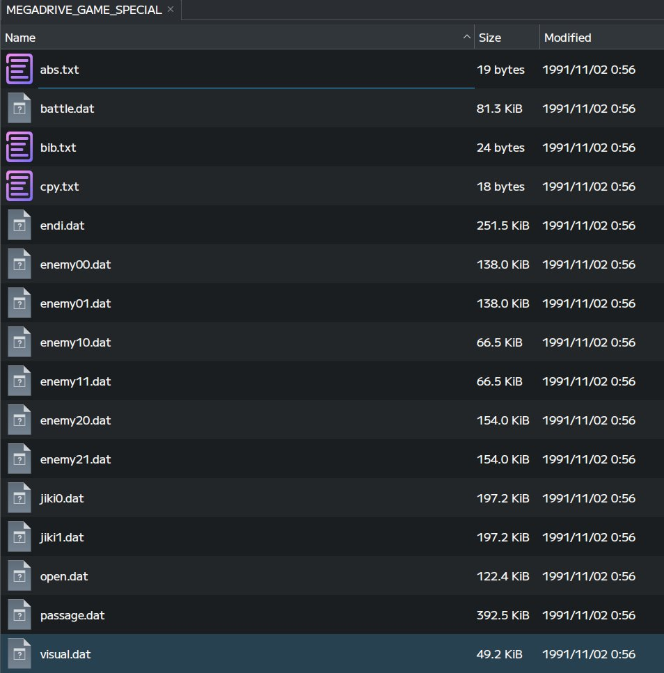
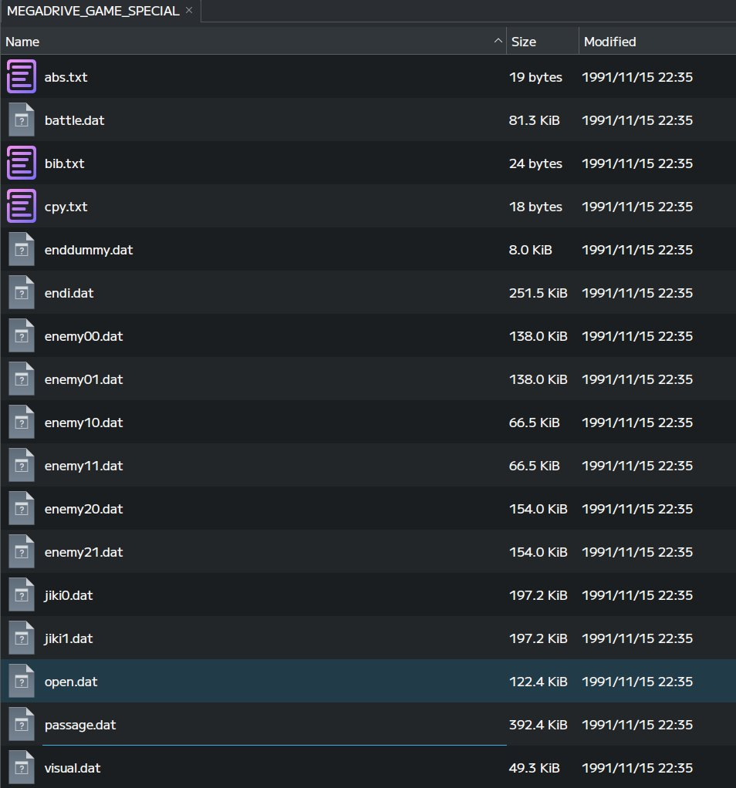
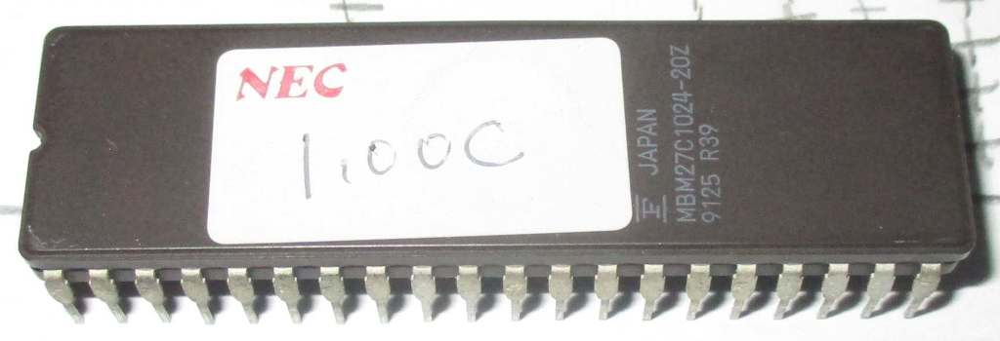

We have something a bit special today: a prototype of a Mega CD game! (*crowd cheers*) Unfortunately, it's one of, if not *the* worst game for the system: Heavy Nova. (*crowd boos*) But it does have something pretty interesting within it's data which redeems its value a bit. (*crowd cheers cautiously*)

Let's take a look.

<!--more-->

First of all, the game was [posted on archive.org here](https://archive.org/details/heavy-nova-prototype-19911102).

Let's see what's on the disc compared to the final version:

**Prototype**

**Final**

It's pretty much identical, both in file names and sizes. The only real difference is the inclusion of `enddummy.dat` in the final version, which may be there to simply pad out some space on the disc.

We can tell from the timestamps that this is a late prototype. The final version has a date of 1991-11-15 while the proto has 1991-11-02, just a couple weeks short of the master. While a lot can happen in a couple weeks leading up to a deadline, it would probably all be very minor changes and bug fixes rather than anything drastic.

Of course, I say "probably" because we can't do a comparison since the game isn't playable in its current state. If you load the game in an emulator or burn it and pop it into your Japanese Mega CD, you'll find that it won't be recognized as valid software and you end up at the CD Player in the BIOS.

This is what makes it makes it interesting: the security code in the game's boot sector appears to be for a prerelease version of the Mega CD hardware.

# Mega CD Security

Security on the Mega CD is pretty minimal. As it was the very dawn of consumer CD writers, a time when most people didn't yet have even a regular CD-ROM drive in their home PC, copy protection wasn't addressed. You can easily copy and burn games for the system without the need for a hardware mod.

The protection it does have is aimed more at unauthorized software development for the system. At the start of the IP (the game's boot code) located within the boot sector for all Mega CD games is a small chunk of data and code which must be present in order for the game to load. This "security code" was distributed to developers as a binary blob that could simply be included from within the assembly source. This chunk of data is, by design, identical across all revisions of hardware, though different for each of the major sales regions (Japan, US, and Europe).

It consists of a small bit of code that does some very minor system initialization, including calling the subroutine within the Boot ROM library that displays the "Produced By Or Under License From..." screen. It also contains the graphics that are used on that screen. (The US version of the security code is significantly larger for this reason, as it contains the more elaborate Sega logo and the Sonic sprite animation.)

What makes this all "secure" is that there is an copy of this security code within the hardware's internal Boot ROM. The version within the game must match *byte for byte* with the copy of the security code within the ROM. This check is done by the Sub CPU on startup, and if it does not match, the disc is not treated as Mega CD software and the system does not boot.

Which brings us back to Heavy Nova.

# Heavy Nova's Security

The security code within Heavy Nova does *not* match the copy stored in the internal Boot ROM/BIOS. With Heavy Nova being one of only two launch titles for the Mega CD, it seems that what we have is a version of the security code from a pre-production version of the BIOS.

(Pedantic side note: technically, what everyone generally calls the BIOS is an image of the Boot ROM, the chip containing all the low level system code for both the Main CPU (Mega Drive) and Sub CPU (Mega CD) sides, which is "distributed" to each side very early on boot. The system code that runs specifically on the Sub side is called the BIOS. However, I will use the term BIOS to refer to dumps of the whole ROM as that is the colloquial terminology.)

My first thought was to check against the ["pre-retail" version of the BIOS that was dumped some years back](https://gendev.spritesmind.net/forum/viewtopic.php?t=3043), version 1.00C. However, the security code there does not match either. Given how close the dates are on these versions (1991-11-02 for the Heavy Nova prototype and 1991-11-14 for BIOS 1.00C), this must have been a relatively last minute change.

The change is pretty minor, though. Let's compare the prototype version with the final.

Both versions set the reset vector at 0xFFFD02 to 0x280, which is a branch to the system reset code within the BIOS.

The final version then does an additional task of ensuring the Sub CPU is synced up by first resetting the Sub CPU (which additionally gives access to PRG-RAM from the Main CPU side), setting a jump vector within PRG-RAM to allow the Sub CPU to break out of a wait loop, and finally releasing the reset assertion.

This Sub CPU housekeeping is not done in the proto version. Presumably there was no wait loop on the Sub side in this older version of the BIOS.

From there, the two versions realign, with both of them setting a pointer to the graphics data within the security block and calling the boot logo subroutine before branching to the program's entry point.

So as far as logic goes, they are 90% identical. The graphics (the simple 1bpp SEGA logo) are the same as well. There is one more interesting, tiny difference towards the end however: there is a space in the wrong location within the romanized Japanese title for Sega Enterprises:

Proto: "KABUSHI KIKAISHA SEGA ENTERPRISES." 

Final: "KABUSHIKI KAISHA SEGA ENTERPRISES."

In any case, 90% identical isn't good enough: it needs to be 100% identical to allow the game to boot.

# Can it be fixed...?

The short answer is no. The longer answer is ehhHHHHHHhhhh maybe.

"Just patch in the newer security code and let it rip, that should fix it right?"

There are two problems with this approach. The first is that the length of the older security code is shorter than the final: 826 bytes versus 854 bytes, respectively. This means that the newer version would cut into the game's code that appears immediately following the security code.

One solution here would be to shift the the following code down by those extra bytes and then manually edit any pointers within the IP to account for the new offset. The IP isn't that large, after all, so sure, that's a possibility.

But there is one more difference within the prototype security code that must be noted: the address called for the boot logo routine in the proto (0x348) is different from the final (0x364). This is very important and brings us to the second problem.

While it might seem like a given that the address of routines will change across versions, it's problematic here because this calls into the [Boot ROM Library jump table](https://x.com/suddendesu/status/1348993850459578372). Essentially, that is the "API" for the boot ROM functions available to games. Thus the functionality assigned to each entry in this table cannot change across BIOS revisions or games will break. This goes for all Mega CD hardware iterations (Model 1, Model 2, Wondermega, Multi Mega, LaserActive, etc). 

So for this prototype security code to be calling a different address within the bootlib jump table indicates that there were major differences in this older, preproduction BIOS that the Heavy Nova proto was using.

"Okay, so fix that address for the boot logo display routine as well and we're good, right?"

The security code is not the only place the Boot ROM library is used. [As discussed in the link above](https://x.com/suddendesu/status/1348993850459578372), many Japanese games made use of this internal library. Indeed, even a quick analysis of the Heavy Nova prototype IP reveals it makes numerous calls into this table. Which is a problem for the reasons mentioned above: the functionality is different for these offsets in the final version.

For example, in the final version of Heavy Nova calls 0x368, which is `_BLIB_SET_VINT` to set the vblank interrupt vector, with the vector specificed in the A1 register. In the same place in the prototype, it is calling 0x340 instead. In the final BIOS, 0x340 is `_BLIB_CLEAR_COMM`, which will clear the gate array communication registers and likely screw up the synced state of the main and sub CPUs. We can see in the Heavy Nova proto that it is setting an address in A1, so we know its intention is to set the vint vector as the final version does, but it simply won't work.

Since there is extensive use of the Boot ROM library in the game's code, we would need to analyze all the code in the game and create a map of the old and new offsets for the jump table, then correct each and every call into the library across the entire game.

Is that do-able? Provided there aren't any additional issues like library functions from the old version that no longer exist in the newer one, or routines that have different calling parameters, then yes, it's possible.

Myself, however, I don't care to spend that time on a game like Heavy Nova, doubly so on a late prototype which likely has minimal differences. I salute anyone else who wishes to take on this challenge, however.

So while the game is unplayable, I do think it was worth the (very expensive) price as it contains this interesting little nugget of early Mega CD hardware history.
