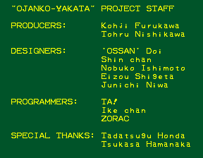
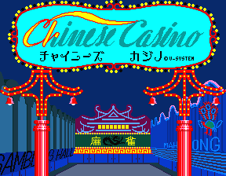

Still hacking around with MAME games, and I'm having a blast! This time I opened up Ojanko Yakata (roughly translated as Mahjong Girl Mansion), one of the many, many adult mahjong games to grace game centers of the past. I spotted some ASCII in the memory dump that looked like a hidden developer credits screen and investigated...

<!--more-->

And sure enough, I soon found the routine to display the text, as well as where it was called from, and how to activate it normally in the game: press B, I, and M at the same time any time on the title screen or attract mode. Note that this also works, with the exact same text, on Ojanko Yakata 2banken, which appears almost identical in code; the only difference is the girls.

There are a couple very similar games that run on the same hardware; one of these is Chinese Casino.

I opened it up as well, and also found a developer screen:

And sure enough, it has a similar way to enable it as Ojanko Yakata: press E, N, and C at the same time.

Do these letters correspond to anything? Well, if you re-arrange each, you could get IBM and NEC, two major computer manufacturers. That's my guess anyway.
