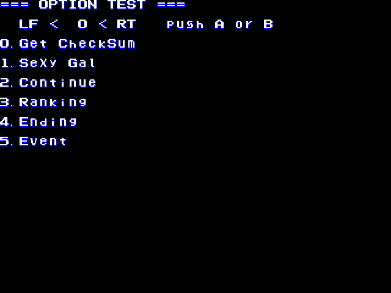
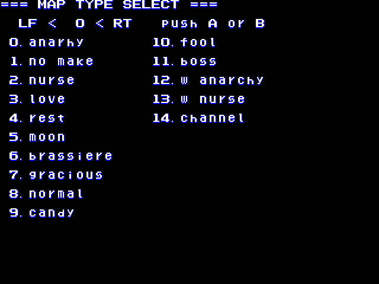
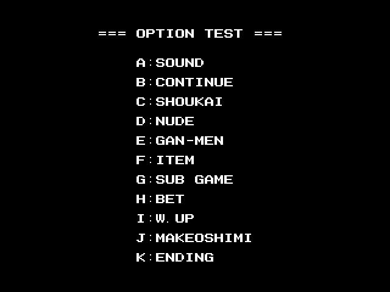

More Mahjong Menus! Next up we have Nyanpai and Musoubana, two games that run on the same Nichibutsu hardware and share most of the same artwork. They also share a hidden option test.

<!--more-->

Nyanpai (officially (mis-)transliterated as Niyanpai) is a twist on the tile-matching form of mahjong that most Westerners are familiar with, and Musoubana is a standard version of the hanafuda game Koi-koi. The art is pretty decent, and the Nyanpai gameplay is pretty easy to figure out for most people, making it one of the more playable porn games in MAME.

# Nyanpai

## Options Menu



First off we have a pretty standard options test. Get Checksum, interestingly, does nothing. The rest is pretty self-explanatory - Sexy Gal allows you to select one of the girls and go through each of their images. Continue, Ranking and Ending display those screens. Event allows you to select the pre-level cutscene for each level.

Now, most Nichibutsu mahjong games have such a pretty similar menu already available in the dip switches. At first I thought that perhaps MAME wasn't emulating some of the switches, assuming they were unused. However, in doing some research, I came across [this blog](http://gfront.sblo.jp/archives/201501-1.html), with some beautiful photos of PCBs and flyers. The DIP layout in the image matches what's in MAME, so even if this menu was at one time DIP enabled, it is clearly not meant to be in the final version.

I did spend some time disassembling, trying to find how it was normally enabled, and I did see some hints towards DIP settings, but I couldn't find anything definitive. For now, here's a MAME cheat to enable it:

```
  <cheat desc="Option menu">
  <comment>Reset the game after enabling</comment>
    <script state="on">
      <action>temp0=maincpu.mb@a319</action>
    </script>
    <script state="run">
      <action>maincpu.mb@a319=03</action>
    </script>
    <script state="off">
      <action>temp0=maincpu.mb@a319=temp0</action>
    </script>
  </cheat>
```

As a bit of technical background, it checks the value at 0x404D3 for the 'mode' to switch to at certain calls; a value of 3 brings it to the options menu. As such, you could have the cheat write to 0x404D3 constantly with 3, but instead I chose to rewrite part of the opcode where it sets the default mode (normally 2); that way the RAM location is naturally set to 3 anyway.

## Level Select



Now this is something I haven't seen in many mahjong games - an actual level select. Activating it by hacking was easy; trying to find out how it was naturally activated proved much more difficult, and several hours in I just gave up. It may have something to do with some bit of unknown/unemulated/developer hardware.

Anyway, it's a level select. Here's the MAME cheat for it:

```
  <cheat desc="Level select menu">
    <comment>Menu will load after the introduction/first cutscene</comment>
    <script state="on">
      <action>temp0=maincpu.md@163ee</action>
      <action>temp1=maincpu.mw@163f2</action>
      <action>maincpu.md@163ee=4e714e71</action>
      <action>maincpu.mw@163f2=4e71</action>
    </script>
    <script state="run">
      <action>maincpu.pb@40883=01</action>
    </script>
    <script state="off">
      <action>maincpu.md@163ee=temp0</action>
      <action>maincpu.mw@163f2=temp1</action>
    </script>
  </cheat>
```

Like the comment says, it loads during the level initialization, so you'll need to wait after the first cut scene for the menu to appear.

# Musoubana

## Options Menu



Like Nyanpai, and unlike most other Nichibutsu adult games, the test mode menu is not normally accessible, although it remains in the game fully working. Going through the menu we have:

 - Sound - A pretty standard sound test
 - Continue - Displays the CONTINUE? screen
 - Shoukai - Japanese for introduction; shows the screen when first meeting a girl
 - Nude - Mm-hmm.
 - Gan-men - Japanese for face; runs through the various faces displayed by the girls in a round
 - Item - Shows the card being laid out. Not sure if there's supposed to be more to it..
 - Sub Game - Screen goes blank for a second then returns to this menu. Interesting.
 - Bet - Runs through the stages of undress on the Bet screen
 - W. Up - Distributes the cards like it's about to start a game, then just sits there...
 - Makeoshimi - Japanese for sore loser; shows the screen after defeating one of the girls
 - Ending - Shows the ending.

I can't find the proper way to access this menu either, but I may just need to spend more time with it. For now, here's a MAME cheat to access it:


```
  <cheat desc="Options menu">
    <comment>Reset the game after enabling</comment>
    <script state="on">
      <action>temp0=maincpu.md@bfec</action>
      <action>temp1=maincpu.mw@bff0</action>
      <action>maincpu.md@bfec=4ef90001</action>
      <action>maincpu.mw@bff0=8368</action>
    </script>
    <script state="run">
      <action>maincpu.pb@40883=01</action>
    </script>
    <script state="off">
      <action>maincpu.md@bfec=temp0</action>
      <action>maincpu.mw@bff0=temp1</action>
    </script>
  </cheat>
```
