Yet another adult arcade quiz game, but this one has some pretty well-drawn and amusing artwork by [eromanga artist Miyasu Nonki](https://www.mangaupdates.com/authors.html?id=4951)! A while back I found the text for an alternate test menu, with object and background checks. I could never really track it down properly with the standard MAME disassembly. Maybe I just wasn't trying hard enough, because when I gave it another go yesterday, this time in IDA, I was finally able to find the routine as well as the non-hacked method for activating it.

<!--more-->

# Test Menu

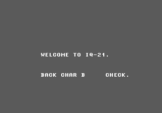

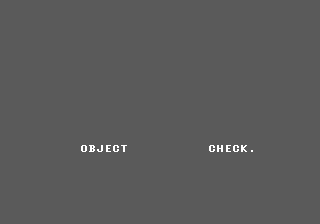

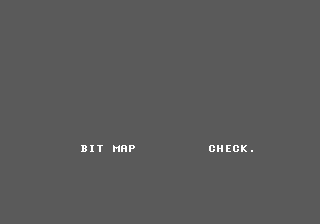

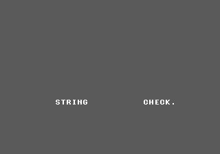

Not the most exciting menu, but there you have it. The full list of options are:

 - Object Check
 - Object 2 Check
 - String Check
 - Back Char Dump Check
 - Object Dump Check
 - Bit Map Check
 - Back Char B Check
 - Back Char A Check

To access this menu, make sure Service Mode is enabled in the dip switches, then hold P1 Button 1 and Button 2 while turning on (or resetting) the system.

## Object / Object 2 Check

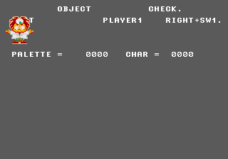

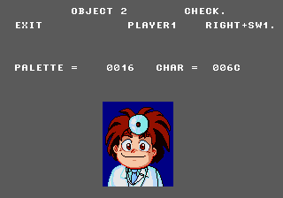

An object viewer, as you'd expect. P1 Up/Down to scroll through the objects, P1 Left/Right to switch palette. P1 Button 2 + Joystick moves the object around the screen (note the axes are reversed). P2 Button 1 enlarges the object, while P2 Button 2 shrinks it.

## Back Char A / B Check

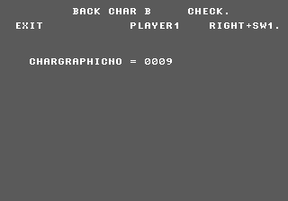

Similar to the object viewer, this is for viewing the static artwork in the game. P1 Up/Down to scroll through the items. P1 Button 1 to display the item, and P1 Button 2 to return.

## Object / Back Char Dump

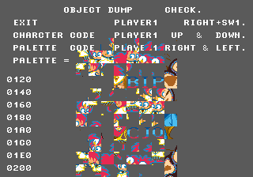

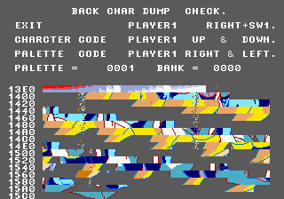

Basically, the raw tile versions of the objects and artwork.

## String Check

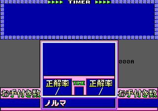

This is obviously meant to be a text string check, but it appears to not work. When you first choose String Check from the menu, the screen will clear as if it has locked up. However, the code is looping at 0xA3A3 looking for a value of 1 at 0xFF80DE. If you manually set that memory location to 01, this quiz screen pops up. You can scroll through the list with up and down, but that's all; nothing shows up. It may be an emulation issue with graphic priority... or it may just be broken.

## Bitmap Check

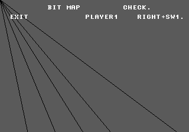

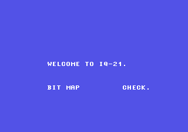

No idea. Shows this screen. When leaving this screen, the background color scrolls to bright blue from the top down.

In all of these menus, you can hold P1 Right and hit Button 1 to return to the main menu.

# Alternate Title Screens

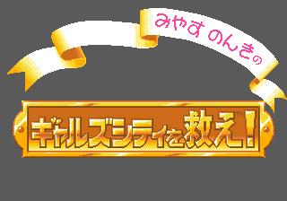

Among the Back Char art are four title screens for the game, two of which are not used (the other two can be selected via DIP switch). We have:

 - ギャルズシティを救え！ (Rescue Girls City!)
 - クイズ１８禁　１８歳未満は禁止なの！ (Quiz 18-kin - Under 18 Prohibited!)

Interesting. And to make things even more interesting, [there's a photo of the manual which uses the second 'unused' screen](http://gfront.sblo.jp/article/61475851.html):

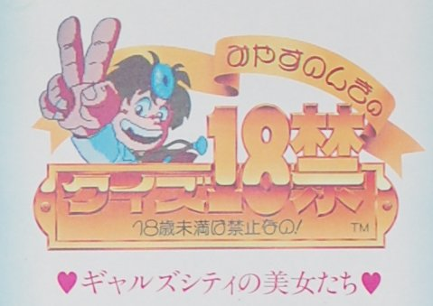

I'd bet the board in G-Front's photo is a different version than our dump, or maybe that screen was the old title screen which was changed after the manual went to print. It is a pretty "generic" subtitle after all. Who knows.
