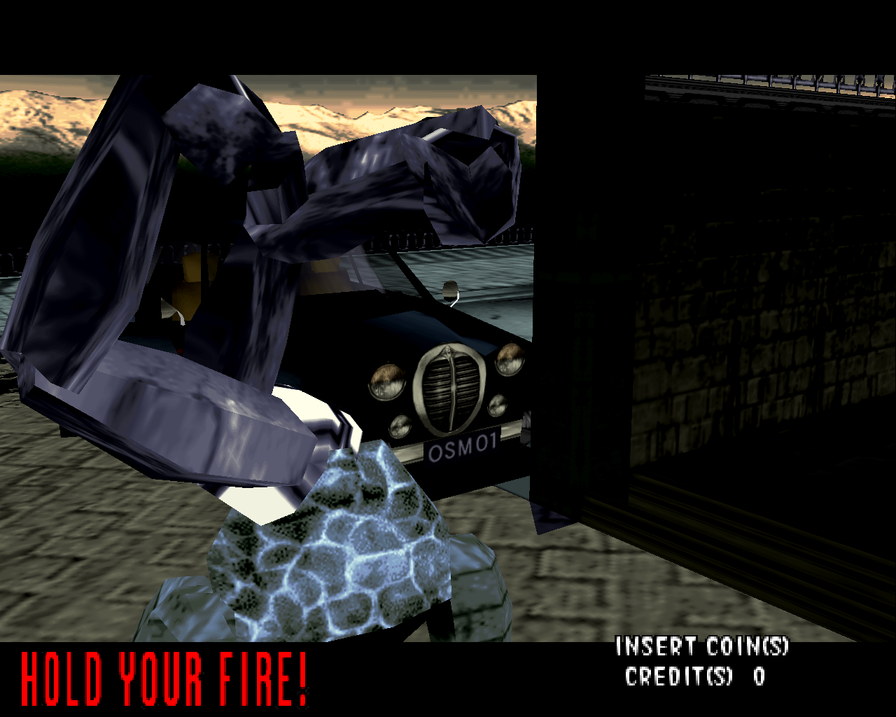
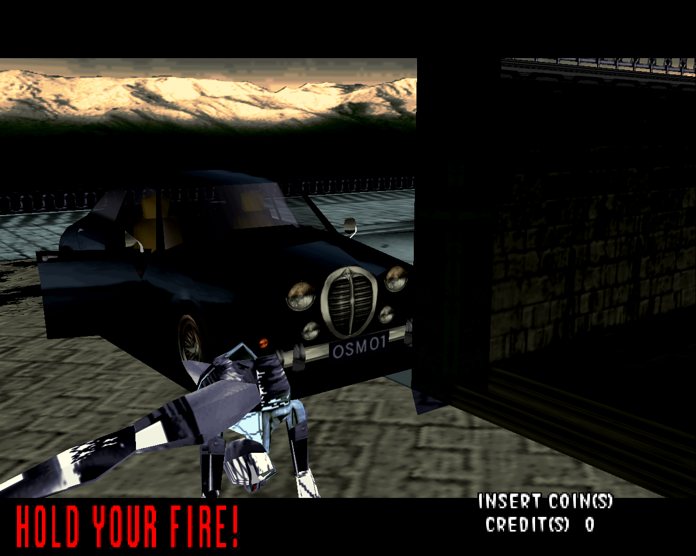

In which we take a look at the House of the Dead cheats and how they can be used to load model data from unused characters.

<!--more-->

Fairly recently, the Website of the Dead posted a tweet with [House of the Dead cheat codes](https://twitter.com/WeboftheDead/status/1214356339796959232). I had seen these before, but not just on various cheat listing sites.

```
ROM:0000D258 p1p2_sophie_input:.ascii "LRRLLR"<0>    # DATA XREF: ROM:loc_D358↓o
ROM:0000D258                                         # Both Players are Sophie
ROM:0000D25F                 .byte 0
ROM:0000D260 P1_sophie_input:.ascii "RLRRLL"<0>      # DATA XREF: ROM:loc_D388↓o
ROM:0000D260                                         # Player 1 is Sophie
ROM:0000D267                 .byte 0
ROM:0000D268 p2_sophie_input:.ascii "LRLLRR"<0>      # DATA XREF: ROM:loc_D3B8↓o
ROM:0000D26F                 .byte 0
ROM:0000D270 p1_rogan2_p2_g2_input:.ascii "LRLRLR"<0>
ROM:0000D270                                         # DATA XREF: ROM:loc_D3E8↓o
ROM:0000D270                                         # Both Players are Super G
ROM:0000D277                 .byte 0
ROM:0000D278 p2_g2_input:    .ascii "RRLRR"<0>       # DATA XREF: ROM:loc_D418↓o
ROM:0000D27E                 .short 0
ROM:0000D280 p1_rogan2_input:.ascii "LLRLL"<0>       # DATA XREF: ROM:loc_D448↓o
ROM:0000D280                                         # Player 1 is Super G
ROM:0000D286                 .short 0
ROM:0000D288 score_cheat_input:.ascii "LLLRR"<0>     # DATA XREF: ROM:loc_D478↓o
ROM:0000D288                                         # Display Score
```

In this snippet of code from the disassembly of The House of the Dead's program, we can see the cheats are strangely stored in plaintext. It might have been difficult for anyone to see this text at the time of the game's release, and surely even more difficult for someone to see this and understand that the "L" and "R" would be cheating inputs at the title screen. Regardless, there they are, but what's happening here to activate the cheats?

The game loads the cheat (ex. "LRLRLR") into one of the CPU's registers and logical ANDs the value with 0. If the value is still 0, the cheat code has not been entered correctly, and it checks to see if the next cheat code has been entered. If a comparison is equal to any other value but 0, that cheat's value is stored at 0x51EDAC in memory. The list of the cheats in numerical value are as follows:

1. P1 is Rogan2
2. P2 is G2
3. P1 is Rogan2 and P2 is G2
4. P2 is Sophie
5. P1 is Sophie
6. Both Players are Sophie
7. Score Display

Now how does this cheat know what players to load based on these values? Well, the routine for loading a player begins at 0x57CF0:

```
ROM:00057CF0 Load_Player:                            # DATA XREF: ROM:000C15B8↓o
ROM:00057CF0                 ld      cheat, g4
ROM:00057CF8                 ldis    0x70(g0), g2
ROM:00057CFC                 ld      P1_LIST[g4*8], g1
```

Now this code at 0x57CFC loads a long stored in a table that lists P1's values. P2's values follow immediately after P1:

```
ROM:000CA680 P1_LIST:        .long 2                 # DATA XREF: ROM:00057CFC↑r
ROM:000CA680                                         # ROM:0005814C↑r ...
ROM:000CA684 P2_LIST:        .long 0xD               # DATA XREF: ROM:0005871C↑r
ROM:000CA684                                         # ROM:00058B3C↑r ...
ROM:000CA688                 .long 0xE
ROM:000CA68C                 .long 0xD
ROM:000CA690                 .long 2
ROM:000CA694                 .long 0xF
ROM:000CA698                 .long 0xE
ROM:000CA69C                 .long 0xF
ROM:000CA6A0                 .long 2
ROM:000CA6A4                 .long 0x22
ROM:000CA6A8                 .long 0x22
ROM:000CA6AC                 .long 0xD
ROM:000CA6B0                 .long 0x22
ROM:000CA6B4                 .long 0x22
ROM:000CA6B8                 .long 2
ROM:000CA6BC                 .long 0xD
```

If we analyze this array of longs, we can see that P1 as 0x2 and P2 as 0xD are the default values. So that must mean the two longs immediately following this, 0xE and 0xD, indicate the value 0xE is the value for Rogan2. We can see that 0xF is G2 and 0x22 is Sophie.

By looking at a list of objects starting at 0xC8A3C in the ROM's data, we can see that these numbers match up in a plaintext way. Value 0x2 in this list is "BO_tom", 0xD is "BO_gman_kihon". So we can use this list to find a numerical value to replace in the array above to see what certain BO, or as I call them "body objects", may look like when loaded.

Using the cheat code for P1 as Sophie and replacing Sophie's value from 0x22 to 0x5, or "BO_mr_g", we can see that the removed Mr. G still has model data within the game, albeit it does not load properly and only loads for a single frame in this configuration:



The same goes for replacing Sophie with 0xA, or "BO_syndy":



In conclusion, the cheat works as follows: The game at the title screen checks for the player's inputs from the two lightguns. If the inputs match one of the cheat codes, that cheat's value is stored in memory at 0x51EDAC. When the game begins to load a player model, the value of 0x51EDAC is loaded into the CPU's g4 register and is multiplied by 8 to retrieve a long stored in an array list of body objects that correspond with what cheat is active. Of course, if no cheat is active, it grabs the first values in the array's list, which happen to be the default characters in the game.

While this isn't particularly ground breaking information, I thought it would be interesting to attempt to replace character objects in House of the Dead and always thought the cheats were the way to go about it. Obviously there is more to it than this, but this method does prove that body objects such as the removed characters Mr. G and Syndy still have model data inside the game worth investigating. I also felt it was important to document my process for others to learn just a little bit of the inner workings of House of the Dead.

This is my first entry here at Sudden Desu, and it's not quite as polished as Ryou's entries, but I hope you found this article insightful or entertaining.
