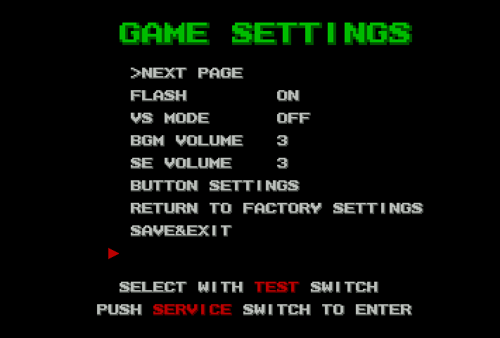
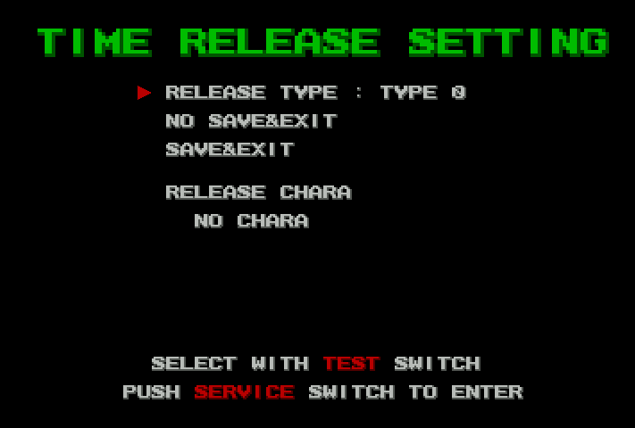
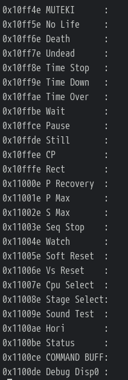

This is just a quickie article to archive some work done via twitter.

<!--more-->

# Time Release Menu

Recently [I was asked](https://twitter.com/ATG213/status/1380556473529475073) to have a look at King of Fighters XI, which has a so-called "Time Release" menu within its code. This menu instantly unlocks the various characters that are otherwise [only available](http://adb.arcadeitalia.net/dettaglio_mame.php?game_name=kofxi) under certain gameplay conditions or after many hundreds of hours of continual operation. The menu had [previously been found](https://wiki.hardedge.org/wiki/The_King_of_Fighters_XI:_Hidden_Content_in_the_Arcade_Version) by manually modifying memory, though the address was not documented. I was asked to see if there was any way to access this menu without hacking so hardware owners wouldn't have to wait such a ridiculous amount of time to access the characters.

I'm sorry to say that it appears the menu is normally inaccessible. It would have appeared as an extra option on the bottom of the second Game Settings page, like so:



While I haven't given this the weeks-long deep dive that I usually do for these articles, I feel that my understanding of the code around these menus is pretty solid at this point. There's no sign of a text string leftover indicating the Time Release screen as an option, nor a different way of accessing it outside of the normal test menus.

Interestingly, the "switch" in the program code that jumps to the options based on the cursor position in the menu still contains the call to the Time Release menu. However, the cursor position is limited by the menu definition, which is set to only 8 entries here. If you modify the menu definition to tell it there are 9 entries instead, you can move to the final "ghost" entry and...



... the menu works perfectly.

I find it a bit odd that the Time Release option appears below the Exit option. The strange ordering seems to imply it was always meant to be hidden, that maybe there was a way to increase that menu option count and and make the invisible entry selectable. That's probably just wishful thinking though and I don't want to assert that was actually the case. There's no sign of changing the count during runtime, and this [isn't the first game](http://sudden-desu.net/entry/disabled-test-options-in-bakuretsu-breaker) where debug options in the test menu are still full implemented but were disabled by removing them from the menu, so I think, unfortunately, there's no way for the hardware owners to access this menu without using a modified ROM.

On that note, here is the MAME cheat to modify the menu configuration and allow the cursor to move to the blank entry and select Time Release:

```
  <cheat desc="Enable Time Release menu">
    <comment>In the Test Menu, go to Configuration then Game Settings, and on the second page you can move the cursor to the blank slot below Exit. Selecting this will bring up the Time Release menu.</comment>
    <script state="run">
      <action>maincpu.pw@8c10f754=000A</action>
    </script>
  </cheat>
```

Atomiswave emulation on MAME is abysmal, but with the information above, someone could easily write a cheat for a different emulator (i.e. demul).

# Debug Options



There are a number of debug strings throughout the code, some of which are shown above. It looks like most, if not all, are still referenced. The ones shown above in particular are loaded into memory on startup to 0x8C126DF8 as a set of pointers along with some surrounding data which may be flags to enable/disable each option. Unfortunately, the game crashes in MAME before reaching any actual gameplay and demul doesn't run in Wine, so it's not really possible for me to explore these much further.

That's all for now! Maybe we'll come back to this game in the future when it's better emulated.
