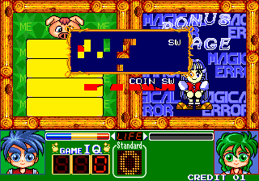

I noticed this menu a while back in Magical Error wo Sagase, a puzzle game where you search for differences between two images. In the past I was able to load the routine, but I guess the stack wasn't set up properly, and it would reset the game immediately after the text appeared. I took a second look at the disassembly tonight and had much better success.

<!--more-->

**THREE YEARS LATER UPDATE:** Here we are again, updating another old article after giving the game a more thorough analysis. The content has more than doubled in size now! Enjoy!

# Disable Memory Check

First thing's first: let's get rid of that memory check to speed things up and avoid any possible startup errors due to our cheats:

```
  <cheat desc="Disable memory check">
    <script state="on">
      <action>temp0=maincpu.md@614e4</action>
      <action>maincpu.md@614e4=4e714e71</action>
    </script>
    <script state="off">
      <action>maincpu.md@614e4=temp0</action>
    </script>
  </cheat>
```

# Stage Select


Let's talk about the fun stuff next: a fully working Stage Select! P1 Left/Right selects the Stage, while P1 Up/Down selects the round. Button 2 sets the Norm (the amount of errors needed to be found to pass the round) for the level, and Button 1 starts the round. There are a couple levels with blank names, but selecting them just takes you to an existing, working level. You also have access to the Bonus Rounds and the Ending.

It's interesting to note that there is a Japanese family name below each of the levels (Takagi, Matsumoto, Mawatari, etc). At first I thought it was the artist for that round's scene, but I'm not so sure now, as some of the artwork really doesn't match other art that has the same name. None of the names appear in the end credits (which are all nicknames anyway). I'm assuming that the names are the person responsible for that round. Maybe.

There's an interesting point about the bonus games listed here. There are eight stages, with a bonus round between each one, which should give us seven. In the normal game, there are five unique ones ([as outlined here](http://retrovania-vgjunk.blogspot.com/2013/08/magical-error-wo-sagase-arcade.html)) followed be a repeat of bonus rounds 1 and 2. However, the stage select lists a full seven! Indeed, it looks like there are two more bonus games in the code, though they are broken in a couple ways.

## Bonus Round 6




The game here is the same as the rotating picture match game from Mario Bros. 3: you'll need to time the button press to match each row of the image to form a complete picture. The code and graphics all seem to work fine, but all the text (aside from Japanese) is missing, giving us broken data as seen in the first screenshot.

# Bonus Round 7


Though the graphics are completely trashed, the gameplay for Bonus Round 7 still seems to work. It involves rotating a maze to maneuver something in order to collect... something. It's similar to the special stage from the original Megadrive Sonic the Hedgehog. And all the text is broken here too, as well.

The check for the level select occurs right before loading a level, including the levels before the demo screen. So it will show the level select during the attract mode, when it would normally show the demo. If you let it load this way, it will always be 2 player mode. If you want 1 player or 2 player only, you'll need to insert a coin, enable the code, then choose 1P or 2P start.

```
  <cheat desc="Level Select">
    <script state="run">
      <action>maincpu.pd@C0E23C=3</action>
    </script>
  </cheat>
```

# Demo Make


There is also a simple demo editor tool leftover. Note the 'Demo Make' text in the lower left. In this mode, the demo screens play, but you have player control. Also, the norma is double the usual demo mode, for whatever reason. Like most similar tools, nothing is actually saved. Instead, it is probably stored somewhere in RAM where the developer could grab it.

```
  <cheat desc="Demo Make Mode">
    <script state="run">
      <action>maincpu.pd@C0E23C=2</action>
    </script>
  </cheat>
```

# Other Regions


Another pretty big find is the discovery of other languages/regions in the code. Besides the default Japanese, we have USA, China, and Korea! As far as I can tell from internet research, there wasn't a release of the game outside Japan. Or if there was, it was obscure enough that it's been forgotten. The game is fully translated, with the exception of the end credits, which remain in Japanese.


This is controlled by the word value at 0xC0E29A, with four possble values: 0 for Japan, 1 for USA, 2 for China and 3 for Korea. Note that I use 'USA' instead of 'World' for English. This is because a big ol' ugly FBI "Winner's Don't Do Drugs" screen is present when set to 1, indicating it was for 'Murica. Here's the cheat to select the region:

```
  <cheat desc="Select Region">
    <parameter min="0" max="3" step="1">
      <item value="0">Japan</item>
      <item value="1">USA (English)</item>
      <item value="2">China</item>
      <item value="3">Korea</item>
    </parameter>
    <script state="run">
      <action>maincpu.pw@c0e29a=(param)</action>
    </script>
  </cheat>
```

# Unused Exception Handling

So now let's move on to some of the boring stuff. Oh boy!


There is an unused exception handler in the game. Nothing special here: it's similar to many other games, dumping the CPU register values to the screen. It was probably disabled so such nonsense wasn't displayed to the player in the off-chance that the game or hardware glitched.

In its place is a small chunk of code that increments a certain variable before jumping to the CPU's reset vector. That variable is only used in the exception code and as such acts as an error counter. During the game's startup, specifically during the warning screen, it will check that variable and if it is greater than zero, will display it in the lower left hand corner along with another variable that counts the number of times the game has reset. So this acts like a secondary, less intrusive error handler. It may have been used during a location test so devs could at least get an idea of how buggy the game still was, even if they didn't have extended information.

But in our final version, before the warning screen and early in the initial program, both those values are set to zero, effectively disabling this secondary handler as well. Of course, we can restore both of these very easily:

```
  <cheat desc="Restore exception/reset counter">
    <script state="on">
      <action>temp0=maincpu.mq@636</action>
      <action>maincpu.mq@636=4e714e714e714e71</action>
      <action>temp1=maincpu.md@63e</action>
      <action>maincpu.md@63e=4e714e71</action>
    </script>
    <script state="off">
      <action>maincpu.mq@636=temp0</action>
      <action>maincpu.md@63e=temp1</action>
    </script>
  </cheat>

  <cheat desc="Restore exception handler">
    <script state="on">
      <action>temp0=maincpu.md@914</action>
      <action>maincpu.md@914=4e714e71</action>
      <action>temp1=maincpu.mw@918</action>
      <action>maincpu.mw@918=4e71</action>
    </script>
    <script state="off">
      <action>maincpu.md@914=temp0</action>
      <action>maincpu.mw@918=temp1</action>
    </script>
  </cheat>
```

The chances that you'll actually see a crash during normal gameplay are pretty slim, though. If you really want to see it, use the emulator debugger and point the PC register to a random location. Exciting stuff. Woo.

# Test Mode Extras


There is a lot more going on in the test menus than I expected.

## Extra Options

First of all, there are two disabled options in the menu: Bookkeeping and Backup RAM Clear. Bookkeeping is an audit of money inserted, time played, level cleared, etc. Backup RAM Clear will clear the bookkeeping data. These were probably enabled during a location test to gauge sales, [something we've seen before](/entry/rod-land-location-test-code-and-stage-editor).

Both options are enabled with a RAM value. However, 'Backup RAM Clear' actually has an input code to enable: **press P2 Start and Service (9 in MAME) while on the Test Mode menu**. This will set the RAM value for the option. However, it will not display unless 'Bookkeeping' is also enabled. And there's no input code for that; it's fully disabled.

So, we need a MAME cheat to enable Bookkeeping, and then we can use the input code to make RAM Clear enabled:

```
  <cheat desc="Enable bookkeeping option in Test Mode">
    <script state="run">
      <action>maincpu.pw@FFFCCA=1</action>
    </script>
    <script state="off">
      <action>maincpu.pw@FFFCCA=0</action>
    </script>
  </cheat>
```

## Alternate Sound Test


There is also an alternate sound test available, with seperate controls for sound effect and BGM selection. The normal version uses Service/Test buttons (9 and 0 in MAME) to select the item to play while the alternate version uses player inputs. Player 1 controls BGM; Player 2 controls SFX. Joystick Up/Down changes the value by 1, while Left/Right changes by 10. Button 1 starts playback; button 2 stops; button 3 fades out.

This alternate version is enabled, once again, with a simple RAM value, making a MAME cheat extraordinarily easy:

```
  <cheat desc="Use alternate sound test">
    <script state="run">
      <action>maincpu.pw@FFFCC8=1</action>
    </script>
    <script state="off">
      <action>maincpu.pw@FFFCC8=0</action>
    </script>
  </cheat>
```

Somewhat interestingly, if that RAM value is set to 2 when entering the test mode, it will jump straight to the sound test. I don't have a hack for that since there seems to be an issue with MAME where RAM cheats are not applied in time for code that happens very early after a reset. But it's nothing more than an interesting footnote.

The alternate version is a bit nicer to use since the controls are connected to the player inputs. I assume it has something to do with the design of the final machine, which is also why I assume the test mode uses Service/Test buttons instead of player controles. But I can't seem to find any pictures of the cabinet online, so who knows...

# Alternate Test Mode


We're not done with test mode weirdness yet. In fact, there appears to be a whole other, possibly disabled test mode!

In this version, you press P1 Start to move through each test. The first ones are text scrolling vertically on three of the graphics planes, then a color test on plane 3. Next is a sprite test, where each letter in the word 'SPRITE TEST' scrolls up and down. After that is a sound test that plays a few FM tones followed by PCM sound effects in a loops, and finally there is an input test, which tracks which buttons were successfully pressed.

Note that I wrote this is *possibly* disabled. I say that because there is a path to this code. During startup, the highest bit of DIP switch 2 is checked. If it is unset, the game will jump to this test mode. I haven't been able to find an online copy of the game's service manual, so I don't know if there is any mention of the setting there. Unfortunately, MAME does not emulate all the switches, opting to only use the ones with a function listed in the standard test mode, so I have a small hack that will jump to this alt mode instead of the usual one when the normal "Test Mode" switch is set:

```
  <cheat desc="Alternate Test Mode">
    <comment>Replaces the standard menu when the 'Test Mode' switch is set</comment>
    <script state="on">
      <action>temp0=maincpu.mb@614a7</action>
      <action>maincpu.mb@614a7=3</action>
    </script>
    <script state="off">
      <action>maincpu.mb@614a7=temp0</action>
    </script>
  </cheat>
```

Maybe I'll add in all the DIP switches in to MAME as a rainy day project someday.
