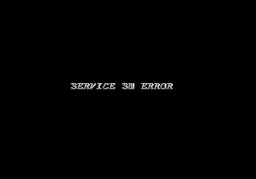
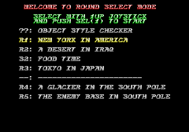
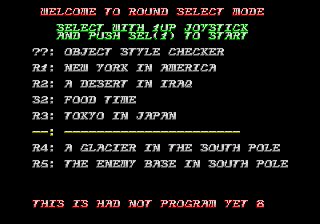
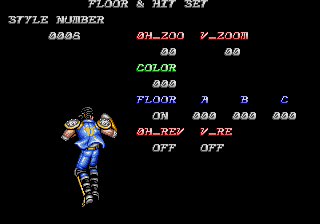
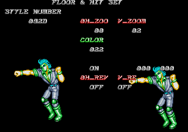
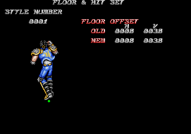
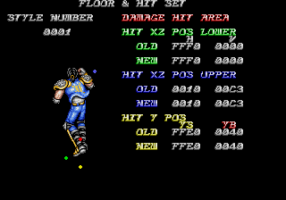
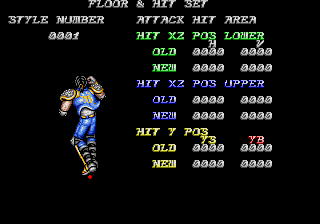

Well, that's enough mahjong for now... Let's try something a little more exciting! Like the title screen implies, Riding Fight is a FRONT VIEW SPEED ACTION GAME featuring a couple of hoverboard riding radical dudes from the future who punch everything in their path. And it turns out it has a level select screen!

<!--more-->

A few hours into following the disassembly around and testing with the debugger, I found how the code is activated: while the game is turning on, hold the service button until the SERVICE SW ERROR text appears.



Let go of service, and hit Start, Start, Start, Service, Start. (The starts are P1 Start.) If you're using the default MAME mappings, that would be 1, 1, 1, 9, 1. You have about 3 seconds to enter the code. You'll know it worked if it goes to the next screen, instead of restarting again. I've confirmed it works on all three versions that have been dumped.

Note that all this code does is set a word value of 0xFFFF to 0x408284. As such, we can skip the button presses and use a MAME cheat:

```
  <cheat desc="Level Select Menu">
    <comment>Enable then insert a coin; disable before resetting the system</comment>
    <script state="run">
      <action>maincpu.pw@408284=FFFF</action>
    </script>
    <script state="off">
      <action>maincpu.pw@408284=0000</action>
    </script>
  </cheat>
```

After the Taito logo, you'll be greeted with this lovely menu:



You'll probably notice the empty slot right away; I know I did. And when you select it...



This is had not program yet! Oh.. okay...

The rest of the entries bring you to their respective levels, of course. After picking an entry, you'll be brought to the character select spring, then brought to your choice. There's also the Object Style Checker at the top. Let's check that out.





The initial screen lets your scroll through all the sprite objects. 2P up and down cycles through them; holding P2 button 1 scrolls faster, while P2 button 2 scrolls by the upper digit. P1 button 2 cycles between the H_ZOOM/V_ZOOM (sprite scaling) and the FLOOR options. FLOOR can be turned off with P1 button 1, P1 button 3 cycles between floor A, B, and C. P2 buttons 1, 2 and 3 assign the current sprite to floor A, B, or C respectively. While in floor mode, the P1 joystick moves that floor around. Holding P1 button 4 and pressing P1 button 2 increases Color and also turns on/off V_REV (vertical mirror). Oddly, if you hold P2 button 1, while doing the color/V_REV cycling, it will play a sound effect each time. I haven't found a way to decrease color or set/unset H_REV yet.

What a mess of controls. And we're not done yet! Hit P1 Start to go to cycle through Floor Offset, Damage Hit Area, and Attack Hit Area.







P1 button 1 cycles through each section on each screen, including a "MASTER NO." that appears at the bottom, which can be scrolled through with P2 up/down. No idea what the MASTER is for. You can set coordinates for a bunch of settings related to hit boxes. Note that after hitting P1 start to get to these three menus, you can't go back to the original menu (the one above, with the H_ZOOM/V_ZOOM, etc).

The controls are such a mess that there are probably some more button combos I've missed, but I leave that to someone more adventurous than I.

Let's take a step back for a minute and look at something else interesting that I found. I started tracking down this level select menu when I saw the ASCII strings for the menu:

```
WELCOME TO ROUND SELECT MODE
SELECT WITH 1UP JOYSTICK
AND PUSH SEL(1) TO START
??: OBJECT STYLE CHECKER
R1: NEW YORK IN AMERICA
R2: A DESERT IN IRAQ
S2: FOOD TIME
R3: TOKYO IN JAPAN
--: ----------------------
R4: A GLACIER IN THE SOUTH POLE
R5: THE ENEMY BASE IN SOUTH POLE
R6: THE FINAL BOSS
S5: FIGHTING AMONG PLAYERS
THIS IS HAD NOT PROGRAM YET!
```

Wait, what's that? There are a couple lines that do not appear in the actual menu: "R6: THE FINAL BOSS" and "S5: FIGHTING AMONG PLAYERS"

I assume that the Final Boss is just that; perhaps it was its own separate level at first. The Fighting Among Players is interesting; it's marked as S5, implying it's a bonus round (like the S2: Food Time above it). I see no sign of it in the [full playthrough](https://www.youtube.com/watch?v=sS8VFzfx8MM), so I guess we can assume it's a cut level.

So there you have it. Enjoy!
