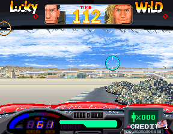
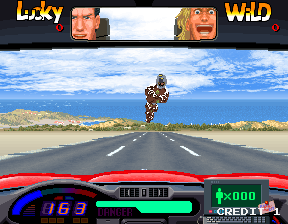
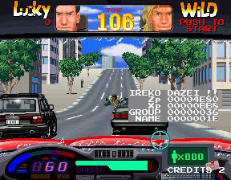

Lucky & Wild is a crossover between arcade racing and lightgun shooting genres with a buddy-cop twist. As always, [Hardcore Gaming 101 has a great description of it](http://www.hardcoregaming101.net/lucky-wild/). Unfortunately, I've never seen it in an arcade, but it seems like a lot of fun. The game code has a few disabled test menus as well as a round select that has what appear to be test levels! There are also a small truckload of debug tools that were more than a little bit difficult to get working...

<!--more-->

# Round Select


Select a stage by shooting at the option. I'm not certain if it's an emulation issue or a bug in the code, but the target doesn't exactly line up with each option. It seems you need to point up and to the right to get the item you want. The entries do get highlighted as you pass the gun over them, but, depending on what palette is loaded when you insert a coin, the highlight can be minimal and hard to read. If you wait for the first in-game demo to insert coin, you'll get a black background with yellow highlighting, which makes things much easier to see.

There are only six stages in the game but there are eight rounds are listed in the menu! Prepare for disappointment, though: RND7 will roll the credits, and RND8 starts on the Stage 1 intro screen with a broken palette, and then locks up when the actual level starts. The most interesting thing is the TST entries which appear to be test stages.







Several test stages consist primarily of obstacles in the middle of the road, and some jump immediately to the boss. The credits test stage (TST7) has an odd broken-palette object in the air which seems to knock the car upwards, followed by a jump to the exception handler (though, interestingly, the credits continue to roll and the program remains responsive). TST1 doesn't work at all. The fact that these exist and are accessible is kind of cool, but there doesn't seem to be anything amazing in them as far as content goes.

Here's the MAME cheat to enable the round select:

```
  <cheat desc="Enable Round Select">
    <comment>Displays round select after inserting coin</comment>
    <script state="on">
      <action>temp0=maincpu.mb@4953</action>
      <action>maincpu.mb@4953=FE</action>
    </script>
    <script state="off">
      <action>maincpu.mb@4953=temp0</action>
    </script>
  </cheat>
```

## Round Select - Technical

Getting the round select working was pretty simple, actually. Its code begins at 0x49DA and is referenced as the very first entry in the pointer table at 0x4992. This table is used by the gameplay loop code, beginning at 0x4950. On entering that loop code when a coin is inserted, it sets the initial value to the second entry, for the 1/2 Player select screen. If we change that initial value to one less, to that first entry in the pointer table, it now jumps to the level select. Easy-peasy.

# Disabled Test Menus

The game's service mode consists of five screens: game options, input test, gun calibration, crosshatch and colorbars, with the Service 1 button used to cycle through them. However, there are six more screens that are disabled: ADS mode, sound test, three graphics viewers and an object test.

## ADS mode


ADS seems to be Namco's terminology for gameplay auditing. Nothing much interesting here.

## Sound Test


The sound test here works, but it uses hardware inputs that are no longer present on the final machine. Which is to say, you can't actually control anything here. And even if you could, there's a bug in the code... More on all that in the technical section below.

## Raw Graphics Viewer


This is a very basic, raw view of the graphics data. P1 Pedal 2 scrolls though the data, one way only.

## Tile Viewers


There are two tile viewers that appear one after another. They are identical in usage, the difference being that each points to a different block of graphics.

P1 Pedal 1 increases palette number, while P1 Pedal 2 descreases the number. The steering wheel scrolls through the tiles.

## Object Viewer


The object viewer displays the various objects appearing in the actual driving gameplay, fully assembled from the tiles.

As with the tile viewers, P1 Pedal 1 and 2 change the palette, while the driving wheel scrolls through the objects. It also uses the same unemulated inputs that the Sound Test uses, to move the objects around the screen. We'll talk about those next.

## Disabled Test Menus - Technical

All though not as immediately simple as the round select function, accessing the disabled test menus was relatively straightforward. Each of the test mode functions end by setting a pointer to the next test mode function. Normally, the color bars screen sets a pointer back to the first screen (game options), making the other test mode options orphaned code.

We can correct this by changing the color bar "next function" pointer to the Sound Test at 0x2558. The sound test, in turn, is already coded to next call the raw graphics viewer, which calls the first tile viewer, which calls the second tile viewer, which calls the object viewer, which then calls the game options, to give us a loop.

However, this leaves out the ADS audit screen. Examining its code, we see that it would set the "next function" pointer to the crosshatch function that normally appears after the lightgun calibration screen. This gives us a proper placement for it in the test mode order, so we replace the lightgun calibration "next" pointer to the ADS code, which then calls crosshatch. Our cheat is complete, integrating all the missing test mode screens with just a couple of word-sized modifications:

```
  <cheat desc="Re-enable disabled test menus">
    <comment>Re-enables the full sound test, ADS mode, and art viewers</comment>
    <script state="on">
      <action>temp0=maincpu.mw@2552</action>
      <action>maincpu.mw@2552=2558</action>
      <action>temp1=maincpu.mw@2354</action>
      <action>maincpu.mw@2354=3E56</action>
    </script>
    <script state="off">
      <action>maincpu.mw@2552=temp0</action>
      <action>maincpu.mw@2354=temp1</action>
    </script>
  </cheat>
```

## Non-existant hardware inputs

As mentioned above, a couple of the test mode functions (and debug tools, which we'll get into later) expect input from hardware that is not present in the final machine. In particular, the test mode tools are looking for Up/Down/Left/Right inputs from a standard joystick. It's safe to infer that such hardware was present for development.

(As a side note, I'm careful not to say *unemulated inputs*, which would be technically incorrect as the inputs simply aren't present to start with. We can add extra input mappings to the MAME source easily and recompile for research, but it would not be machine accurate and thus not appropriate for the mainline project.)

More precisely, the code is checking bits on the inputs on the Player 1 digital input. This input is partially used: bits 4 and 7 act as the Gun Trigger and Start button, respectively. Bits 0 to 3 would correspond to Up/Down/Left/Right. Bit 5 is also referenced in a way that suggests it was a button (see the Memory Viewer section below). With bit 7 as Start, it's a safe bet that bit 6 was also a button, which gives us a pretty standard joystick bit map:

<table>
	<tbody>
		<tr>
			<td>Bit 0</td>
			<td>Right</td>
		</tr>
		<tr>
			<td>Bit 1</td>
			<td>Left</td>
		</tr>
		<tr>
			<td>Bit 2</td>
			<td>Down</td>
		</tr>
		<tr>
			<td>Bit 3</td>
			<td>Up</td>
		</tr>
		<tr>
			<td>Bit 4</td>
			<td>Gun Trigger</td>
		</tr>
		<tr>
			<td>Bit 5</td>
			<td>Button 2</td>
		</tr>
		<tr>
			<td>Bit 6</td>
			<td>Button 3</td>
		</tr>
		<tr>
			<td>Bit 7</td>
			<td>Start</td>
		</tr>
	</tbody>
</table>

We can manually set these bits using the MAME debugger on any of the input vectors that are used by the MCU, which I've provided here for reference. All are word-sized values.

<table>
	<tbody>
		<tr>
			<td>0x460000</td>
			<td>P1 (const)</td>
		</tr>
		<tr>
			<td>0x460002</td>
			<td>P2 (const)</td>
		</tr>
		<tr>
			<td>0x460006</td>
			<td>P1 (single)</td>
		</tr>
		<tr>
			<td>0x460008</td>
			<td>P2 (single)</td>
		</tr>
	</tbody>
</table>

The Sound Test reads from P1 const while the Object Viewer reads from P1 single. (By const and single, I am referring to a constant or single button press, as was [discussed in the Namco Classics article](/entry/namco-classics-collection-dev-messages-and-debug-tools-galore)). Manually setting the bits on these addresses will cause the code to react as if input was made.

However, instead of messing with memory locations, it's probably easier to use these MAME cheats to directly set the values in memory:

```
  <cheat desc="Sound Test - Set FM">
    <comment>P1 Trigger plays the sound</comment>
    <parameter min="0" max="0xff" step="1"/>
    <script state="on">
      <action>maincpu.pw@106a1a=ffff</action>
    </script>
    <script state="run">
      <action>maincpu.pw@106a10=param</action>
    </script>
  </cheat>

  <cheat desc="Sound Test - Set PSG">
    <comment>P1 Trigger plays the sound</comment>
    <parameter min="0" max="0xff" step="1"/>
    <script state="on">
      <action>maincpu.pw@106a1a=0</action>
    </script>
    <script state="run">
      <action>maincpu.pw@106a12=param</action>
    </script>
  </cheat>

  <cheat desc="Sound Test - Set VOX">
    <comment>P1 Trigger plays the sound</comment>
    <parameter min="0" max="0xff" step="1"/>
    <script state="on">
      <action>maincpu.pw@106a1a=1</action>
    </script>
    <script state="run">
      <action>maincpu.pw@106a14=param</action>
    </script>
  </cheat>

  <cheat desc="Object Viewer - Set X Pos">
    <parameter min="0" max="0xff" step="1"/>
    <script state="run">
      <action>maincpu.pw@1069a0=param</action>
    </script>
  </cheat>

  <cheat desc="Object Viewer - Set Y Pos">
    <parameter min="0" max="0xff" step="1"/>
    <script state="run">
      <action>maincpu.pw@1069a2=param</action>
    </script>
  </cheat>
```

A technical note about the Object Viewer X/Y pos: these values are actually signed, meaning they can go negative. However, in practice, positive values from 0 to 255 are perfectly fine for actually viewthing the graphics within the viewport, so there's no reason to overcomplicate the cheats.

## Broken Sound Test

There is actually a bug in the sound test that would be encountered if the inputs were still hooked up. It's actually inconsequential with the cheats above, but it's small so we'll go over it quickly.

<pre class="pdasm pdasm-arch-m68k">
soundTestLoop:
002658: move.w  $460000.l{p1ShotStart_constant}, D0 ; check for button hold
00265E: lsr.w   #2, D0
002660: andi.w  #$3, D0 ; filter for bits 2 & 3 (down & up) on the P1 const input
002664: move.w  D0, (-$a00,A6)
002668: bne     $26d2 ; if up or down are pressed, jump down
00266C: move.w  #$ffff, (-$15e8,A6)
002672: move.w  $460006.l{p1ShotStart_single}, D0 ; read from p1 single input
002678: andi.w  #$f, D0
00267C: move.b  $2688.l{jumptableOffsetRef}(pc,D0.w), D0 ; get the value from the offset table based on the value from the input
002680: ext.w   D0
002682: movea.l $2698.l{jumpPtrs}(pc,D0.w), A0 ; get jump address from the pointer table
002686: jmp     (A0)
jumptableOffsetRef:
002688: dc.b  0
002689: dc.b  4 ; left
00268A: dc.b  8 ; right
00268B: dc.b  0
00268C: dc.b $A ; down (should be 0xC!)
00268D: dc.b  0
00268E: dc.b  0
00268F: dc.b  0
002690: dc.b $A ; up (should be 0xC!)
002691: dc.b  0
002692: dc.b  0
002693: dc.b  0
002694: dc.b  0
002695: dc.b  0
002696: dc.b  0
002697: dc.b  0
jumpPtrs:
002698: dc.l $26a8{idle} ; offset 0
00269C: dc.l $26aa{cursorRight} ; offset 4
0026A0: dc.l $26a0{cursorLeft} ; offset 8
0026A4: dc.l $26d2{adjustSoundId} ; offset C
</pre>

Th gist of this chunk of code is to jump to one of four addresses based on the joystick input. For left or right, jump to code to move the cursor in that direction; for up or down, jump to code to modify the sound id (as well as some other stuff); for anything else or no input, jump to code that does nothing.

It's a relatively simple problem with an oddly convoluted solution: it grabs the value from the joystick (which can be from 0 to 15, since it is a byte AND'ed to a nibble) and uses it as an offset on a reference table to obtain another value that acts as an offset to a second table which contains pointers to the code. In other words, the values in jumptableOffsetRef refer to the entries in the jumpPtrs table. Since jumpPtrs contains long-sized values (4 bytes each), each entry is offset by 4: 0, 4, 8, 0xC.

The bug here is located in the jumptableOffsetRef table, where, for values 4 and 8 (down and up), it specifies a jumpPtrs table offset of 0xA. This is incorrect since 0xA is only two bytes after 8 when it should be four bytes. So the CPU will jump to 0x26AE0000, hit invalid code, and crash.


The fix is very simple: change the 0xA entries to 0xC.

```
  <cheat desc="Correct Sound Test bug">
    <script state="on">
      <action>temp0=maincpu.mb@268c</action>
      <action>maincpu.mb@268c=c</action>
      <action>temp1=maincpu.mb@2690</action>
      <action>maincpu.mb@2690=c</action>
    </script>
    <script state="off">
      <action>maincpu.mb@268c=temp0</action>
      <action>maincpu.mb@2690=temp1</action>
    </script>
  </cheat>
```

Again, this isn't necessary if you're using the cheats from above to set the values directly. I just enjoy finding and fixing obscure bugs in 25+ year old games.

# Partially Unused Background Graphic


On the left is the usual scene after finishing a stage, with the ladies of the Pink Cats Garage around the car. However, the girls are actually a seperate image overlay. The background is fully illustrated, as you can see with the unobscured image on the right.

# Usage Meter


At 0x14E58 in the main CPU's code is what appears to be a usage meter of sorts. It is displayed as a horizontal white bar with X's above it acting as a gauge. The length of the bar represents the number of active 'obstacle objects.'

While I've not researched this piece of the gameplay code extensively, there is a stack of 0x80 sized objects starting at 0x104100, with a maximum of 0x12 objects. These are the various obstacles that appear in the game, such as the exploding barrels, thrown grenades and traffic barriers. However, it may also be some invisible effects.

The code to process this object stack is at 0x14CC6, with the pointers to each object's code listed in the table at 0x14D46. There are 67 pointers in the list, though only 12 of them actually lead to substantial code. The rest jump to an RTS, making them empty.

Right after this pointer table is our usage meter code, which is unreferenced. It's code is relatively simple: draw a block for every active 'obstacle object.' There is a check on the DIP switches at the start as well: switch 4 (marked as $2000-4 in the MAME settings) must be set Low.

Since it is unreferenced, we don't know how it was properly called. It seems likely, though, that it would have been called from the "process objects" code mentioned above. Restoring calls to orphaned code is always a challenge since there is rarely empty space to insert a branch or jump. This was no exception. The process objects code is tight, but after some analysis and thinking, I found the answer.

The code loops over all 12 object slots, checking the first word value of each. This value is the "ID" which corresponds to the entry in the pointer table for each object's code. If the ID is 0, it is inactive, and the code skips the processing and jumps down to loop to the next slot. Since 0 is an 'invalid' value representing an inactive slot, this means that entry index 0 in the pointer table will never be called. (Not that anything would happen even if it was valid: it's one of the majority 'pointer to RTS' entries in the table.) And that gives us four extra bytes to insert a BSR to the CPU code!

At least, that's the high level summary. There's a couple other changes that need to be made, but this is already unnecessarily technical. Here's the cheat to show the usage meter in gameplay:

```
  <cheat desc="Restore usage meter">
    <comment>DIP switch 4 ($2000-4 in MAME) must be set LOW</comment>
    <script state="on">
      <action>temp0=maincpu.mq@14d3e</action>
      <action>maincpu.mq@14d3e=610001184e754250</action>
      <action>temp1=maincpu.md@14d46</action>
      <action>maincpu.md@14d46=424760ea</action>
      <action>temp2=maincpu.mw@14d1c</action>
      <action>maincpu.mw@14d1c=6026</action>1
    </script>
    <script state="off">
      <action>maincpu.mq@14d3e=temp0</action>
      <action>maincpu.md@14d46=temp1</action>
      <action>maincpu.mw@14d1c=temp2</action>
    </script>
  </cheat>
```

# Memory Viewer


This is a very rudimentary tool for checking the values at an arbitrary address in memory. It displays an offset and a 16 byte dump of the data from that address on the right side of the screen. There are also two values on the left middle, and one value at the bottom.

This is another dev tool that uses the non-existant P1 inputs: Left and Right are used to position the cursor along the memory offset, while Up and Down change the value. It also uses what would have been Button 2 (bit 5 on the MCU input vector, mirrored to 0x1009EA). Holding that button makes the viewer active, though the text remains on screen even when releasing it.

It's unclear what the two values on the left side were for. The upper value (stored at 0x100088) is changed when pressing Left or Right, though this has no relation to the offset cursor (which also uses Left/Right at the same time). The lower value is at 0x1002B4, which is not used anywhere else in the code.

On the bottom is a three digit value that is curiously rendered on the the sprite layer rather than the text layer. This means it is covered by the car overlay during gameplay, though it is briefly visible during damage flashes. The value changes during gameplay, but I haven't been able to determine where the value is coming from.

It seems it was meant to run during actual gameplay (though given how old this code seems to be, it may have been that there was only 'gameplay' then, with no title screen, etc) as the cursor blink timing relies on 0x4090C0, a counter in the main loop that is only incremented in gameplay.

Re-implementing this tool is relatively easy. It is present in the sub CPU's code and is blocked off by an RTS at 0x16B4. This RTS is actually called from the IRQ 2 (labeled as EXIRQ in the MAME source - External IRQ?) code, so restoring it is as simple as NOPing the RTS. However, since it is checking for the non-existant P1 Button 2 to activate, we still don't get anything on the screen. And even if we remove those checks, we still can't actually interact with it, and will always see the contents of memory at 0x0.

We can deal with the button check by remapping it to one of the inputs that does exist in the game, which are P1 Start and P1 Gun Trigger. Alternatively, we can remove the button check altogether and have the viewer active on the screen at all times.

Changing the offset is a little more difficult. The value for the offset is stored as a dword at 0x100014 (in the sub CPU RAM), so you can just manually change it there using MAME's debugger. Alternatively, you can use the Remap Inputs cheat that I go into detail about in the last section of this article. If you choose that route, note that you'll have to use the 'always active' version of the button check fix. This is because the Remap Inputs cheat changes P1/P2 Starts to a directional inputs and it also trashes the code that mirrors the Gun Trigger constant inputs. So we don't have any remaining digital inputs to easily use as the button check replacement. The solution there is to bypass the button check completely.

Here are both versions of the cheat:

```
  <cheat desc="Restore memory viewer">
    <comment>Hold P1 Start to show memory viewer; offset can be changed @ dword 0x100014 in sub CPU RAM</comment>
    <script state="on">
      <action>temp1=slave.mw@16b6</action>
      <action>slave.mw@16b6=4e71</action>
      <action>temp2=slave.mb@16bf</action>
      <action>slave.mb@16bf=ee</action>
      <action>temp3=slave.mb@17e7</action>
      <action>slave.mb@17e7=ee</action>
    </script>
    <script state="off">
      <action>slave.mw@16b6=temp1</action>
      <action>slave.mb@16bf=temp2</action>
      <action>slave.mb@17e7=temp3</action>
    </script>
  </cheat>

  <cheat desc="Restore memory viewer (always active)">
    <comment>Offset can be changed @ dword 0x100014 in sub CPU RAM</comment>
    <script state="on">
      <action>temp1=slave.mw@16b6</action>
      <action>slave.mw@16b6=4e71</action>
      <action>temp2=slave.mw@16c0</action>
      <action>slave.mw@16c0=4e71</action>
      <action>temp3=slave.md@17e8</action>
      <action>slave.md@17e8=4e714e71</action>
    </script>
    <script state="off">
      <action>slave.mw@16b6=temp1</action>
      <action>slave.mw@16c0=temp2</action>
      <action>slave.md@17e8=temp3</action>
    </script>
  </cheat>
```

# IREKO DA ZE!



This is really more of an error message, but it certainly would have been used for debugging. It's also the only "debug" function that is still referenced in the code. It displays "IREKO DAZEI!!" followed by the values from a few memory locations.

Its code first checks the DIP switches, similar to other dev tools. Specifically, it checks that switch 5 ($2000-4) is low. As for how it's triggered, I can't say exactly. This is another piece of code that I haven't spent the hours necessary to demystify what's happening. I can tell you it is related to the scenery: the buildings, trees, etc along either side of the road. It is related in some way to values becoming out of sync. We can force it to appear by setting the long value at 0x107350 to anything greater than it's current value.

The meaning of "Ireko Dazei!!" is also a bit unclear. Ireko is Japanese for nest, as in for a bird, but can also mean [nesting in the computer science sense](https://jisho.org/word/%E5%85%A5%E3%82%8C%E5%AD%90%E3%81%AB%E3%81%99%E3%82%8B) of the word. "Dazei" is probably a form of "da ze," giving us a (probable) meaning of "Hey, it's nesting!!"

# MORPHINE


This one remains a bit of a mystery. It's a bit of text that resides in an unreferenced subroutine at 0x76C0 in the main CPU's code. Like the 'Ireko' text above, it's an error message, though it's a bit difficult to say what is happening without much more research. The code is similar to a chunk of the function above it, which seems to copy gameplay objects such as the enemies to the shared dual-port ram, probably for the sub CPU to use since it seems to handle the sprite drawing. This unused code doesn't actually copy any objects to shared RAM. As such, if we force it to be called from where that similar code above it would be executed, we get the road, the background and the car overlay, but no sprites.


We could theorize it was a test function, to see a roadway without sprites, but we don't know enough about it to say for sure. Where I was calling it from may be entirely incorrect.

In any case, the MORPHINE text is called when... something unexpected happens in this unused code. It dumps a couple values to the screen and carries on. Why they labeled it "morphine" is anyone's guess...

# Object/Graphics Viewers

We've saved the "best" (emphases on the "air quotes") for last.

Within the sub CPU are a handful of dev tools for viewing and testing various graphics in the game, similar to the disabled Object Viewer described above. There are six of them in total, each displaying a settings text overlay with lines dividing the screens into sections.

Their code starts at 0x882E in the sub-CPU ROM, which is unreferenced. It begins with the equivalent of a switch statement, checking against the DIP settings to determine which viewer to display:

<pre class="pdasm pdasm-arch-m68k">
testViewers:
00882E: btst    #$5, $100a1c.l{DIPSW}
008834: bne     $8c78.l{testViewer5}
008838: btst    #$4, $100a1c.l{DIPSW}
00883E: bne     $8fcc.l{testViewer4}
008842: btst    #$3, $100a1c.l{DIPSW}
008848: bne     $916e.l{testViewer3}
00884C: btst    #$2, $100a1c.l{DIPSW}
008852: bne     $971c.l{testViewer2}
008856: btst    #$1, $100a1c.l{DIPSW}
00885C: bne     $99ce{testViewer1}
testViewer0:
008860: bsr     $8b34.l{drawLines}        ; continue to testViewer0 display...
</pre>

With this, we can see the DIP bit priority: 5, 4, 3, 2, 1. (These match up to $2000-5, $2000-4, and so on in the MAME DIP switch menu. We should clarify as well that a 'set' switch in this menu is Low; 'unset' is High.) So, for example, if switches 1, 2, and 4 are set, testViewer 4 will be displayed. If we turn off 4, then it will show testViewer2. The easiest way to deal with this is to make sure all dips are unset, and only set the one you want to use.

That accounts for five of the six viewers. When all these switches are off, it will continue past these jumps to enter the remaining viewer's code. Since these tools lack a title or label, I am referring to them in the context of the DIP switch that enables them.

You can switch between the viewers at any time by changing the DIP values, but it should be noted that not all the subroutines properly clear the text fields. So switching from Viewer 1 to others, you'll have leftover text at the bottom that is not actually part of the newly selected viewer. You may also get an address exception if one of the values is set to high for the new function.

As with the Object Viewer and Sound Test tools discussed above, these functions use the no-longer-existant Up/Down/Left/Right input hardware to change the settings. The four directions intuitively moved the cursor around the digits, with up and down switching the current row and left and right changing the current digit. The cursor is indicated by the currently selected digit flashing very quickly. Holding P1 Pedal 2 and pressing Up/Down changes the value of the digit.

I've put together a MAME cheat to remap some inputs so we can actually use these functions. We'll talk about that in depth later.

## Viewer 0:


This viewer is enabled when DIPs 1 to 5 are unset. It displays the graphics for the vehicles in the game. There are two instances of the vehicles, listed as Main  Obj No1 and No2, which can be set independently. They can also be position around the screen, though this *position is tied to the object ID rather than the object instance*. This means if Object 1 is set to number 2, and you reposition the object, then change Object 1 to number 3, the position will be set back to zero. Change Object 1 back to number 2, and the position will be back to where you moved it to. It sounds strange when spelled out like this, but you'll quickly understand what I mean if you play around with it.

P1 Gun Trigger will cycle through the available palettes.

## Viewer 1


It displays various vehicles in the game and renders the shadow beneath them. COND seems to represent 'condition,' as in how beat up a vehicle is, while PHAI seems to be the different angles for vehicles. EXP PAT seems the be the explosion arrangements in the game, while EXP CNT seems to cycle through the explosions frames. Be careful with FLAG, as setting a value too high (like by moving the value below 0 by accident and overflowing to FFFF) will cause an exception.

## Viewer 2


This is similar to Viewer 0, but there is only one object, and it seems to be all the sprites in the game, not just the vehicles. The unlabeled settings below 'Main Obj' does not seem to do anything. The first row of values under XY Size affects the size of an initially invisible gray circle, seperate from the Main Obj. The lower byte changes the height and the upper byte changes the width. The next two rows also don't seem to have any effect, with the last row of settings changing the width of the Main Obj. If bit 15 is set (any value greater than 0x8000), the Main Obj will be mirrored.

P1 Trigger cycles through palettes.

## Viewer 3


Also similar to Viewer 0, once again dealing with vehicles. However, it seems that the Position, Size and Flip settings don't actually affect the Main Obj. Instead, like Viewer 2, they affect an initially invisible gray circle. For the XY Flip, bit 14 (0x4000) flips the circle and bit 15 (0x8000) mirrors the circle.

## Viewer 4


This tests the various humans in the game, leaning out of cars and standing. The sub objects are explosions and projectiles, so this was probably a way to visualize how those effects looked on on the 'bad guy' sprites.

The Flip Pri Pal field changes the palette on the sub object, while P1 Trigger cycles through palettes on the main object.

## Viewer 5


This is identical to Viewer 4, but with cars instead of people this time. 

Note that setting Main Obj too high will crash the game.

## Test Viewers - Technical

Let me preface this by saying that a lot of work went into restoring these viewers. With this sort of research, you start with a hammer and work your way down to tweezers. Everything I figured out was a matter of breaking the game, noting observations, breaking the game again *more specifically*, and so on until I had a grasp of what was going on. This is not a clean process and can take a very long time. This article has been in the works (on and off again) for more than two years, and the majority that time was trying to get these viewers working properly.

The test viewer code is unreferenced, and as we've talked about many times on this site, this means we don't know the proper context from which to call the code. After lots of analysis and trial/error, we discover that if we want to call these functions, there are three main issues to work out:

 - The code needs to be called in a loop
 - The code runs on the sub CPU
 - The code relies on the A4 register being set properly before being called

The loop part isn't too difficult. It's clear that it should be called from somewhere in the main loop. As usual, there isn't any free space to just drop it in there, but we can get around that by putting a code patch somewhere where there is free space or replacing a call to a subroutine we know we won't need.

The fact that the code runs on the sub CPU isn't an issue in and of itself, but it poses a problem here since, normally, it only outputs anything to the screen during the driving gameplay. This is controlled by the main CPU by setting a flag in the shared memory that the sub CPU checks to determine if it should output graphics. So we can get around that by removing the check in the sub CPU's main loop.

With these two fixes in place, we can see the 'target' lines and the settings text, but nothing seems to work, even when manually changing the settings values in RAM. For the longest time, I assumed these viewers were broken, possibly intended for an older version, due to the fact that I couldn't get them to do anything. In fact, the article was almost complete and ready to be published, writing these tools off as a minor footnote, when I found the problem.

It turns out the viewer code uses the A4 address register as the pointer to the sprite list located at 0x810000. This is necessary to output the sprite graphics to the screen. However, it never actually writes to A4 anywhere in its code, which implies the register needs to already be set beforehand. We could solve this by setting A4 to the correct address in a small code patch... or we could see if there's some place in the code where A4 is set up as expected.

And indeed there is! The subroutine at 0x3CA2 is called from the main loop, and within it, at 0x3CD2, A4 is loaded with 0x810000. Immediately after that, a number of drawing subroutines are called, which use A4 in the same way our viewers do. So not only do we have a 'built in' fix, we have a credible clue about from where this code was originally meant to be called.

So we patch the sub CPU code to ignore the 'Disable Graphics' check and hijack one of the functions that rely on A4 being set, and there we have it! The viewers work!

But we have a couple more problems to deal with...

Recall that we have two CPUs running at the same time. They can communicate through the dual-port RAM, but ultimately they are running independently. Though our viewer is running, the main CPU is still doing it's thing in the background:


Well that's distracting.

It's probably safe to assume that when these viewers were used in development, the main CPU was in a cooperative state, but if the code to put the main processor into such a state is still present, I haven't found it. So we need to put the main CPU 'to sleep' with a nice, clean black screen and a useless loop to keep it busy. The solution here isn't really that interesting. The short story is we hijack the player select screen, prevent it from displaying the background or the 'CREDITS' text, have it run in a loop, and then call the modified player select code from the game's startup. No more distractions.

The biggest issue we face with using these test viewers "properly" is manipulating the settings (e.g. the object ID and position).  As mentioned above, the viewers use the non-existant joystick controls. (Specifically, it uses mirrored values rather than directly referencing the MCU input vectors.) We got around this in the Sound Test and Object Viewer tools by using cheats to set the values directly in RAM. Things aren't quite as straightforward here.

One reason things are more difficult is that all the viewers share the same chunk of RAM to store the settings. If this was only a handful of shared addresses, this could be solved by having a few generic cheats to change values. But the second reason things are difficult is that these viewers use dozens of memory locations due to how they are coded, and each of those locations would need its own cheat...

So our remaining option is to remap inputs. We can modify the code to write the values from the (actual, emulated) inputs to where the viewers are expecting the (non-existant, unemulated) directional inputs. After some experimentation, I decided to remap the two start buttons to up and down and the steering wheel to left and right.

(On later reflection, I could have been more consistent, such as mapping to all digital inputs (i.e. start buttons and coin inputs) or all analog (steering wheel and pedals), but I guess it made sleep-deprived sense to me at the time. Things could certainly be improved, someday.)

To implement a fix like this, we would need space in the ROM to overwrite. We're actually quite lucky in that regard. The code at 0xA4BC on the sub CPU reads the inputs from the MCU via the dual-port RAM and mirrors some values to the sub's private RAM, which are then used by the game's code (including the viewers). Right at the beginning, it shifts the P1 const input value from the MCU along all eight bits, mirroring each each one. That includes the bits for the nonexistant inputs, and we can use that 'useless' code as space to implement a patch.

I've already droned on at length, so I won't go into the finer details, but the patch works and that's what matters. Putting everything together, we need to enable both the "Viewers Enable" and the "Remap Inputs" cheats to get things working more-or-less perfectly.

Without any further ado, here are both of those cheats:

**Enable Viewers**

```
  <cheat desc="Enable Test Viewers">
    <comment>Tools can be switched by setting DIPs $2000-1 to 5; enable Remap Inputs to change actually use the tools</comment>
    <script state="on">
      <!-- bypass 'disable sub cpu gfx updates' check-->
      <action>temp0=slave.md@1310</action>
      <action>slave.md@1310=4e714e71</action>

      <!-- call the debug function -->
      <action>temp1=slave.md@3cda</action>
      <action>slave.md@3cda=0000882e</action>

      <!-- use the player select screen as a nice 'playground' -->
      <!-- bypass load player select BG and 'insert coin' text -->
      <action>temp2=maincpu.mw@28096</action>
      <action>maincpu.mw@28096=4e75</action>
      <!-- bypass the *other* call to load BG -->
      <action>temp3=maincpu.mq@24d0c</action>
      <action>maincpu.mq@24d0c=4e714e714e713d7c</action>

      <!-- jump immediately to the player select screen on startup -->
      <action>temp4=maincpu.md@4624</action>
      <action>maincpu.md@4624=00004950</action>

      <!--  get rid of the CREDITS text in the corner -->
      <action>temp5=maincpu.md@7dc8</action>
      <action>maincpu.md@7dc8=4e714e71</action>
    </script>
    <script state="run">
      <!-- make sure we're always hitting the code in the slave main loop that calls debug -->
      <action>maincpu.pw@40d412=1</action>
    </script>
    <script state="off">
      <action>slave.md@1310=temp0</action>
      <action>slave.md@3cda=temp1</action>
      <action>maincpu.mw@28096=temp2</action>
      <action>maincpu.mq@24d0c=temp3</action>
      <action>maincpu.md@4624=temp4</action>
      <action>maincpu.md@7dc8=temp5</action>
    </script>
  </cheat>
```

**Remap Inputs**

```
  <cheat desc="Remap Non-existant Dev Inputs">
    <comment>P1 Start for Up; P2 Start for Down; Steering wheel for left/right</comment>
    <script state="on">
      <action>temp8=slave.mq@a4ce</action>
      <action>slave.mq@a4ce=0080ee493d4189e6</action>

      <action>temp0=slave.mq@a4d6</action>
      <action>slave.mq@a4d6=740076000C790080</action>
      <action>temp1=slave.mq@a4de</action>
      <action>slave.mq@a4de=0046001A6E00000A</action>
      <action>temp2=slave.mq@a4e6</action>
      <action>slave.mq@a4e6=6B00000E6000000E</action>
      <action>temp3=slave.mq@a4ee</action>
      <action>slave.mq@a4ee=343C000160000006</action>
      <action>temp4=slave.mq@a4f6</action>
      <action>slave.mq@a4f6=363C00013D4289E0</action>
      <action>temp5=slave.mq@a4fe</action>
      <action>slave.mq@a4fe=3D4389E24e714e71</action>

      <action>temp6=slave.mw@a52c</action>
      <action>slave.mw@a52c=ee48</action>
      <action>temp7=slave.md@a532</action>
      <action>slave.md@a532=3d4089e4</action>
    </script>
    <script state="off">
      <action>slave.mq@a4d6=temp0</action>
      <action>slave.mq@a4de=temp1</action>
      <action>slave.mq@a4e6=temp2</action>
      <action>slave.mq@a4ee=temp3</action>
      <action>slave.mq@a4f6=temp4</action>
      <action>slave.mq@a4fe=temp5</action>

      <action>slave.mq@a4ce=temp8</action>

      <action>slave.mw@a52c=temp6</action>
      <action>slave.md@a532=temp7</action>
    </script>
  </cheat>
```

That about covers Lucky & Wild I think. This article has sitting in my queue for more than two years, and I'm happy to see it gone. I hope you've enjoyed the final result.
