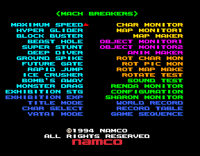
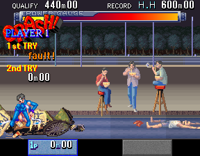
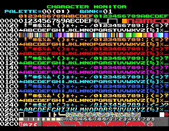
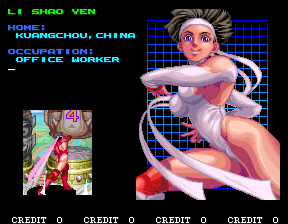
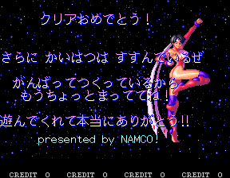

Today we'll look at the sequel to Numan Athletics: Mach Breaker! If you have a particular interest in debugging tools, then strap in because you're going to have a ball playing with what Namco left in the game. Let's dive in!

<!--more-->

# Debug Tools Menu




As with [Namco Classics Collection](/entry/namco-classics-collection-dev-messages-and-debug-tools-galore) there is a menu with an impressive list of developer-oriented options, including links to all of the minigames and some very well-crafted debug and design tools.

The different types of options are loosely grouped by colors. The cyan entries are shortcuts to the minigames while dark blue entries are shortcuts to the global modes (things like the title screen and high scores, etc, except for Yatai Mode, but we'll get to that). The remaining colors are debug tools: yellow for tilemaps (usually backgrounds and other static pictures), magenta for objects (basically anything that isn't a background), orange for images that are rotated and zoomed, and green for miscellaneous.

Let's have a look at some of these!

## Yatai Mode





If you select Yatai Mode from the menu, you'll get a black screen and a couple sound effects, along with a FAULT! graphic. You'd be inclined to think it's broken (well, it kind of is broken inasmuch as it is being called incorrectly), but the code it's referencing is actually part of one minigame in particular: Hyper Glider.

It is the scene that is shown if you fail to gracefully jump off the ramp and instead fall clumsily. The first time you fall, you will land on a food cart (the [yatai](https://en.wikipedia.org/wiki/Yatai_(food_cart)) in "Yatai Mode"), causing the owner to get angry at you. If you fail the second attempt as well, you'll fall on the same yatai which has been cobbled back together. In some cases, you'll miss the yatai, with the owner celebrating your unbroken fall.

It's a fun joke, but it's not clear why it's included in the test menu, especially since loading it outside the context of the game doesn't seem to work. It may have been to test the different scenarios (i.e. falling on cart first time, second time or missing completely).

## Char Monitor




Garden variety tile viewer; not much to talk about here. Controls are P1 Up/Down to scroll and P1 Left/Right to change the palette. P1 Button 1 changes between Bank 0 and 1, and P1 Button 3 exits to the menu.

## Map Monitor


Basically the same as the Character Monitor above. Map here is a synonym for tilemap and are the larger bitmaps, where as "characters" are individual tiles.

Controls are P1 Up/Down to scroll and P1 Left/Right to change the palette. P1 Button 1 changes between Bank 0 and 1, and P1 Button 3 exits to the menu.

## Map Maker


The Map Maker tool is quite interesting. It defines and visualizes the layout of the various tilemaps as they appear in the backgrounds of stages. You can switch between Normal Mode, which displays the current tilemap "screen," and Reduce Mode, which is an overview of all the maps laid out together.machbrkj_

P1 Stick - Move your current location on the overall map layout. This is best understood when seen in Reduce Mode, as it moves your selection cursor around.

P1 Button 2 - In Reduce Mode only, clears the value of highlighted entry.

P1 Button 3 - Switches between Normal / Reduce modes. "Reduce Mode" seems to be an "overhead" view of all the maps.

P2 Button 3 - Exit map maker

P2 Left/Right - Change the color palette. Hold P2 B1 or B2 to skip the initial pause for scrolling through the list.

P1 Start - Change map number for this entry

## Object Monitor


This tool displays the variety of smaller graphic elements in the game, what we might normally thing of as sprites.

P1 Up/Down - Change Picture No.

P1 Left/Right - Change palette

P1 B1/B2 - Change Bank down/up, respectively

P1 B3 - Exit

## Object Monitor 2


This is similar to the first Object Monitor, but displays individual tiles rather than wholly assembled. The controls are the same as the first monitor.

## Animation Maker


This is another impressive tool. As the name implies, it allows you to view and edit the animations of each player character. Note that you cannot change the character in the tool itself. Rather, you will need to change the "ANIM CHARACTER" setting in the Configuration option on the debug tools main menu.

P1 Button 1 plays the animation once, and P1 B2 plays it on loop; pressing either one while playing will cause it to stop. P1 Up/Down scrolls through the options in the menu. Other controls vary depending on which item is highlighted in the menu.

For the first option, P1 Left/Right will change the animation number by 1, and P2 Up/Down will change by 0x10. P2 Left/Right will change the wait speed.

For the second option, P2 Left/Right changes the picture for the curent frame by 1, while P2 Up/Down change the value by 0x100. P2 Button 1 cycles throgh the flip/mirror flags for the image. P1 Start will add a new frame to the animation, while P2 Start deletes the currently highlighted frame. P1 Left/Right will change the current frame in the animation. All options below this one return this functionality for P1 L/R.

For the third option, P2 stick changes the position of the image and P2 Button 1 resets the position to 0.

For the zoom and color options, P2 Left/Right change the value.

Frame cut will clear all frames in the animation. It is activated by P1 Button 3.

Picture and Position Shift will change the image and position fore each frame in the animation, respectively, relative to their current value. P2 stick changes the values.

We can assume pack/unpack is some kind of compression used by the game engine, but it doesn't have any effect (that I can see) in the animation tool itself.

## ROT CHAR MON


This is another simple tile viewer, with P1 Up/Down scrolling through the graphics and P1 Left/Right changing the palette. The ROT here is short for rotate, and as we'll see next, refers to graphics that are intended to be hardware rotated/resized.

## ROT PIC MON


Here we can play with the hardware sizing/rotation effects. P1 Up/Down scrolls through the available images by 1, while P1 Button 1/2 changes the value by 0x100. P1 Left/Right changes the palette. P2 Left/Right rotates the image and P2 Up/Down resizes (zooms). Finally, P2 Button 1 resets the size/rotation, and P2 Button 2 changes the background color.

## ROT MAP MAKER


This is very similar to in concept to the Pic Map Maker but is for mapping out the parts of the stage that are meant to be hardware sized and rotated. Once again, there is a Normal and a Reduce mode, which offers a birds-eye view of the layout of the parts.

P1 Button 3 switches between those two modes, and P1 stick moves your cursor. While in Normal mode, P2 Up/Down zooms in and out of the current view, showing the neighboring pieces. Unlike the other map editor, this one has a basic copy/past function. P1 Button 1 copies the current block to memory and P1 Button 2 pastes it. Finally, P2 Left/Right changes the palette and P2 Button 3 exits to the main menu.

## Rotate Test


This is yet another tool showing off the rotation and resizing capabilities of the hardware. P2 Up/Down changes the Phi value (camera tilt), P2 Left/Right changes Theta (camera rotate), and P2 B1/B2 moves the camera forward and backward. P1 Button 3 exits.

It seems that the OBJ and ZOOM settings can't be controlled, though I have not examined the code closely to determine what's going on there. It's also worth noting that the people objects don't always spawn. This seems to happen randomly.

## Sound Test


Yup, it's a sound test. The music entries begin at 0x200.

## Renda Monitor


Renda is "repeated hits" and refers to the hitting of the B1/B3 buttons in repetition used in many of the minigames. You can set weights to the two patterns: hitting both buttons at the same time (douji) or alternating (kougo). You can also set specific weights for Button 1 (left) and Button 2 (right). The coefficient is the "base" value for the weights. I believe the curve determines how effective your button presses are over time.

The higher the weight, the "stronger" that press is. The bar next to the Key Speed text visualizes how "strongly" you are hitting.

## Sharon Monitor


This tool visualizes and adjusts the levels of speed of your opponent (Sharon from Numan Athletics) during the Exhibition Match that happens during a "good" ending:


The four numbered entries (4 - 1 jō no kō - line terms, as in a term in an equation) represent the four phases of the race, while the final option (teisū kō - constant term) is the base value. P1 Up/Down moves the cursor, P1 Left/Right changes the value by 1 and P1 Button 1/2 change the value by 0x10.

Setting these values will affect the actual game. Keep in mind that the stage doesn't end until she crosses the finish line, so setting the values too low will cause her to take a very long time to finish the race. To put her at an easily beatable speed but still finish in a reasonable time, you can use these settings as an example:


# Tools Menu Technical

The code for the debug tools menu is located at 0x0A48E0 but is unreferenced.

As we'll see with the Debug Monitors below, practically every piece of program code is modularized as a task and given a human readable text identifier. This makes working with the disassembly far less painful than usual, as there is nothing more helpful to a researcher than having text within a tangle of assembly opcodes to give clues to what is going on.

And because almost everything is a task with a well-defined syntax, pieces of code can be interchanged with relative ease. That brings us to the debug menu: it too is implemented as a task and even though it is orphaned code we can replace practically any other task and it should just work.

However, we're faced with the old conundrum of "no reference = no context," meaning since it isn't actually used by the code, we can't know **where or when** it was meant to be used within the context of the running program. Since the last option in the menu (SEQUENCE) loads the game as normal, it's pretty safe to guess that it was meant to be displayed on startup, before the main game. We'll go with that assumption and move forward.

So we need to find where the game itself begins and squeeze our call in there. The subroutine at 0x2E844 does some init work, including spawning several low-level system tasks:

<pre class="pdasm pdasm-arch-m68k">
02E876: jsr    $a38ae.l{task_WATCH} ; This is the debug monitor task which we'll look at in the next section
02E87C: jsr    $7f8c.l{task_COIN_MGR}
02E882: jsr    $33df0.l{task_WINDOW_MGR}
02E888: jsr    $5bda4.l{task_OBJECT_MGR}
02E88E: jsr    $352c8.l{task_ANIM_MGR_V2}
02E894: jsr    $ba7c0.l{task_SEQUENCE}
02E89A: jsr    $34fea.l{task_KEY_MGR_V2}
</pre>

Of particular interest to us is the SEQUENCE task, which manages the attract mode and starting the game. This is basically our entry into the game, and since we want to show the tools menu at the start, replacing the call to the SEQUENCE task with the tools menu task is a good place to start.

Indeed, if we do that, things work pretty much flawlessly. However, you'll notice that the gray player status "windows" at the bottom of the screen are visible inside the tools and can get in the way a little bit.


This doesn't break anything, but it hints that things aren't quite in a perfect state. It turns out that these blocks are displayed due to the WINDOW_MGR task that was launched with the other system tasks. If we remove the call to the WINDOW_MGR task, the blocks disappear in our tools. We would also expect that, as an unfortunate side effect of completely disabling the task, the windows would not be displayed during gameplay... yet they work just fine when choosing one of the gameplay options!

That means that WINDOW_MGR is being launched elsewhere besides this initialization routine. Indeed, it looks like the tools menu itself will launch three of the system tasks (WINDOW_MGR, OBJECT_MGR and ANIM_MGR_V2) as needed for any gameplay options. Consequently, loading those tasks during the normal init routine because unnecessary. We can visualize this with the helpful Heap Monitor (which we'll examine in the next section):


All of the immediate children of ROOT-HEAP are the tasks that the init routine spawns. In this case, we have replaced SEQUENCE with SELECT (which is the name of the tools menu task). You can see among the children for SELECT are the window, anim and object managers, but those same tasks are also present under the root. Since SELECT (the debug tools menu) launches them on its own, we can safely remove them from the init routine and free some system resources.

Note that WATCH, COIN_MGR, KEY_MGR_V2 are absent from the SELECT children. Because SELECT does not spawn them, it is necessary to preserve their activation within the init routine.

With all that in mind, here's what we need to do at a high level:

 - Launch the debug tools menu task (SELECT)
 - Disable the redundant tasks (window/anim/object manager) and the normal gameplay task (SEQUENCE)
 - Preserve the other system tasks (WATCH, COIN_MGR, KEY_MGR_V2)

So the most efficient way to do that with the code as it exists is to replace the WINDOW_MGR task with SELECT, overwrite the next call with a branch to jump over the next few calls and land on the KEY_MGR_V2 task. With that in place, we have a nice and tidy heap:


One final thing to mention with the tools menu is that after about 20 seconds of no activity, the Namco logo will briefly fade in and out. For a long time, I thought this was an issue with how I was calling the menu, perhaps a task I had missed that was still running in the background or something non-standard that runs outside the task system. After some closer inspection it seems that, no, there was nothing wrong and that this is intentional. The test menu itself is coded to display the logo after a certain interval. The only reason I can think of for this is that it acted as a screensaver of sorts to help prevent burn in.

So without further ado, here is a MAME cheat to launch the tools menu at startup:

```
  <cheat desc="Game Mode Select">
    <script state="on">
      <action>temp0=maincpu.mq@2e884</action>
      <action>maincpu.mq@2e884=000a48e060104e71</action>
    </script>
    <script state="off">
      <action>maincpu.mq@2e884=temp0</action>
    </script>
  </cheat>
```

# Debug Monitors

Within the game is an impressive set of runtime monitoring tools that remain fully implemented and operational. I would go as far as saying these are the most elegant, useful and functional debugging monitors I've yet seen in a retro arcade game. They are mostly identical to the monitors that we examined in the [Namco Classics Collection article](/entry/namco-classics-collection-dev-messages-and-debug-tools-galore), though the ones in Mach Breakers are a newer version and actually work while the game is running. In fact, the monitor task is spawned as part of the init sequence and runs alongside the game, but remains inactive since the debug flag is normally disabled.

That debug flag can be enabled within the Configuration option listed in the Tools menu above:


Alternatively, if you don't plan to use the tools menu, you can set it directly in memory with a cheat:

```
  <cheat desc="Enable debug monitors">
    <comment>When enabled, P1 Left/Right change game speed and P1 Up/Down scroll through the monitors</comment>
    <script state="run">
      <action>maincpu.pw@23F510=0</action>
    </script>
    <script state="off">
      <action>maincpu.pw@23F510=1</action>
    </script>
  </cheat>
```

When the flag is enabled, the game's run speed can be controlled like a three position "switch," with Normal Speed on the left, Paused in the middle and Slow Speed on the right. P1 Left/Right changes the position of this "switch." When in Paused mode, P1 Start advances by one frame.

The monitors themselves work similarly, with P1 Up/Down scrolling through each of the available tools. The bottommost "position" clears the monitor. For menus that have changeable options, P2 Up/Down will move the cursor, P2 Start activates the highlighted option, and P2 Left/Right changes the value once activated.

Now let's take a look at the monitors.

## Alignment Grid


This doesn't have any interactivity as far as I can tell. It may have been an overlay to identify the relative positioning of tiles and elements.

## Heap Tree Monitor


We saw this briefly when working with the tools menu in the first section. This monitor displays all the currently running tasks in a hierarchal list. P2 Up/Down scrolls through the list of tasks, and P2 Left displays task details. Within the details view, values can be changed with P2 Start and P2 Left/Right. P2 Right returns to the list view.

This also introduces the concept of color coding for tasks, which is used in the other monitors as well:

 - Red - Super Task - A "low level"/system task
 - Magenta - Object Task - A task with some kind of visual element on the screen
 - Green - Normal Task - A task without a visual element

There is likely more meaning to each of these to the engine itself, but that should be good enough for our high level understanding.

## Task Load Monitor


This tool presumably shows the CPU load of the individual tasks. However, I've never seen any of the values change from zero. The list items can be scrolled though with P2 Up/Down, but there doesn't seem to be any other interactivity. If the highlighted task has visual elements on the screen, those graphics will flash.

## Value Monitor


This monitor displays and allows you to modify a dizzying array of runtime variables. There's far too many to go through here, but there are a variety of graphics and system level settings as well as values for individual events, such as Qualifying and World Record requirements.

## Heap Status


The Heap Status monitor is similar to the Heap Tree monitor in that it visualizes all of the currently running tasks. However, this is more of a birds-eye view, with each task being displayed as a single asterisk, color coded to its type.

## Event List


The Event List monitor is something like a log of recent commands, such as playing sound effects, killing tasks, changing palettes, etc. The most recent entries appear at the bottom, scrolling upwards off the top of the screen. It's unclear exactly what the teal entries are; perhaps current requests that have not yet completed.

# Makoto Regional Changes

This section was originally much longer as I thought I discovered an unknown/undumped region in the code but [thanks to Gaming Hell for pointing out that this is actually set in the Game Options menu in the World version's Test Mode](http://gaminghell.co.uk/NumanAthleticsMachBreakers.html). Doh.

To summarize, the slim female character in the leotard known as Makoto from Japan in the Japanese version is changed to Li Shao Yen from China in the Asia Version of the World dump.




Her palette has been altered to remove the sun symbol from her in-game sprite and all her artwork. Her ending had particular attention paid to it:


The Japanese version is on the left, and the World version on the right. The World version has, predictably, been translated into Chinese.

Gaming Hell suggests this was done to work around [South Korean laws at the time](https://en.wikipedia.org/wiki/Censorship_of_Japanese_media_in_South_Korea) that forbid certain Japanese content in media (due to [reasons](https://en.wikipedia.org/wiki/Pacific_War)), which is as good of an explanation for this as any.

In the Europe/America version of the World dump, she retains her Japanese name and nationality, but there was a small change made here as well:


On the left is the Japan region and on the right is the EU/US version. Her hometown changes from Tokyo to Osaka. That's a pretty big shift in personality (if we're going by stereotypes), and while the change to Chinese to avoid South Korean censorship is plausible, I can't think of any good reason why the change to her hometown was made for the rest of the world.

Oh, and her conclusion was changed pretty drastically for the English versions:


Compare that to a more accurately translated Japanese version:

>大会後、 元気なイメージを買われ、
>
>マコトにCMの出演依頼が殺到したが…
>
>てぇやんでぇ！やってらんねーや！
>
>と言って、自社のポスター撮影を最後に
>
>OLに戻ったのだった。
>
>POSTER: “いちばん。”　安心。　久地銀行のお得なマッハプラン

>Thanks to her energetic image, Makoto was flooeded with requests to appear in ads after the tournament, but...
>
>"Whaddya talking about! No way I'm doin' that!"
>
>... she said. After posing for a poster for her company, she went right back to work as an office clerk.
>
>POSTER: "Number one." Peace of mind. The great value Mach Plan from Kuji Bank.

Yeah, the English in the game is not exactly accurate.

# Interesting Text format

While ASCII is pretty much the universal standard for storing Western alphabetic characters digitally, Japanese is a whole other jar of [nattō](https://en.wikipedia.org/wiki/Natt%C5%8D). This is due to the fact that once you start including kanji, the number of characters goes way past 256, which is the maximum that could be uniquely referenced with a single byte. Two bytes per character is enough to cover written Japanese and plenty of other glyphs, but most games only need subset of kanji, not the full 6,355 defined in the JIS X 0208 character set standard. You certainly would not spend the energy to draw and implement thousands of extra characters you don't need and won't use. So what do you do in that case? Well, you will need to create your own unique character set and encoding.

This is why finding text in Japanese games tends to be more difficult than English text: the character sets are tailored to what's needed for the games, and those characters are not implemented using a standard encoding because such encodings are meant to represent the full breadth of a language.

I explain all that background because Mach Breakers has a really interesting way of encoding its Japanese, a method that I had never seen before and found to be, dare I say, charming. It's a double-byte encoding, but with each byte using values in the ASCII range so each glyph is represented as a kind of romaji. This means that, like ASCII, it's human readable within the data.

Let's look at a couple examples. Here's the (bad) ending screen:


The text for this screen is stored in the data like so:

```
      KURIAAAoMeDeToAu?u         @
    ToAiAiTaAiToKoRoDaGaM5       @
    R3R4R5WiKURIAASiNaAiTo       @
  AEWUDEZ1WUGUHaW0ReNaAiWuDa     @
          MoAuAiTiDo             @
KiMiNoW1AiPUREAIWiMaYeTeRuZoZ5   @
   R0WuDeKuReTeAaRiGaToAu?u      @
```

If you have a bit of Japanese knowledge, it probably looks to you like an N5 student tried to transcribe the text to romaji while extremely intoxicated. Some of it matches up pretty closely, but other parts are odd.

Though I have not done a thorough analysis, here's a generalized overview of how it is encoded:

 - For kana phonetics, the first letter determines the row and the second letter is the vowel. For example, Ka is か, Na is な, and so on, making it identical to a standard romanization for the most part. Some of the classic exceptions apply: for example, Ti is ち, Si is し, but the reason for this should be obvious to anyone with some knowledge of the language.
 - For the basic vowel phonetics, "A" is used as the first byte. For example, Ai is い, Au is う, etc.
 - For ん, Wu is used. I'm not sure what the correlation is there.
 - Most of the punctuation begins with ?, for example, ?U is elongation ー and is comma  、.
 - The case of the second letter determines hiragana or katakana. Ka is か while KA is カ, Si is し and SI is シ, etc.

Unfortunately, there isn't really any rhyme or reason for the remaining symbols, things like the small characters and full width romaji and kanji. They retain the two byte ASCII range format, filling in character combos that aren't taken by the logic of the primary phonetics. This can make things start to look kind of crazy when you have lots of kanji and less common glyphs. For example, here's Makoto's Japanese ending that we just looked at above:

```
dUdEeaNaAIME?UZIWieiWaRe;;;MAKOTONiP2aaNo11eueeeoGaeAeISiTa****Ga*M5@
TeG4YaWuDeG4?u**YaYeTeRaWuNe?UYa?u@
TofUYeTegiNoPOSUTA?UgugeWigogANi;;;        auNiiuYeTaNoDaYeTa?i@
```

Still, at least it's all made up of viewable data, and that makes debugging the scripts beneficial. Kudos to the programmers who came up with this, as I find it to be pretty darn clever.

# Old Ending Screen & Location Test Text


The final thing we'll look at is some unreferenced code at 0xF5118 (Japan dump) which is an older version of the ending message screens. The images above compare the old version (left) to the one in the final (right). The biggest change is that old version featured the World Record pose of your character scrolling in from the left side of the sceen, different text placement and no fancy NAMCO logo.

This older version was likely the one used in the location test version, as it actually displays this message by default:




Unfortunately, I haven't found a quick and easy way to get this to display. For now here's my work cheat, which replaces the Staff Roll that is displayed for the non-bad endings:

```
  <cheat desc="Show loc. test ending instead of credits roll">
    <script state="on">
      <action>temp0=maincpu.md@a9c08</action>
      <action>maincpu.md@a9c08=000f5118</action>
      <action>temp1=maincpu.md@a9aa4</action>
      <action>maincpu.md@a9aa4=000f5118</action>
    </script>
    <script state="off">
      <action>maincpu.md@a9c08=temp0</action>
      <action>maincpu.md@a9aa4=temp1</action>
    </script>
  </cheat>
```

And I think that about does it for Mach Breakers. See you next game!
