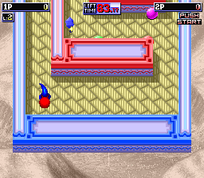
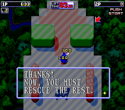
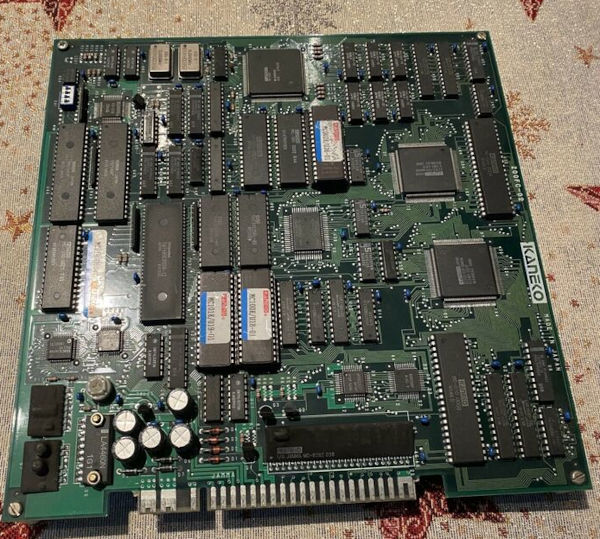
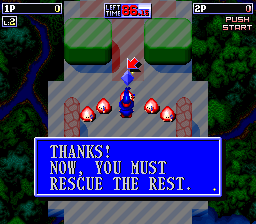

Sometimes you begin disassembling some code thinking, "well, there's not much here, this won't take long to research and write about," and then it spirals out of control and takes up all your free time for multiple weeks.

Anyway, here's more than you ever wanted to know about what's hidden away inside Magical Crystals!

<!--more-->

# Regions & Revisions

There are currently three dumps of the game, differentiated by region and build date:

- 1991-12-10 (World)
- 1992-01-10 (World)
- 1992-01-13 (Japan)

The two later revisions are almost entirely identical, but the code for the earlier one is notably different. The differences are not simple bug fixes or other mostly "invisible" changes as you may expect from an incremental version. Instead, the earlier revision lacks a couple of important gameplay aspects and a bunch of refinements found in the later revisions.

## Revision Differences

### Gameplay Features

There are two major features missing in the older version.




The first is the power shot. This is done by holding the shot button for a few seconds to build up power, after which the player will emit a defensive ring of fire and shoot a large fireball.

As it does not require any powerups or resources to use and is always available to the player, it's a pretty fundamental aspect of the game. For it to be missing from the earlier version seems odd. While not vital to winning, it does make the game more interesting to play and makes the bosses drastically easier to deal with.


The second missing feature is also related to attacks. In the later revision, fairies will occasionally bring you bonus crystals during boss stages. This is the only way to obtain the orange and aqua crystals, which give your player the bomb and three-way shot attacks, respectively. In the earlier version, however, the fairies do not assist in boss stages, making those two crystals effectively unavailable and unused.

We'll revisit both of these missing features later in the article.

### Content Differences

This list is certainly not exhaustive. These are just some of the changes I noticed while researching.


The biggest content change between versions is the World 1 boss. In the earlier revision, this boss appears as a Puyo-ish slime which breaks into smaller slimes as you attack it. In the later revision, it first appears with a metallic, insect-like exoskeleton. After destroying the outer shell, the inner slime is then revealed. Moreover, the slime form in the later version lobs bombs at the player, an attack pattern missing from the earlier version.

This was definitely a late addition as these graphics are completely missing in the older dump and appear at the very end of the sprite ROM in the newer sets.


There is also at least one stage object layout difference. Near the end of World 1 Act 1, there is a circle of cannons surrounding the final crystal. This is not present in the earlier version.

There may very well be other stage changes throughout the game, but this one was the most obvious.


The text popup for the green (Timer Extend) and rainbow (1 UP) crystals is not present in the older rev, which makes their respective effects unclear.


In the earlier version, cannons do not leave behind craters after being destroyed.




The later version has a solid background and a shadow for dialogue boxes.

## Regional Differences

All of the regional differences are language based.


The attract mode title screen has katakana reading マジカル　クリスタル which, as you may have guessed, is the Japanese pronunciation of Magical Crystal. The plural 's' is misisng from the Japanese reading.


As a side note, the same Japanese also appears on the secondary title screen after a coin is inserted, but in this case, it is not a seperate graphic and is visible in any region.


The staff roll has Japanese section headers.


And of course, the dialogue boxes are in their respective languages, with the English version being a bit awkward with its wording. The Japanese version has a couple extra text boxes which do not appear in English, but we'll discuss them and all of the dialogue text further in one go, in the Unused Content section below.

## Location Test?

Given that a couple of fundamental gameplay features are not present and that multiple elements are unfinished or changed drastically, it does not seem that revisions are incremental fixes to address glitches. Instead, it appears that the later revision is the final version while the 1991-12-10 dump is a location test or some other kind of prototype.

The biggest piece of evidence for this is the preview of the game in the 1992 March (vol. 69) issue of GAMEST.

[](img/gamest_review.jpg)

The screenshots clearly indicate that they played the game on an earlier version: the dialogue boxes are transparent and there are no cannon craters where we would expect them near the World 1 Stage 1 exit. With the text being in English as well, this may very well be the exact same 1991-12-10 dump that we have in MAME.

As such, we know that the powered up shot and the orange/aqua crystals and their related shot types are not present. Yet the article lists all of the crystal types, including orange and aqua, and correctly explains the shot types they confer. Moreover, it specifcally describes the power shot as a feature.

So there are a couple possibilities. One is that the version that GAMEST played is a build somewhere between our revisions, where all of the shot types and crystals have been implemented, but other elements (such as cannon craters and opaque dialogue boxes) have not. This seems unlikely. There is only one month difference between the dumps we have, and I find it hard to believe that they would have prepared another revision in that meantime just for a magazine preview.

The more likely scenario (in my opinion) is that they were informed they were playing an early/location test version but given all the information for what would be expected in the final version for the article. Provided this is what happened, which I feel strongly is the case, then we can draw the conclusion that the extra crystals and the powered-up/three-way/bomb shots were all planned as part of the game and that our earliest dump, which lacks these, is an incomplete prototype of some sort.

Despite the lack of a gameplay audit tool or any other common indicators, my feeling is that this is a location test version. The reasoning there is that the game was dumped from a board with well-marked ROM chips.

[](img/mc_h_00.jpg)

(The only place I could an image of the board with ROMs that match what is listed in MAME [is this page](https://www.jammarcade.net/explosive-breaker-repair-log/), where the PCB was used to repair another Kaneko game. Ouch.)

Of note here is the region indication of "H" on the ROMs, which does not match the E and J seen on other boards.

If this were an internal prototype, we would expect to see handwritten labels and risers, like on [the Wing Force prototype](http://www.lucaelia.com/mame.php/2016/Saving-Wing-Force). Instead, this looks like a production board. To me, an unfinished but nearly complete game on production hardware indicates a location test.

## Additional Revisions?

The MAME driver says that there is a "known undumped older Japan set" and links to this image:

[](img/pcb_j_00.jpg)

The ROMs on this board end in 00. The MAME source isn't explicit about it, but based on the filenames, I believe the dump we have may be numbered 02, making 00 an earlier revision. Interestingly, every single picture of the board with 'J' marked chips has the 00 revision, and I can't find any images of an 02. Perhaps the 00 revision is actually relatively common and we were lucky to have the more uncommon version dumped. Ultimately, it probably isn't wise to draw any serious conclusions just from image search results.

[This blog post](https://keigox68000.hatenablog.com/entry/20121226/p1) shows a board with clearly marked J 00 ROMs, along with a couple gameplay shots. Unfortunately, this does not include the build date on startup. Notably, though, it does have the cannon circle at the end of World 1 Stage 1 as well as the World 1 Boss second form bomb attacks, neither of which are in the earlier revision. This seems to indicate that we are dealing with bugfix revisions instead of the massive changes of the oldest revision we have.


There is this board from [auction history site aucfan](https://aucview.aucfan.com/yahoo/g140072391/), marked as Japan region with what looks like '01' for its revision. It's a bit difficult to tell due to the image resolution.

[](img/mc_e_01.jpg)

Finally, we have this E region board also from an [auction history site](https://www.ebay-kleinanzeigen.de/s-anzeige/magical-crystals-1991-original-kaneko-jamma-arcade-pcb-top-/1958779824-227-1993) with ROMs marked 01. Could there also be an E 00 out there?

So we know there are some more revisions out there. If you have a Magical Crystals board, check the chips and send it to the MAME team if you have one of these versions!

# Extended System Menu Options


The initial Service Mode screen displays the game setup, and after pressing Start to exit, you are sent to a System Menu as shown above. However, in the older revision, this menu contains options two extra options for graphics viewers, one for sprite/object tiles (CHR CHECK) and one for background tiles (BG CHECK).


Both have the same controls: P1 Up/Down to scroll the tiles; P1 Button 1/2 to change palette; P1 Left/Right to change bank.

Instead of completely removing the viewers from the menu in the later version, their presence is instead controlled by a hardcoded value in the code: setting the word at 0x23C6E to 0 will enable the options. Here's a MAME cheat to set that value and enable the viewers in either of the later versions:

```
  <cheat desc="Enable extra service mode options">
    <comment>Add CHR/BG check to system menu</comment>
    <script state="on">
      <action>temp0=maincpu.mw@23c6e</action>
      <action>maincpu.mw@23c6e=0</action>
    </script>
    <script state="off">
      <action>maincpu.mw@23c6e=temp0</action>
    </script>
  </cheat>
```

# Stage Select


There is a very, very simple stage select tool which is disabled but remains functional. It displays on the title screen after inserting a coin, as shown above.

What, you don't see it?

It's that little green triangle in the upper left!

Rather than displaying a list of stages or some other identifying text, the programmer opted to use a single tile in the upper left corner to indicate the selected level. Clearly it was meant for an older version of the graphics ROM, and the tile was probably originally a number or letter or something like that. But the indices have changed, and it now points to the parts of some larger object.

The controls are inverted from what you'd probably expect: P1 Down increases by 1 and P1 Up decreases by 1. Also, P1 Left increases by 4 and P1 Right decreases by 4. (Stepping by 4 effectively changes the World as there are 3 stages and one "scene" per World.) Note that the max usable value is 0x17 (which is World 6, Act 3), but the tool will let you set any value, causing a crash for anything invalid. With the graphic tile not being much help in indicating what stage you are selecting, it can be difficult to use.

So, in addition to re-enabling the code, we also change the tile to which it points. Luckily this and other Kaneko games of the era had their empty graphics banks filled with serial hexadecimal numbers, like so:


This is perfect for identifying a number in a single tile, and it may have been what the programmer used at first.

Here's the cheat to enable the stage select and make it usable:

Older Revision:

```
  <cheat desc="Stage select">
    <comment>Use the P1 stick on the title screen to set the starting stage</comment>
    <script state="on">
      <action>temp0=maincpu.md@16b9c</action>
      <action>maincpu.md@16b9c=4e714e71</action>
      <action>temp1=maincpu.mw@16bf8</action>
      <action>maincpu.mw@16bf8=4200</action>
    </script>
    <script state="off">
      <action>maincpu.md@16b9c=temp0</action>
      <action>maincpu.mw@16bf8=temp1</action>
    </script>
  </cheat>
```

Newer Revisions:

```
  <cheat desc="Stage select">
    <comment>Use the P1 stick on the title screen to set the starting stage</comment>
    <script state="on">
      <action>temp0=maincpu.md@1a14e</action>
      <action>maincpu.md@1a14e=4e714e71</action>
      <action>temp1=maincpu.mw@1a1aa</action>
      <action>maincpu.mw@1a1aa=4300</action>
    </script>
    <script state="off">
      <action>maincpu.md@1a14e=temp0</action>
      <action>maincpu.mw@1a1aa=temp1</action>
    </script>
  </cheat>
```

# Pause Mode

DIP switch #7 (bit 6) is marked as unused, but enabling it will freeze the game. Disabling it leaves the game in its frozen state. Which seems pretty useless.

What's happening here is that the game is waiting for P2 Button 3, an input that is not used by the game and thus is not emulated. As long as that button is held, the game continues to run at full speed. It pauses again whenever the button is released. Disabling the DIP switch after pressing the button returns the game to its normal state.

So it works kind of like a pause mode, though it's probably the strangest implementation of it I've ever seen. It can also work as a sort of slow/frame advance mode by tapping on the button quickly.

Since it uses the non-existant P2 Button 3, we'll have to re-map it to something else in order to use it. The cheat below will change it to P2 Button 2.

For all revisions:

```
  <cheat desc="Remap advance frame button">
    <comment>Hold P2 Button 2 to advance the frames when DIP switch #7 is set</comment>
    <script state="on">
      <action>temp1=maincpu.mb@743</action>
      <action>maincpu.mb@743=5</action>
    </script>
    <script state="off">
      <action>maincpu.mb@743=temp1</action>
    </script>
  </cheat>
```

# Unused Content

There is a boatload of unused content in the game. Here we go...

## Dialogue Boxes

There are 10 unique dialogue strings in the game. Of these, 6 are used in the Japanese version and 4 in the English version. We'll examine and translate each of the strings, including the ones that are actually used, in the list below, just to be complete and to provide perhaps a more natural translation for the Japanese messages.

Each language has its own pointer table, both of which are the same length. Each message ID, then, points to different data based on the system language. Some entries point to the same string in both tables, and in those cases we only include one screenshot.

### Message ID 0


This is a test message which is not actually used by any code. It does not have an English equivalent. It reads, "Testing the dialogue window. ♥ This is where the ??? appears."

It's a bit strange, as the three kanji used in the second line, 員因噂, don't form a legitimate word and don't make any sense individually either: "member-reason-rumor." I've just left this as question marks in the translation since we can't derive any real meaning from it. This may be a case where the kanji ordering changed while the kana ordering did not, similar to what we saw with [the Chrono Trigger prototype leftover text](/entry/leftover-text-in-chrono-trigger).

### Message ID 1


This is used only once, at the very beginning of the game. The English is fine here.

### Message ID 2





This is shown only once, when obtaining your first crystal. The English sounds a little more natural as, "Thank you!! Hurry and save everyone else!!"

### Message ID 3


This is shown whenever all crystals in a stage are collected. The English isn't incorrect, but it's unintentionally rough, especially when compared to how gentle/cute the Japanese is. It's better as, "Alright! ♥ That's everyone! All that's left is to escape. ♥"

### Message ID 4


This is shown whenever you reach 30 second left on the clock. The English is fine, but it's a little better as, "Oh no! We're out of time! Hurry, hurry!!"

### Message ID 5


This string is not used in the game. Interestingly, both of the language pointer tables use this string, and there does not seem to be an equivalent Japanese version. It may have been used if you missed a crystal (i.e. a fairy) and you are nearing the exit.

### Message ID 6


This message is used in the Japanese version but is specifically not used in the English version. There is a string in the equivalent slot in the English table, though as you can see, the translator gave up one word in.

The Japanese reads, "By the way, you can evade enemies by jumping!"

It is not present in the older revision, with its slot pointing to message ID 0.

### Message ID 7


As with the message above, this string is only used in the Japanese version and has an unfinished English version. It looks like the translator had an even worse time with this one. It's not clear if it's junk text or if they were considering using the [Japanese word kiai](https://jisho.org/search/%E6%B0%97%E5%90%88) or some kind of translation for it.

The Japanese reads, "By the way, if you hold down the button, you can shoot a Power Shot!"

This string is not present in the older revision, as above.

### Message ID 8

Appears to be an unused message slot. Points to message ID 0 in all revisions and in both language tables.

### Message ID 9


An unused message reading, "Ah! Look out! Be careful not to fall off." It likely would have been shown when hanging off an edge, but considering how often that can happen, it would be displayed way too often. Perhaps it was only shown once, similar to the "tutorial" messages, in which case who knows why it wasn't used.

There is no English equivalent string.

### Message ID 10


Another unused test string. Both language tables point to it.

## Preview Version text

At 0x3B25C in the later revisions and at 0x37696 in the earlier revision is this string:

```
PREVIEW VERSION
```

It is unreferenced by any code, but considering its proximity to the strings that appear on the title screen (easy game, standard game, etc) it probably appeared there.

Meanwhile, at 0x2B754 (earlier) / 0x2F2BA (later), appearing after the staff roll strings is this text, using the dialogue box encoding:

```
ＴＨＡＴ’Ｓ　ＡＬＬ　ＦＯＲ　ＮＯＷ.
ＰＬＥＡＳＥ　ＥＮＪＯＹ　ＴＨＥ　ＲＥＭＡＩＮＤＥＲ
ＯＦ　ＴＨＥ　ＣＯＭＰＬＥＴＥＤ　ＶＥＲＳＩＯＮ　ＯＦ
ＯＵＲ　”ＭＡＧＩＣＡＬ　ＣＲＹＳＴＡＬＳ”　ＧＡＭＥ,
ＷＨＩＣＨ　ＷＩＬＬ　ＢＥ　ＣＯＭＩＮＧ　ＳＯＯＮ.
ＴＨＡＮＫ　ＹＯＵ　ＶＥＲＹ　ＭＵＣＨ
ＦＯＲ　ＹＯＵＲ　ＴＩＭＥ.
```

It too is unreferenced by any code. Taken together, these two messages indicate that there may have been an even older version, possibly for use at a trade event.

## Unused Graphics

We will group the unused graphics by the type (CHR or BG) and the bank in which they appear. As always, this list is not exhaustive and I'm sure there are plenty more unused graphics that I missed.

(You can hover over the images to zoom in on them.)

### BG Bank 10


A floor decoration with a couple of initials that I can't quite make out. F & C, perhaps? In any case, it's unclear what they stand for. I couldn't find a palette that worked really well, so I chose to show it with both a dark and light shade.


More unused floor decorations.

### BG Bank 12


More unused stage flooring decorations.

### BG Bank 16


And even more unused floor decorations.

### BG Bank 1A


Could be a flooring "image," like the ones used in boss stages. Palette may be incorrect, but it's the one that fit the best.

### CHR Bank 00


Appears to be a simple walking animation for... something. It certainly doesn't fit the aesthetic of the game. As it lacks any other directional animations, it may have been a test placeholder.

### CHR Bank 01


A stylish font that is never used.


I always found it a bit strange that the disappearing red floating platforms had a double-arrow design, which as a visual cue seems to hint that they were directional buttons. It looks like that may have been the case after all, as there is a whole set of of similar platforms with the arrow sides highlighted, including a larger version. None but the vertical, unhighlighted small panel in the lower left are used in the game.

### CHR Bank 02


These were likely enemies of some sort. The palettes here are equally likely to be incorrect.

### CHR Bank 04


Appears to be some kind of undulating tube, probably animated. No clue what it may have been used for. Part of the targeting reticle for the shooting bonus game is sandwiched near the beginning of these, so perhaps there is some relation?

### CHR Bank 05 & 06


This font is actually used for the dialogue boxes, but as we saw above, there are only a small handful of those messages and the text within them barely makes use of the large character set available. As such, most of the glyphs go unused.

### CHR Bank 07


An unused steel platform.


A small version of the first title screen logo. I can imagine this being used in the corner during demo play, but who knows what it was actually meant for.

### CHR Bank 09


Here we have two unused player character animations. In the first he appears to look up, while in the second he appears to sneeze.


An alternate logo that may have been used on a different version of the title screen. It's quite nice and it's a shame it wasn't used.

### CHR Bank 12


This little guy is a bit of a mystery. It looks like there is an animation where he is lifting a crystal, and another where he appears to fall asleep, dropping the crystal, crying out and disintegrating. I have no idea what's going on here.

Not sure if the palette is correct, but it does work quite well, so it may be correct after all.


Probably another enemy. Palette is likely incorrect.

### CHR Bank 13


An alternate GOAL block.

### CHR Bank 19 & 1B


I'm not going to spend the time extracting and assembling each of these, but it looks like the text on the first title screen was going to have spinning letters at one time.

### CHR Bank 20 & 21

In bank 20, we have this guy:


The palette may not be correct, but we can clearly see that he's a round dude surrounded by a joystick based control pad... thing. His legs are clearly part of his body, so what is he controlling with those sticks? Well, in bank 21, we have these parts:


Our red dude clearly fits in space on the circuit boards. There is also a circular cap that perfectly covers the hole in the smallest of the boards. If we position him and the cap into the boards, we get these:


Taking an even closer look, it becomes clear that the boards were meant to be stacked, which gives us this:


Most likely, the circuit board stack did not move, with each piece breaking in half as you attack it to reveal the next lower level. After enough attacks, the boards are totally destroyed, and with nothing left to control, the red dude must resort to chasing the player on foot.

With such a complex set of graphics, it's likely that this would have been a boss rather than a normal stage enemy. He certainly would have been a perfect fit for World 2 Act 3 design.


Considering this is the only place a PCB design is used, it seems natural that he would have been the boss here in World 2, instead of the boring red blob we ended up with.

It's a real shame this guy wasn't used. I quite like him!

And yes, in case you were wondering, the PCB background for the World 2 boss is, indeed, based on actual Kaneko boards at the time:


### CHR Bank 25


Appears to be an enemy that emerged from the ground.

### CHR Bank 29


Appears to be yet another unused enemy.

### CHR Bank 2D


A set of player character frames with wings. Doesn't appear to be used by any code.

### CHR Bank 2F


And here we have some sprites from B-Rap Boys. Wait, what? Why?

(The palette here is obviously incorrect, but it's the only one I could find that relfects the color groupings sanely.)

Without knowing how the graphics were drawn, imported and tested by the staff, it's hard to answer that question. We sometimes see graphics from other games appear in data when EEPROMs get overwritten and older data still remains. This really only happens with cartridge based console games, however, as a reusable dev cart may be passed around among teams. Yet there may be something similar situation here. If the graphics "pages" (banks) were saved as individual files on a disk-based drawing system (similar perhaps to [Sega's Digitizer System](https://segaretro.org/Digitizer_System)), it's possible one from B. Rap Boys may have been loaded by mistake into the final ROM with no one noticing.

The most notable aspect of these graphics is that it is only one frame per character. What's shown above is the entirety of the graphics in that bank, as you can see here.


Even if this were used somewhere in the game, it would just be those static sprites with no animation. Which means even if this were loaded from B. Rap Boys by mistake, why would there be only these single frames? For a sprite, we expect all of their frames to be grouped together into a single block, like so:


As they appear in Magical Crystals CHR bank 2F, they're relatively useless as anything besides static placeholders.

That **may** have been their purpose: very early placeholders to test game engine mechanics before actual graphics were completed. Personally, I find that unlikely. At least, it would be unlikely they were placeholders for Magical Crystals. They could, however, have been early placeholders for B. Rap Boys itself.

The graphics feature the three player characters in the game as well as three enemies. However, two of those enemies are unused in the final game (as far as I can tell from my own playing and watching longplays). Those unused enemies are the bikini clad muscle woman and the bikini cladd mohawk punk. I also think the poses for the player characters do not appear in the final B. Rap Boys graphics, but that may just be due to my eyes crossing as I stare at disassembled sprite tiles. I look forward to some who knows that game well to clarify if any/all/none of the above sprites are used in the final game.

Interestingly, the woman appears in a screenshot in one of the game's flyers.

[](img/brapboys_chirashi01.jpg)


She apparently joined other enemies on the truck that appears early in the first stage. You may also notice that the truck looks different in the flyer screenshot, with writing on the side. The graphics for the original version are still present in the final in two frames only, as the truck makes its jump through the billboard.


After that, the text magically turns into a sweet airbrush flame job for the rest of the game. I guess it reads "KIDISH"? No idea what that means.

Uh... anyway, back to Magical Crystals...

If I was really pressed to come up with a theory, I would say that these were placeholders in some capacity for B. Rap Boys and, as suggested earlier, were loaded by mistake into Magical Crystals with no one noticing/caring.

But as always, this is purely conjecture. It is a mystery.

# Kaneko ToyBox


During the game's memory test at startup, we are shown the build date and a message reading:

```
TOYBOX SYSTEM - VERSION 0.93B+
```

There is also a subtitle to the Kaneko logo on the next screen reading:

```
TOYBOX UNIT PRESENTS...
```

Meanwhile, within the code at offset 0x400 in all revisions, we have this ASCII text:

```
X-BASIC_TB Version 2.7a-5
Copyright 1991 by ToyBox Lab.
```

This is not referenced by the code and seems to be a hidden message. (As a technical side note, both of the lines are terminated with a CR and LF, indicating that they probably come from a DOS-based file that was included as part of the build.)

So, what is ToyBox?

According to MAME, it's a microcontroller that executes copy protection functions to prevent bootlegging, including ROM decryption. There's an entire machine subsystem dedicated to it (kaneko_toybox).

It seems odd, however, that Magical Crystals would advertise its copy protection system so prominently, as if it was a player-facing feature. Indeed, the wording on these messages, like "ToyBox Unit," "ToyBox Lab," "X-BASIC_TB," seems to hint at something larger than an MCU on the circuit board.

In fact, if you check the MAME source for its ToyBox subsystem emulation, [you'll see a list of games which use it](https://arcade.vastheman.com/minimaws/machine/kaneko_toybox)... and Magical Crystals is not included. The copy protection MCU which MAME understands to be "ToyBox" was not used by Kaneko games until 1994, with Great 1000 Miles Rally being the first (though it likely would have begun with Wing Force in 1993 had the game made it to production, as there is an unoccupied socket on its board where the chip would be expected).

So, again: what **is** ToyBox?

I am lucky enough to be in contact with a developer who worked at Kaneko during that time. Takeuchi Hisanori, better known as [TinyTomo](/entry/mouja_unused-test-menu-debug-functions-easter-eggs-and-more), worked on Air Buster and The Berlin Wall, games that are contemporary with Magical Crystals and used the same hardware. I asked him what he knew of ToyBox, and his response was simple and direct:


>Toyboxシステムは当時リーダープログラマの五十嵐さんが作ってたシステムです。タスクやスプライトの管理をしているシステムです。特にハードウエアでやってる事とかはないです
>
>The ToyBox System was created by Igarashi, who was lead programmer at the time. It was a system for managing things like tasks and sprites. It doesn't really have anything to with hardware.

Igarashi Satoshi worked on a number of Kaneko games including Air Buster, Heavy Unit, Bakuretsu Breaker and PC Genjin, among others. He often used the nickname To-Y (which itself may be a reference to the [popular 80's manga/anime of the same name](https://en.wikipedia.org/wiki/To-y)), and suddenly the name "ToyBox" makes more sense.

So ToyBox, it seems, was a development framework of sorts, an underlying system to save other developers time when starting their own projects.

But that doesn't mean MAME is entirely incorrect, either. Mamedev is full of intelligent people after all, and they had a good reason for thinking ToyBox was the name of the protection scheme. The chip in question is an MCU with internal ROM, meaning there is data inside. At 0x10200 within the MCU data, most of the games have a string with some copyright info. Let's take a look at some of them:

Great 1000 Miles Rally:

```
TOYBOX1994 SECURITY DATA 2.0.1(MM) (C)1994 KANEKO // TOYBOX
```

Oedo Fight:

```
SECURITY DATA 1.2.1(O-EDO) (C)1994 ATOP/KANEKO // TOYBOX
```

Kyūkyoku! PC Genjin:

```
TOYBOX SECURITY DATA 1.0.3 PROGRAMMED BY S.IGARSHI (C)1993 BY TOYBOX LAB
```

As you can see, they all plainly identify themselvs as "ToyBox" or as being related to it in some way. In fact, this is the only place outside of Magical Crystals where the term is used in any of the games.

Moreover, the chip itself is actually labeled as "TBSOP," as shown here from the Jackie Chan arcade game:


(Sorry it's difficult to see; high quality PCB images are hard to find.)

With "TB" on the label and "TOYBOX" appearing in the ROM data, drawing the conclusion that the protection system as a whole is called ToyBox is logical.

It seems that in reality, the term "ToyBox" was used by Igarashi as an aggregate of all the generalized, non-game specific tools he created for Kaneko during this period. The software framework and the protection system were components of the ToyBox system as a whole. Takeuchi told us that Igarashi was the lead programmer, and his credits in many games supports this. It makes sense that he would have some clout in spreading the name around.

Certainly, I would love to talk to Igarashi himself about all this, to get more details and really put the mystery to rest. These relatively small details from history of game development absolutely fascinate me, but beyond that, it's history worth preserving.

And I think that's all we have for Magical Crystals for now. See you next time!
