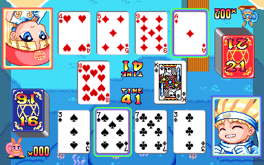
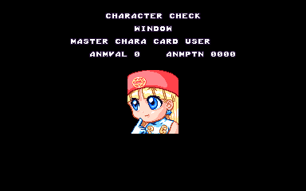

Today we look at Magical Speed, a simple but surprisingly fun Allumer game based on the [card game Speed](https://en.wikipedia.org/wiki/Speed_(card_game)). Turns out there's a hidden debug menu in the code that's super simple to re-enable, and lots (LOTS) of unused graphics.

<!--more-->

# Debug Menu


The menu appears on startup, and the cursor is controlled with the four P1 Card inputs: Button 3 and 4 for Up/Down, respectively, and Button 1 or 2 to change the option. When you're ready to start the game with the options that have been set, press P1 Start.

Most options are self explanatory, but there are some I haven't quite figured out yet. Let's look at a few that we do understand and might need an explanation:

## CPU Power


A CPU usage meter. Displays as a white block at the top of the screen, along with a number of the right side that seems to grow with screen complexity. Not certain what it's actually counting, however.

## Stop Mode

Enables pausing the game by holding P1 Start + P2 Start. Note that the game will not stay paused; it only works as long as you hold the two buttons.

## Mascot In

When this is disabled, the annoying character "blockers" that appear in your blank card slots will be disabled.

## Auto Supply


When this is set to Off, the card slot will not automatically 'refill' with the next card. You'll need to manually select it to draw the next card. This is enabled for normal gameplay, so perhaps there was an earlier verson or a different mode that was more difficult by not automatically drawing the next card.

## Character Check


This entry has three options: Mascot In, Window and Demonstration. It will display the various sprite objects used for the small mascot characters, the gameplay character "window," and the full body graphics from the stage introduction screens.

P1 Buttons A and B will scroll through the characters; P1 Buttons 1 and 2 will change ANMVAL and P1 Buttons 3 and 4 will change ANMPTN. To start the tool from the menu, select which viewer to use and press P1 Start to display the viewer. P1 Start again will take you back to the menu.

## CPU Think Easy Level

The CPU will always be on easy no matter what difficulty was chosen and no matter what stage is played.

## Technical

The debug menu is enabled by setting switch #5 on DIP SW2. (It's marked as the fourth 'Unused' DIP in MAME.) That's it!

However... The code at 0x990, which loads the DIP settings into RAM mirrors during startup, specifically masks out bits 2 through 6 on the lower byte (which is the second DIP switch). So the fix is as simple as removing the mask on those bits:

```
  <cheat desc="Disable DIP masking">
    <comment>Restores the debug menu, which is then enabled by SW2 #5 (fourth 'Unused' from top in MAME)</comment>
    <script state="on">
      <action>temp0=maincpu.md@99e</action>
      <action>maincpu.md@99e=4e714e71</action>
    </script>
    <script state="off">
      <action>maincpu.md@99e=temp0</action>
    </script>
  </cheat>
```

# Audit Screen


The game has an input code to display an audit screen. During the attract mode, hold P1 Button 1 and 4 and A for a couple seconds. While on that screen, you can press P1 Start to exit, or hold P1 Button 2 and 3 and B to reset the audit stats.

# Expanded role of Claire

Here's the basic summary of the game's story. There is an island country with sorcerers known as 'Card Users.' Two apprentice card users, Nicole and Claire, read one of their master's books and learn about the Rainbow Card. Having this card, any wish will be granted. The two go off on a quest to search for it and become the best Card Users in the world.


(Quick side note about their names: they only appear as katakana throughout the game, as ニコル NIKORU and クレア KUREA. In the character test screens from the above mentioned test menu, the names appear romanized as Nicor and Crea... but I think it's pretty clear that they actually intended something closer to Nicole and Claire and just weren't aware of the proper Western spellings. So I'm sticking with that.)

It's basically the same plot as any number of character based puzzle games. In most of those, the two protagonist characters represent/are controlled by Player 1 and 2. Furthermore, this is often a boy and a girl, with P1 being the boy and P2 the girl. Some other similar games that use these concepts include Pururun, Logic Pro, Puzzli, Rod Land...

And yet, despite the partnership clearly implied in the opening cutscene, Claire is never a playable story mode character. In fact, she appears as an enemy early in the game.


"Which of us is worthy of the Rainbow Card? Let's find out!"

And she was never seen again...

In many puzzle games that fit this "two main characters" trope, you can use the 2P side to play through the normal mode as the secondary main character, usually by starting the game with 2P Start from the title screen. That's not the case here: the instant you insert a coin you're taken to the mode select screen, which only responds to the P1 inputs.

She *is* playable as player 2 in versus mode, which reinforces the idea that, indeed, she is meant to be the secondary player character.



It's strange, then, that she isn't available as a story mode character. Well... it looks like she was at one point!

Aside from the implications of the points above, there are a multitude of hard facts that support this. The first is in the Character Check from the debug menu. In all three modes (Window, Mascot and Demonstration), the character name is listed. Nicole is first and is followed by Claire, as you might expect from 1P and 2P "main" characters:


But if you scroll through the characters, Claire appears again as "Card User":



Card User is her appearance as a story mode opponent, rather than player character, and her earlier named entry in this debug menu is never actually used. Ultimately, both entries point to the same graphics, but the fact that there is a seperate slot for her is noteworthy. That extra slot is present in all of the Character Check tools, but it is especially suspicious in the Demonstration viewer, which shows graphics from the stage intros. Here, we have Nicole's graphics, then the next slot for Claire...


It's Nicole's graphics repeated! All of the "CREA" slots in the other viewers had graphics related to Claire. So clearly this slot has some issues.

Claire appears correctly later in the list, of course, as Card User.


If you look closely, the first few Nicole graphics are somewhat large, and that none of the other characters (including "Card User"-version Claire) have a similar larger version.



The bigger version is used during the stage intro scene: the player sprite is larger since it appears in the foreground. (The shrunken version of Nicole is from the Doppelganger enemy in stage 14.)

Since none of the other characters are player characters and will never appear in the foreground, they don't need larger versions. But if we have a look at the raw graphics data, we see that there is a larger version of Claire after all!



In fact, there's a whole set of her larger foreground sprites, just like Nicole.



These are entirely unused.

That's a pretty clear indication of her "main character" status right there. Want some more proof? How about the overworld map.


Only the player character ever appears here. And look at that, there are overworld sprites for Claire too!



Here's another point: Nicole and Claire share the same color palette, which indicates they were meant to share the screen often, or be used interchangeably:



As a side note, since the two share the same palette, we can see what Doppelganger Claire looked like, if we apply the stage 14 palette to her:



The fact that her unique colors change with the Doppelganger palette is a further indication that she was meant to be a playable main character. And there's even *more* proof in the Unused Graphics section below.

So why was she cut?

We won't have a definite answer to that unless we ask the developers, of course, but I suggest that it was due to the cocktail design of the machine. 


([Pictures from @1re1](https://twitter.com/1re1/status/939552668506251264))

The screen output only faces one side in this setup. In VS mode, the 2P half of the screen is software flipped, but there isn't a way to flip the whole output to either side at will. Since it's always facing only one side there isn't a way to differentiate which character to play as in single player mode. They could have added a characters select screen, but maybe felt that ultimately it wasn't worth the effort for a simple card game.

Whatever the reason she was cut as a main character, it certainly feels like a waste. While it would be relatively simple to restore her, it would require more data changes than we could fit in one MAME cheat. Patching the ROM is an option, but then you need to customize the driver and build MAME locally. There wouldn't be an easy way to actually use the modified ROM. But hey, if someone has the free time and is feeling ambitious...

# Unused Graphics

Aside from the abandoned Claire sprites that we've talked about, there are bunches more unused tiles.

First let's clarify what we mean by unused. Each 16x16 tile is addressed by a word sized value inside VRAM. The code doesn't do any special manipulation of these values, so graphics mappings stored in ROM are just a lists of 16-bit tile identifiers. Thus, it's safe to sat that any graphics tiles that are not referenced in the program data are not used.

However, there is another kind of "unused," where the tiles are referenced by code, but that code itself is not used, or due to a bug the tiles are never displayed. We have a fair amount of both styles in this game.

This is in no way a comprehensive list. Rather, these are graphics that caught my eye among the raw tiles as something I hadn't seen in the game, followed by a quick check that, indeed, they weren't used by the code.

(All graphics are posted in their original size, which means they're pretty tiny. Hover over them with your mouse to enlarge them and hold the mouse button to change the background color.)

## Opening Animation Fix

Our first bit of unused graphics is... actually used but is never displayed due to timing issues. It is from the scene where Nicole and Claire are looking through a book, which is a mostly static image. While their eyes do animate in a slow blink, there also exists graphics for turning pages and talking mouths.



It looks like this scene originally played out longer, as the code that plays the mouths opening/closing and the page turning is still part of the subroutine, but the scene switches long before it reaches that part of the code. It's unclear if this is a code bug or an emulation issue, but I'm leaning towards code bug since a emulation timing issue would likely have much larger effects on the game.

We can "correct" this either by extending the time this scene playes, or by shortening the time the mouth/page animations start. I've chosen the latter option with this cheat:

```
  <cheat desc="Restore intro scene animations">
    <comment>Change timing on mouths/page flip during the intro scene</comment>
    <script state="on">
      <action>temp0=maincpu.mw@6b0c</action>
      <action>maincpu.mw@6b0c=0045</action>
      <action>temp1=maincpu.mw@6b5a</action>
      <action>maincpu.mw@6b5a=0078</action>
      <action>temp2=maincpu.mw@6ba8</action>
      <action>maincpu.mw@6ba8=0041</action>
      <action>temp3=maincpu.mw@6bf6</action>
      <action>maincpu.mw@6bf6=0073</action>
      <action>temp3=maincpu.mw@6c44</action>
      <action>maincpu.mw@6c44=0060</action>
    </script>
    <script state="off">
      <action>maincpu.mw@6b0c=temp0</action>
      <action>maincpu.mw@6b5a=temp1</action>
      <action>maincpu.mw@6ba8=temp2</action>
      <action>maincpu.mw@6bf6=temp3</action>
      <action>maincpu.mw@6c44=temp4</action>
    </script>
  </cheat>
```

In this fix, I halved the time to wait for the mouth animations to play. In the case of the book flip, even reducing it to a quarter of its original time just barely made it in before the scene changed, so I reduced it a bit more.

## Character Sprites

There is a full set of small character sprites in the game which go entirely unused.





























The sprites are quite small, some of them only being 1 tile in size per frame. Each consists of a winning and a losing animation. While almost all stages are represented, there are three that are missing: stage 4 (tree), stage 10 (golem) and stage 13 (dragon). Interestingly, these do exist in a larger, more detailed form, which also go unused:







It's my guess that these were the original in-game sprite for each character, before the portrait "window" style in the final. This is based on the fact that they represent the two "moods," winning & losing, that are also displayed in the final version. It's likely that the small versions are the originals, and it was decided to make them larger. After converting three of them, they decided to abandon the idea altogether and go with the portrait style. Maybe. Possibly.

## Unused logos

Strangely, we have logos for Nihon Systems and Taito within the game's graphics. There's also an unused, smaller Allumer logo:



I'm not 100% certain on the colors; I've just used the title screen palette, which seems like a logical place for these to appear.

Why NSI and Taito? They may have been added [in anticipation of publishing deals with those companies](https://twitter.com/MameHaze/status/1168572255560974336).

## Bonus Round



This reads Bonus Round, and it's interesting since, as you probably guessed, there are no bonus rounds in the game. Its tiles are referenced in the ROM at 0x24954, though it is not actually used by any code. There is another mention of a bonus round in the unused text section below, but unfortunately it seems like everything else related to this has been removed.

## Time



This is the Time that appears in the middle of the screen of single player mode. The English version on the left is normally used, but there is a Japanese katakana version as well. The Japanese version is referenced at 0x24CC2, but is not used by the program.

## Animated Joker Card



It looks like the Joker card was animated at one time, as there is a second frame with the hands and mouth changed slightly. All four of these graphics are referenced in a small pointer list at 0x1A3DC, though this list is not used by the code. Only the first frame of both cards is referenced directly elsewhere in the code.

(Also: blue cards for player 1, and red for player 2. Yet another association with Nicole as P1 and Claire as P2...)

## Mascot Graphics





The mascot for Nicole/Claire has some small, single tile graphics for walking. This may have been used on the overworld map, following the main character.

There is also a larger, detailed animation of walking (hopping?). It's not certain where this is from, though there is a similar (but smaller) animation used in the opening animation, where the mascots are running alongside the main characters.

## Stage Background Graphics

These graphics were all intended to appear in the background during gameplay, but are not used for whatever reason. This is especially strange since a couple of the backgrounds as they appear in the final game (namely the "town life" backgrounds) are full of sprites and animations, while some are so barren they almost feel unfinished.



Some kind of water monster. Probably from the lake backgrounds.



These appear to be meteors of varying sizes, and it would make sense for them to appear in the final boss stage with the space background. There are actually four color variations for the three largest rocks, thought only this palette seems to make any sense.



This one's pretty strange. The moon as it appears on the left side is used in the final stage as part of the space background. However, the wacky eyes on the right are not used. Not too sure what they were planning there.



A whole chunk of unused ocean life. These are almost certainly intended for the ocean stages, which is one of the most empty backgrounds in the game.

The water appears as a yellow shade here, which is strange, but none of the other color palettes look even remotely correct. My thinking is that this is from a sunset version of the ocean background. There are sunset versions of the town life and lake scenes, so it's possible there was such a variation planned for the ocean as well.







A fire animation, a soldier, and a "dark servant." These would feel right at home in the castle interior background of the final stages, which is another notably empty background. The flames in particular look like they would work perfectly on the torches that line the room:


In fact, three of the frames have a ring at their base, like they were meant to be in something circular. They work perfectly if we composite them onto the torch stand:



## Generic Enemies?













The creatures above could be more stage background sprites, but I have my doubts about that. The only background they could conceivably belong to, thematically, is the dark castle we just discussed. Things would be getting pretty crowded in that narrow hallway...

None of the color palettes immediately jumped out at me as definitely correct, so I've chosen ones that look the best. There was no single palette that worked for all of them at once. That strengthens the idea that they are not background graphics, as they would need to share colors to work within the same stage.

Moreover, these characters are a bit large compared to other background denizens, which tend to be only one tile wide and a couple high. The bat does have a smaller version, so perhaps those were meant for a background while the larger version was meant for something else...

A couple of them seem to have "damaged" animations, namely the golem and grim reaper characters. Those two as well as the "slime" character at the top also have a lighter colored frame. Anyone who's played video games knows that a bright flash of an animation frame indicates a hit or damage. There's also the unused explosion smoke which roughly fits the size of these sprites and may have been used for defeating them.

So what are these? We can't really say without any context. They almost seem like generic enemies. I have an entirely unfounded suspicion that they may have been part of the Bonus Round we've seen whispers of.

## Unfinished Graphics

There are a handful of graphics that were clearly not completed.



These appear as part of the tilemap backgrounds. The solid black background and the dots which appear to be stars imply it was meant for the space background, or perhaps the title screen. The space palette seems to work well with it, in any case. It appears to portray the astrological sign for Aquarius, and a cat.



It's difficult to say what the top row of graphics was meant to be, though the lines around its base seems in indicate water. The palette for the lake background seems to support this, as it colors those lines blue. This was obviously an early rough sketch of a couple of animations.

The trees are actually the same trees that appear in the background of the lake scene, but here a couple of frames have had the graphics shifted a little in either direction. This probably indicated wind blowing, or birds in the trees. There are some solid lines in a couple of frames, roughly triangular which may have been birds.

## Unused Opening/Ending Scene?

Towards  the end of the tilemap graphics, we have this rather jarring image:



What's strange about it is how wildly different the art style is from the rest of the game. The whole time, our characters Nicole and Claire have had huge, cute anime eyes with bodies verging on the super deformed style. And then there's this, a far more realistic take. Where it would have been used is a mystery, though given that it's a static image featuring our heroes, it was likely from an ending or intro.

(Oh, and it further reinforces Claire as a main character and partner rather than a throwaway stage opponent.)

## Graphics Editor Leftovers



This is... pretty crazy. At the end of the sprites data, there is this chunk of tiles which seems to be from a graphics editor, quite possibly from the one used by the development staff to work on the game. None of the palettes in the game seem to work perfectly for it, and even here I edited the background to be white so it is more visible.

There's a save icon, what looks to be a printer, and what looks like color selections for a 16 entry palette (which is what this hardware uses). There are buttons for PLT CPY (palette copy?) and VRAM, which you would expect for a development workstation rather than a garden-variety graphics editor. Though there isn't any code associated with this, it's still a fascinating glimpse into the development side of things.

# Unused Text

Starting at 0x2BE74 are three unreferenced text strings:

```
そうさせつめい
ボーナスステージ
エンディング
```

These read Sousa Setsumei (How to Play), Bonus Stage and Ending. These may have been placeholders for unimplemented code, or perhaps from an old test menu that jumped to these subroutines.

Immediately after this text, we have the strings for the ending credits. The only thing of interest here is the title for 企画 kikaku, Planner. In the game it appears by itself:


However, it actually appears as 企画／グラフィック Planning/Graphics in the data. Indeed, the person listed there, Shiba Kyousuke, is later included in the Graphics section:


It was probably a matter of reducing the length of the title for readability.

Since I took the time to write up a text table for the game (in the hopes I would find some unused dialog for Claire as the main character... which was fruitless), I'll go ahead and leave the staff credits here in plain text for posterity:

```
ディレクター
市川 淳

企画
榛葉 京介

メインプログラム
梶原 聡

サウンドプログラム
山中 博

グラフィック
榛葉 京介
大島 勝
小橋 禎司
南条 孝幸
山中 誠

サウンド
小川 洋子

スペシャルサンクス
杉本 ゆき江
おおた やすひろ

プロデューサー
津行 良明
```

# Useful Cheats

Need to get through the stages quickly? Here's a helpful cheat: always draw Jokers!

```
  <cheat desc="Always draw Joker (Player 1)">
    <script state="on">
      <action>temp0=maincpu.md@11498</action>
      <action>maincpu.md@11498=4e714e71</action>
      <action>temp1=maincpu.mw@1149c</action>
      <action>maincpu.mw@1149c=4e71</action>
    </script>
    <script state="off">
      <action>maincpu.md@11498=temp0</action>
      <action>maincpu.mw@1149c=temp1</action>
    </script>
    <script state="run">
      <action>maincpu.pw@201b08=0</action>
    </script>
  </cheat>
```

And that wraps up Magical Speed. As always, follow me on Twitter at [@suddendesu](https://twitter.com/suddendesu), where I tend to post my discoveries in real time before they make their way into articles, as well as retweets of interesting game preservation, emulation and hacking posts.
