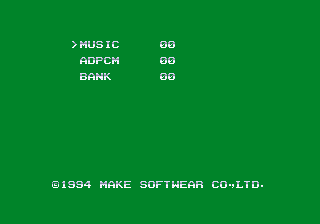

# Debug Tools

Within the code is a set of seven disabled debug tools. 

Reach -> forward, Chi -> Backwards

## Debug Tool #1


Simple graphics viewer, usual controls. Looks to be a viewer for smaller sprites.

## Debug Tool #2


Another graphic viewer. Usual controls, though Pon cycles through the color palettes. Looks like a viewer for larger tilemaps. Has some of the girls from Dokyuusei 2

## Debug Tool #3


Looks to be a very simple sprite resize test. Reach makes it small, Chi makes it larger. And... that's it.

## Debug Tool #4


Another graphics viewer, this time for backgrounds and other large images. More Dokyuusei 2 stuff.

## Debug Tool #5


This tool simply plays through all the gameplay reactions of the girls on loop. There are no player inputs.

## Debug Tool #6


This tool appears to start the game as normal, but actually skips over actual game play and shows the scenes and animations throughout the game on loop. Pressing Start or N will speed through the current animation/scene and jump to the next one.

## Debug Tool #7




It's a sound test! Reach increases, Chi decreases, Pon moves the cursor, and Ron/Tsumo plays the sound.

# 

Code is within test menu (0x900), but is blocked off with a branch @ 0x910. Removing the branch will check the three unmarked dip switches and jump

Code immediately above it refereces it (bsr @ 0x938)

No reference to the code; works if you remove the BRA at 0x910; need to set D0 manually @ 0x938; some weirdness there with how it sets D0.

Build string used as save data verification @ 0x5898

Save data check which appears to be unused: 0x5812

It links to an audit screen (which in turn appears to be unused)  @ 0x5918

TODO: find out how the memory check is triggered at the start

# Audit Screen

There is some unused code at 0x5812 that does not appear to be used. It looks like it was called on startup, perhaps in a location test version. There are two reasons that might be the case, both of which relate to what the code actually does.

First of all, it checks to see that this string is present at a certain location in RAM:

```
Mahjong Doukyusei P.1Ver 0.90  Feb 10 1995
```

If the string is not present, you are greeted with this screen:


The "Good Luck!" is not immediately shown. It only appears after pressing any button, after which it will call some functions (which are likely related to system init), write the string to RAM where it is expected and start the game.

It's interesting that it says the "backup RAM" is broken, as (at least according to MAME) there is no such storage. String checks like these are relatively common, both for data integrity checks (as implied here) and as piracy prevention. This string and its expected memory location, though, are not used by the final game as is. They only appear in this routine.

This code also checks player input for a couple buttons as it starts. If Button A is pressed, it will skip the string check and jump immediately to the code for when the string doesn't match. In other words, it forces the screen to be shown and to "fix" RAM.

If Button B is pressed, it leads to the other major feature of this code, which is an unused audit screen.


The reason I think this is a leftover from a location test is the version in the "memory check" string, which identifies itself as "Ver 0.90." This seems to hint it wasn't a final version, a version 1.0. But more than that is the presence of the audit screen itself, activated by a button press. This is something we've seen before, where devs hide an audit screen with a button combination so they can check the gameplay and income status throughout the active location test period.

# The Cheat

Conveniently, we can both re-enable the debug DIPs and restore the call to the memory check/audit screen in one cheat. The code for the test menu entry begins at 0x900 and contains the code to switch to the debug tools based on the DIP settings. However, there is a branch to the normal test mode before that switch. Simply removing that branch restores the debug DIPs. But if, instead of simply removing it, we turn it into a call to the memcheck/audit code, then we've killed two birds with one stone. The cheat below does just that:

```
  <cheat desc="Enable debug DIPs and Restore Audit/Memory Check">
    <comment>Set variations of the three 'Unknown' DIPs to enter various debugging tools when entering test mode. Also enables an unsed bit of code: Hold A and enter test menu to see a memory reset message; hold B to see an audit screen.</comment>
    <script state="on">
      <action>temp0=maincpu.md@910</action>
      <action>maincpu.md@910=61004f00</action>
    </script>
    <script state="off">
      <action>maincpu.md@910=temp0</action>
    </script>
  </cheat>
```


# Dokyusei 2 Previews

If you make it to Mai-chan, you will be treated to previews for Dokyusei 2.

Actually you see one after the pharmacy girl too? Some unused ones in the graphics viewers? Need to research this further.

Mahjong Dokyusei Special

has all the same debug tools and the "backup ram" check/audit screen. There are no DIP switches, though the code uses the same upper three bits of what would have been the switches, stored at ffc056f (byte)

Mahjong Gakuensai

Global Mode 14 is a scene viewer, doesn't seem to be much else in the way of debug stuff. Probably needs a closer look tho.

Gakuensai 2

looks like it has a viewer menu, need to dig it out
