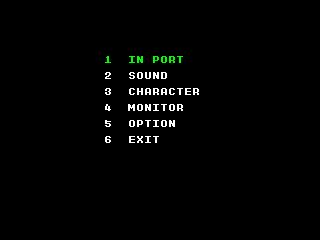
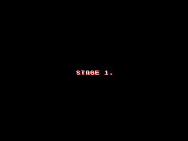

Witches on their brooms shooting magic missiles is the name of the game, literally: gunhōki translates to "gun broom." There's a stage select buried in the code, which is accessible on actual hardware without any code hacks. Neat!

<!--more-->

# Service Mode



Before we jump into the more fun stuff, let's talk briefly about the game's Service Mode. On most arcade hardware, when the service mode DIP switch is enabled, the game will show a test menu either immediately or on the next system reset. Gunhōki works a little differently.

When service mode is enabled and the game is reset, it will perform its usual memory test. Then it will sit at the results screen and do nothing. It would seem at initial glance that there's a bug, or that there's no test menu after all, but the [game's manual](https://archive.org/details/arcademanual_Mystic_Riders) explains this mode in greater detail.

If you press P1 Button 1 + Button 2, it will bring you to the proper test menu, as shown above. It's... dreadfully sparse. The manual says after doing any testing, you should disable the service mode switch and restart. But you'll notice the final option in the menu is Exit, which will bring you into the game. And that's our key to the...

# Debug Tools




Now I mentioned the strange Service Mode as it's a prerequisite for our debug tools.

To enable the debug tools, the game must be run from the Service Mode, and you must hold P1 Up + P1 Button 1 on startup. This means with the cursor at option 1 of the test menu, hold P1 Up (which moves you to Exit) and press P1 Button 1.

The game will appear to run as normal, but now P1 Start will pause the game, and P2 Start will advance by a single frame. P1 Start again will unpause.

The far more useful tool is the stage select, which is pictured above. While the game is paused, hold P1 Button 1 + Button 2 and press P2 Start. Use P1 or P2 Left/Right to change stage, and Button 1 to load the stage.

If you don't feel like going through the Service Mode steps, you can use the cheat below:

```
  <cheat desc="Enable Debug Tools">
    <comment>P1 Start to pause; hold P1 Button 1 + 2 and press P2 Start for stage select</comment>
    <script state="run">
      <action>maincpu.pd@e8596=ffffffff</action>
    </script>
  </cheat>
```

However, this will interfere with the memory test on startup. You'll either need to enable this cheat after the memory test has completed, or use it in conjunction with the cheat below, which will...

# Skip Memory Test

We can skip the somewhat lengthy memory test at the beginning with this cheat:

```
  <cheat desc="Skip memory test">
    <script state="on">
      <action>temp0=maincpu.mw@7a770</action>
      <action>maincpu.mw@7a770=ffcd</action>
    </script>
    <script state="off">
      <action>maincpu.mw@7a770=temp0</action>
    </script>
  </cheat>
```

And that's it for Gun Brooms! Happy Shooting!
