Whoa! The website (in its current form) just passed its one year anniversary! I figured after a year it was FINALLY time to give the design a little refresher with better support for mobile devices, so I spent some time redoing the layout with Bootstrap as well as fixing up some of the design. I think it came out pretty well. Aside from that, I've also been hacking on a new game...

<!--more-->

Mouja is a puzzle game similar to Money Puzzle Exchanger for the NeoGeo. You drop coins of varying amounts to connect them until they add up to the next highest coin. I first gave this game a look a few months back and noticed some interesting things but didn't give it the attention it really needed until now.

And I got way more out of it than I expected...

# Useful Cheats

Before we start, here are a couple of MAME cheats that will be useful when exploring the game. The first is a level select, and the second bypasses the ROM/RAM check at startup (useful if you reset the game with cheats on):

```
  <cheat desc="Level select">
    <parameter>
      <item value="0x00">1</item>
      <item value="0x01">2</item>
      <item value="0x02">3</item>
      <item value="0x03">4</item>
      <item value="0x04">5</item>
      <item value="0x05">6</item>
      <item value="0x06">7</item>
      <item value="0x07">8</item>
      <item value="0x08">9</item>
    </parameter>
    <script state="change">
      <action>maincpu.pb@F00061=param</action>
      <action>maincpu.pw@F00002=F</action>
    </script>
  </cheat>
```

```
  <cheat desc="Skip ROM/RAM test">
    <script state="on">
      <action>temp0=maincpu.mw@0fee</action>
      <action>temp1=maincpu.mw@0ff0</action>
      <action>maincpu.mw@0fee=6000</action>
      <action>maincpu.mw@0ff0=036c</action>
    </script>
    <script state="off">
      <action>maincpu.mw@0fee=temp0</action>
      <action>maincpu.mw@0ff0=temp1</action>
    </script>
  </cheat>
```

# Unused Test Mode

To start things off, the game data contains an unused but far more complete Test Mode. Whereas the Test Mode in the final version is a Frankenstein of input test, sound test and dip switch viewer crammed into one screen, this unused menu is laid out like most other arcade games:

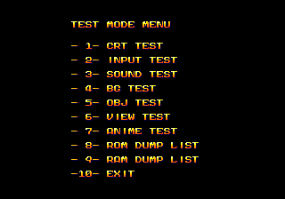

Up/Down to scroll and P1 Start to select / return to the main menu.

## CRT TEST

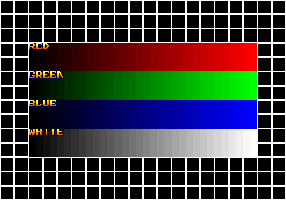

Basic stuff here.

## INPUT TEST

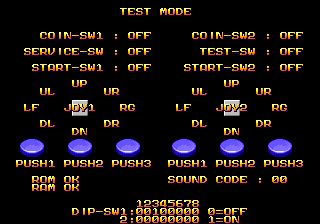

This is what loads for the standard test menu, so nothing special.

## SOUND TEST

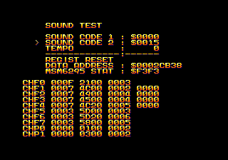

P1 Button 1 plays the song for Sound Code 1, while P1 Button 2 plays Sound Code 2. Has a control for the music tempo and a sound channel data view, which is kinda neat.

## BG TEST / OBJ TEST

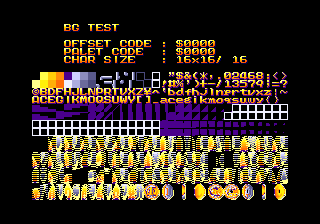

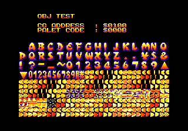

For the BG Test, P1/P2 Button 1 and Button 2 to scroll up and down through the palette, and Button 3 to switch between 8x8 and 16x16 tiles. Same controls for the Obj Test, except for the tile size selection.

## VIEW TEST

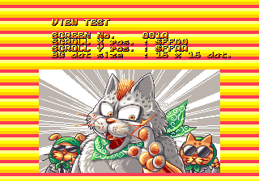

A viewer for the background graphics assembled into coherent images. P1/P2 joystick to reposition, Button 1 and 2 to scroll through the images, Button 3 to switch 8x8/16x16.

## ANIME TEST

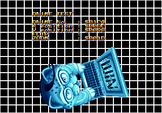

A viewer for sprites, which can be cycled quickly to see them animated. P1/P2 joystick to reposition, P1 Button 1 and Button 2 to cycle through the sprites and frames, and Button 3 does a horiz/vert flip. P2 Button 1 and 2 to zoom in or out, P2 Button 3 to reset the zoom level. P1 Button 3 actually normally causes the game to crash, but our MAME cheat fixes it! See the technical section below for more on that.

## ROM DUMP LIST / RAM DUMP LIST

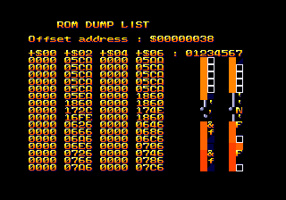

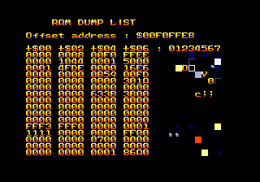

Pretty straightforward, a dump of the data from the ROM and RAM. Interesting that it visualizes it as graphics tiles. P1/P2 up/down to scroll.

So here's the code to enable the menu:

```
<cheat desc="Use old test menu">
    <comment>Replaces the standard test menu.</comment>
    <script state="on">
      <action>temp0=maincpu.mw@17f0</action>
      <action>temp1=maincpu.mw@17f2</action>
      <action>temp2=maincpu.mw@14c8</action>
      <action>temp5=maincpu.mw@1532</action>
      <action>temp6=maincpu.mb@14d3d</action>
      <action>temp7=maincpu.mw@14d10</action>
      <action>temp8=maincpu.mw@14d12</action>
      <action>maincpu.mw@17f0=0001</action>
      <action>maincpu.mw@17f2=4484</action>
      <action>maincpu.mw@14c8=3c38</action>
      <action>maincpu.mw@1532=3c38</action>
      <action>maincpu.mb@14d3d=ac</action>
      <action>maincpu.mw@14d10=4e71</action>
      <action>maincpu.mw@14d12=4e71</action>
    </script>
    <script state="off">
      <action>maincpu.mw@17f0=temp0</action>
      <action>maincpu.mw@17f2=temp1</action>
      <action>maincpu.mw@14c8=temp2</action>
      <action>maincpu.mw@1532=temp5</action>
      <action>maincpu.mb@14d3d=temp6</action>
      <action>maincpu.mw@14d10=temp7</action>
      <action>maincpu.mw@14d12=temp8</action>
    </script>
  </cheat>
```

Yeah, that's a pretty big cheat. Wanna know why?

# Unused Test Mode - Technical

The entry point for the test menu, based on the main function pointer table @ 0x17F0, begins at 0x14476

<pre class="pdasm pdasm-arch-m68k">
test_menu_entry:
014476: bra     $15042{input_test}     ; branch immediately to the input test...
01447A: btst    #$0, ($43,A6)          ; test bit 0 of 0xf00043
014480: bne     $15042{input_test}     ; branch to input test if the bit is set
014484: move.w  ($998,A6), D0          ; start the test menu for real...
014488: add.w   D0, D0
01448A: move.w  ($14490{test_menu_strings},D0.w), D0
01448E: jmp     ($14490{test_menu_strings},D0.w)
</pre>

We see that the code immediately jumps down to the input test when it first enters the test menu. That makes the code below it unreachable. Period. This menu was 100% disabled.

On the next two instructions after that, it's testing bit 0 of 0xF00043. (Note that this game stores a base RAM location of 0xF00000 in register A6, so references like ($43,A6) are 0xF00000 + 0x43.) If that bit is set, it branches to the test menu, as above. So it looks like there was an 'if' there to determine whether we get the input test only or the full menu.

So what's at 0xF00043? Starting at 0xF00040 are four bytes representing the four dip switches on the PCB. On startup (and in a loop in the input test), these four bytes are copied from the hardware port at 0x478884 to 87, and the program uses the RAM mirror for the game options. Here's a picture of the dip switches from the actual board:

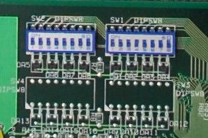

Four ports but only two switches. The two unused ports would have been used on development hardware for debug settings. So 0xF00040 is dip 1 and 41 is dip 2 while 42 and 43 (that the test menu is checking) are the non-existent dips 3 and 4.

In other words, this test menu is really, really inaccessible. Someone was paranoid enough to add that branch before the dip check just in case someone was wacky enough to solder on a dip switch block or short the connection. But that's nothing a little code hacking can't fix!

There are two steps in the MAME cheat above to get the menu working: change the address of the test menu entry to past the branch and check, and hijack the jumps to the test menu initialization. There's also a third step to patch a bug in one of the functions.

The first step is pretty straightforward. The list of pointers to major game functions starts at 0x17F0, and right at the start, for game mode 0, is the address for the test menu, 0x14476. We'll change that to 0x14484, which is the start of the test menu after the branch/dip switch check. Great, let's do that and reset the game and...


Hmm. Well. The angle bracket there next to RED is the cursor for the menu, which is functional. In fact, if we choose an option with P1 Start, then push it again, it returns to the menu with it correctly redrawn. This only works if you load the cheat on startup with test mode set; if you press the Test button while in game, it sometimes crashes. But I mean it sort of works, so.. good enough? Nope! We're going to do this right.

The test menu has three distinct pieces: menu initialization, option initialization and loop code. The initialization code for the full menu starts at 0x13C38, which clears some variables and draws the main menu text to the screen. Immediately after that is the option initialization switch, which starts at 0x13D9E. This switch will jump to the setup for the option you choose from the main menu (for example, setting initial values and drawing the starting text and graphics). Finally, the loop code starts at 0x14476. This runs the loop code for the selected option (for example, reading controller inputs and acting on those inputs). As their names imply, the initialization functions should only be called once, while loop functions are called continuously from the program loop.

Our main menu text is not loaded at first because its init code at 0x13C38 is never called. Instead, there's another init subroutine for the new test menu starting at 0x1353E. This code does some graphics resets, displays the grid/color bar CRT test, then sets the game mode to 0 to switch the game loop into the test mode. Whats interesting is that it even bothers to call the grid/color bar test at all, since they disappear almost instantly after it re-enters the game loop. This explains why we have that as the background for our slightly-working attempt above: it called the initialization for the new test menu but we have the loop pointing to the old menu.

So we need to change the references to the *new* menu init to point to the *old* menu init. 0x1353E (new menu init) is called from two locations, JSRs at 0x14C4 and 0x152E, both of which are part of the main game loop. The first call is made when the Test dip is set on startup, and the second is from inside the game loop. We'll need to change both of these to use the old, full menu code at 0x13C38. After we've done that...


Everything is beautiful! ... almost. There's actually a bug in the Anime Test. When pressing P1 Button 3 (which was supposed to be h/v flip the sprite), the game crashes. Let's fix that!

The anime test loop code starts at 0x14C56. It checks which buttons are being pressed and updates values. When it comes to check Player 1 Button 3...

<pre class="pdasm pdasm-arch-m68k">
check_input_p1_button3_reset:
014D00: btst    #$7, D0                    ; check if B3 was pressed..
014D04: bne     $14d20{check_input_p1_button3_flip}
014D08: btst    #$7, D1
014D0C: beq     $14d20{check_input_p1_button3_flip}
014D10: clr.w   ($990,A6)                  ; reset h/v flip to normal
014D14: move.w  #$a0, ($99c,A6)            ; reset to the initial y
014D1A: move.w  #$70, ($99e,A6)            ; and x position
  check_input_p1_button3_flip:
014D20: btst    #$7, D0                    ; check for B3 again
014D24: bne     $14d50
014D28: btst    #$7, D1
014D2C: beq     $14d50
014D30: addq.w  #1, ($990,A6)              ; add to the h/v flip value
014D34: andi.w  #$3, ($990,A6)
014D3A: lea     (-$a55,PC)[$142e7], A1    ; this is pointing to an invalid string!
014D3E: move.w  ($990,A6), D0
014D42: add.w   D0, D0
014D44: add.w   D0, D0
014D46: movea.l (A1,D0.w), A1
014D4A: jsr     $15850{display_text}
</pre>

There are a couple problems here. The biggest problem is at 0x14D3A. This sets up for the text display call by pointing register A1 at 0x142E7, which is suppsed to be a pointer table in the middle of the text strings. But it's off by one byte! 0x142E7 is the very last byte of the ZOOM string, ending with an FF. It's actually looking for 0x142E8, where we have the start of the FLIP text.

So that's a simple fix. If we update that address, the game doesn't crash now, but it also doesn't go beyond H-FLIP. This is due to the code right above, where it resets the flip value to 0 every time. What's going on here?

Just like the flip code does, the reset code above it checks if Button 3 was pressed. If so, it sets the H/V flip to normal and the X/Y position to default. And then it jumps down into the flip check code discussed above. This means every time the button is pressed, it resets everything to default, but then also increases the flip value by one; when you press it again, it's reset and increased to one again, never getting past H-FLIP.

I'm not certain if the 'reset to default' code was meant to be mapped to another button, or if it was supposed to be a combined function that was just never fixed. We can fix it to work either way. If we want it to reset the x/y position every time but not the flip, we just need to NOP out the bytes for the CLR at 0x14D10. If we want to skip the reset code altogether and just leave in the flip, we need to add a branch at 0x14D00 to the flip code, so the defaults code is never accessible. I prefer the second option and think most others would too, so that's the version I put in the MAME cheat.

Either way, the anime test works beautifully now!

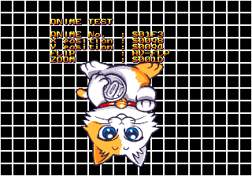

# Developer Easter Eggs

Right at the top of the code, immediately following the vector table, at 0x400 we have a message from the programmer:

```
(C)1996/04/08 PM 5:35 Hisanori Takeuchi / TinyTomo   <KYC00151@niftyserve.or.jp>     
```

I don't think that email address is around anymore.

There's another, far more elaborate easter egg in here too:

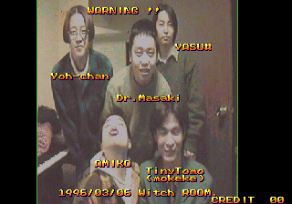

Text snuck into the data is one thing, but a full size digital picture (especially for 1996) is a pretty big deal! Oh hey, there's TinyTomo, the guy who gave us his email address above.

This screen is accessible by pressing P1 Button 1 fifty times while on the audit screen.

Wait, what audit screen?

# Income Audit Screen

This audit screen:

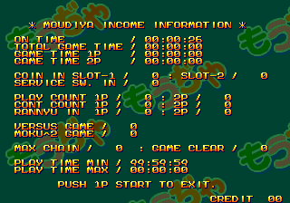

Pretty standard stuff. What's weird though is I don't think there's a way to access this normally, at least not without having a better understanding of the actual hardware. It would normally be accessible during the attract mode animation by pressing and holding a currently unknown button and pressing a sequence of Player one buttons: 1,2,1,1,2,2,1,2,1,1,2,2.

Without digging too deep technically, the code is looking for the lowest bit of the input to be unset. MAME has this bit literally marked as unknown:

```
PORT_BIT( 0x0001, IP_ACTIVE_LOW, IPT_UNKNOWN )
```

My guess is that this was only meant to be available during the location test, perhaps on different hardware that had our missing button. Whatever it was, we can patch it pretty easily to use a button that actually exists. The MAME cheat below does just that, replacing our mystery button with P1 Up:

```
  <cheat desc="Audit screen patch">
    <comment>While the attract animation is playing, hold P1 Up and press P1 1,2,1,1,2,2,1,2,1,1,2,2</comment>
    <script state="on">
      <action>temp0=maincpu.mb@8671</action>
      <action>temp1=maincpu.mb@1505f</action>
      <action>maincpu.mb@8671=fd</action>
      <action>maincpu.mb@1505f=fd</action>
    </script>
    <script state="off">
      <action>maincpu.mb@8671=temp0</action>
      <action>maincpu.mb@1505f=temp1</action>
    </script>
  </cheat>
```

# Broken Score Pattern Select

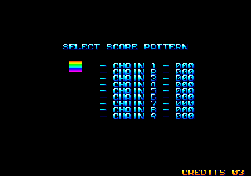

It's not clear what this menu was meant for, though I suspect it originally allowed you to set up point values for chained combos. The rainbow cursor can be moved up and down like on a menu, and P1 Button 1 'selects' the option and goes on to the gameplay type selection screen. Here's some things we do know about it:

- This is game mode 0x15 (as defined in the main functions table), and seems to be completely un-referenced.
- The text is entirely hardcoded - the zeros are not changeable values.
- The cursor does not line up with any of the text.
- It seems it was originally meant to appear before the gameplay type selection screen, as it has a jump to that screen at the end of its code
- The code is similar to the number of players/gameplay type menus but it's very minimal and doesn't seem to store any values that affect the game later

So it looks like whatever functionality this menu was supposed to enable was removed or never completed to start with. Since it conveniently calls the gameplay type selection after it, we can modify the code a bit to have it appear after the 1/2 player selection screen:

```
  <cheat desc="Chain pattern select">
    <comment>This will appear between the 1/2 Player select screen and the Gameplay Type select screen</comment>
    <script state="on">
      <action>temp0=maincpu.mw@f594</action>
      <action>temp1=maincpu.mw@f5c6</action>
      <action>maincpu.mw@f594=4e71</action>
      <action>maincpu.mw@f5c6=4e71</action>
    </script>
    <script state="off">
      <action>maincpu.mw@f594=temp0</action>
      <action>maincpu.mw@f5c6=temp1</action>
    </script>
  </cheat>
```

# Post Credits Bonus Game

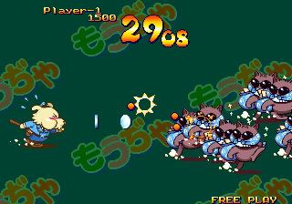

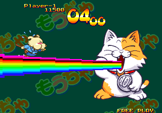

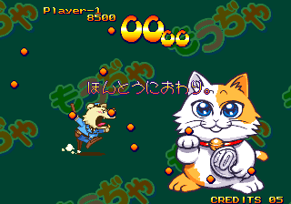

This doesn't really count as hidden, I suppose, but I doubt very many people know about it. It's a simple side scrolling shooter, where you hurl coins at the raccoons and the boss cat. To activate this mode, you'll need to have a new top score after finishing the final round, beating all the existing entries in the high score list for the game mode you're playing in. If your score is high enough, the mini-game appears after the credits.

Interestingly, it has its OWN high score list:

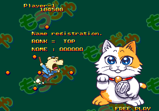

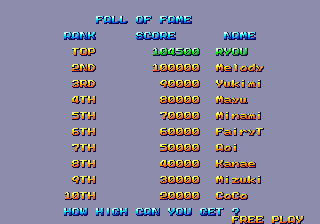

If you want to cheat, you can change your P1 score at 0xF0019A (dword) when you're at the last level.. or you can use the cheat below to load the bonus game instead of the standard game:

```
  <cheat desc="Go to bonus game">
    <comment>Goes directly to the bonus game instead of the standard game after pressing Start</comment>
    <script state="on">
      <action>temp0=maincpu.mw@1834</action>
      <action>temp1=maincpu.mw@1836</action>
      <action>maincpu.mw@1834=1</action>
      <action>maincpu.mw@1836=0a02</action>
    </script>
    <script state="run">
      <action>maincpu.pb@f0000d=2</action>
      <action>maincpu.pb@f00038=2</action>
      </script>
    <script state="off">
      <action>maincpu.mw@1834=temp0</action>
      <action>maincpu.mw@1836=temp1</action>
    </script>
  </cheat>
```

And finally, the score for the shooting game is the dword value at 0xF001A0, if you want to cheat your way to the top of that list too.

# Debugging Tools

We're not done yet!

There are two un-used functions in the game for displaying overlays with debugging information. The first one is a game state monitor that simply displays the values from a few RAM locations:

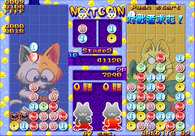

The upper half of the first line is the value at 0xF00190 and the lower half is 0xF004FE. These are the IDs for the player 1 and player 2 puzzle background images, respectively. The second line contains the flags for whether P1 and P2 are human or computer controlled, at 0xF00038. The third line reads from 0xF0003A, but I haven't been able to determine what effect this value has on the game. The final two lines are the x and y position of the puzzle background images. The x position is the word at 0xF009E4, and the y position is at 0xF009E2.

Here's the MAME cheat to enable this:

```
  <cheat desc="Enable small debug overlay">
    <script state="on">
      <action>temp0=maincpu.mw@1556</action>
      <action>temp1=maincpu.mw@1558</action>
      <action>maincpu.mw@1556=6100</action>
      <action>maincpu.mw@1558=0490</action>
    </script>
    <script state="run">
      <action>maincpu.pb@f00044=1</action>
    </script>
    <script state="off">
      <action>maincpu.mw@1556=temp0</action>
      <action>maincpu.mw@1558=temp1</action>
      <action>maincpu.pb@f00044=0</action>
    </script>
  </cheat>
```

The other debug tool left behind is much more impressive. It's a task list for all the on-screen objects:

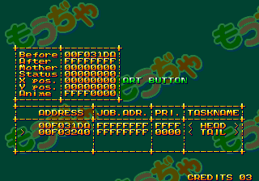

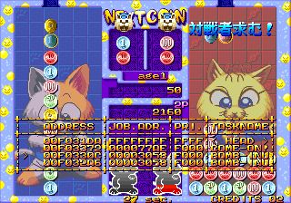

Press P2 Button 3 to toggle it on or off. You can scroll through the list using P2 Up/Down. P2 Button 2 will bring up extended information about the object, and P2 Button 1 will delete (!) that object. Before we dive into the technical behind this, here's the MAME cheat to enable it:

```
  <cheat desc="Enable debug task list">
    <comment>Press P2 Button 3 to bring up the list</comment>
    <script state="on">
      <action>temp0=maincpu.mw@154c</action>
      <action>temp1=maincpu.mw@154e</action>
      <action>temp2=maincpu.mw@1550</action>
      <action>temp3=maincpu.mw@1552</action>
      <action>temp4=maincpu.mw@1554</action>
      <action>temp5=maincpu.mw@1556</action>
      <action>temp6=maincpu.mw@1558</action>
      <action>maincpu.mw@154c=6100</action>
      <action>maincpu.mw@154e=04ea</action>
      <action>maincpu.mw@1550=082e</action>
      <action>maincpu.mw@1552=0000</action>
      <action>maincpu.mw@1554=0044</action>
      <action>maincpu.mw@1556=6600</action>
      <action>maincpu.mw@1558=0198</action>
    </script>
    <script state="off">
      <action>maincpu.mw@154c=temp0</action>
      <action>maincpu.mw@154e=temp1</action>
      <action>maincpu.mw@1550=temp2</action>
      <action>maincpu.mw@1552=temp3</action>
      <action>maincpu.mw@1554=temp4</action>
      <action>maincpu.mw@1556=temp5</action>
      <action>maincpu.mw@1558=temp6</action>
    </script>
  </cheat>
```

# Debugging Tools - Technical

The task list code begins at 0x1A38. Looking through it, we see a number of references to bits 0 and 1 of 0xF00044. If we set bit 0 of that address while the game is running, the game 'pauses.' As soon as we unset it, the game resumes. Interesting.

So we search the code for any more references to this address, and we see that it is only used in the task list, and in one other location, at 0x154C, which is inside the main game loop:

<pre class="pdasm pdasm-arch-m68k">
00154C: btst    #$0, ($44,A6)          ; check bit 0 of 0xf00044
001552: beq     $155a                  ; if it's unset, branch down and continue
001556: bra     $16f0{main_loop_end}   ; if it's set, jump to the end of the game loop
00155A: tst.b   ($4e,A6)               ; continue the loop...```
</pre>

If bit 0 is set, it skips all the game processing and rendering and just continues to loop. Since 0xF00044 isn't touched by the code anywhere else except for the debug task list, it's pretty safe to say that this check in the game loop is a leftover from when that debug function was enabled. So how do we fix this?

Going back to the task list code, we see that the first thing it does is check for player input, specifically whether P2 Button 3 was pressed, and will invert bit 0 of 0xF00044 accordingly. If bit 0 is set, it displays the menu and returns; if its unset, it just returns.

So ultimately we need to have the task list subroutine called in every iteration of the game loop. Thankfully the code is close enough that we can use a branch instead of a jump and save a couple bytes. That gives us enough room to make the call, test 0xF00044, and branch to the end of loop if it's set. If it isn't, the loop carries on happily:

<pre class="pdasm pdasm-arch-m68k">
00154C: bsr     $1a38                  ; branch to the task list code
001550: btst    #$0, ($44,A6)          ; check bit 0 of 0xf00044 (set or unset in the task list code above)
001556: bne     $16f0{main_loop_end}   ; if set, jump to the end of the game loop
00155A: tst.b   ($4e,A6)               ; otherwise continue the loop...```
</pre>

# Misc.

## Music Credits

The pointers for the [OPLL](https://en.wikipedia.org/wiki/Yamaha_YM2413) music data start at 0x2B97E. Each chunk of song data appears to have a header, including what appears to be strings for the composer name. Most songs have this as 'Hakase,' though a couple also have the name 'Yoichi.' In the game credits, the sound composers are listed as Dr. Masaki and Yoh-chan, both of whom are pictured in the easter egg above (and I'm pretty sure that's a music keyboard on the left side of of the image!). Hakase (Japanese for professor) is Dr. Masaki, and Yoichi is Yoh-chan.

Also in that header chunk is the name of the song, in Shift-JIS encoding. Here are the strings:

```
もうぢゃ 00 : Ｇame Ｓelect
もうぢゃ 02 : Ｈigh Ｓcore Ｍode
もうぢゃ 03 : 勝ち
もうぢゃ 04 : 負け
もうぢゃ 05 : ステージクリア
もうぢゃ 06 : Ｒeady
もうぢゃ 07 : Ｇame Ｏver
もうぢゃ 08 : 乱入
もうぢゃ 09 : ネームエントリー
もうぢゃ 10 : ランキング
もうぢゃ 11 : コンティニュー
もうぢゃ 12 : タイトル
もうぢゃ 13 : ステージスタート
もうぢゃ 14 : ＢＧＭ０２ 対戦モード
もうぢゃ 15 : 最終面デモ
もうぢゃ 16 : エンディング１
もうぢゃ 17 : エンディング２
もうぢゃ 18 : エンディング２
もうぢゃ 19 : スタッフロール
もうぢゃ 20 : サウンドテスト（ＦＭ）
もうぢゃ 21 : サウンドテスト（ＰＣＭ）
```

## Unused Logo

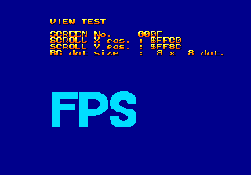

It's a little bit boring, but there appears to be an unused logo for FPS (the publisher?).

***

I think that about covers it. I've been hacking on and writing about this game for the last two weeks, and while it's been fun, I'm definitely looking forward to moving on to something else...
