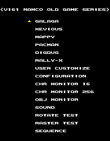
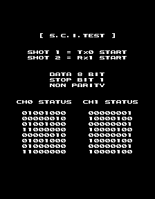
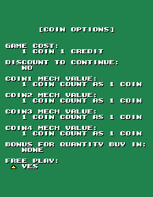
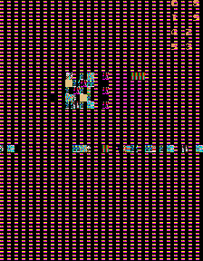

This is a great little collection of classic Namco games - Pac-Man, Rally X, Dig Dug, Mappy, Galaga and Xevious. Not only are the original games faithfully recreated, there's an 'arranged' mode for each with new graphics, music and gameplay. Oh, and there are bunches of debug tools leftover...

<!--more-->

Namco Classics Collection is split across two releases: Volume 1 contains Galaga, Mappy and Xevious, and Volume 2 has Dig Dug, Pac-Man and Rally X. The same team of programmers worked on both releases, and the non-game specific, system code is the same. This includes the same set of debug tools, which are present and working in both versions. As such, I'll be taking a look at each function as it's shared across both versions.

 - <a href="#inputs">Additional Hardware Inputs</a>
 - <a href="#gameselectdebug">Game Select Menu  &amp; Debug Tools</a>
 - <a href="#objectdebug">Object/Memory debugger</a>
 - <a href="#devcredits">Developer Credits</a>
 - <a href="#v1finds">Version Specific Finds - Volume 1</a>

# <a id="inputs" name="inputs"></a>Additional Hardware Inputs

After initially digging into the disassembly and getting some of the disabled dev tools to function, my first issue was the inability to actually navigate the menus. The CPU was humming along and the first option was selectable with Player 1 controls so I knew it wasn't locked up, yet I couldn't move the cursor with either controller. So back into the code I dove. This ended up being quite a rabbit hole...

## Player Hardware

Both editions of Namco Classics Collection have two player inputs consisting of a joystick, two game buttons, and a Start button (though it should be noted the hardware supports a third game button, which we'll see later). We can see that here on the physical cabinet:


The controller input is handled by the [MCU](https://en.wikipedia.org/wiki/Microcontroller), a [Hitachi H8/3002](https://en.wikipedia.org/wiki/H8_Family), which processes and copies the data into memory shared with the CPU. In its main loop, the CPU then mirrors those values to another location in memory, and in turn the game code uses those copies for acting on player input. At a high level, this sort of data sharing process is common to many arcade games.

On the surface, things are pretty straightforward, but a little bit of digging reveals some oddities for both of these processors...

## The MCU

Let’s start with the MCU, since the controller data passes through here first. The microcontroller only has a handful of simple tasks, so its code is likewise relatively simple. As mentioned above, one of those tasks is providing the controller data to the CPU. Instead of simply copying the data as-is, it does some extra work, expanding the byte into a word containing both the constant- and the single-press values. Let me elaborate on that.

In most games, controller data is polled in the program’s main loop. If you’re holding down a button, then the value of that press is registered in every iteration. This is the constant value, which is useful for things like making your ship move around the screen just by holding the joystick in that direction. But suppose you want the ship to launch a bomb only once when the user hits the button. If you rely on the constant value, the ship will fire with every loop iteration. Instead, you need a value that is set *only if button’s state has just changed from off to on.* This is the single-press value, only set in that first iteration after a new button press. It needs to be calculated in the code, which usually involves storing the value from the previous iteration in memory and comparing with the current value to see if there is a state change.

In our case, the single press value is determined in the MCU’s program code. Let’s take a look at the disassembly:

<pre class="pdasm pdasm-arch-h8">
copyIn1:
0041E4: mov.b @h'00c00003{P1_INPUT}, r1h ; get the current input from the player
0041EA: mov.b @h'00200051{P1_INPUT_prev} r0l ; load the value from the last iteration
0041F0: cmp.b r0l, r1h  ; has the value changed?
0041F2: beq h'000041fa    ; it has not, jump down
0041F4: mov.b r1h, r1l  ; these lines do the bitwise math to determine the single-press value (low byte)
0041F6: xor.b r0l, r1l
0041F8: and.b r0l, r1l
0041FA: mov.b r1h, @h'00200051{P1_INPUT_prev} ; store the current value as the previous value for the next iteration
004200: not.b r1h
004202: mov.w r1, @h'00200004{P1_INPUT_shared} ; copy the input to shared RAM for the CPU to use; this is equivalent to 0x400004 on the CPU
004208: xor.b r1l, r1l ; clear the lower byte of the register
copyIn2:
00420A: mov.b @h'00c00002{P2_INPUT}, r1h ; doing the same code but with the Player 2 addresses now, as expected
004210: mov.b @h'00200052{P2_INPUT_prev}, r0l
004216: cmp.b r0l, r1h
004218: beq h'00004220
00421A: mov.b r1h, r1l
00421C: xor.b r0l, r1l
00421E: and.b r0l, r1l
004220: mov.b r1h, @h'00200052{P2_INPUT_prev}
004226: not.b r1h
004228: mov.w r1, @h'00200006{P2_INPUT_shared}
00422E: xor.b r1l, r1l
</pre>

This is the chunk of code that expands the player 1 input byte (at 0xC00003) into a word, with the constant and single values making up the high and low bytes, respectively, then copies the processed value into shared RAM (at 0x200004, equivalent to 0x400004 on the CPU side). It’s pretty uncomplicated stuff. It then continues on, repeating this exact algorithm (but with different memory offsets) for player 2, as expected… but then something unforeseen occurs:

<pre class="pdasm pdasm-arch-h8">
copyIn3:
004230: mov.b @h'00ffffce{H8_PORT7}, r1h ; this is where things get interesting
004236: mov.b @h'00200053{UNKNOWN1_INPUT_prev}, r0l ; we have the exact same code, copying controller inputs to the CPU, but from an unexpected source
00423C: cmp.b r0l, r1h
00423E: beq h'00004246
004240: mov.b r1h, r1l
004242: xor.b r0l, r1l
004244: and.b r0l, r1l
004246: mov.b r1h, @h'00200053{UNKNOWN1_INPUT_prev}
00424C: not.b r1h
00424E: mov.w r1, @h'00200008{UNKNOWN1_INPUT_shared}
004254: xor.b r1l, r1l
copyIn4:
004256: mov.b @h'00c00001{UNKNOWN2_INPUT}, r1h ; and here it is on more time: same code, but yet another unused address
00425C: mov.b @h'00200054{UNKNOWN2_INPUT_prev}, r0l
004262: cmp.b r0l, r1h
004264: beq h'0000426c
004266: mov.b r1h, r1l
004268: xor.b r0l, r1l
00426A: and.b r0l, r1l
00426C: mov.b r1h, @h'00200054{UNKNOWN2_INPUT_prev}
004272: not.b r1h
004274: mov.w r1, @h'0020000a{UNKNOWN2_INPUT_shared}
</pre>

After processing/sharing the Player 2 data, the code repeats two more times using different, undocumented memory offsets! Since the code is doing exactly the same thing here that it does for dealing with the normal player controls, it’s fair to say it’s expecting controller input data from somewhere else besides our two known player controllers. That implies there were four hardware inputs on a system with only two players.

Our information is limited, but here’s what we can know about these unknown addresses from which the MCU is expecting joystick and button input. Looking at the third block of code, we see it referencing 0xFFFFCE. Digging into [the H8/3002 manual](https://4donline.ihs.com/images/VipMasterIC/IC/HITA/HITAS03250/HITAS03250-1.pdf?hkey=EF798316E3902B6ED9A73243A3159BB0), we see that this is an 8-bit, read-only port labeled as Port 7. Looking at the chip pinout and the PCB itself...


… we see that it leads to an empty suppression filter and further down to the proprietary Namco 48 connector edge. That tells us this input was not connected to the JAMMA compatible player controllers and the ability to use the port was removed in the production PCB.

In the fourth chunk of code, we’re back in the 0xC0000x neighborhood, near the normal player joysticks and DIP switch values. This time we’re reading from 0xC00001, which MAME has acknowledged as an unused input. Unfortunately, in this case, it’s not as obvious on the hardware in where the values in this area are coming from. I would need to look at the physical board, or some much higher res pictures of the front and back to try to follow the leads. From the images of the PCB that we do have, it’s interesting to note that two more suppression filters are missing near that Namco 48 edge, just like on the connection to the H8’s Port 7 that we just discussed:




The lower highlight is the H8/Port 7 connection already examined, and the one above it marks two more missing suppression filters. This isn’t proof that these are the leads for this other input, but it’s an interesting correlation.

So it looks like two additional input devices were supported, though they are disabled in the final consumer board. But just to make things more *complicated* interesting, let’s take a look at the PCB for Abnormal Check, the only other game dumped for the Namco ND-1 hardware.




This is a newer version of the board, revision C (Namco Classics are marked as rev. B). There’s a daughterboard for controlling the game’s thermal printer, but most of the hardware is otherwise identical. What’s interesting here is that all of the suppression filters missing from the Namco Classics/rev. B boards are present here!

We can only guess at the nature of these inputs. They may have been debugging ports for use during development, though if that’s the case, why does Abnormal Check have them connected? Perhaps there were meant to be four player games, though this seems unlikely. In any case, what we know for sure is that in all versions of the code, the MCU is dutifully polling data from these ghost ports and giving it to the CPU.

## The CPU

So that’s half of the story! Now let’s move on to the CPU, where all the actual game processing occurs. During the main loop, the Player 1 and 2 input values that were provided by the MCU are copied to a mirror in RAM

Right near the beginning of that shared memory are the locations of the input data: offsets 0x04 for Player 1 and 0x06 for Player 2. The values are word sized, with the high byte being constant press and the low byte being single press. As part of the main loop on the CPU side, those values are copied to mirrors at 0x40089C and 0x40089E. The game generally uses these mirrors rather than the values directly shared by the MCU.

Things are pretty straightforward so far, but things get strange in the various debug tools. Not only do they use the normal input mirrors like the rest of the game, they also reference two more word-sized RAM addresses and treat them as inputs as well.

Those RAM locations are never written to anywhere in the code and they are never referenced in any of the normal user-space game code. So right away we have a problem with the debug menus: you can’t move the cursor around since there’s never any data there!

Assuming the two mystery locations are, indeed, input values, my initial fix for this was to simply have the code duplicate the P1/P2 input values to the two addresses, respectively. This worked quite well. Perfectly, in fact. Our debug menus work now... but that’s not good enough for me, of course. What are these other, cryptic input values?

For quite some time, I puzzled over what they could be. The most intriguing aspect was that none of the inputs overlap. That is to say, there are no instances where the code is looking for, say, P1 Button 1 and Mystery Input Button 1 at the same time. The two sets of inputs mesh together perfectly, and that’s why “merging” them together the way my fix does works so well. This implied a relation between the normal and mystery inputs, though from a code perspective they are entirely discrete. Finally, I noticed something on the debugging menu (which is discussed below) that I missed before:


The first screen of the debugger is a simple monitor of some major program variables. One set of them is Key1p and Key2p which, as expected, return the raw value of the current input. And right below them is Key1pAuto and Key2pAuto, which reference our mystery addresses. This settled that debate: there is indeed a connection to the normal controls. But what about the word “Auto”? What is that supposed to mean?

As a gamer, the first thing that probably comes to mind is “autofire,” and in fact that may be the key here. Remember near the top of this section I went over the constant and single press values, and how the MCU amalgamates the two into one value. My theory is that the “auto” here is in fact referring to the constant value from the controller. Perhaps in an older version, before the MCU combined the two byte values into one word per controller, there were two word values: one for single press, one for constant press.

Of course, since the code that actually wrote to these “auto” values is no longer present, I can’t prove this. However, there’s some compelling evidence for it. Consider that, as I already pointed out, the Auto values worked in perfect conjunction with the Normal values, with no overlap. It seems the two were meant to work together instead of separately. Next, consider how the Auto values are used in the debug menus: only in places where you would expect the constant input value to be useful. For example, the Auto value is used to control the cursor movement; from a usability standpoint, it would be useful to just hold up or down to scroll instead of tapping the stick for each menu option. Finally, consider that only the lower byte of the Auto values is ever referenced by the code. It’s logical that if the single and constant values (both of which are only one byte each) were split into two words, only the low byte would ever be of use.

Naturally, there are a couple quirks to this theory. For one, using the constant value as-is for the menu cursor makes it move way too fast, since it’s updating on every program loop iteration. It requires the slightest of taps on the controller to move the cursor only one space. One could argue that while this is annoying, perhaps the devs found more value in being able to move through the menus quickly. Or perhaps there was some removed code to add some timing to this.

But let’s also look at the CHR16 tool, a simple tile viewer discussed below. It uses the normal P1 input to move the tiles left and right, and the Auto P1 input to move them up and down. Again, an example of the two working together, but what throws us for a loop is the fact that it is using the constant value of normal P1 (the high byte; that is, it keeps scrolling as you hold the button). Remember that the Auto values only use the low byte. On one hand, this supports the theory that the Auto value is meant to always be a constant press; that is, from a usability perspective, we would expect it to match the same functionality as the normal input (hold to scroll). But it also throws a wrench in the idea that the Auto value is from an old version, since it’s also referencing the constant, high byte of the normal input that, theoretically, should have been in later versions. It could be that the code was halfway updated when the new method was implemented, but that’s just conjecture at this point.

Have I lost you yet?

## Putting it all together

Let’s sum up the facts and theories:

1. Fact: the MCU code has an identical block of code repeated four times for four different memory locations that computes and concatenates the single and constant button press values from controller data into two bytes (one word). The MCU provides all four of these word values in shared RAM, available to the CPU. Two of these memory locations are known, the Player 1 and 2 inputs; the other two are unknown.

2. Theory: The two unknown controller inputs being read on the MCU could have been developer/debugging inputs.

3. Fact: the CPU reads the known P1/P2 values from the MCU and copies them to a mirror in RAM. All of the gameplay code references these mirrors for player input rather than the MCU shared location. However, the disabled developer tools that are leftover in the code also reference two other memory locations adjacent to the input mirrors as controller inputs. The debug menu names these locations with variable names Key1pAuto and Key2pAuto. Though their values are used dev tools, they are never written to anywhere in the code and thus never have a value during normal operation.

4. Theory: The Auto values may have been from previous versions, where the Single and Constant buttons presses could have been split into two word values per controller.<

We can visualize it like this:




Two disabled hardware inputs on the MCU and two half-removed software inputs on the CPU… It’s tempting to say there’s a correlation here. In reality, I think it’s just a big fat coincidence. This is primarily due to the theory I laid out in the CPU section, wherein I believe there is enough evidence in the code to explain the CPU inputs away as relics of an older version.

So... Here's a MAME cheat to copy the standard inputs to the auto inputs, which will render the debug menus usable. There are two versions: the first is a 'single press' version, while the second is the theoretical 'constant press' version. I reccomend using the single press version, as it's more sane:

Volume 1 Japan (Ver. 1.03)

```
    <cheat desc="Enable Auto inputs (single press)">
        <comment>Copies P1/P2 inputs to P1Auto/P2Auto inputs for use in the debug menus</comment>
        <script state="on">
            <action>temp0=maincpu.mq@255a</action>
            <action>maincpu.mq@255a=3d790040000400a0</action>
            <action>temp1=maincpu.mq@2562</action>
            <action>maincpu.mq@2562=3d790040000600a2</action>xxxxxx
            <action>temp2=maincpu.md@256a</action>
            <action>maincpu.md@256a=4efaff78</action>
        </script>
        <script state="off">
            <action>maincpu.mq@255a=temp0 </action>
            <action>maincpu.mq@2562=temp1 </action>
            <action>maincpu.md@256a=temp2 </action>
        </script>
    </cheat>

    <cheat desc="Enable Auto inputs (constant press)">
        <comment>Copies P1/P2 inputs to P1Auto/P2Auto inputs for use in the debug menus</comment>
        <script state="on">
            <action>temp0=maincpu.mq@255a</action>
            <action>maincpu.mq@255a=1d790040000400a1</action>
            <action>temp1=maincpu.mq@2562</action>
            <action>maincpu.mq@2562=1d790040000600a3</action>xxxxxx
            <action>temp2=maincpu.md@256a</action>
            <action>maincpu.md@256a=4efaff78</action>
        </script>
        <script state="off">
            <action>maincpu.mq@255a=temp0 </action>
            <action>maincpu.mq@2562=temp1 </action>
            <action>maincpu.md@256a=temp2 </action>
        </script>
    </cheat>
```

Volume 2 Japan

```
    <cheat desc="Enable Auto inputs (single press)">
        <comment>Copies P1/P2 inputs to P1Auto/P2Auto inputs for use in the debug menus</comment>
        <script state="on">
            <action>temp0=maincpu.mq@255a</action>
            <action>maincpu.mq@255a=3d79004000040028</action>
            <action>temp1=maincpu.mq@2562</action>
            <action>maincpu.mq@2562=3d7900400006002a</action>
            <action>temp2=maincpu.md@256a</action>
            <action>maincpu.md@256a=4efaff78</action>
        </script>
        <script state="off">
            <action>maincpu.mq@255a=temp0 </action>
            <action>maincpu.mq@2562=temp1 </action>
            <action>maincpu.md@256a=temp2 </action>
        </script>
    </cheat>

    <cheat desc="Enable Auto inputs (constant press)">
        <comment>Copies P1/P2 inputs to P1Auto/P2Auto inputs for use in the debug menus</comment>
        <script state="on">
            <action>temp0=maincpu.mq@255a</action>
            <action>maincpu.mq@255a=1d79004000040029</action>
            <action>temp1=maincpu.mq@2562</action>
            <action>maincpu.mq@2562=1d7900400006002b</action>
            <action>temp2=maincpu.md@256a</action>
            <action>maincpu.md@256a=4efaff78</action>
        </script>
        <script state="off">
            <action>maincpu.mq@255a=temp0 </action>
            <action>maincpu.mq@2562=temp1 </action>
            <action>maincpu.md@256a=temp2 </action>
        </script>
    </cheat>
```

# <a id="gameselectdebug" name="gameselectdebug"></a>Game Select Menu  &amp; Debug Tools




*Volume 1 (left) and Volume 2 (right)*

This is by far the most useful developer tool in the game. It allows you to quickly select any of the games and also has some graphics viewers and settings menus. It's present in both editions, though the contents of each differ somewhat.

The code for the menu is a standard game object, which means we can access it easily enough through the game, but is unreferenced, which means we can't where it was accessed from. I've set it up so it appears at startup. This seems pretty accurate, since the final option in the menu (Sequence) jumps to what is the normal game startup.

If you slogged through the section above about the wacky extra inputs this game has, then you'll recall that these developer menus make extensive use of the 'P1Auto' and 'P2Auto' memory locations. As such, **I've indicated any inputs that use these values as, you guessed it, P1Auto and P2Auto. Know that if you're using the cheat fix, these will just map to regular P1 and P2 inputs. I've only marked them in the interest of research. And of course, you'll need the 'Enable Auto Inputs' cheat from above enabled to navigate the menus!**

Here's the MAME cheats to play along:

Vol 1 (Both versions, both regions)

```
    <cheat desc="Enable Game Select/Debug Menu">
        <comment>Displayed on startup</comment>
        <script state="on">
            <action>temp0=maincpu.md@268c</action>
            <action>maincpu.md@268c=0001058e</action>
        </script>
        <script state="off">
            <action>maincpu.md@268c=temp0 </action>
        </script>
    </cheat>
```

Vol 2 (Japan)

```
  <cheat desc="Enable Game Select/Debug Menu">
        <comment>Displayed on startup; reset the machine after enabling</comment>
        <script state="on">
            <action>temp0=maincpu.md@26d4</action>
            <action>maincpu.md@26d4=0001ab24</action>
        </script>
        <script state="off">
            <action>maincpu.md@26d4=temp0 </action>
        </script>
    </cheat>
```

Let's take a look at what we've got here.

(In all of these options, P1 Start returns to the main menu.)

## Games

The first options in the menu list the games available, and will automatically jump to it using the options set in the Configuration menu also on this menu.

Volume 1 lists all six games even though only three are present in this edition. It seems more likely to me that all the ported games were planned/developed at the same time by the same team, rather than there originally being six games per edition. Choosing one of the invalid games loads the Dummy Program, which we'll look at next.

## Dummy Program (Vol. 1 only)


Just like the name implies, this is a placeholder program. It fills the slots for the unused games and the User Customize option in Vol 1. While running, it will occasionally shoot out a handful of the '2031' tiles from the center of the screen in random directions. There are a couple controls, which are listed in the text. P1 Button 1 will cause a mosaic effect, though this appears to be unemulated in MAME (a windows pops up at the bottom indicating the mosaic function was called). P1 Button 2 will cause the text to black and then fade in at a random speed.

P2Auto Joystick also controls the horiz/vert positioning of scroll plane B and the object plane.

The dummy program code is still present in Vol 2, at 0x25014, but is not referenced anywhere.

## User Customize

My theory is that 'User Customize' was a way for devs to plug in jumps to arbitrary functions in the game that didn't necessarily need their own entry in this already full menu, probably for quick testing or prototyping.

In Volume 1, there is one User Customize option, which loads the Dummy Program described above. So it looks like it was either reset or never used.

In Volume 2, there are three User Customize options. The first loads the Demo Info, which we'll talk about in the next section. The second option loads the Pacman instructions, and the third loads the Game Select screen.

## Demo Info


There's not a whole lot going on here. It simply displays a couple of variables related to the game's demo mode for a few seconds before exiting. These variables can be changed in the Configuration menu. My guess is that this was a placeholder during development to indicate a demo mode that would be playing.

While the code for this is present in both editions, only Vol 2 has it linked to the menu. In Vol 1, this menu is orphaned code, at 0xE632C [ver 1.03]. Since the User Customize option in Vol 1 is useless, we can re-link it to this (equally useless) Demo Info screen with a cheat:

```
    <cheat desc="Link Demo Menu to User Customize">
        <script state="on">
            <action>temp0=maincpu.md@1086a</action>
            <action>maincpu.md@1086a=000e632c</action>
        </script>
        <script state="off">
            <action>maincpu.md@1086a=temp0 </action>
        </script>
    </cheat>
```

## Configuration


This menu sets up a variety of game variables, which affects the game you choose from the main menu. Most of the options are pretty self explanatory.

## Chr/Object monitors


The Chr viewers are standard tile viewers. 

### CHR VIEW 16

P1 left right - scrolls left right

P3 up down - scrolls up down

P1 B1 - changes tile size

P2 B1 + P2 up/down - change base by larger value

P4 up/down - change base

P4 left/right - change palette

### CHR VIEW 256

... is broken

## Sound Test


Yup, it's a sound test, though a little more interesting than the one in the normal test menu. Both versions have the same controls and functionality, though Vol. 2's menu is a little more refined. P3 left/right changes the sound ID by 1, while up/down changes by 0x10. P1 Button 1 plays the sound and button 2 stops while P2 Button 1 also plays the sound. P4 left/right changes the Register an up/down changes the Value. The Value field will be updated with the value currently set in the register as you scroll, and P2 B2 will set the value to the register.

(Vol 1) There is a slight difference between P1 B1 and P2 B1: P1 B1 will call 0x100C0 (which is some kind of audio clear subroutine) before calling the main "play sound" code, while P2 B1 does not. Which button you use doesn't make much of a difference most of the time. The only time it seems to matter is if a song is already playing: on some tracks, the song may be missing an instrument if you use P1 B1. 

## Rotate Test


This is a simple video function test. It spins and zooms the video buffer.

## Raster Test


This is another simple video mode test. The text switches to a slightly different font and gently bounces up and down. That's it.

Note that this only works in Vol 2. In Vol 1, the screen just freezes and you can return to the menu with P1 Start. The code is nearly identical and I've tried poking it a bit to get it to work, but didn't have any luck. Not sure if it's a software bug or emulation issue, but it's not really important enough to spend too much time on.

## S.C.I. Test (Vol. 2 only)



This looks to be a test for the serial communication interface (SCI) on the H8 MCU.

## Sequence

When selected, the game jumps to the Attract Mode sequence, which is to say it starts the game as normal. The presence of this option is a pretty good indicator that this menu was supposed to be shown at boot, which is how I've implemented it in the MAME cheat.

# <a id="objectdebug" name="objectdebug"></a>Object/Memory debugger

Namco Classics Collection has one of the most detailed debugging tools that I've ever seen in an arcade game. There is a process list, object heap viewer, palette viewer, and pages and pages of variables that can be set.

Unfortunately, while it seems to be completely functional on its own, it doesn't play well with the processes running underneath it. As the video modes switch and graphics get thrown around during normal execution in the background, the debugger screen is also affected. The video gets all sorts of glitched out, and the debugger (and game) becomes nearly unusable.

The only real way to play with it for more than a few seconds at a time is to load it at a point when the video is "sitting still." One place like this is the game select/debug menu we just talked about above. Unfortunately, since there's not much going on and this is a system debugger, there's not a lot to really play with.

It's hard to say if this a problem in the game's code or MAME's code, though I'd like to believe this is due to inaccurate emulation. There are certainly some ND-1 emulation issues; it's possible that this does work fine on the final hardware. I also find it hard to believe that such a detailed tool just wouldn't work.

The debugger itself is enabled by pressing P1 Button 3. (Remember earlier I said the hardware supports three buttons, but the game only uses two? Thankfully MAME has mappings for all three.) Once enabled, P1Auto Right will display the debugging tools; pressing P1Auto Right again, or P1 Left will close the debugger. P2 Button 1 will disable it.

This will display the debugging options. While displayed, P1 Left or P1Auto Right will close the debugger. After it has been enabled by the P1 B3 + P1Auto Right combination, pressing only P1 Right will display the menu. P2 Button 1 will disable it completely.

Inside the debugger itself, P1 Up and Down will cycle through the menus.

Before we dive into it, here are the MAME cheats to access it. As with all the debug menus, **you'll need the 'Enable Auto Inputs' cheat from above enabled!**

Vol 1 (Japan, ver. 1.03)

```
    <cheat desc="Restore debug monitors">
        <script state="on">
            <action>temp0=maincpu.mq@2690</action>
            <action>maincpu.mq@2690=4eb90000e9f84e71</action>
        </script>
        <script state="off">
            <action>maincpu.mq@2690=temp0 </action>
        </script>
    </cheat>
```

Vol 2 (Japan)

```
    <cheat desc="Restore debug monitors">
        <script state="on">
            <action>temp0=maincpu.mq@26d8</action>
            <action>maincpu.mq@26d8=4eb90001b0484e71</action>
        </script>
        <script state="off">
            <action>maincpu.mq@26d8=temp0 </action>
        </script>
    </cheat>
```

Here are the sections of the debugger:

## Heap Tree


This displays a list of all the objects instantiated on the game's heap. P2 Up/Down to move the cursor; P2 Start deletes the object from the heap. P2 Right will display the object-specific memory, including named variables! P2 Left returns to the object list.

If anybody wanted to make hacks of the game, this would be a pretty useful tool.

## User Memory


This is a HUGE list of named variables used in the game, with the ability to change their values. Pretty cool stuff! In this case, it deals with game-specific values.

P2 Left/Right cycle through the pages of variables; P2 Up/Down to move the cursor. P2 Start to begin editing. While editing, P2 Left/Right to change the lower byte; P2 Up/Down for the upper byte.

## Global Memory


Same as above, but for system level variables. Controls are also the same.

## RAM Area


Displays the raw values in RAM. P2 Up/Down to scroll, P2 Left/Right to shift by page.

## Grid


Not too certain what this was meant for. Possibly a way to visualize X/Y values for positioning elements. P2 Joystick to move the cursor around.

## Heap State


This looks to be a visualization of all the objects on the heap, and I believe the color indicates their type (Super, Normal, Object). It also displays the current video palette on the lower half. In any case, no user inputs here.

# <a id="devcredits" name="devcredits"></a>Developer Credits

There are multiple Shift-JIS encoded hidden messages in the code from the developers. 

## Team Credits

In both editions, there is a block of text listing each team member and the piece of code they worked on. These appear immediately after the main loop function, at 0x255E, in romaji and native Japanese:

Volume 1:

```
PROGRAM_TEAM    
 SYSTEM___TSUKKA
 GALAGA__MOKUSEI
 XEVIOUS___KOSHI
 MAPPY_______MOC
 MAPPY___KIYOSHI
プログラムチーム 
 システム  大塚 
 ギャラガ  岩永 
 ゼビウス  腰越 
 マッピー  望月 
 マッピー   南 
```

Volume 2:

```
PROGRAM_TEAM    
 System___TSUKKA
 Pacman___TSUKKA
 Pacman__MOKUSEI
 Digdug____KOSHI
 RallyX__KIYOSHI
(C)1995.NAMCO   
    namco vs R&amp;D
プログラムチーム
システム    大塚旧
パックマン大塚新
パックマン岩永
ディグダグ  腰越
ラリーＸ    南  
制作（株）ナムコ
ナムコＶＳ開発部
```

There are no line breaks, just spaces, so the formatting above is just a guess. Everything seems to line up properly, however.

## Mokuseijin Credits

One of the developers who went by the name 木星人 (Mokuseijin) added his own hidden credits. Each one is located right before the start of the arranged version of the game he worked on. 

In Volume 1, for Galaga Arranged, we have this at 0x32872:

```
-----------------------------------------------------
v161 namco Classic Collection GALAGA Arrangement Mode

             ＧＡＬＡＳＰＡＲＫ ギャラスパーク            

                programmed by 木星人                 
-----------------------------------------------------
```

And in Volume 2, for Pacman Arranged, there's this at 0x856B2. It list's Mokuseijin's real name as [Iwanaga Yoshihito](https://patents.justia.com/inventor/yoshihito-iwanaga).

```
--ｎａｍｃｏ ＣＬＡＳＳＩＣ ＣＯＬＬＥＣＴＩＯＮ vol.2--
              ＰＡＣＭＡＮ ARRANGEMENT mode
Programmer    木星人    (Iwanaga Yoshihito)
Planner       ＴＡＤ    (Iguchi Tadashi)
Visual        ＩＭＡ    (Imaizumi Takashi)
Sound         ＫＡＶＡＮ(Ishikawa Takayuki)
--------------------------------------------------------
```

These blocks of text are CR/LF line terminated, which means they were probably text files on his machine that were included when compiled.

# <a id="v1finds" name="v1finds"></a>Version Specific Finds - Volume 1

Here are some finds that are specific to Volume 1:

## Old Audit Screen


It looks like there is an old audit screen leftover. It was once activated by a series of input presses at the title screen. The inputs were:

 - Hold P1 Button 1, press P1 Up - Increases 0x40(A5)
 - Hold P1 Button 2, press P1 Right - Increases 0x44(A5)
 - Hold P2 Button 1, press P1 Down - Increases 0x42(A5)
 - Press P1 Left - Increases 0x46(A5)

(A5 holds the base address of the instantiated object.)

The input check routine is still in the program (hence why we know the code...) and is located at 0x1A702. It's likely that the order of button presses wouldn't have mattered since, for each input step, it simply increases a word value in RAM at the address indicated in the list above, where A5 is the current object frame pointer. The piece of code to advance to the audit screen (which is at 0x1A7D8) is missing, though. Most likely, that code would have checked that all four memory locations had a value greater than zero.

The audit screen itself is very simple: it just shows the number of times each game and type was chosen. The fact that it was originally accessible by the standard, final production inputs from the title screen tells me it was probably a location test audit screen, which is something we have [seen](/entry/rod-land-location-test-code-and-stage-editor) [before](/entry/mouja-unused-test-menu-debug-functions-easter-eggs-and-more).

It really isn't worth the hassle to re-implement the check of all four RAM addresses. The fastest way to re-enable the menu is to hijack one of those working-but-unused button press checks and have it increment the function's step value inside, which will have it jump to the screen. Here's a cheat to have P1 Left display the audit info while at the title screen:

Vol 1 (Japan, ver. 1.03)

```
    <cheat desc="Enable Old Audit Screen">
        <comment>Press P1 Left on the title screen</comment>
        <script state="on">
            <action>temp0=maincpu.mb@1a7d5</action>
            <action>maincpu.mb@1a7d5=36</action>
        </script>
        <script state="off">
            <action>maincpu.mb@1a7d5=temp0 </action>
        </script>
    </cheat>
```

## Original Galaga Test Mode


The original version of Galaga has a Test Mode menu with a variety of gameplay options. Muteki mode is invincibility; Com Player will enable the computer controlling the player; the rest are pretty self-explanatory.

The steps to access it are actually fully implemented in the final code, so, with access to the Service switch, you can bring up this menu on the hardware. As with all the other dev menus, it uses the Auto inputs, so be sure that cheat is enabled in order to actually use the menu.

Set your Original Galaga configuration like so:




<ul>
	<li>Enable Free Play in Coin Options</li>
	<li>In Game Options -> Old Xevious Options:
	<ul>
		<li>Difficulty: Easy</li>
		<li>Final Lap: Endless</li>
		<li>Solvalou &amp; Extend: 5 Solvalou (1/36)</li>
	</ul>
	</li>
	<li>In Game Options -> Old Mappy Options
	<ul>
		<li>Difficulty: Hard</li>
		<li>Final Round: 23 Round</li>
		<li>Mappy &amp; Extend: 5 Mappy (16/32)</li>
	</ul>
	</li>
</ul>

When these are set, while Original Galaga is running, hit the Service button (mapped to 9 by default in MAME) to bring up the Test Menu.

If you don't feel like setting everything yourself, here's a MAME cheat to set all the RAM values automatically:

Vol 1 (All versions and regions)

```
    <cheat desc="Enable Classic Galaga Test Mode screen">
        <comment>Press Service button while Classic Galaga is running; requires Dev inputs enabled</comment>
        <script state="run">
            <action>maincpu.pw@4008d6=1</action>
            <action>maincpu.pw@4008ee=1</action>
            <action>maincpu.pw@4008f2=4</action>
            <action>maincpu.pw@4008f6=0</action>
            <action>maincpu.pw@400906=1</action>
            <action>maincpu.pw@400908=1</action>
            <action>maincpu.pw@40090a=f</action>
        </script>
    </cheat>
```

## Mappy debug menu





Mappy too has its own debug menu, though clearly something isn't working, as you can see from the screenshots. The program is fully responsive: the cursor moves, you can select options and the screen changes, though it remains glitched. It's probably due to either incomplete emulation or broken code. It's a bit of a tossup: one one hand, we know the ND-1 video emulation has some issues, but on the other hand, this menu is a mess to begin with.

Here are the unreadable options in the menu:

```
GAME START.
MAP CHECK.
ARR OBJECT.
MAP DISPLAY.
```

Some pretty nice options here, but don't get your hopes up. Game Start, as expected, exits and starts the game as normal (with the graphics suddenly working). Map Check jumps directly to a return and Map Display creates an object whose only code is also a return, making both functions empty. I'm betting these options were just never completed instead of being removed.

That leaves Arr(ange?) Object, which is actually the second and third screenshots above. Here are the options in that menu:

```
XPOS = 
YPOS = 
CODE = 
SIZE = 
PALT = 
```

So it's a basic sprite/tile viewer, and it actually works well. Use P1 Up/Down to move through the menu and P1 Left/Right to change options. You'll see the art appear correctly behind the mess of broken graphics.

It's also not clear how to properly access this menu to begin with. Currently I have it hacked in so that the debug menu is called when Mappy is loaded, which works well enough. 

## Advance Attract Mode

During the attract mode, pressing both B1 and B2 for either player will skip the currently running scene and move to the next one. This is enabled by default, no codes needed. It's probably a small debugging tool they forgot to remove.

---

Well... that should cover everything I've found so far. There are a couple other things I'd like to investigate eventually (like the differences between version 1.00 and 1.03), but this article is already huge, so time to move on for a little while. Hope you enjoyed!
