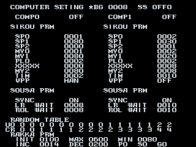

A cute falling blocks style puzzle game with a spellcasting twist and a surprisingly detailed CPU Player debugging tool.

<!--more-->

# Gameplay Settings



There is a disabled debug tool in the game's code which is used for modifying the CPU AI settings. While on this menu, P1 Up/Down move the cursor, while P1 Left/Right change the value. You can hold P1 Button 1 to move the cursor or change values quickly.

I can't say what each individual setting does, but here's a general overview. COMP0 and 1 will enable or disable CPU control of the player. PRM probably stands for 'program,' which is to say the settings for a certain facet of gameplay. SIKOU is likely shikou, "thinking, considering," meanin these values probably affect how the CPU decides to use its piece. SOUSA is "operation, handling" and seem to be related to how the CPU "opeates" the physical movement of the piece. RAKKA is "falling," and these settings are related to the "physics" of the descending piece.

After manipulating the settings to your liking, press P1 Start. You'll then be brought to a very basic character select screen:


Each character is represnted by their magic element/color. All characters, including the story mode enemies that are not normally playable, can be chosen from here. The character/icon can be changed with Up/Down on the corresponding player controls, with Button 1 or Start confirming the choice. When both players have chosen, the game will begin.

# Graphics Viewer


On the first debug screen we talked about, with the myriad CPU AI settings, pressing Service 1 button (mapped to 9 in MAME by default) will bring up a rudimentary graphics viewer. In this mode, P1 Up/Down scrolls through the graphics, while P1 Button 1 returns to the debug screen.

Without further ado, here is the MAME cheat to enable the debug screen. It will be displayed after inserting a coin and pressing start.

```
  <cheat desc="Enable Debug Screen">
    <comment>Debug screen displays after inserting coin and pressing start</comment>
    <script state="on">
      <action>temp0=maincpu.md@27e8</action>
      <action>maincpu.md@27e8=10ec6</action>
    </script>
    <script state="off">
      <action>maincpu.md@27e8=temp0</action>
    </script>
  </cheat>
```

And that's all for Naname de Magic, for now!
