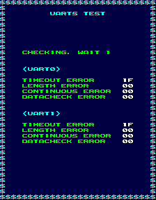

I seem to be running into this a lot lately, where standard test mode options are disabled or missing from test menus. Honestly, while it's always gratifying to dig out unused code and make it dance, these finds are kind of boring. But at least this game has some hidden developer credits. Those are always interesting!

<!--more-->

# Re-enabled Test Mode Options


Here's the standard test mode menu. UARTs Test, Object Test and RS-232C, while listed, are unselectable. Like we're going to let something like that stop us.

# UARTS TEST & RS-232C




UARTs are hardware for managing serial communication, while RS-232C is a standard for communication. In other words, these options are both pretty useless in an emulated environment, and will just error out (in the case of UARTs Test) or sit there waiting for some external input (as in RS-232C).

## OBJECT TEST


The most bland and rigid object test I've seen so far, bordering on useless. The screen is initially blank; P1 Button 1 will cycle through each frame. That's it. No bank selection, no going reverse through the frames, no palette options. Bleh. P1 Button 2 to go to back to the main menu.

I actually had a bit of trouble with the game at first (indirect addressing can be a real pain in the ass), but in the end I found that the menu references a table of booleans right before the string table which indicate which options in the menu to enable or disable, with each byte corresponding to each items in the list. In the JP version, this table of 16 bytes (yes, 16, there's room for more options; and yes, bytes, I'm somewhat surprised they didn't pack it into bits) is located at 0x20ACC and at 0x20A8C in the World version. All we have to do then is set those values to 1

**Japan:**

```
  <cheat desc="Enable all test mode options">
    <script state="on">
      <action>temp0=maincpu.mw@20ad1</action>
      <action>temp1=maincpu.mw@20ad7</action>
      <action>maincpu.mw@20ad1=0101</action>
      <action>maincpu.mw@20ad7=0101</action>
    </script>
    <script state="off">
      <action>maincpu.mw@20ad1=temp0</action>
      <action>maincpu.mw@20ad7=temp1</action>
    </script>
  </cheat>
```

**World:**

```
  <cheat desc="Enable all test mode options">
    <script state="on">
      <action>temp0=maincpu.mw@20a91</action>
      <action>temp1=maincpu.mw@20a97</action>
      <action>maincpu.mw@20a91=0101</action>
      <action>maincpu.mw@20a97=0101</action>
    </script>
    <script state="off">
      <action>maincpu.mw@20a91=temp0</action>
      <action>maincpu.mw@20a97=temp1</action>
    </script>
  </cheat>
```

## Other Namco NB-1 Games

So this Test Menu seems to be standardized across most of the other Namco NB-1 hardware games (Great Sluggers, Numan Athletics 2, The Outfoxies). However, in most of those games, while the communications options may be disabled, the Object Test is usually on. The Outfoxies is an exception here, with the object test disabled. I'm certain all these games have an option enable-disable table like Nebulas Ray, so re-enabling them should be a piece of cake... for some other day.

# Hidden Developer Credits

Finally, something interesting! Right near the top of the program code (immediately after the exception vector table and right before the program entry, at 0x100 to be exact) is some ASCII with the staff names:

```
NEBULASRAY
copyright 1994 namco
  - STAFF -  
PLANNING:M.KIMOTO
PLANNING:Y.YAMAMURA
DEGINER:H.KUWABARA
GRAPHIC:H.ITO
SOUND:M.FUKUZAWA
SOUND:T.ISHIKAWA
PROGRAM:Y.SAITO
PROGRAM:T.OTUKA
PROGRAM:H.HARIMA
VISUAL:M.KIMURA
VISUAL:T.MORI
VISUAL:H.ONISI
VISUAL:Y.YAGUCHI
VISUAL:K.MITUNAGA
VISUAL:H.TAKAHASI
thank you.
```

At first I thought this was part of the credits screen, but it's pretty weird to see it that far up, in no-code's land. I ran through the game real fast to compare against the actual credits:


They don't match, so our found text is not used here. Clearly the names in the actual credits are nicknames, which is pretty common in older Japanese games. The names in our credits are real, however, and you can sort of pick out who's who in the nickname'd credits.

I think this was an easter egg more than a leftover. Each line in the text ends with 0x0D, which is the standard ASCII newline byte, which makes this look like a text file that was thrown in after the code was compiled. Neat!
