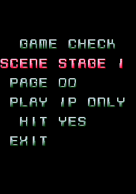
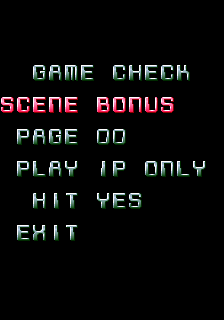
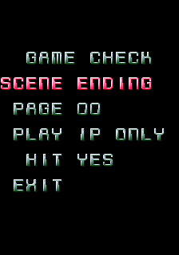
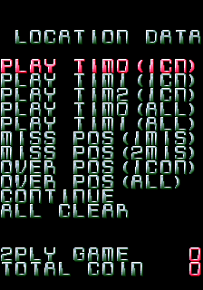
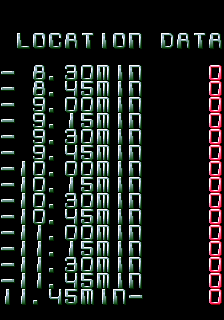
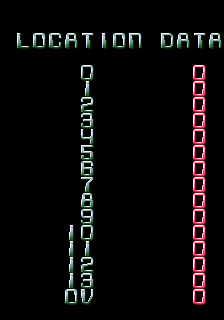
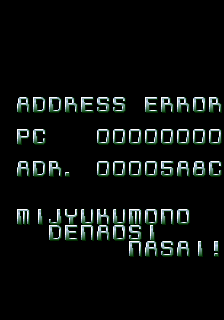
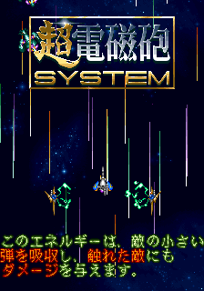
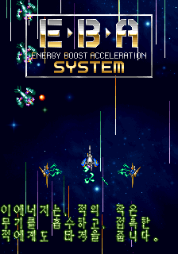
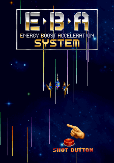

A competent but relatively uninteresting shooter from Face, the people who are way more famous for Money Idol Exchanger. At least there's a stage select!

<!--more-->

# Unused Test Mode Screens

There are two test mode functions which go unused: a stage select and location test audit. Before enabling these, though, you will need to disable the RAM/ROM check that occurs on startup. A cheat to do just that is already present in the standard MAME cheat collection, but in case that isn't available for you, here is a copy of it:

```
  <cheat desc="Skip RAM/ROM Check">
    <script state="on">
      <action>temp0 =maincpu.mw@000122</action>
      <action>temp1 =maincpu.mb@0005E1</action>
      <action>temp2 =maincpu.mw@0005F8</action>
    </script>
    <script state="run">
      <action>maincpu.mw@000122=0146</action>
      <action>maincpu.mb@0005E1=00</action>
      <action>maincpu.mw@0005F8=4ED2</action>
    </script>
    <script state="off">
      <action>maincpu.mw@000122=temp0 </action>
      <action>maincpu.mb@0005E1=temp1 </action>
      <action>maincpu.mw@0005F8=temp2 </action>
    </script>
  </cheat>
```

With that enabled, we can have a look at the Game Check and Location Test Data screens. As a bit of a technical note, the cheats the for both of these work by replacing the pointer to the Input Test screen. The test mode uses a fixed pointer table starting at 0x238E, so we can't (easily) re-add these to the whole test menu. Since both cheats replace the same screen, only one should be used at a time. Though if one were so inclined, one could alter the cheat to replace a different pointer table entry... but that seems pretty pointless since the Location Test Data screen is a minor curiosity at best and is basically useless.

## Game Check





First up is the Game Check screen, which is a gameplay config/stage select. Scene and Play set the stage number of players. Hit will enable or disable invincibility. 

Page value seems to be unused. Technically, it's the word at @ 0x100098, though it's displayed as a byte value. This same address is used as an option value variable in other tets menus as well, which just reinforces that it has no actual use in the game. The Ranking, Ending and Bonus options in the stage list also appear to broken, possibly using values from an older version.

Here's the cheat to see it in action:

```
  <cheat desc="Restore Game Check Menu">
    <script state="on">
      <action>temp0=maincpu.md@2392</action>
      <action>maincpu.md@2392=000024d0</action>
    </script>
    <script state="off">
      <action>maincpu.md@2392=temp0</action>
    </script>
  </cheat>
```

## Location Test Data





Your garden-variety location test audit screen. P1 Up/Down moves the cursor, P1 Button 1 selects and returns to main menu.

```
  <cheat desc="Restore Location Data Screen">
    <script state="on">
      <action>temp0=maincpu.md@2392</action>
      <action>maincpu.md@2392=000038d8</action>
    </script>
    <script state="off">
      <action>maincpu.md@2392=temp0</action>
    </script>
  </cheat>
```

# Insulting Error Screen



If you happen to hit an exception screen (which is extremely unlikely in normal gameplay, but happens regularly when hacking apart a game...), you'll get an error screen with the exception type and a minimal register dump. Below that is a somewhat rude message: "MIJYUKUMONO DENAOSI NASAI!," which roughly translates to, "You amateur! Go try again!"

While the text could be interpreted to mean the player, it's more likely a self-deprecating message from the dev to himself.

# Attract Mode Regional Difference

The big regional difference (that I noticed) is on the attract mode's gameplay instructions screen.







The game's weapon upgrade system is called 超電磁砲 **chou denjibou**, the Ultra Electromagnetic Cannon, in Japanese, but is called the Energy Boost Acceleration in the Korean and World releases. Okay, removing kanji is understandable, that's fine. But what I found particularly amusing is that, while the Japanese and Korean versions have text detailing the instructions and gun system, the English version simply has a hand animation pushing the shot button to show how to re-create the attacks shown in the animation. Guess they couldn't find a competent English speaker.
