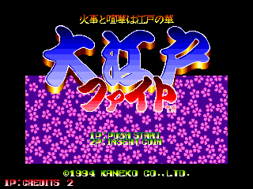
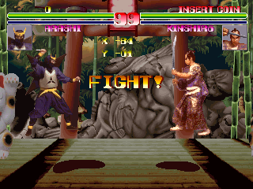

I've had this article half-researched and half-written for more than a year now, just sort of laying around. I've lacked the interest in finishing it because, frankly, the game is pretty awful. Well, after months of Donpachi and Dodonpachi, it's time to take a short break with something easy.

Enjoy, I guess?

<!--more-->

# Debug Menu

Leftover in the code is a fully functional debug menu. Let's take a look:


P1 Up/Down moves the menu selection cursor, while P1 Left/Right moves the flag cursor. Use any P1 buttons to flip the flag value at the cursor.

## Debug Flag

Unfortunately the debug options aren't all that interesting, but at least they're useful. Only three of the flags seem to be used, however, the three lowest bits.

### Bit 0 - CPU Skill Level


When set, you'll be able to choose your the enemy CPU skill level before starting a match. P1 Left/Right changes the value, and P1 Button 1 starts the match

### Bit 1 - Unlimited time

When set, gameplay will continue even after the timer reaches zero.

### Bit 2 - Select CPU player

When set, you'll be able to choose your opponent in single player mode. At the character select screen, after choosing the P1 character, use the P2 controls to choose the CPU character.

## Country Flag

Only the lowest bit is checked here. If it's set, it will be Japanese version. If unset, it will be the international version.

## DIP Switches (aka Game settings)

Interestingly, it lists three dip switches, while MAME only has one mapped in the hardware. The [game manual corroborates this](http://www.gamesdatabase.org/game/arcade/oedo-fight), listing only one switch (though in two different locations, based on the hardware revision). Unfortunately, I couldn't find a high res picture of the PCB to see if there were any spots for removed dips (<a href="/entry/mouja-unused-test-menu-debug-functions-easter-eggs-and-more">like we've seen before</a>). But this seems unlikely, anyhow. The hardware reads the dip settings through the (amusingly named) Toybox MCU, which returns data for only one switch. 

Actually, in the debug menu, the one marked DIP SW 2 is our actual hardware switch. The other two are misnomers and are soft settings. DIP SW 1 maps to the coin value settings in COIN MODE SET UP from the standard test menu. DIP SW 3 is a bit of a mystery. It is only checked in one place in the code, checking bit 0, but doesn't seem to have any place where it is set (except for the debug menu). It seems to separate the two coin slots, whereas normally a coin in either slot counts as a credit for either player. From this, it changes the credits text on the title screen:





The first screenshot on the left is the standard text after inserting coins in either slot, with the counter showing up in the lower left. Setting the lowest bit on dip switch 3 seems to count the two coin slots seperately.

Somewhat interestingly, the Memory Switch Set Up (aka Blood Mode) menu from the standard test menu is not listed here. Those settings are stored in another byte near the others and is retrieved along with the others during game settings load. I would have kind of expected all the settings to be available here.

Of course, instead of using the debug menu, you can set the bit values directly in RAM at these locations:

<table>
	<tbody>
		<tr>
			<td>0x10688D</td>
			<td>Debug Flag</td>
		</tr>
		<tr>
			<td>0x10497B</td>
			<td>Country Flag</td>
		</tr>
		<tr>
			<td>0x10497C</td>
			<td>Blood settings</td>
		</tr>
		<tr>
			<td>0x10497D</td>
			<td>DIP Switch 1 (Coin settings)</td>
		</tr>
		<tr>
			<td>0x10497E</td>
			<td>DIP Switch 2 (Hardware Dip)</td>
		</tr>
		<tr>
			<td>0x10497F</td>
			<td>DIP Switch 3 (Split coin slots)</td>
		</tr>
	</tbody>
</table>

# Debug Menu - Technical

There are no code references to the debug code. There is, however, entry code that checks if bit 6 of the system inputs (which maps to Service 1 in MAME) is pressed. The code starts at 0x3610:

```
debugEntry:
003610: 0839 0006 0010 4998        btst    #$6, $104998[sysInput] ;is Service 1 held?
003618: 6602                       bne     $361c[debugMenu]       ;yes, go to menu
00361A: 4E75                       rts                            ;no, return
debugMenu:
00361C: 4EB9 0000 45E4             jsr     $45e4
003622: 4239 0010 497A             clr.b   $10497a
003628: 4EB9 0000 3D9A             jsr     $3d9a
00362E: 4239 0010 4993             clr.b   $104993
...
```

With no references to the entry code, though, it's impossible to say how this was originally accessed (aside from the fact that it involved pressing the Service 1 button). I've tried calling it a number of different ways, and I've found the best method is to replace the test menu check on startup with a jump past the entry to the debug menu itself. Here's the MAME cheat to do just that:

```
  <cheat desc="Replace Test Menu with Debug Menu">
    <comment>Loads the debug menu instead of test menu on startup when test mode dip switch is set</comment>
    <script state="on">
      <action>temp0=maincpu.md@1862</action>
      <action>maincpu.md@1862=0000361C</action>
    </script>
    <script state="off">
      <action>maincpu.md@1862=temp0</action>
    </script>
  </cheat>
```

With this cheat enabled, you can access the debug menu by resetting the game (F3 in MAME) while the Service Mode dip is set. You can still access the standard test menu by pressing the Service Mode button (F2 in MAME) during gameplay, but keep in mind that pressing that button also toggles the dip switch.

# More Debug Tools

There are some other debugging tools leftover that can be accessed without any code hackery. They involve the use of the Tilt input, however. I'm not sure if this is an actually implemented sensor or button in the final version, but it looks like its function as an input was abused during development for testing.

To enable slow motion, hold the Tilt button during gameplay (mapped to T by default in MAME). While holding Tilt, press the Service Mode switch (F2 in MAME), and you'll be able to move the sprites around the screen.




You can use P1 or P2 joystick to move around the respective characters. The X/Y value in the middle is shared between the two characters, oddly. Also of interest is that during the ending scene, the sprites that are controlled by this function are two background characters rather than the player.

# Hidden & Leftover Text

## Developer date

At 0xFEC0, we have this piece of text:

```
 ATOP 1993.12 
```

ATOP is the game's developer, and 1993.12 is of course a date: December 1993, possibly the date of the build. It is used in the routine at 0x1622, which checks the validity of the saved game settings with this string. If the string is not present after loading the data, it assumes it is corrupt and writes all zeros, resetting everything. You can see it in the shared CPU/MCU RAM at 0x208070.

## Lost characters

It looks like there may have been more characters at one time. Starting at 0x10078 we have the round win strings. Aside from the expected character names, we have a few more:

```
ryu won
bozu won
kikori won
oni won
gaikotu won
asyura won
himitu won
```

Interesting. I haven't found any signs of any leftover assets of these missing characters, though admittedly I haven't looked very hard. You can manually change the character pointer in the RAM at 0x105F38 for Player 1, 0x10638A for Player 2. Values 0 through 8 are the standard characters, while 9 through F are the missing characters above.


However, using any of the extra values will always result in the Kasumi character with the wrong palette palette and broken name graphics. Also, interestingly, the character won't take any damage and is essentially invincible.

## Bonus game

Finally we have this after the credits strings, at 0x11a22:

```
bonus game
```

There are no code references to it as far as I can tell, so it appears to be completely abandoned. Perhaps there was meant to be a bonus round in the game at one time?
