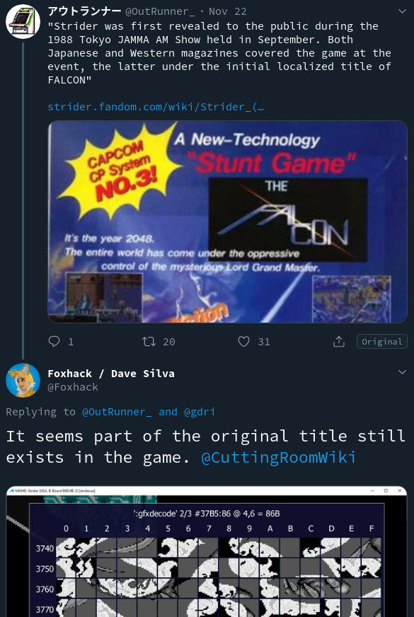

Just a quickie article so this isn't lost to the sands of Twitter.

<!--more-->

[So it started with this thread:](https://twitter.com/OutRunner_/status/1197849198806347776)



[@Foxhack](https://twitter.com/Foxhack) pointed out that the graphics are still present in the data, which piqued my interest. [@GoldS_TCRF](https://twitter.com/GoldS_TCRF) then chimed in with some very helpful memory locations, and with a bit of trial and error, we got the titlescreen (more or less) correctly repointed to the old data:

 

 

 

Video of it in action:

<div class="embeddedContent oembed-provider- oembed-provider-youtube" style="text-align: center;"><iframe allowfullscreen="true" frameborder="0" height="349" scrolling="no" src="//www.youtube.com/embed/eWIKbueUL8Q?wmode=transparent&amp;jqoemcache=EMlO4" width="425"></iframe></div>

And here's the MAME cheat so you can see it yourself:

```
  <cheat desc="Restore old title screen">
    <script state="on">
      <!-- repoint the tilemaps to the old ones-->
      <action>temp8=maincpu.md@5cac</action>
      <action>maincpu.md@5cac=cd9de</action>
      <action>temp9=maincpu.md@5cf0</action>
      <action>maincpu.md@5cf0=cdac2</action>
      <!-- the lower half tileset is a bit off, need to remap it a bit -->
      <action>temp0=maincpu.mb@5cbd</action>
      <action>maincpu.mb@5cbd=24</action>
      <action>temp1=maincpu.mb@5cc3</action>
      <action>maincpu.mb@5cc3=4a</action>
      <action>temp2=maincpu.mb@5cc9</action>
      <action>maincpu.mb@5cc9=70</action>
      <action>temp3=maincpu.mb@5ccf</action>
      <action>maincpu.mb@5ccf=96</action>
      <action>temp4=maincpu.mb@5cd5</action>
      <action>maincpu.mb@5cd5=bc</action>
      <action>temp5=maincpu.mb@5cdb</action>
      <action>maincpu.mb@5cdb=e2</action>
      <!-- also, the loops are one too small, which results in missing the last tiles on the bottom of both the upper and lower half-->
      <action>temp6=maincpu.mb@5cb5</action>
      <action>maincpu.mb@5cb5=10</action>
      <action>temp7=maincpu.mb@5cf9</action>
      <action>maincpu.mb@5cf9=4</action>
    </script>
    <script state="off">
      <action>maincpu.md@5cac=temp8</action>
      <action>maincpu.md@5cf0=temp9</action>
      <action>maincpu.mb@5cbd=temp0</action>
      <action>maincpu.mb@5cc3=temp1</action>
      <action>maincpu.mb@5cc9=temp2</action>
      <action>maincpu.mb@5ccf=temp3</action>
      <action>maincpu.mb@5cd5=temp4</action>
      <action>maincpu.mb@5cdb=temp5</action>
      <action>maincpu.mb@5cb5=temp6</action>
      <action>maincpu.mb@5cf9=temp7</action>
    </script>
  </cheat>
```
