Life is finally returning to normalcy (whatever that is) after moving into my new house. And that means back to hacking old games in my spare time! Today we'll look at Akamaru Q Joushou, a game you probably haven't bothered with unless your Japanese is pretty good. At its heart, it's a quiz game but has a variety of simple action and word games as well to make things interesting. It has a heck of a set of debugging tools... and a very interesting developer easter egg!

<!--more-->

When I first began to dig through the game, I found lots of text that hinted at debugging functions. I began to find these functions and call them, one by one. And I was finding a lot. Eventually I came upon menus that referenced these routines, and worked my way further up... until I found a code that unlocked everything.

There's a genuine thrill (at least for me) in reverse engineering a bunch of assembly to find a code that probably very few people know about, or may have been otherwise completely lost to time. Things like this, to me, are the very essence of digital archaeology: digging down into old code to find the parts that are hidden away and revealing not only more about the development of the game but a part of video game history. But I digress, so without further rambling, here is the debug code for Akamaru Q Joushou:

**From the Settings Menu, choose "Option". On the Program Test Page 0 screen, hold P2 Right for about two seconds, then quickly press P2 Left + P2 Button. You should hear an 'Okay!' voice sound effect. You can now press P1 Left or Right to cycle through the debug menus.**

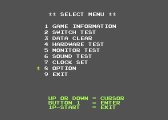
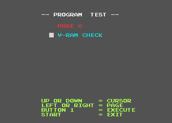

# Program Test

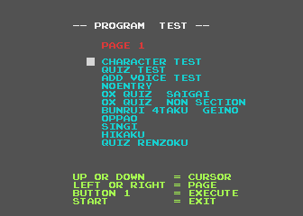
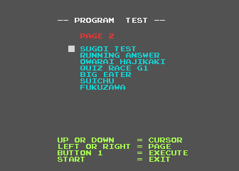
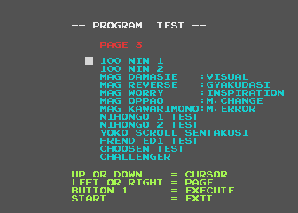

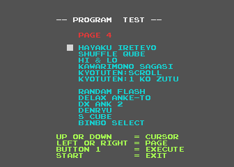
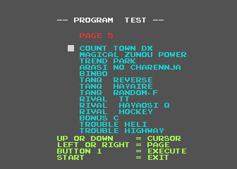
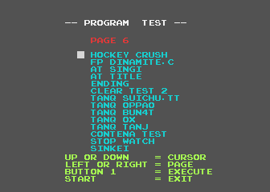

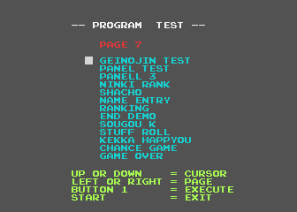
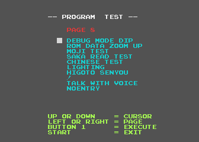

Behold... Not one, not two, not three... but EIGHT pages of debug options! The great majority of these are tests of the quiz modes and mini games. I'm not going to bother doing translations for all the lines of text, since they're the names of the quizzes/games, and not really related to anything debugging or hidden. (If there's enough interest, I can do a full translation, though.) I'll go over a few of the interesting bits though.

Note that for many of the game mode tests, there is a setup screen that appears before the game loads:

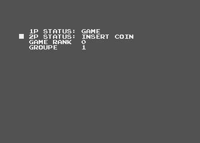

You can set the mode for P1 and P2 (such as in game, waiting to press start, won the game, etc) and other settings specific to the game. Maybe it's just the controller that I'm using, but the input seems touchy and will skip this screen quickly if you hold down the button too long when selecting a test option.

## Page 1

### Character Test

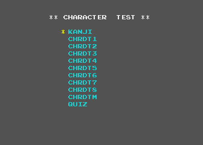

The Character Tests are standard graphics viewers. For all of these options, P1 Up and Down cycles through the pages, while P1 Left and Right cycle the color palette. P1 Start returns to the previous menu. 'KANJI' views the complete Japanese font set, and near the bottom 'CHRDTM' views the system English font set. The rest view the various graphics in the game. 'QUIZ' at the very bottom is unselectable; the cursor doesn't even hover over it. Odd.

### Quiz Test

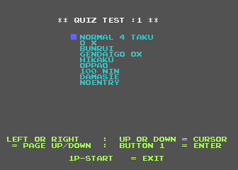

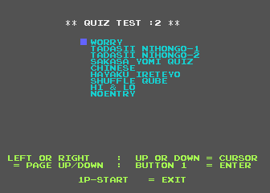

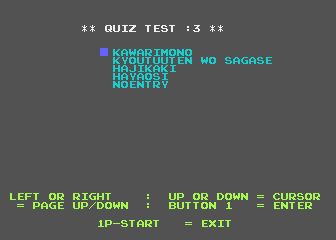

This is a viewer for all the quiz text data in the game. There are 8 pages here, by pressing P1 Left/Right, though only 3 have usable entries; anything with 'NOENTRY' is empty. Instead of actually loading the quiz gameplay, it is literally a viewer for the text in the game. Note that some of them appear to be broken, loading system text instead of quiz text. Here are some examples:

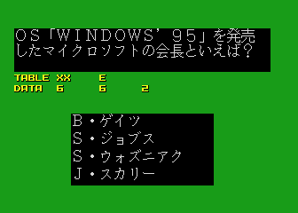

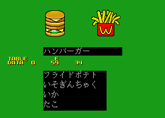

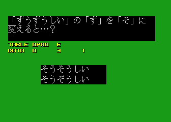

### Apend Voice Test

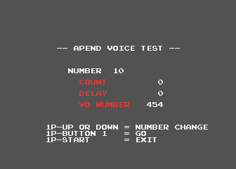

Something like a sound test, it seems to be primarily related to vocal audio clips. Note that the Delay doesn't seem to match the length of many of the sounds. I'm not sure if this is due to emulation issues or if it acted that way on the hardware.

# Page 2

### Sugoi Test

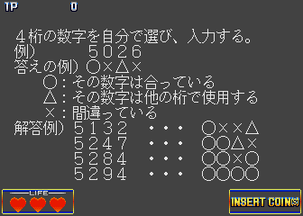

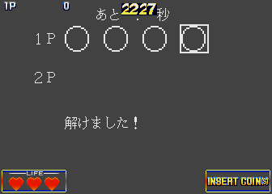

The title means something like 'Amazing Test', and I'm sort of baffled by its existence. I don't recall seeing this anywhere in the normal game (though, admittedly, I haven't played every single bit of it) and it seems too basic and rough to be in the final anyway. It's also like it was from an earlier version, or perhaps a simple placeholder minigame. A random number is chosen, and you have to guess the number by cycling through the digits. X is incorrect, triangle means that number is used elsewhere, and O is the correct digit. When you solve it, the text 'Solved!' appears at below it (second screenshot).

### Fukuzawa

This seems to be a test of the falling [Fukuzawas](http://en.wikipedia.org/wiki/10,000_yen_note) that appear during the intro to the 'Arashi no Challenge' section. See 'ARASI NO CHARENNJA' on page 5 to see this in action.

# Page 7

We jump to page seven since everything in between is quiz or game modes, or short tests of transitions

### Geinojin Test

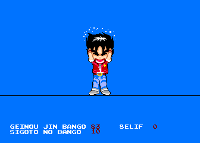

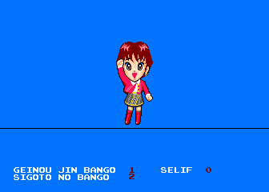

This is a simple viewer of the various player sprites in the game. P1 Up/Down cycles through the characters and P1 Left/Right cycles through their actions. P2 Left/Right cycles through the vocal clips. P2 Button replays the audio.

### End Demo

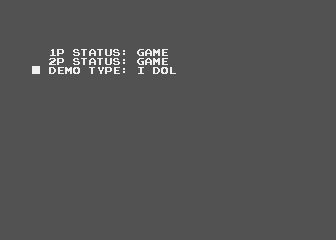

Here you can view the various endings for the game. The 'storyline' for the game is that you're working for a talent agency, trying to become famous. The endings, from worst to best, are:

 - COMBINI - You end up working at a convenience store
 - DOKACHI - You end up working in construction
 - NUIGURUMI - You end up working in full body costumes on stage
 - EXTRA - You end up working as an extra in the background of a movie
 - GEI NIN - You end up working as an unpopular stage entertainer (comedian?)
 - URETERU GEININ - You end up working as a popular stage entertainer
 - MODEL - You end up working as a fashion model
 - IDOL - You end up working as an idol singer

# Page 8

On the last page are some of the most interesting options available.

### Debug Mode DIP

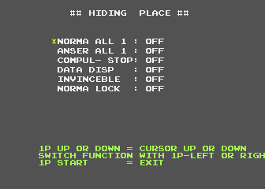

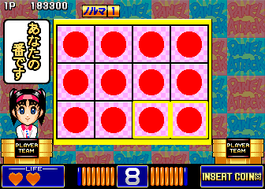

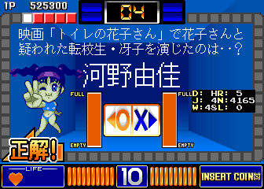

Oh boy, a bunch of cheats! I haven't tested them all fully, but:

 - NORMA ALL 1 - Make the number of required correct answers (the 'norma') always only 1
 - ANSER ALL 1 - This makes the first choice always the correct answer. For true or false questions, the answer is always 'left.' Note that this also makes the minigames extremely easy (for example, the panel matching minigame has only one shape to match, making any square correct, as in screenshot 2)
 - COMPUL- STOP - Haven't figured this one out
 - DATA DISP - Displays a small text box with information about the games (screenshot 3)
 - INVINCEBLE - Don't lose a chance when you pick a wrong answer
 - NORMA LOCK - The norma count never goes down, you so essentially stay playing the game forever

After setting any of these, you can hit P1 Start to return to previous menus, all the way to the game startup, and the settings will be enabled in the normal game.

ROM Data Zoom Up

This seems to be a very simple test of the sprite resizing code. P1 Up/Down to zoom the sprite in and out. That's all.

### !

Finally, shown on the menu as a single exclamation point, we have what I think is the most interesting option of them all:

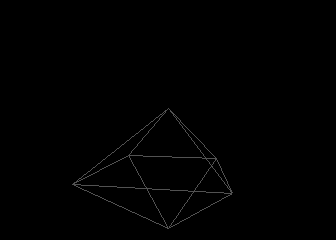

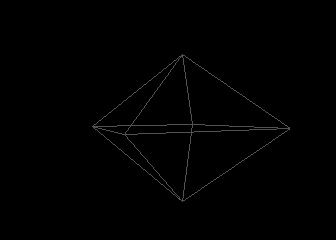

It may not look like much in the screenshots, but it's a slowly rotating wireframe polygon. It can be zoomed in and out with P1 Up/Down and moved horizontally with P1 Left/Right, and vertically with P2 Up/Down. It runs very, very slowly unless you zoom very far out and it seems to crash if you zoom too far in, but there's a fair amount of math required to do even something simple like this, so the fact that it's running at all on this old hardware is impressive itself. Maybe the programmer wrote it when he was bored; maybe he wanted to test the hardware to see if they could implement some 3D parts into the game. Who knows. I think it's a fascinating leftover though.

So there we have it. One simple code to unlock all this to play with. This game runs on the DoDenLover hardware, and that game has a similar system setup menu, so I have a sneaking suspicion there may be some options menus tucked away in there too. I'll have to investigate sometime and make another post if I find anything.
